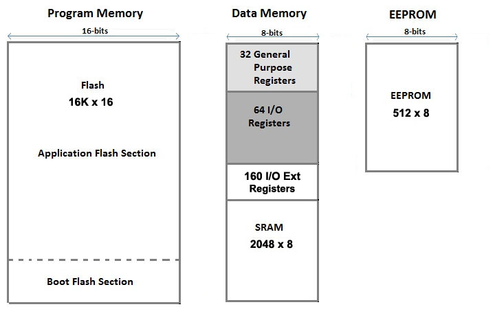
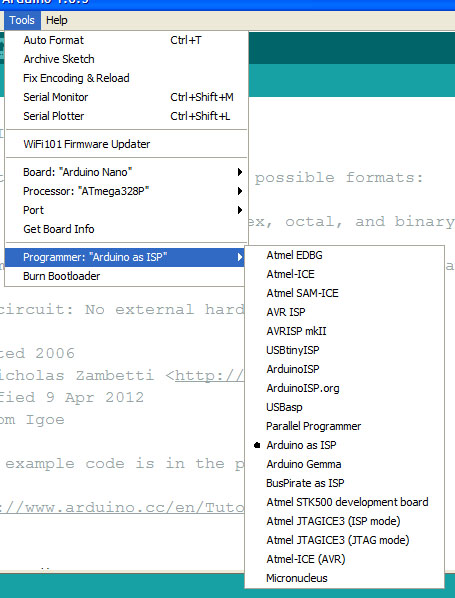
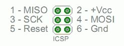
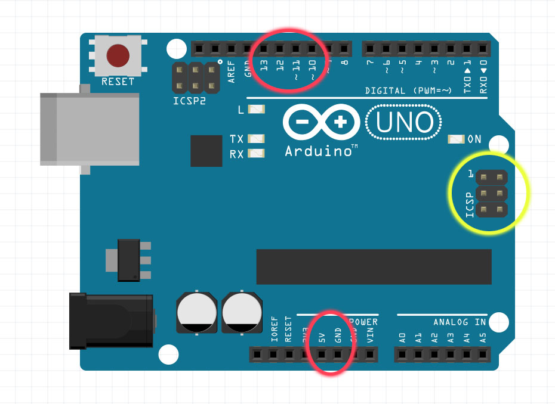
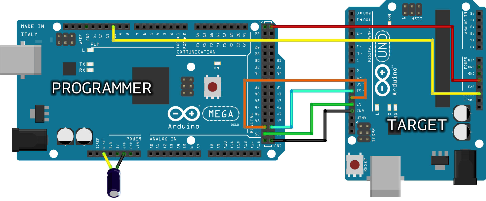
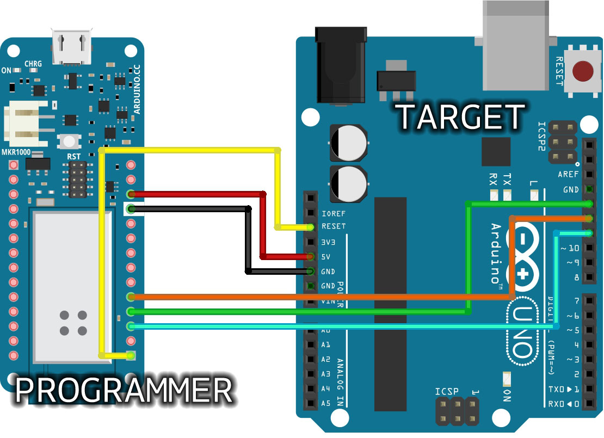
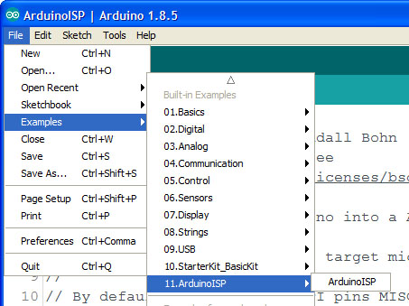
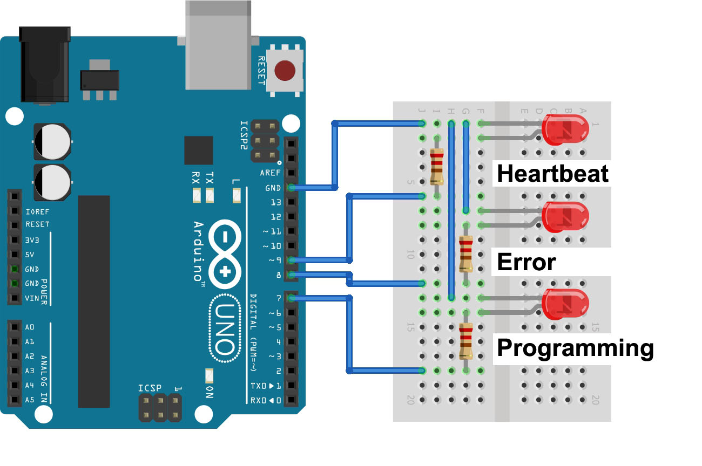
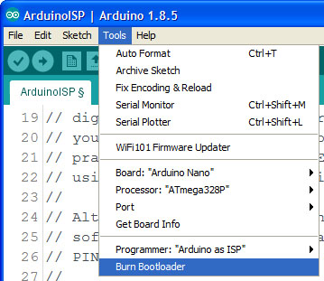

What makes an Arduino what it is? Many things, but one of the most important ones is the way every Arduino board is easily programmed with the Arduino Software (IDE). It is enough to connect it to the computer USB port and press the "Upload" icon to start a process that transfers your sketch into the Flash memory of the microcontroller.

### The Bootloader

The behaviour described above happens thanks to a special piece of code that is executed at every reset of the microcontroller and that looks for a sketch to be uploaded from the serial/USB port using a specific protocol and speed. If no connection is detected, the execution is passed to the code of your sketch.

This little (usually 512 bytes) piece of code is called the "Bootloader" and it is in an area of the memory of the microcontroller - at the end of the address space - that can't be reprogrammed as a regular sketch and had been designed for such purpose.

The Memory Map of an ATmega328P

To program the bootloader and provide to the microcontroller the compatibility with the Arduino Software (IDE) you need to use an In-circuit Serial Programmer (ISP) that is the device that connects to a specific set of pins of the microcontroller to perform the programming of the whole flash memory of the microcontroller, bootloader included.
The ISP programming procedure also includes the writing of fuses: a special set of bits that define how the microcontroller works under specific circumstances.

### Use Arduino as ISP

The whole process of loading the bootloader code and burning properly the fuses to make an ATmega microcontroller an "Arduino" is managed by the Arduino Software (IDE): it provides a specific menu item and allows you to use a variety of programming devices.
Among the programmers, the "Arduino as ISP" is the cheapest and most practical solution to burn a bootloader on another Arduino board with ATmega, 32U4 or ATtiny.

The programming process uses VCC, GND and four data pins. Three pins connect MISO, MOSI and SCK between the programming micro and the target micro, the fourth pin from the programming micro goes to the reset pin of the target.

#### How to wire your boards

The following table display on which pins the MOSI, MISO and SCK are broken out on the different Arduino boards:

| **Arduino Board**    | **MOSI**     | **MISO**     | **SCK**      | **Level** |
| -------------------- | ------------ | ------------ | ------------ | --------- |
| UNO or Duemilanove   | 11 or ICSP-4 | 12 or ICSP-1 | 13 or ICSP-3 | 5V        |
| Mega1280 or Mega2560 | 51 or ICSP-4 | 50 or ICSP-1 | 52 or ICSP-3 | 5V        |
| Leonardo             | ICSP-4       | ICSP-1       | ICSP-3       | 5V        |
| Due                  | ICSP-4       | ICSP-1       | ICSP-3       | 3.3V      |
| Zero                 | ICSP-4       | ICSP-1       | ICSP-3       | 3.3V      |
| 101                  | 11 or ICSP-4 | 12 or ICSP-1 | 13 or ICSP-3 | 3.3V      |

The SPI interface - and therefore these pins - is the interface used to program the AVR microcontrollers.  Note that MISO, MOSI, and SCK are available in a consistent physical location on the ICSP header; this connector is used also by shields that rely on the SPI interface allowing the design of shields that work on every board.

On the Arduino UNO in the following image, we have highlighted in red the connections on the female strips; in yellow the ICSP connector that connects to the ATmega328P. Please note that the Rev.3 board has an ATMega 16U2 chip that manages the USB connection and also that chip can be reprogrammed via a dedicated connector labeled ICSP2, just above the ATMega 16U2 itself.

On some Arduino boards (see table above), pins MOSI, MISO and SCK are the same pins as digital pin 11, 12 and 13, respectively. That is why many tutorials instruct you to hook up the target to these pins. If you find this wiring more practical, have a define USE_OLD_STYLE_WIRING. This will work even when not using an UNO. (With the UNO board this is not needed).

In the picture above we are connecting two UNO boards for bootloader burning with the "old style" connections: the top board is the Target, the bottom board is the Programmer. Note the yellow connection from D10 of the programmer to RESET of the target. *On MKR family of boards, you can't use D10 for reset; we suggest D6 and you must remember to change the line 73 of the ArduinoISP sketch - `#define RESET 10` - putting "6" instead of 10.*

This Arduino NANO is programmed through its ICSP connector with wires coming from D10-D13 of the programmer UNO board.

The Arduino MEGA above is programming an Arduino UNO connecting D51-D11, D50-D12, D52-D13, GND-GND, 5V-5V and D10 to RESET. This type of board needs a 10&#xB5;F electrolytic capacitor connected to RESET and GND with the positive (long leg) connected to RESET.  The capacitor has to be placed after the programmer board has been loaded with the ISP sketch.

The 10&#xB5;F electrolytic capacitor connected to RESET and GND of the programming board is needed only for the boards that have an interface between the microcontroller and the computer's USB, like Mega, UNO, Mini, Nano. Boards like Leonardo, Esplora and Micro, with the USB directly managed by the microcontroller, don't need the capacitor.

#### About voltages

The Arduino family of boards includes 5V and 3.3V devices. When using an Arduino that is not 5V tolerant (Due, Zero, ...) as the programmer, make sure to not expose any of the programmer's pins to 5V. A simple way to accomplish this is to power the complete system (programmer and target) at 3V3.

In the above picture you see the wiring between a MKR1000 and a UNO. As described above, everything runs on 3.3V, taken from VCC  and GND of the MKR1000 and sent to 5V and GND of the UNO. The same connection could be made to the ICSP of the UNO following the pinout explained in the page. We have used the same colors for the wires as in the other pictures to help you switch from the "old wiring" to the ICSP connector with ease. Please note that the MKR family of boards share the same pinout, therefore you can use any MKR board as ISP programmer. If you use a MKR board as ISP programmer, remember to change the line 73 of the ArduinoISP defining the actual pin used on the MKR board to Reset the target (6 in the picture above).

**Note: Please do not connect to USB or power supply the boards while you set up the connections and wires. We also suggest that you first program the Arduino used as ISP programmer before you proceed with the wiring to the target board.**

### Load the sketch

The Arduino that you will use as programmer needs a specific sketch. You find it under Examples > 11. ArduinoISP > ArduinoISP .

Going through the lines of the sketch you find a number of parameters that need to be set according to the target board. These parameters are, however, set by a specific file available for each bootloader/board supported by the Arduino Software (IDE). Other parameters are clearly explained by the comments and should be changed only if you know what you are doing.
The sketch also supports three LEDs that give you a visual feedback about the programming process.

To upload the sketch to your Arduino board - the one that you will use as the programmer - you need to select board type and port, then you can proceed as usual.

### Program the bootloader

If all the wires are set, you need to switch to the board type you want to program with the bootloader. This step is mandatory to select the proper bootloader code and the fuses configurations. The programming procedure checks the signature of the microcontroller before any writing action is taken, but many boards share the same microcontroller and each board has its own bootloader. The port remains the one of the ArduinoISP.

Choose "Burn bootloader" under tools and wait  for the confirmation message in the lower part of the Arduino Software (IDE) interface. If you connected the LEDs you may follow the process visually.

#### The Serial Programming Mode

The programming process manages the three SPI lines (MISO, MOSI and SCK) according to the standard SPI programming protocol, the same used to read and write SD memory cards. The only difference with memory cards is the lack of a CS (Chip select) pin. On our AVR microcontrollers we use the RESET pin that halts the execution of any sketch or bootloader and puts the microcontroller in a specific state where it listens to the commands arriving from the SPI interface. The very first command that the protocol requires is the one that enters the microcontroller in the *Serial Programming Mode*.

Once this specific mode is active, we can write and read all the microcontroller programmable areas: Flash, EEPROM and Fuses. At the end of the Flash memory, we have the bootloader code area, as highlighted in the image at the beginning of this article. The "Burn Bootloader" procedure also sets properly the fuses of the microcontroller according to the design of the board. This is one of the reasons why you have to burn the bootloader selecting your exact board model in the list.

### Technical aspects of programming

The open source software tool used to program the microcontroller is [avrdude](http://www.nongnu.org/avrdude/). The process goes through four steps: unlocking the bootloader section of the chip, setting the fuses on the chip, uploading the bootloader code to the chip, locking back the bootloader section of the chip.

The fuses are managed according to the preferences stored into each parameter file associated with the board, avoiding potential mistakes.

The management of fuses, usually a set of three bytes - low, high and extended -, is the most delicate aspect of the bootloader programming: a wrong fuse setting could brick the microcontroller and the board.
Fuses define many aspects of the microcontroller's functions like: selecting different clock sources and change how fast the chip runs, setting the minimum voltage required before the chip works (brownout), setting whether or not a bootloader is used, setting how much memory is allocated to the boot loader (from 256 to 2048 words - 512 to 4096 bytes),
disabling reset or serial programming and stop EEPROM data being erased when uploading a new sketch.

Detailed description of the fuses can be found on the datasheet of each microcontroller.

Every setting has its own usage and it is logical to allow the developer to lock the chip and protect it from ISP programming, but it might happen to mistakenly set a fuse in the wrong way, locking you out of the programming process through the ISP interface. To recover the microcontroller, you have to rely on a High Voltage Serial Programmer that uses 12V to reset the fuses.

### Recap: burn the Bootloader in 8 steps

- Open the ArduinoISP firmware (in Examples) to your Arduino board.

- Note for Arduino 1.0: you need to make one small change to the ArduinoISP code. Find the line in the heartbeat() function that says "delay(40);" and change it to "delay(20);".

- Select the items in the Tools > Board and Serial Port menus that correspond to the board you are using as the programmer (not the board being programmed).

- Upload the ArduinoISP sketch.

- Wire your Arduino boards..

- Select the item in the Tools > Board menu that corresponds to the board on which you want to burn the bootloader (not the board that you're using as the programmer). See the board descriptions on the environment page for details.

- Select the Arduino as ISP in the Tools>Programmer menu.

- Use the Burn Bootloader command.

### Learn more

You can find more basic tutorials in the [built-in examples](/built-in-examples) section.

You can also explore the [language reference](https://www.arduino.cc/reference/en/), a detailed collection of the Arduino programming language.

*Last revision: 2018/01/20 by SM*
