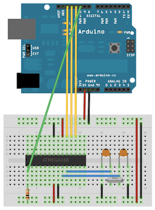
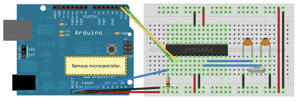
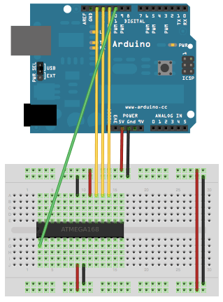
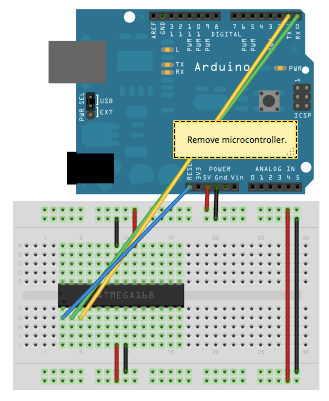

This tutorial explains how to migrate from an Arduino board to a standalone microcontroller on a breadboard.  It's similar to [this tutorial](https://www.arduino.cc/en/Main/Standalone), but uses an Arduino board to program the ATmega on the breadboard.

Unless you choose to use the minimal configuration described at the end of this tutorial, you'll need four components (besides the Arduino, ATmega328P, and breadboard):

- a 16 MHz crystal,

- a 10k resistor, and

- two 18 to 22 picofarad (ceramic) capacitors.

### Burning the Bootloader

If you have a new ATmega328P (or ATmega168), you'll need to burn the bootloader onto it.  You can do this using an Arduino board as an in-system program (ISP).  If the microcontroller already has the bootloader on it (e.g. because you took it out of an Arduino board or ordered an already-bootloaded ATmega), you can skip this section.

To burn the bootloader, follow these steps:

1. Upload the ArduinoISP sketch onto your Arduino board. (You'll need to select the board and serial port from the Tools menu that correspond to your board.)

2. Wire up the Arduino board and microcontroller as shown in the diagram to the right.

3. Select "Arduino Duemilanove or Nano w/ ATmega328" from the Tools > Board menu.  (Or "ATmega328 on a breadboard (8 MHz internal clock)" if using the minimal configuration described below.)

4. Select  "Arduino as ISP" from Tools > Programmer

5. Run Tools > Burn Bootloader

You should only need to burn the bootloader once.  After you've done so, you can remove the jumper wires connected to pins 10, 11, 12, and 13 of the Arduino board.

*Using an Arduino board to burn the bootloader onto an ATmega on a breadboard.*

### Uploading Using an Arduino Board

Once your ATmega328P has the Arduino bootloader on it, you can upload programs to it using the USB-to-serial converter (FTDI chip) on an Arduino board.  To do, you remove the microcontroller from the Arduino board so the FTDI chip can talk to the microcontroller on the breadboard instead.  The diagram at right shows how to connect the RX and TX lines from the Arduino board to the ATmega on the breadboard.  To program the microcontroller, select "Arduino Duemilanove or Nano w/ ATmega328" from the the Tools > Board menu (or "ATmega328 on a breadboard (8 MHz internal clock)" if you're using the minimal configuration described below).  Then upload as usual.

*Uploading sketches to an ATmega on a breadboard.  Remember to remove the microcontroller from the Arduino board!*

### Minimal Circuit (Eliminating the External Clock)

If you don't have the extra 16 MHz crystal and 18-22 picofarad capacitors used in the above examples, you can configure the ATmega328P to use its internal 8 MHz RC oscillator as a clock source instead.  (You don't really need the 10K pullup resistor on the reset pin either, so we remove it to get a truly minimal configuration.)

You'll need to install support for an additional hardware configuration:

1. Download this hardware configuration archive: [breadboard-1-6-x.zip](https://www.arduino.cc/en/uploads/Tutorial/breadboard-1-6-x.zip), [Breadboard1-5-x.zip](https://www.arduino.cc/en/uploads/Tutorial/Breadboard1-5-x.zip) or  [Breadboard1-0-x.zip](https://www.arduino.cc/en/uploads/Tutorial/Breadboard1-0-x.zip) depending on which IDE you use.

2. Create a "hardware" sub-folder in your Arduino sketchbook folder (whose location you can find in the Arduino preferences dialog).  If you've previously installed support for additional hardware configuration, you may already have a "hardware" folder in your sketchbook.

3. Move the breadboard folder from the zip archive to the "hardware" folder of your Arduino sketchbook.

4. Restart the Arduino software.

5. You should see "ATmega328 on a breadboard (8 MHz internal clock)" in the Tools > Board menu.

Once you've done this, you can burn the bootloader and upload programs onto your ATmega328P as described above.  **Be sure to select "ATmega328 on a breadboard (8 MHz internal clock)" when burning the bootloader.** (If you select the wrong item and configure the microcontroller to use an external clock, it won't work unless you connect one.)

#### Attention

This procedure works on Arduino 1.0.x software.

*Using an Arduino board to burn the bootloader onto an ATmega on a breadboard (w/o an external clock).*

*Uploading sketches to an ATmega on a breadboard.*

### Getting Rid of the Arduino Board

Once you've programmed the ATmega on the breadboard, you can eliminate the Arduino.  To do so, you'll need to provide an alternative power supply for the microcontroller.  See the [standalone Arduino on a breadboard](https://www.arduino.cc/en/Main/Standalone) tutorial for details.

### Learn more

You can find more basic tutorials in the [built-in examples](/built-in-examples) section.

You can also explore the [language reference](https://www.arduino.cc/reference/en/), a detailed collection of the Arduino programming language.