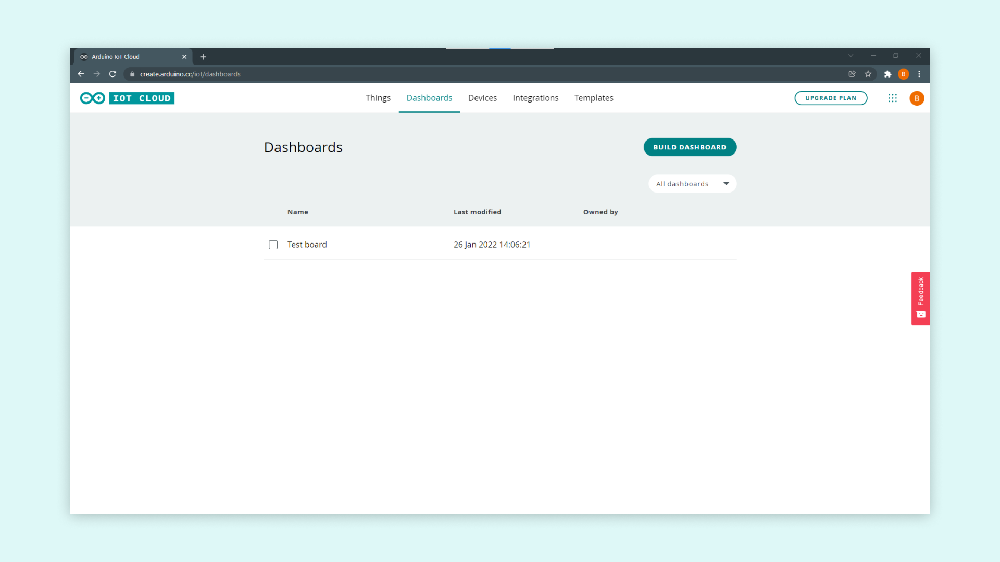
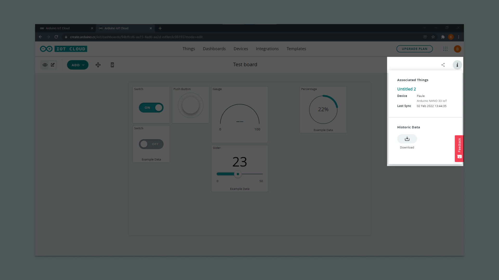

## Introduction 

It is possible to gather Historical data from your [Arduino IoT Cloud]((https://create.arduino.cc/iot/)) Things and Variables. Historical data can be essential to making your electronics and Arduino project work how you want them to. Data retention is a really useful feature with Arduino IoT Cloud.

## Goals

The goals of this project are:

- Learn about Arduino cloud historical data
- Learn how to use this data

## Hardware & Software Needed

For this tutorial, you will need a cloud compatible board. You can see the full list below:

- [MKR 1000 WiFi](https://store.arduino.cc/arduino-mkr1000-wifi)
- [MKR WiFi 1010](https://store.arduino.cc/arduino-mkr-wifi-1010)
- [MKR GSM 1400](https://store.arduino.cc/arduino-mkr-gsm-1400)
- [MKR NB 1500](https://store.arduino.cc/arduino-mkr-nb-1500-1413)
- [Nano RP2040 Connect](https://store.arduino.cc/nano-rp2040-connect)
- [Nano 33 IoT](https://store.arduino.cc/arduino-nano-33-iot)
- [Portenta H7](https://store.arduino.cc/portenta-h7)

***The MKR GSM 1400 & MKR NB 1500 requires a SIM card with a data plan to work. You can read more about it in [this page](https://store.arduino.cc/digital/sim).***

### Different Historical Data

If you are running a home automation to turn the lights on when it's dark, your system is working with (pretty much) real-time data. So 24 hours of sensor information is perfectly adequate. It's not like you'll be turning a lamp on or off based on yesterday's ambient light levels.

A weather station might work a bit differently though. If you're measuring the temperature or rainfall or daylight hours, you may want to build a comparison to see how the weather is changing. In this case using 15 days of data would be more suitable, allowing you to monitor and record recent changes in your weather station's variables.

Historical data for an IoT greenhouse, or maybe an aquarium or terrarium, would be much more important. Maybe it's even an industrial project that's monitoring equipment for predictive maintenance needs. In these cases, being able to look back at your variables over previous weeks and months could be essential.

### Putting Historical Data to Use in Arduino Cloud

Arduino Cloud is really clever when it comes to the data generated by sensors and used as variables. For example, you can specify how often new data is sent to your Arduino Cloud. Let's say you are monitoring Wi-Fi signal strength at the end of the garden, where a project (weather station for example) is installed. If this is a solar and/or battery powered device, power consumption becomes essential. By changing the data sampling interval from updating a variable on Arduino Cloud every second to updating once a minute, you can extend battery life by a huge amount. The device is only operating a fraction of the time it was before, and the information is just as useful.

Combined with 15 days or three months of historical data, you can build a detailed picture of Wi-Fi performance that lets you keep everything running perfectly. Or, if you need to find out when and why your signal has been dropping, the story is right there in your Arduino Cloud dashboard historical data.

## Instructions

### Downloading Historical Data

First, to download historical data navigate into one of your dashboards on the [Arduino cloud](https://create.arduino.cc/iot/dashboards).

While in the dashboard press the "i" icon up in the right corner. When this icon is pressed a window will show up that allows you to download historical data. As shown in the image below.

Clicking “Historical Data” that gives you a list of all variables in use. From here you can select all the ones you want to download by selecting the check boxes. If your dashboard is using multiple Things, you can swap between them from the dropdown at the top.

Simply choose the variables and Things you want to export and click the "Select Data Source" button. You’ll be taken to a new window where you confirm that you want to download the data. You will then receive an email after a couple of minutes providing you with a link to download your data as individual CSV files, zipped up into a single download.

## Conclusion

In this tutorial you learned what applications historical data could have. And how to extract historical data from your Arduino IoT Cloud dashboard.