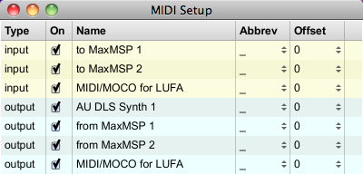
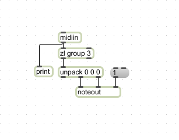

This tutorial shows how to play MIDI notes from an Arduino programmed to appear as a general MIDI device. This tutorial is only applicable to Arduinos with the 8U2 chip, the UNO and Mega2560 boards. This will not work with earlier models that use the FTDI chip (Duemilanove and previous).

Following the instructions on the [Programming 8U2 instructions](/hacking/software/DFUProgramming8U2) using the [MocoLUFA](http://web.mac.com/kuwatay/morecat_lab./MocoLUFA.html) firmware, your Arduino will appear to the computer as a native MIDI device without any additional hardware.

You can read the Wikipedia [MIDI](http://en.wikipedia.org/wiki/MIDI) entry for complete information on the specification, but in a nutshell, MIDI is a useful protocol for controlling synthesizers, sequencers, and other musical devices. MIDI devices are generally grouped in two broad classes: controllers (i.e. devices that generate MIDI signals based on human actions) and synthesizers (including samplers, sequencers, and so forth).

For more information, see this [introduction to MIDI](https://www.tigoe.com/pcomp/code/communication/midi/) or this [example](http://itp.nyu.edu/physcomp/Labs/MIDIOutput).

The Serial.print() function will send a MIDI command to the software synthesizer of your choice (in this example we will use Cycling74's Max/MSP, but any application that accepts MIDI will do).

Before programming the 8U2 firmware, you will need to program the Atmega 328 on your Arduino, the same way you usually do with the IDE. We will be using the MIDI communication example that comes with the Arduino software. It can be found in File>Examples>Communication>MIDI.

## Code
```
/*
 MIDI note player
 
 This sketch shows how to use the serial transmit pin (pin 1) to send MIDI note data.
 If this circuit is connected to a MIDI synth, it will play
 the notes F#-0 (0x1E) to F#-5 (0x5A) in sequence.

 
 The circuit:
 * digital in 1 connected to MIDI jack pin 5
 * MIDI jack pin 2 connected to ground
 * MIDI jack pin 4 connected to +5V through 220-ohm resistor
 Attach a MIDI cable to the jack, then to a MIDI synth, and play music.

 created 13 Jun 2006
 modified 13 Aug 2012
 by Tom Igoe

 This example code is in the public domain.
 
 http://www.arduino.cc/en/Tutorial/Midi
 
 */

void setup() {
  //  Set MIDI baud rate:
  Serial.begin(31250);
}

void loop() {
  // play notes from F#-0 (0x1E) to F#-5 (0x5A):
  for (int note = 0x1E; note < 0x5A; note ++) {
    //Note on channel 1 (0x90), some note value (note), middle velocity (0x45):
    noteOn(0x90, note, 0x45);
    delay(100);
    //Note on channel 1 (0x90), some note value (note), silent velocity (0x00):
    noteOn(0x90, note, 0x00);  
    delay(100);
  }
}

//  plays a MIDI note.  Doesn't check to see that
//  cmd is greater than 127, or that data values are  less than 127:
void noteOn(int cmd, int pitch, int velocity) {
  Serial.write(cmd);
  Serial.write(pitch);
  Serial.write(velocity);
}
```
Program your Arduino, and prepare to program the 8U2 chip. Follow the instructions on the [Programming 8U2](/hacking/software/DFUProgramming8U2/) page, replacing the Arduino firmware with the [MocoLUFA](http://web.mac.com/kuwatay/morecat_lab./MocoLUFA.html) firmware.

After the 8U2 has been updated with the MIDI firmware, disconnect and reconnect the USB cable.

Open your MIDI application of choice and look for connected devices. You should see the Arduino appear as an input and output device named "MIDI/MOCO for LUFA".




A simple Max patch that will allow you to hear the notes generated by the MIDI commands looks like this :



To change the program on the Arduino, you must first reset the firmware on the 8U2 to the Arduino's default.

See Also:

- [MIDI](https://www.arduino.cc/en/Tutorial/Midi)