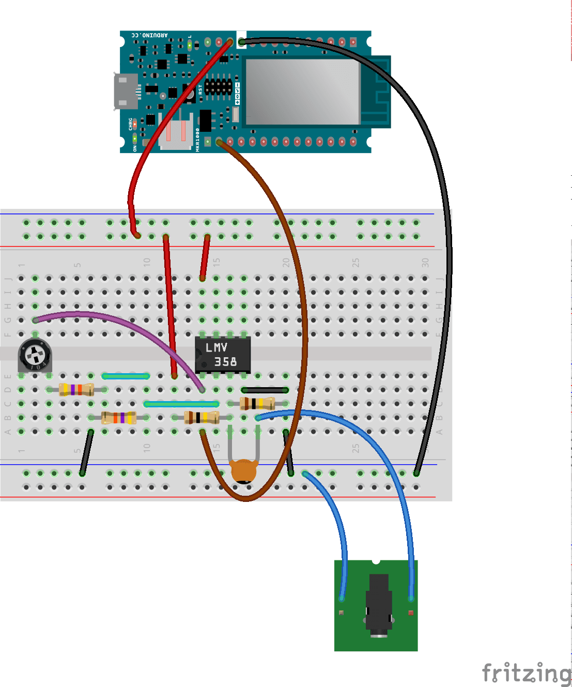
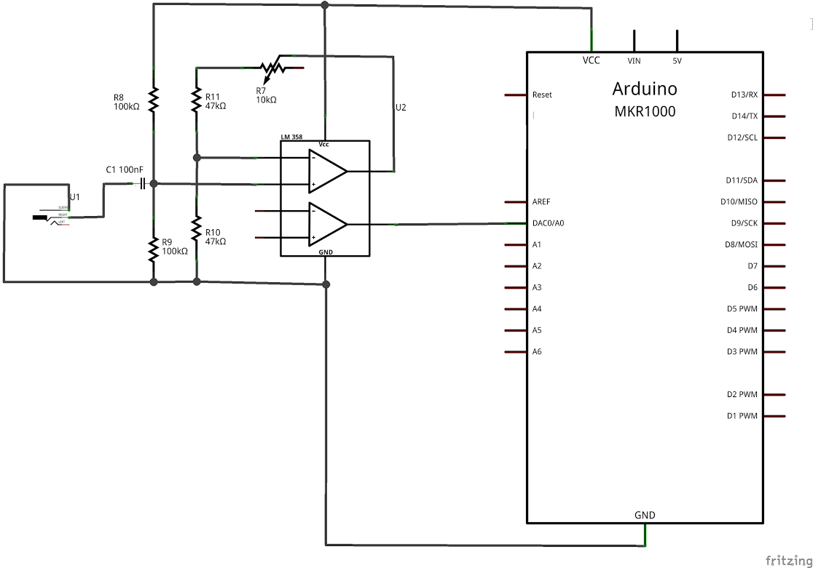

With this tutorial you use the [Audio Frequency Meter Library](https://github.com/agdl/AudioFrequencyMeter) and the [Arduino Midi USB library](https://github.com/arduino-libraries/MIDIUSB) and build a device that recognizes an input frequency and outputs it to MIDI as the nearest corresponding note of the chromatic scale.

## Hardware Required

- Arduino MKR1000 Board

- 1x 10k trimmer

- 1x [LMV358](http://www.ti.com/lit/ds/symlink/lmv324.pdf) or [TLV2462](http://www.ti.com/lit/ds/symlink/tlv2462-q1.pdf)
- 2x 100k resistor

- 2x 47k resistor

- 1x 100n capacitor

- 1x 3.5mm jack

## The Circuit



In order to get the most dynamic range even from low level inputs, the circuit consist of a [non-inverting amplifier](https://en.wikipedia.org/wiki/Operational_amplifier_applications#Non-inverting_amplifier) that brings the amplitude of the signal to the full input voltage range supported by the ADC. Sampling at full [resolution](https://en.wikipedia.org/wiki/Analog-to-digital_converter#Resolution) means a better accuracy.

The 10k trimpot allows to adjust the [gain of the amplifier](https://en.wikipedia.org/wiki/Gain_%28electronics%29) matching the signal level with the ADC input range. This adjustment should be made looking at the output on the Arduino Software (IDE) Serial Monitor: when the note reading is stable while playing the same note, the gain is properly set.

As an alternative, you may purchase the [Electret microphone amplifier - MAX4466 with adjustable gain](https://www.adafruit.com/product/1063) that was designed specifically for this purpose.

Works on: MKR1000 and Zero boards.

## Schematic



## Software Essentials

### Includes:

`<AudioFrequencyMeter.h>`
Library that contains the methods and functions to manage analog frequencies read through the analog inputs. In this sketch it recognizes the main frequency to play through MIDI.

`<MIDIUSB.h>`
Library that creates a MIDI device through USB Host port; the device outputs notes in MIDI format and needs a sound generator.

`<frequencyToNote.h>`
Defines the correspondence between audio frequencies and notes of the 88 keys scale. Part of MIDIUSB

`<pitchToNote.h>`
Defines the correspondence between notes and MIDI note values. Part of MIDIUSB

### Functions In Sketch

**searchForNote(float frequency)**
Search for the nearest frequency that is in the vector of frequencies noteFrequency[ ]

**noteOn(byte channel, byte pitch, byte velocity)**
Sends out to MIDI the event to turn on the note of the specified pitch on the specified MIDI Channel

**void noteOff(byte channel, byte pitch, byte velocity)**
Sends out to MIDI the event to turn off  the note of the specified pitch on the specified MIDI Channel

## Code

```arduino

/*

  Analog to Midi Converter for Arduino MKR1000

  Demonstrates how to sample an input signal and get back its corresponding MIDI note

  This example code is in the public domain

  https://www.arduino.cc/en/Tutorial/AnalogToMidi

  created by Arturo Guadalupi <a.guadalupi@arduino.cc>

  29 Jan 2016

*/

#include <AudioFrequencyMeter.h>
#include <MIDIUSB.h>
#include <frequencyToNote.h>
#include <pitchToNote.h>

#define DEPTH         60                      // Defines depth of the array for averaged frequencies
#define HUMAN_RATE    50                      // Defines 50ms corresponding to 20 notes/s
#define MAX_DURATION  1000                    // Defines the max play duration of the note

AudioFrequencyMeter meter;

int notesArray[DEPTH];                        // Array to store detected notes and find the "correct" note which occurred the most often
int occurrences[DEPTH];                       // Array in which the number of occurrences for each note are stored

bool marked[DEPTH];                           // Array to indicate which of the notes have been checked
int frequencyIndex = 0;                       // Used to navigate to where the current note must be stored

int previousNote;
unsigned int startTime;                       // Used to determine when the note must stop
unsigned int humanTime;                       // Used to determine when the next note can be sampled (using HUMAN_RATE timing)

int intensity = 64;                           // The volume of the played note is fixed at 64

void setup() {

  // put your setup code here, to run once:

  Serial.begin(115200);

  pinMode(11, OUTPUT);

  meter.setBandwidth(75.00, 600.00);          // Set available bandwidth between 75Hz and 600Hz

  meter.begin(A0, 45000);                     // Initialize A0 at sample rate of 45kHz
}

void loop() {

  float frequency = meter.getFrequency();

  if (frequency > 0)

  {

    int noteIndex = searchForNote(frequency); // Find the index of the corresponding frequency

    int note = notePitch[noteIndex];          // Use that index to find the corresponding note in the LUT

    notesArray[frequencyIndex++] = note;      // Store the note and continue to next value in array

    if (frequencyIndex > DEPTH)               // If all the notes have been stored

    {

      frequencyIndex = 0;                     // Reset the index

      int i, j;

      /*Reset all the occurrences and marked positions*/

      for (i = 0; i < DEPTH; i++)

      {

        occurrences[i] = 0;

        marked[i] = 0;

      }

      /*Count the number of occurrences*/

      for (i = 0; i < DEPTH; i++)

      {

        for (j = 0; j < DEPTH; j++)

        {

          // If notes are the same and the note has not been marked yet

          if ((!marked[j]) && (notesArray[j] == notesArray[i]))

          {

            occurrences[i]++;                 // Increment the number of occurrences

            marked[j] = true;                 // Signal the note as marked

          }

        }

      }

      int numberOfdifferentFrequencies = 0;   // Used to determine how many different Frequencies have been detected

      for (i = 0; i < DEPTH; i++)

      {

        // If the counter does not equal zero

        if (occurrences[i] != 0)

        {

          // Store the the various detected Frequencies

          notesArray[numberOfdifferentFrequencies] = notesArray[i];

          // And the number of occurrences for each note

          occurrences[numberOfdifferentFrequencies] = occurrences[i];

          numberOfdifferentFrequencies++;      // Increment the number of detected Frequencies

        }

      }

      /*Search for the maximum number of occurrences to discriminate the played note*/

      int maxNumberOfFrequencies = occurrences[0];

      int rightIndex = 0;

      for (i = 0; i < numberOfdifferentFrequencies; i++);

      {

        // If a new maximum exist

        if (occurrences[i] > maxNumberOfFrequencies)

        {

          // Update the value

          maxNumberOfFrequencies = occurrences[i];

          // Update the index

          rightIndex = i;

        }

      }

      note = notesArray[rightIndex];          // Note to be played is that with the most occurrences

      // If the specified time has elapsed before the next note

      if (millis() - humanTime > HUMAN_RATE)

      {

        humanTime = millis();                 // Update the timer

        startTime = millis();                 // Update the note duration

        noteOff(0, previousNote, intensity);  // Stop playing the previous note

        previousNote = note;                  // Update previous note with the new one

        Serial.println(note);                 // Print the note to be played

        noteOn(0, note, intensity);           // Play the note!

      }

    }

  }

  if (millis() - startTime > MAX_DURATION)    // If maximum time elapsed

    noteOff(0, previousNote, intensity);      // Turn the note off
}

int searchForNote(float frequency)
{

  float minimum = abs(frequency - noteFrequency[0]);

  float newMinimum;

  int index = 0;

  /*Search for the nearest frequency that is in the vector*/

  for (int i = 0; i < NUMBER_OF_NOTES - 1; i++)

  {

    newMinimum = abs(frequency - noteFrequency[i]);

    if (newMinimum < minimum)

    {

      minimum = newMinimum;

      index = i;

    }

  }

  return index;
}

void noteOn(byte channel, byte pitch, byte velocity) {

  midiEventPacket_t noteOn = {0x09, 0x90 | channel, pitch, velocity};

  MidiUSB.sendMIDI(noteOn);
}

void noteOff(byte channel, byte pitch, byte velocity) {

  midiEventPacket_t noteOff = {0x08, 0x80 | channel, pitch, velocity};

  MidiUSB.sendMIDI(noteOff);
}
```
