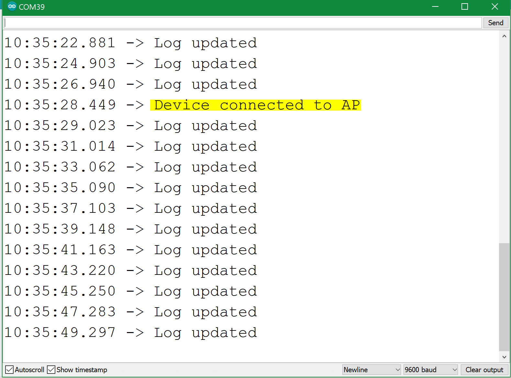
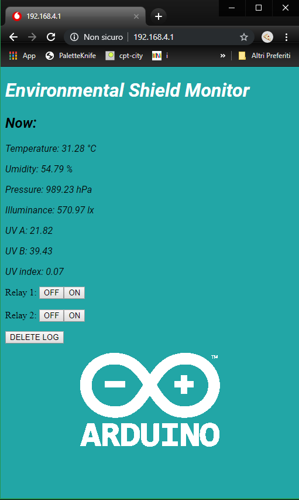

## Components and Supplies

- [Arduino MKR IoT Prime Bundle](https://www.distrelec.biz/en/mkr-iot-prime-bundle-arduino-akx00018/p/30142238?ext_cid=bmnlbbazzen-ArduinoNPI&cw=1924)

## About This Project

You can imagine this project as a standalone monitoring device that could expose information to other mobile devices (i.e. smartphones) in the absence of a Wi-Fi Internet connection, while **hosting a backup of this information**.

As of this project, the Wi-Fi web server is always on, while you can easily trigger the server by putting a pushbutton that brings it up if pressed, making the application less power-hungry. **Temperature, humidity, pressure and light** data are going to be displayed on a simple webpage, while two buttons will allow to control the behavior of the two relays on the Proto Carrier.

Most important, all the data is stored on the SD, in a .CSV file (comma separated values). This is very handy if you want a solid backup device that can be collected / or replaced as needed. 

### Software

This project heavily relies on the **AP_SimpleWebServer** example of the WiFiNINA Library written by Tom Igoe: 

**File>Examples>WifiNINA>AP_SimpleWebServer.ino**

I strongly advice you to run that example in order to test a simpler sketch. Before we start we need to know that the SSID and Password names are to be longer than eight letters, don't use short names if you don't want to run into strange behaviors. Another very important rule of thumb is to be sure the WiFiNINA Library is up-to-date (1.4.0 as we speak). While the code checks for the firmware version on line 46. 

```arduino
String fv = WiFi.firmwareVersion();
if (fv < "1.0.0") {
Serial.println("Please upgrade the firmware");
}
```

You should follow the instructions of firmware updater (Tools>Wifi101 WifiNINA Firmware Updater) in order to be 100% sure everything is up to date and working fine on the module.If you are ok in testing the `AP_SimpleWebServer.ino` code, you should be able to light on and off the on-board LED. 

Remember the network the MKR WiFi 1010 is offering has no connection to the interweb, so you'll may enable non-connected navigation on some mobile devices. We are ready to `#copypasta` the code. Before, let's review it in order to check if everything is in order.

Libraries to import:

```arduino
#include <SPI.h>
#include <SD.h>
#include <WiFiNINA.h>
#include <Arduino_MKRENV.h>
#define POLL_RATE 2*1000
```

The variable `POLL_RATE` is defining the update time of the SD data. Every Log is printed in the Serial Port for you to check. 

In the `setup() `function, the communication with the Wi-Fi module, the Environmental Shield and the SD card is checked, and the server is run on port 80, and we are notified on the Serial Port throughout `printWiFiStatus();` function.

```arduino
// start the web server on port 80
server.begin();// 
you're connected now, so print out the status
printWiFiStatus();
```

Like in the previous example, every time a client connects, its browser in injected with html data from the `client.println()` function. Also, this can be seen in the Serial Log. 



The only exception in this version of the code is the body part, generated in the `readENV() `function, returning a string with the data.

```arduino
String body = readENV();
// the content of the HTTP response follows the header:
client.print(body);
```

The data is then saved on the SD throughout the `void writeLog() `function. You can control the board using the web UI.




## Complete Sketch

<iframe src='https://create.arduino.cc/editor/officine-innesto/0328c7e8-4620-4eb0-82f5-b9a323935f1f/preview?embed&snippet' style='height:510px;width:100%;margin:10px 0' frameborder='0'></iframe>

## Hosting Images on SD Card

As a bonus track, an Arduino logo is hosted on the SD and imported directly in the page, using [base64 standards](https://en.wikipedia.org/wiki/Base64). You can use [multiple sites](https://www.base64-image.de/) to create a img.txt file. Check it out!