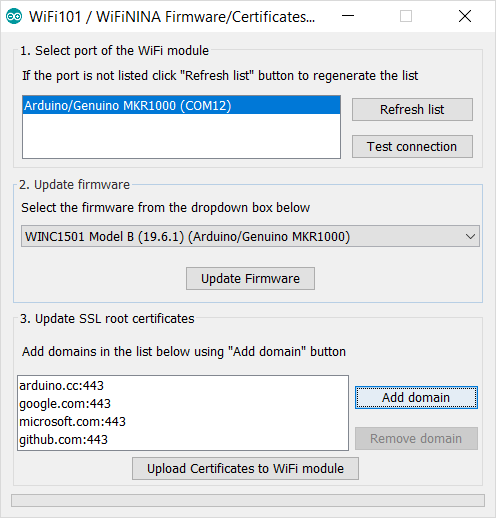

## Introduction
This tutorial will guide you in the process of updating the firmware or loading certificates on your MKR1000 WiFi board or WiFi Shield 101. If the **Check WiFi101 Firmware Version** tells you that you may have issues because the firmware and library versions do not match, here is the solution to align them.

## Goals
- How to update the firmware and loading certificates on the MKR1000 WiFi and WiFi Shield 101.

## Hardware & Software Needed

- [MKR1000 WiFi](/hardware/mkr-1000-wifi) or WiFi Shield 101 connected to an Arduino board
- Arduino IDE ([online](https://create.arduino.cc/) or [offline](https://www.arduino.cc/en/main/software)).

***Note: As of Arduino IDE 2.2.0, the procedure covered in this article no longer works as described for this version. However, you can still use Arduino IDE 1.x.***

## Circuit

The board should be connected to the USB port of the computer ready with Arduino IDE.


***Important note: The 19.6.1 firmware is only available for model B of the WINC1500, this is used in the MKR1000 board. Unfortunately, the WiFi shield 101 uses model A, which Atmel has stopped supporting, so there is no 19.6.1 firmware release for it, 19.4.4 will be the latest firmware version that is compatible.***

## Firmware Update Procedure

To simplify the process, we have prepared a specific sketch: this **FirmwareUpdater**  that you must load on the host board (either the one with the shield plugged in, or the MKR1000 itself) and an easy to use plug-in available in Arduino Software (IDE) 1.6.10 onwards.


Upload the sketch and keep the board (either the one with the shield plugged in, or the MKR1000 itself) connected to the computer. Once done, open the plug-in that is available in the **Tools** menu.


If not is not on the list, please check that it is properly configured in the **Tools** menu.

To update the firmware you should choose the right type of board. You can find your model looking at the WiFi module: the first line in the sticker or the last line of the silk print on the right side of the PCB shows the microcontroller model. It can be either MR210PA or MR510PB and the last letter shows yor model accordingly.


Choose in the dropdown list the model corresponding to your unit and proceed clicking on the **Update Firmware button**. A bar at the bottom will show you the progress of the procedure that includes erasing, writing and verifying of the firmware. At the end you get a clear notice of the successful operation.


## Certificate Uploading

With the same procedure, you may load root certificates on the WiFi module to access securely specific websites. Your board must be running the **FirmwareUpdater** sketch to work. The root certificates are issued by a limited number of certification authorities, but it is difficult to know which site is using which authority. To ease your life, we allow you to specify directly the URL to which you need to connect securely, leaving to us the task to download the root certificate.

The list you are building is not saved from one session to the next one. It might happen that a few websites share the same root certificate. You don't have to worry about this as we take care of it. The space available on your WiFi module to store the certificates is limited to around 10 certificates that, being issued by a limited number of authorities, should be more than enough for the average projects.

The procedure starts connecting your board (either the one with the shield plugged in, or the MKR1000 itself) to your computer and selecting it from the Tools menu of the Arduino Software (IDE). Load the FirmwareUpdater on the board and launch the **WiFi 101 Firmware Updater** from Tools and go to the third section of the interface.



There you find on the left an empty list and on the right the buttons to add or remove the URL from which you want to download the root certificates. The URL should be exactly the one to which you need to connect. Add all the websites' URLs needed and then proceed with the uploading process. Please remember that you erase all the existing certificates when you load a new set. Press the ''Upload Certificates to WiFi module" and wait for the confirmation message.


## Programming the Board
When you load the sketch on the board, it prepares the communication between the plug-in and the WiFi chip. It opens up the communication through the serial port to the WiFi module hosted on the board. It is necessary to perform all the procedures managed by the Firmware Upgrader Plugin. Everything will be managed by the plug-in, but it is important to upload this sketch first.

The complete sketch is below:

## Code


```arduino

/*

  FirmwareUpdate.h - Firmware Updater for WiFi101 / WINC1500.

  Copyright (c) 2015 Arduino LLC.  All right reserved.

  This library is free software; you can redistribute it and/or

  modify it under the terms of the GNU Lesser General Public

  License as published by the Free Software Foundation; either

  version 2.1 of the License, or (at your option) any later version.

  This library is distributed in the hope that it will be useful,

  but WITHOUT ANY WARRANTY; without even the implied warranty of

  MERCHANTABILITY or FITNESS FOR A PARTICULAR PURPOSE.  See the GNU

  Lesser General Public License for more details.

  You should have received a copy of the GNU Lesser General Public

  License along with this library; if not, write to the Free Software

  Foundation, Inc., 51 Franklin St, Fifth Floor, Boston, MA  02110-1301  USA

*/

#include <WiFi101.h>
#include <spi_flash/include/spi_flash.h>

typedef struct __attribute__((__packed__)) {

  uint8_t command;

  uint32_t address;

  uint32_t arg1;

  uint16_t payloadLength;

  // payloadLenght bytes of data follows...
} UartPacket;

static const int MAX_PAYLOAD_SIZE = 1024;

#define CMD_READ_FLASH        0x01
#define CMD_WRITE_FLASH       0x02
#define CMD_ERASE_FLASH       0x03
#define CMD_MAX_PAYLOAD_SIZE  0x50
#define CMD_HELLO             0x99

void setup() {

  Serial.begin(115200);

  nm_bsp_init();

  if (m2m_wifi_download_mode() != M2M_SUCCESS) {

    Serial.println(F("Failed to put the WiFi module in download mode"));

    while (true)

      ;

  }
}

void receivePacket(UartPacket *pkt, uint8_t *payload) {

  // Read command

  uint8_t *p = reinterpret_cast<uint8_t *>(pkt);

  uint16_t l = sizeof(UartPacket);

  while (l > 0) {

    int c = Serial.read();

    if (c == -1)

      continue;

    *p++ = c;

    l--;

  }

  // Convert parameters from network byte order to cpu byte order

  pkt->address = fromNetwork32(pkt->address);

  pkt->arg1 = fromNetwork32(pkt->arg1);

  pkt->payloadLength = fromNetwork16(pkt->payloadLength);

  // Read payload

  l = pkt->payloadLength;

  while (l > 0) {

    int c = Serial.read();

    if (c == -1)

      continue;

    *payload++ = c;

    l--;

  }
}

// Allocated statically so the compiler can tell us
// about the amount of used RAM
static UartPacket pkt;
static uint8_t payload[MAX_PAYLOAD_SIZE];

void loop() {

  receivePacket(&pkt, payload);

  if (pkt.command == CMD_HELLO) {

    if (pkt.address == 0x11223344 && pkt.arg1 == 0x55667788)

      Serial.print("v10000");

  }

  if (pkt.command == CMD_MAX_PAYLOAD_SIZE) {

    uint16_t res = toNetwork16(MAX_PAYLOAD_SIZE);

    Serial.write(reinterpret_cast<uint8_t *>(&res), sizeof(res));

  }

  if (pkt.command == CMD_READ_FLASH) {

    uint32_t address = pkt.address;

    uint32_t len = pkt.arg1;

    if (spi_flash_read(payload, address, len) != M2M_SUCCESS) {

      Serial.println("ER");

    } else {

      Serial.write(payload, len);

      Serial.print("OK");

    }

  }

  if (pkt.command == CMD_WRITE_FLASH) {

    uint32_t address = pkt.address;

    uint32_t len = pkt.payloadLength;

    if (spi_flash_write(payload, address, len) != M2M_SUCCESS) {

      Serial.print("ER");

    } else {

      Serial.print("OK");

    }

  }

  if (pkt.command == CMD_ERASE_FLASH) {

    uint32_t address = pkt.address;

    uint32_t len = pkt.arg1;

    if (spi_flash_erase(address, len) != M2M_SUCCESS) {

      Serial.print("ER");

    } else {

      Serial.print("OK");

    }

  }
}
```

If you are NOT opening the FirmwareUpdater from the examples available in the Arduino Software (IDE) as described in the paragraphs above and wish to copy and paste the code from this tutorial, you need to create another TAB in your sketch and add the **Endianness.ino** listed below.

```arduino

/*

  Endianness.ino - Network byte order conversion functions.

  Copyright (c) 2015 Arduino LLC.  All right reserved.

  This library is free software; you can redistribute it and/or

  modify it under the terms of the GNU Lesser General Public

  License as published by the Free Software Foundation; either

  version 2.1 of the License, or (at your option) any later version.

  This library is distributed in the hope that it will be useful,

  but WITHOUT ANY WARRANTY; without even the implied warranty of

  MERCHANTABILITY or FITNESS FOR A PARTICULAR PURPOSE.  See the GNU

  Lesser General Public License for more details.

  You should have received a copy of the GNU Lesser General Public

  License along with this library; if not, write to the Free Software

  Foundation, Inc., 51 Franklin St, Fifth Floor, Boston, MA  02110-1301  USA

*/

bool isBigEndian() {

  uint32_t test = 0x11223344;

  uint8_t *pTest = reinterpret_cast<uint8_t *>(&test);

  return pTest[0] == 0x11;
}

uint32_t fromNetwork32(uint32_t from) {

  static const bool be = isBigEndian();

  if (be) {

    return from;

  } else {

    uint8_t *pFrom = reinterpret_cast<uint8_t *>(&from);

    uint32_t to;

    to = pFrom[0]; to <<= 8;

    to |= pFrom[1]; to <<= 8;

    to |= pFrom[2]; to <<= 8;

    to |= pFrom[3];

    return to;

  }
}

uint16_t fromNetwork16(uint16_t from) {

  static bool be = isBigEndian();

  if (be) {

    return from;

  } else {

    uint8_t *pFrom = reinterpret_cast<uint8_t *>(&from);

    uint16_t to;

    to = pFrom[0]; to <<= 8;

    to |= pFrom[1];

    return to;

  }
}

uint32_t toNetwork32(uint32_t to) {

  return fromNetwork32(to);
}

uint16_t toNetwork16(uint16_t to) {

  return fromNetwork16(to);
}
```

### Testing It Out

After you have uploaded the code, open the serial monitor to confirm that the update has successfully been uploaded.

### Troubleshoot

If the code is not working, there are some common issues we can troubleshoot:

- You have not uploaded the sketch to the board.
- Your board is not properly configured in the **Tools** menu.

### Conclusion

In this tutorial, we have learned how to update the firmware or loading certificates on the MKR1000 WiFi board or WiFi Shield 101.  