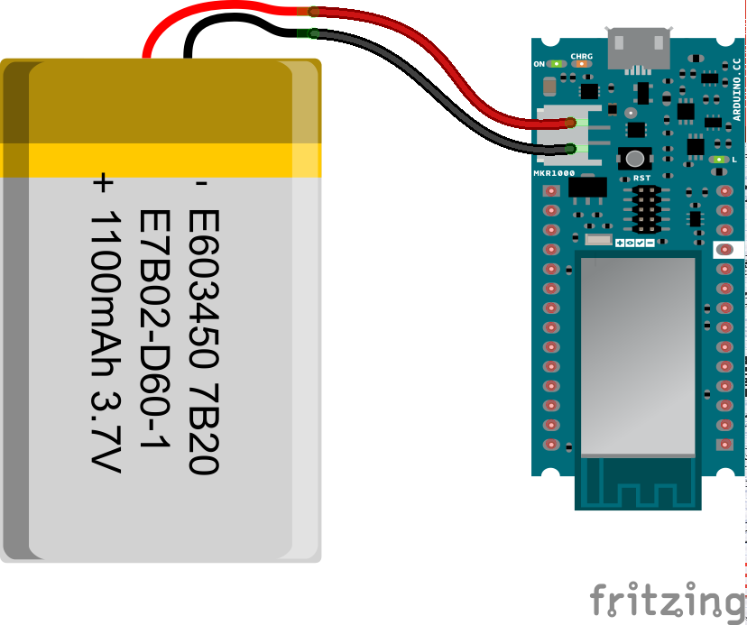
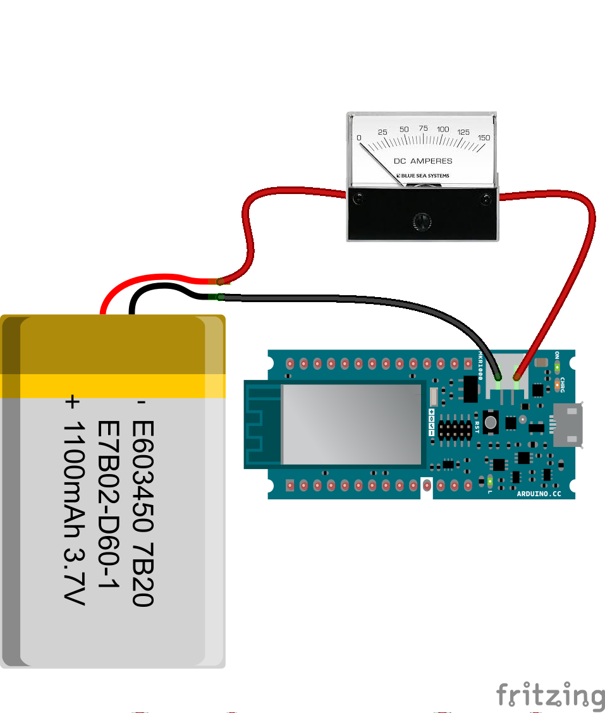

## Introduction

This tutorial gives an overview on how to determine the duration of a rechargeable battery connected to an Arduino MKR1000. Using a simple formula, it is possible to calculate how long a charge can last. The duration is related to the current drawn by the board under different conditions that depend on the sketch and the hardware functionalities used. In this example we use a LiPo battery rated at 1400mAh.

### What You Will Learn


- Learn how to calculate and determine the battery life of a rechargeable battery.
  

## Hardware & Software Needed

- [Arduino MKR1000 WiFi Board](/hardware/mkr-1000-wifi)

- 1400mAh LiPo battery
- Ammeter

- Arduino IDE ([online](https://create.arduino.cc/) or [offline](https://www.arduino.cc/en/main/software)).
- [SPI library](https://www.arduino.cc/en/reference/SPI)
- [WiFi101 library](https://www.arduino.cc/en/Reference/WiFi101)


## The Circuit

The battery is connected to the board through the on-board JST PH connector



### Note

The charging circuit on the MKR1000 board has a charge current fixed at 350mA and a standby charge time of 4 hours. LiPo batteries should not be charged with a current higher than a half of the total capacity. MKR1000 is therefore designed to use batteries with **'at least 700mAh**' of capacity. The maximum capacity is not critical, but bigger batteries require more time to fully charge, therefore we suggest a **maximum** of 1400-1500mAh.

## Computing Battery Life Formula

Computing how long a battery can last is generally speaking quite simple. Each rechargeable battery has its capacity printed on its package, expressed in mAh. This value means that the battery is able to provide the current stated for one hour and after that it will be depleted. If we draw less current, the battery will take more time to discharge. If we know the average current consumption of our circuit we can compute the battery life, expressed in hour using the following formula:

Battery Life = (Battery Capacity) / (Average Current Consumption) * 0.7

If we want the **worst case**  for battery life duration, we can use the maximum current absorbed by our circuit instead of the average one:

Battery Life = (Battery Capability) / (Maximum Current Consumption) * 0.7

### Note

Please note that the factor of 0.7 makes allowances for external factors which can affect battery life for out of specs usage (deep discharge under suggested voltage, mechanical stress etc).

## MKR1000 Current Consumption

The main feature of the MKR1000 board that affects battery life is the Wi-Fi connectivity: it absorbs roughly 100mA when connected to an Access Point and data transfers are on-going. If the Wi-Fi module is not initialized, it is automatically set into low power mode. The consumption of the micro-controller is about 20mA. A sketch using Wi-Fi connection has therefore an average current absorption of 120mA. If we run this information in our formula we get:

Application Run Time = Battery Life = (1400mAh) / (120mA) * 0.7 = 8.16h
## Programming the Board

**1.** First, let's make sure we have correct the drivers installed. If we are using the Web Editor, we do not need to install anything. If we are using an offline editor, we need to install it manually. This can be done by navigating to **Tools > Board > Board Manager...**. Here we need to look for the **Arduino SAMD boards (32-bits Arm® Cortex®-M0+)** and install it.

**2.** To successfully run the code on the board you need to load two libraries:

`#include <SPI.h>`

`#include <WiFi101.h>`

 Go to **Tools > Manage libraries...** then search for the libraries and install them and upload the sketch below to the board.

The estimation of the MKR100's battery consumption mentioned above has been made running the sketch listed below.

```arduino

/*

  Repeating WiFi Web Client

 This sketch connects to a a web server and makes a request

 using an Arduino WiFi shield.

 Circuit:

 * WiFi shield attached to pins SPI pins and pin 7

 created 23 April 2012

 modified 31 May 2012

 by Tom Igoe

 modified 13 Jan 2014

 by Federico Vanzati

 http://arduino.cc/en/Tutorial/WiFiWebClientRepeating

 This code is in the public domain.

 */

#include <SPI.h>
#include <WiFi101.h>

#include "arduino_secrets.h"
///////please enter your sensitive data in the Secret tab/arduino_secrets.h
char ssid[] = SECRET_SSID;        // your network SSID (name)
char pass[] = SECRET_PASS;    // your network password (use for WPA, or use as key for WEP)
int keyIndex = 0;            // your network key Index number (needed only for WEP)

int status = WL_IDLE_STATUS;

// Initialize the WiFi client library

WiFiClient client;

// server address:
char server[] = "example.org";
//IPAddress server(64,131,82,241);

unsigned long lastConnectionTime = 0;            // last time you connected to the server, in milliseconds

const unsigned long postingInterval = 10L * 1000L; // delay between updates, in milliseconds

void setup() {

  //Initialize serial and wait for port to open:

  Serial.begin(9600);

  while (!Serial) {

    ; // wait for serial port to connect. Needed for native USB port only

  }

  // check for the presence of the shield:

  if (WiFi.status() == WL_NO_SHIELD) {

    Serial.println("WiFi shield not present");

    // don't continue:

    while (true);

  }

  // attempt to connect to WiFi network:

  while ( status != WL_CONNECTED) {

    Serial.print("Attempting to connect to SSID: ");

    Serial.println(ssid);

    // Connect to WPA/WPA2 network. Change this line if using open or WEP network:

    status = WiFi.begin(ssid, pass);

    // wait 10 seconds for connection:

    delay(10000);

  }

  // you're connected now, so print out the status:

  printWiFiStatus();
}

void loop() {

  // if there's incoming data from the net connection.

  // send it out the serial port.  This is for debugging

  // purposes only:

  while (client.available()) {

    char c = client.read();

    Serial.write(c);

  }

  // if ten seconds have passed since your last connection,

  // then connect again and send data:

  if (millis() - lastConnectionTime > postingInterval) {

    httpRequest();

  }

}

// this method makes a HTTP connection to the server:
void httpRequest() {

  // close any connection before send a new request.

  // This will free the socket on the WiFi shield

  client.stop();

  // if there's a successful connection:

  if (client.connect(server, 80)) {

    Serial.println("connecting...");

    // send the HTTP PUT request:

    client.println("GET / HTTP/1.1");

    client.println("Host: example.org");

    client.println("User-Agent: ArduinoWiFi/1.1");

    client.println("Connection: close");

    client.println();

    // note the time that the connection was made:

    lastConnectionTime = millis();

  }

  else {

    // if you couldn't make a connection:

    Serial.println("connection failed");

  }
}

void printWiFiStatus() {

  // print the SSID of the network you're attached to:

  Serial.print("SSID: ");

  Serial.println(WiFi.SSID());

  // print your WiFi shield's IP address:

  IPAddress ip = WiFi.localIP();

  Serial.print("IP Address: ");

  Serial.println(ip);

  // print the received signal strength:

  long rssi = WiFi.RSSI();

  Serial.print("signal strength (RSSI):");

  Serial.print(rssi);

  Serial.println(" dBm");
}
```

## Testing It Out

After you have uploaded the code, compute your application's current consumption by the means of an ammeter. To do this you can use the following circuit.



Once you have the ammeter reading you can use the formula we used before.

### Troubleshoot

If the code is not working, there are some common issues we can troubleshoot:

- The wiring is incorrect.
- The battery is not charged.
- You have not installed or included all of the libraries.


## Conclusion

In this tutorial we have learned to calculate and determine the duration of a rechargeable battery using the Arduino MKR1000. The battery life is affected by the sketch that is running on the Arduino, try using different sketches and see how the result differ depending on what sketch you run!