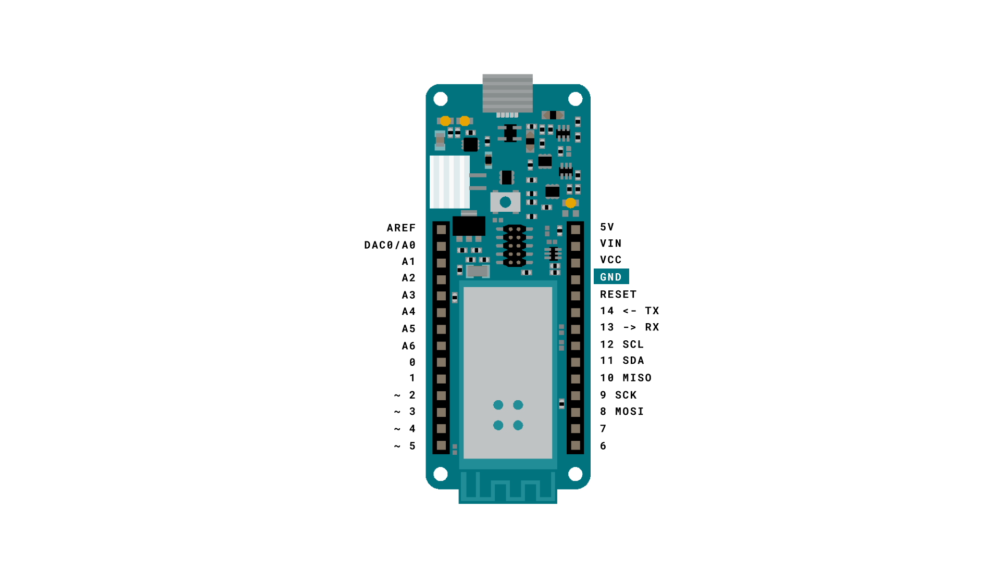
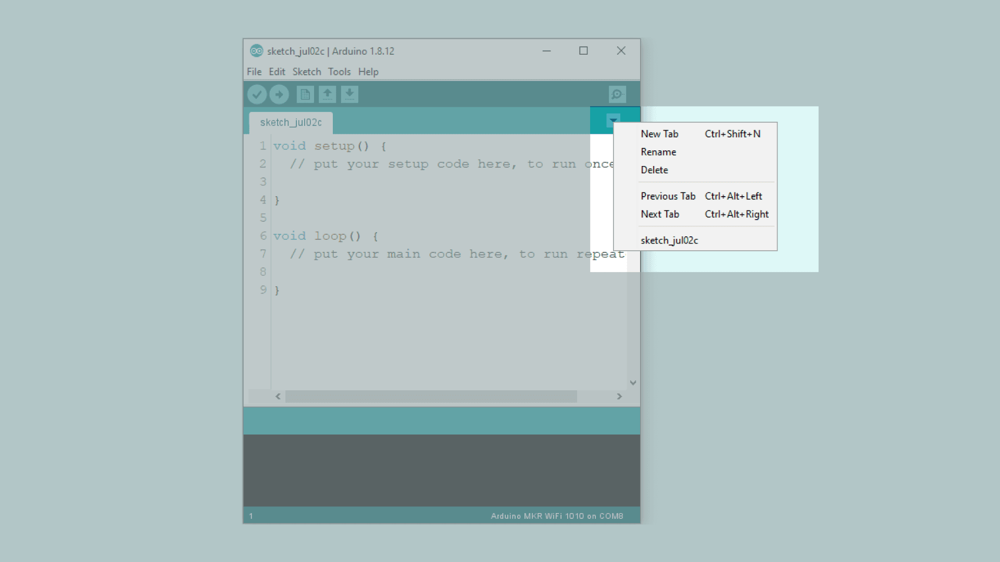
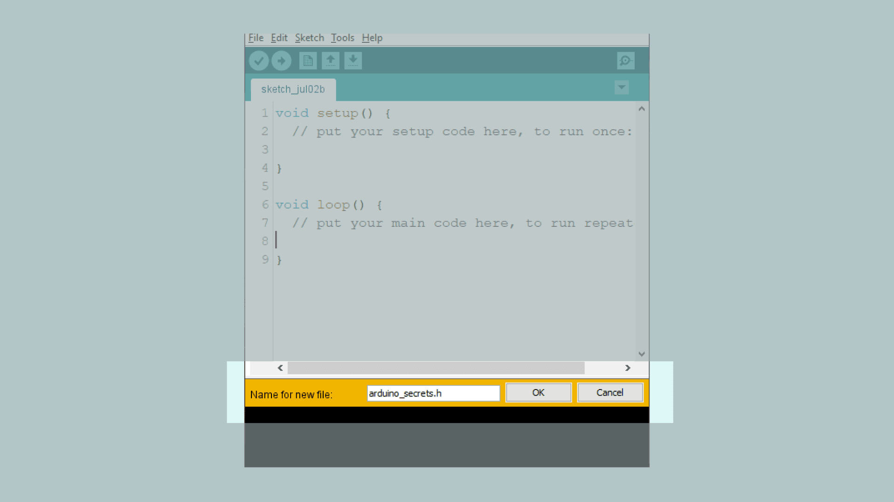
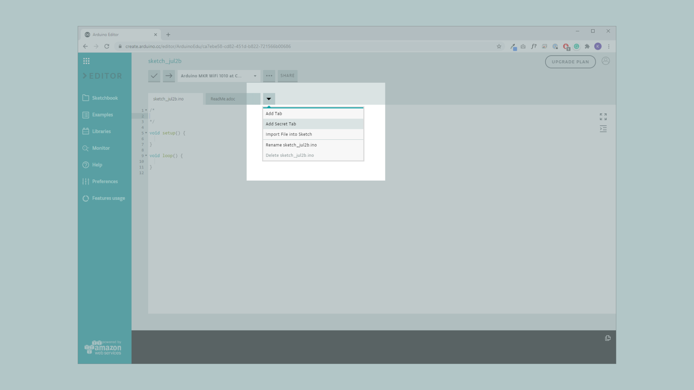
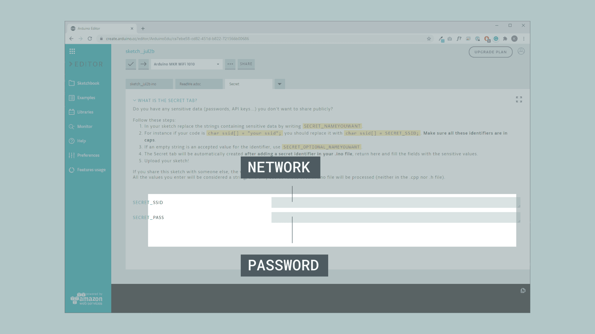
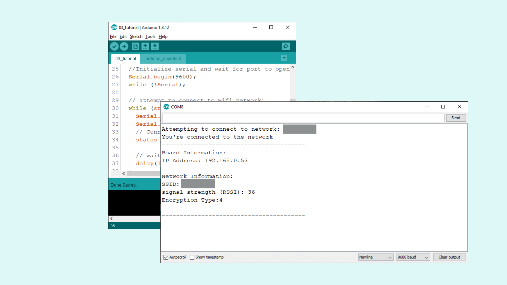
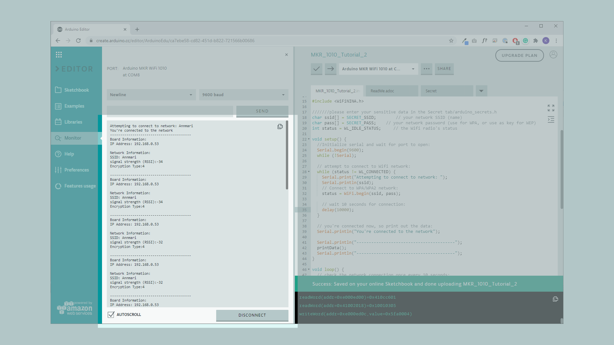

## Introduction

One of the MKR 1000's core strengths is the ability to connect to a Wi-Fi network. In this tutorial, we will focus on achieving this with the help of the **WiFi101** library. We will first connect to a Wi-Fi network and then look at some functions that can help us gather information such as, the IP address of our board, encryption type, RSSI strength and the name of the network we are connecting to.

This tutorial is a great starting point for any maker interested in making applications connected to the Internet.

___

## Hardware & Software Needed

- Arduino IDE ([online](https://create.arduino.cc/) or [offline](https://www.arduino.cc/en/main/software)).
- [WiFi101]https://www.arduino.cc/reference/en/libraries/wifi101/) library.
- Arduino MKR 1000 WiFi ([link to store](https://store.arduino.cc/arduino-mkr1000-wifi)).

## What Is Wi-Fi?

Wi-Fi is a collection of wireless network protocols that are based on the [IEEE 802.11](https://en.wikipedia.org/wiki/IEEE_802.11) standard. It typically uses the 2.4 gHz and 5 gHz radio bands, and is a technology that is best suited for shorter ranges.

It is actually hard to imagine any devices that connect to the Internet (e.g. smartphones, laptops, smart home applications) that does not have a Wi-Fi module. In fact, in 2019, an estimated 3 billion Wi-Fi compatible devices were manufactured (about 0.4 per person, per year, worldwide).

Simply explained, Wi-Fi is used to transfer data from one device to another, for example from your computer to your router. Let's say we are making a request to a server from a device, the following happens:

- A device sends a signal to the router over Wi-Fi.
- Router is physically connected to the Internet, and sends a request to a server somewhere else in the world.
- Server receives request, processes it, and sends it back.
- Router receives it, and sends it to the device.

Now, as we are all aware, this doesn't take a few minutes: it is practically instant (well not quite, but it is very fast). Now if you grew up before Wi-Fi were "the thing", everything was connected by cables, and the core strength of Wi-Fi is that it can send huge amounts of data, without a single cable connected to the device.

Of course, it doesn't come entirely without complications. The main trade-off for using Wi-Fi technologies is mainly power consumption, which is quite high, and the range, which is quite short.

### Circuit

This tutorial requires no circuit. We just need a Micro USB cable to connect our MKR 1000 board to a computer.




## Creating the Program

The goal with this tutorial is to be able to connect our MKR WiFi 1010 board to a Wi-Fi network, and print relevant information regarding the connection.

The following steps are needed in order to create this program:
- Create a header file to store our credentials for the Wi-Fi network which we will connect to.
- Create a function to connect to the Wi-Fi network.
- Create a function to print information regarding the connection.

Let's begin by opening the editor of our choice, and create a new sketch. Now, we need to create a new header file, to store our credentials. We do this, so we don't accidentally store our credentials in a code we may share on the Internet. Depending on what editor you are using, the process is slightly different, but we can follow the instructions below:

### Using the Offline Editor

If you are using the offline editor, simply click on the arrow pointing downwards on the top right corner, following the picture below.



This will open up a yellow field in the bottom of the editor, where we need to name our file **"arduino_secrets.h"**. When we have named it, click "OK" and a new tab will open.



Inside this tab, we need to enter the following code. Simply replace ```"yourNetwork"``` and ```"yourPassword"``` with the credentials of your Wi-Fi network. Remember that it is case-sensitive!
```cpp
#define SECRET_SSID "yourNetwork"
#define SECRET_PASS "yourPassword"
```

### Using the Online Editor
In the online editor, we need to click the downward arrow next to our sketch tab, and click **"Add Secret Tab**. This will create a tab called **Secret**.



We now need to head back to the original sketch file, and enter the following code:

```cpp
char ssid[] = SECRET_SSID;
char pass[] = SECRET_PASS;
```

This will automatically create two fields in the **Secret** tab. If we go back to this tab, we can enter our credentials there.



___

## Code Explanation

>**Note:** This section is optional, you can find the complete code further down on this tutorial.

We have now finished creating our secret credential tab in either the offline or online editor, so let's get started with the code! In this section, we will go through the code, step by step, to get familiar with the different programming concepts we are using.

First, we need to include the **WiFi101** library to access its functionalities. We then need to include the **arduino_secrets.h** file we created (not required in online editor). After that, we need to create two ```char``` variables, one to store our network name, another to store our network password. If you are using the online editor, we have already pasted this in the code in the previous step. We then set the initial Wi-Fi radio's status to idle.

```cpp
#include <SPI.h>
#include <WiFi101.h>

#include "arduino_secrets.h"

char ssid[] = SECRET_SSID;        // your network SSID (name)
char pass[] = SECRET_PASS;    // your network password (use for WPA, or use as key for WEP)
int status = WL_IDLE_STATUS;     // the Wifi radio's status
```

In the ```setup()```, we start serial communication, followed by ```while(!Serial);```, which basically means that unless we open the Serial Monitor, the program will not run. We then create a while loop that checks if we are not connected to Wi-Fi, to begin connecting to it. We then use ``` status = WiFi.begin(ssid, pass); ``` to start connecting to WiFi, and a delay of 10 seconds to give it enough time to connect.

Finally, we will print a simple line, and call on the ```printData()``` function. This function contains information regarding the connection.

```cpp
void setup() {
  //Initialize serial and wait for port to open:
  Serial.begin(9600);
  while (!Serial);

  // attempt to connect to Wifi network:
  while (status != WL_CONNECTED) {
    Serial.print("Attempting to connect to network: ");
    Serial.println(ssid);
    // Connect to WPA/WPA2 network:
    status = WiFi.begin(ssid, pass);

    // wait 10 seconds for connection:
    delay(10000);
  }

  // you're connected now, so print out the data:
  Serial.println("You're connected to the network");

  Serial.println("----------------------------------------");
  printData();
  Serial.println("----------------------------------------");
}
```

The loop is very easy: it only executes the ```printData()``` function every 10 seconds, and then prints a line to separate the information in the Serial Monitor.

```cpp
void loop() {
  // check the network connection once every 10 seconds:
 delay(10000);
 printData();
 Serial.println("----------------------------------------");
}
```

The final step of this code is to create the ```printData()``` function, that we have used in both the setup and loop.

The function is quite basic, it simply prints out three different types of information:
- Board's IP address.
- Name of network connected to.
- Signal strength.

This information is then printed in the Serial Monitor.

```cpp
void printData() {
  Serial.println("Board Information:");
  // print your board's IP address:
  IPAddress ip = WiFi.localIP();
  Serial.print("IP Address: ");
  Serial.println(ip);

  Serial.println();
  Serial.println("Network Information:");
  Serial.print("SSID: ");
  Serial.println(WiFi.SSID());

  // print the received signal strength:
  long rssi = WiFi.RSSI();
  Serial.print("signal strength (RSSI):");
  Serial.println(rssi);

}
```


## Complete Code

If you choose to skip the code building section, the complete code can be found below:

<iframe src="https://create.arduino.cc/editor/ArduinoEdu/ca7ebe58-cd82-451d-b822-721566b00686/preview?embed" style="height:510px;width:100%;margin:10px 0" frameborder="0"></iframe>

>**Note:** You will still need to create a secrets tab yourself and add your credentials if you copy this code.

## Upload Sketch and Testing the Program

Once we are finished with the coding, we can upload the sketch to the board. When it has been successfully uploaded, open the Serial Monitor and the results should match the following images. Note that the network information in this example is greyed out for security reasons.

**If you are using the OFFLINE editor, it will look like this:**



**If you are using the ONLINE editor, it will look like this:**



Congratulations, you have not only connected your board to your Wi-Fi network, but you have also retrieved information from the network. One particularly good feature is the signal strength (rssi). One experiment you can do, is to try to move your MKR 1000 board close to the router and observe the Serial Monitor.

### Troubleshoot

If the code is not working, there are some common issues we can troubleshoot:
- We have not updated the latest firmware for the board.
- We have not installed the Board Package required for the board.
- We have not installed the WiFi101 library.
- We have not entered the SSID and PASS: remember, it is case sensitive.
- We have not selected the right port to upload: depending on what computer we use, sometimes the board is duplicated. By simply restarting the editor, this issue can be solved.

## Conclusion

In this tutorial, we have learned how to simply connect to a Wi-Fi network by using the credentials in the code. We also learned how to obtain specific information regarding our connection, such as signal strength, IP address and name of our network.

Now that you have learned a little bit how to use the **WiFi101** library, you can try out some of our other tutorials for the MKR WiFi 1000 board. You can also check out the [WiFi101](https://www.arduino.cc/en/Reference/WiFi101) library for more examples and inspiration for creating wireless projects!

