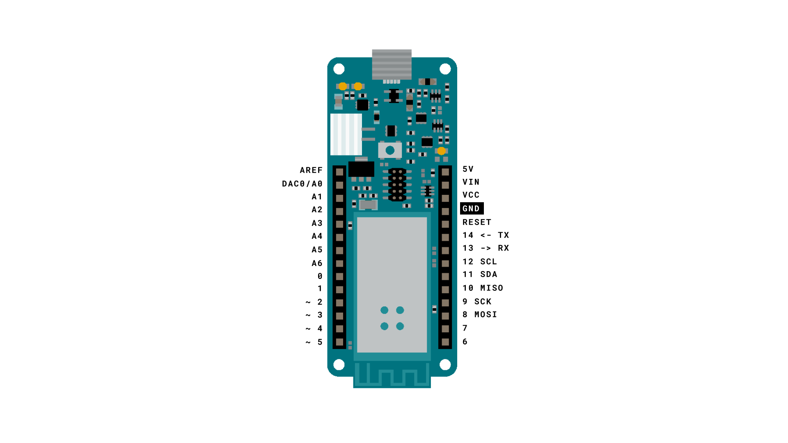
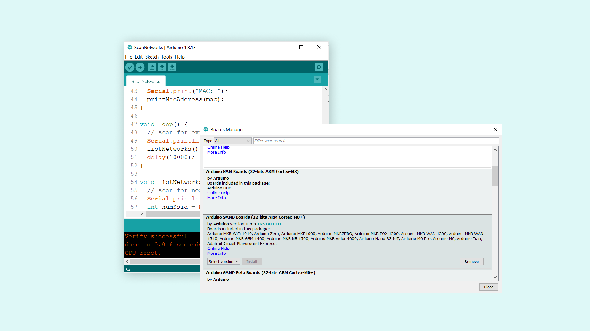
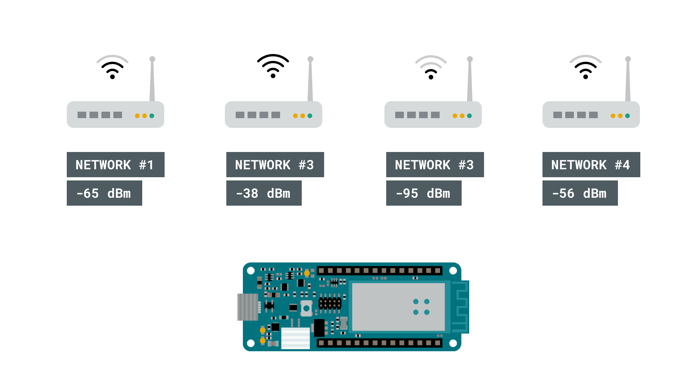

## Introduction

One great feature with the MKR WiFi 1010 is the possibility to scan nearby Wi-Fi networks. This is done using the [NINA-W102 radio module](https://content.arduino.cc/assets/Arduino_NINA-W10_DataSheet_%28UBX-17065507%29.pdf), and in this tutorial, we will go through some simple steps to get this working!

## Goals

The goals of this project are:

- Scan surrounding networks.
- Print available networks in the Serial Monitor.
- Print additional information about these networks.

## Hardware & Software Needed

- Arduino IDE ([online](https://create.arduino.cc/) or [offline](https://www.arduino.cc/en/main/software))
- [WiFi101](https://www.arduino.cc/en/Reference/WiFi101) library.
- Arduino MKR 1000 WiFi ([link to store](https://store.arduino.cc/arduino-mkr1000-wifi))

## Scanning Networks

Scanning for Wi-Fi networks is a quite straightforward process. A device with a Wi-Fi module such as smart-phones, computers or development boards such as the MKR 1000 WiFi, search their surroundings, and get a response from nearby networks. 

The device looking for a network or the client, sends a probe request, while nearby networks send probe responses. These responses contains information such as name of the network, signal strength in dBm (decibel milli-watts) and encryption type.

## Circuit

This tutorial requires no additional circuit.



## Step by Step

1. First we need to make sure we have the dependencies installed. For this tutorial, we will need to install the [WiFi101](https://www.arduino.cc/en/Reference/WiFi101) library. If we are using the offline editor, we can locate this library in **Tools > Manage Libraries...**. If we are using the [Web Editor](https://create.arduino.cc/), it is already installed.

2. If we are using the offline editor, we need to make sure we have the drivers installed. In the editor, navigate to **Tools > Board > Board Manager...**, and install the **Arduino SAMD boards (32-bits Arm® Cortex®-M0+)** core. 



1. Now, we need to install the library needed. If we are using the Web Editor, there is no need to install anything. If we are using an offline editor, simply go to **Tools > Manage libraries..**, and search for **WiFi101** and install it.


2. Now let's take a look at some of the core functionalities of the sketch that we will use.

- `WiFi.macAddress()` - obtains the boards MAC address.
- `WiFi.scanNetworks()` - scans for nearby networks.
- `WiFi.encryptionType()` - retrieves encryption type of found network.
- `WiFi.SSID()` - retrieves SSID (network name) of found network.
- `WiFi.RSSI()` - retrieves RSSI (signal strength) of found network (measured in dBm). 

5. We can now upload the code that can be found in the snippet below to our MKR 1000 WiFi board. You can also find this code in the editor, by navigating to **File > Examples > WiFi101 > ScanNetworks**. 

```cpp
#include <SPI.h>
#include <WiFi101.h>

void setup() {
  //Initialize serial and wait for port to open:
  Serial.begin(9600);
  while (!Serial) {
    ; // wait for serial port to connect. Needed for native USB port only
  }

  // check for the presence of the shield:
  if (WiFi.status() == WL_NO_SHIELD) {
    Serial.println("WiFi shield not present");
    // don't continue:
    while (true);
  }

  // Print WiFi MAC address:
  printMacAddress();

  // scan for existing networks:
  Serial.println("Scanning available networks...");
  listNetworks();
}

void loop() {
  delay(10000);
  // scan for existing networks:
  Serial.println("Scanning available networks...");
  listNetworks();
}

void printMacAddress() {
  // the MAC address of your WiFi shield
  byte mac[6];

  // print your MAC address:
  WiFi.macAddress(mac);
  Serial.print("MAC: ");
  printMacAddress(mac);
}

void listNetworks() {
  // scan for nearby networks:
  Serial.println("** Scan Networks **");
  int numSsid = WiFi.scanNetworks();
  if (numSsid == -1)
  {
    Serial.println("Couldn't get a wifi connection");
    while (true);
  }

  // print the list of networks seen:
  Serial.print("number of available networks:");
  Serial.println(numSsid);

  // print the network number and name for each network found:
  for (int thisNet = 0; thisNet < numSsid; thisNet++) {
    Serial.print(thisNet);
    Serial.print(") ");
    Serial.print(WiFi.SSID(thisNet));
    Serial.print("\tSignal: ");
    Serial.print(WiFi.RSSI(thisNet));
    Serial.print(" dBm");
    Serial.print("\tEncryption: ");
    printEncryptionType(WiFi.encryptionType(thisNet));
    Serial.flush();
  }
}

void printEncryptionType(int thisType) {
  // read the encryption type and print out the title:
  switch (thisType) {
    case ENC_TYPE_WEP:
      Serial.println("WEP");
      break;
    case ENC_TYPE_TKIP:
      Serial.println("WPA");
      break;
    case ENC_TYPE_CCMP:
      Serial.println("WPA2");
      break;
    case ENC_TYPE_NONE:
      Serial.println("None");
      break;
    case ENC_TYPE_AUTO:
      Serial.println("Auto");
      break;
  }
}

void printMacAddress(byte mac[]) {
  for (int i = 5; i >= 0; i--) {
    if (mac[i] < 16) {
      Serial.print("0");
    }
    Serial.print(mac[i], HEX);
    if (i > 0) {
      Serial.print(":");
    }
  }
  Serial.println();
}
```


## Testing It Out

After we have uploaded the code to the board, we will need to open the Serial Monitor. When we open it, we will first see the MAC address of our board printed, followed by the text `"Scanning available networks"`. After 10 seconds of scanning, the available networks will be listed, along with information about the network.


If we look closer at #1 in the list, we can see that the signal is -38 dBm. When this test was done, the board was only a meter away from the router, so the signal strength is great.

But if we look at the other networks, we can see that the signal goes all the way down to -94 dBm, which is very weak. If we tried to connect a computer to this network, it would most likely fail. 



### Troubleshoot

If the code is not working, there are some common issues we can troubleshoot:

- We have not installed the **WiFi101** library.
- We have not installed the drivers for the MKR WiFi 1010.
- We have not selected the right port. 

## Conclusion

In this tutorial we have created a simple Wi-Fi scanner, that has printed all available networks within range of our MKR 1000 WiFi board. This feature exists virtually in any device that can connect to the Internet, and can be quite a good tool to experiment with, for example how far our devices can be from a gateway (router) to work. 


