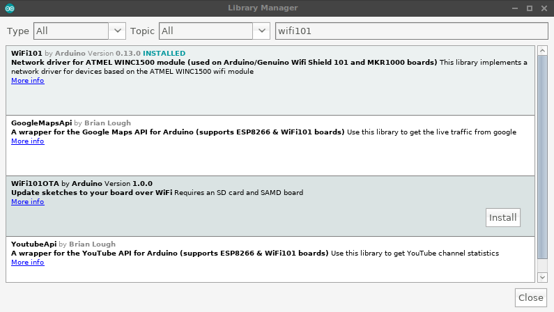
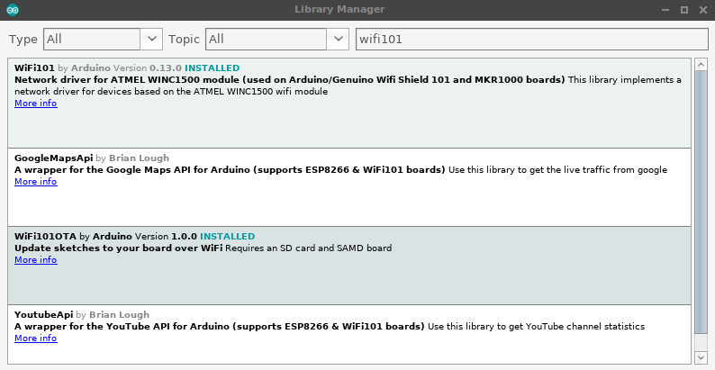
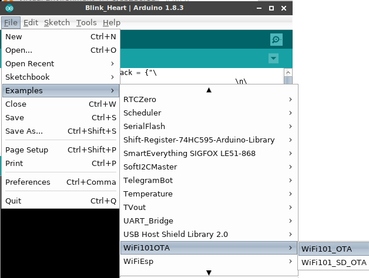
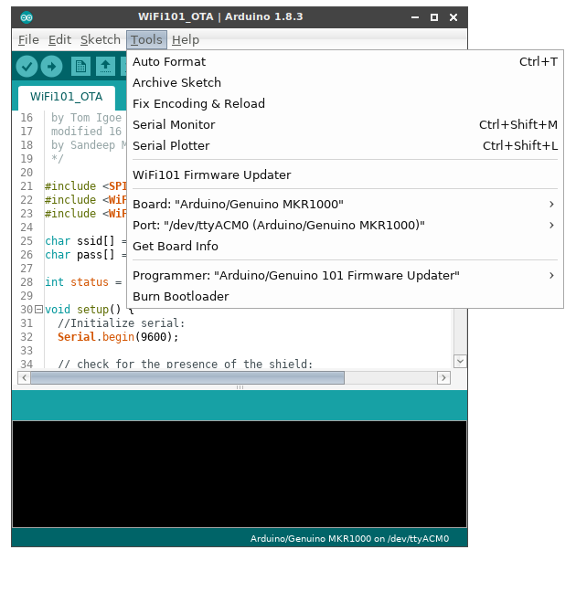
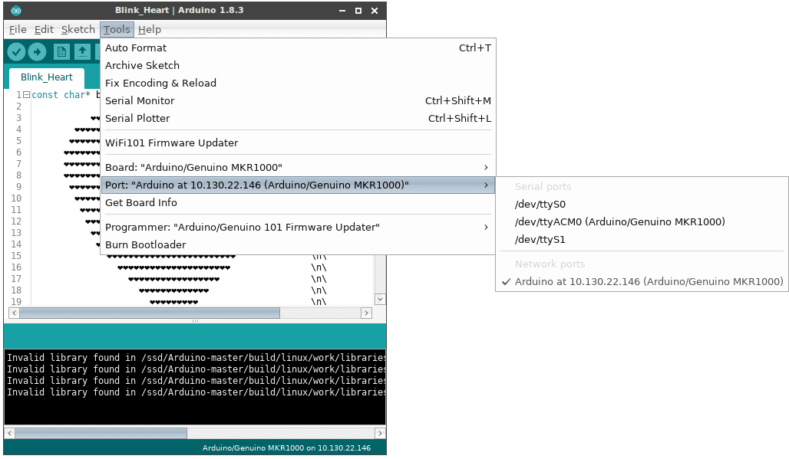
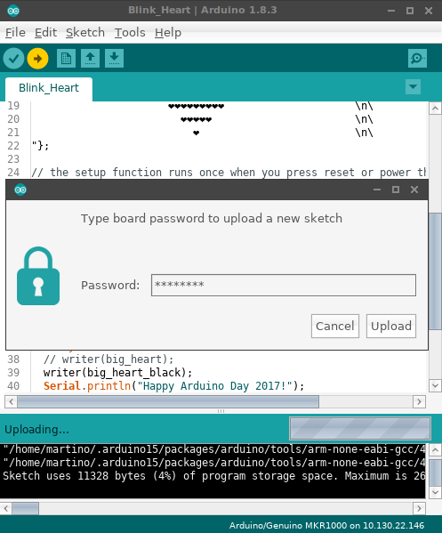
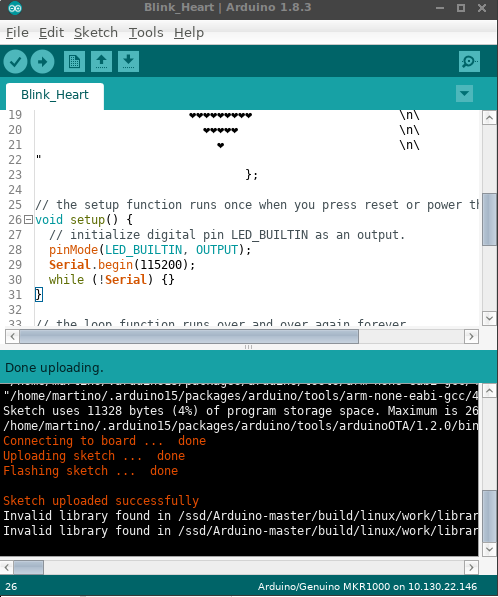
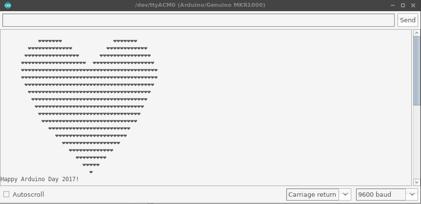
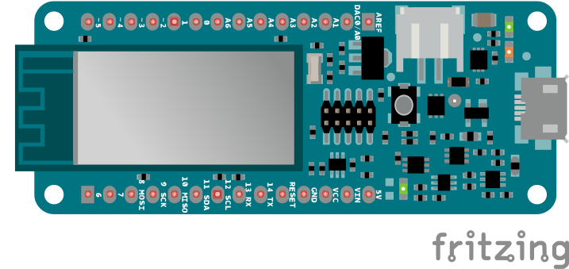

This example shows how to use the WiFi101OTA library to update your sketch over the air. No extra hardware is required since the update is applied directly in the upper half of the  internal flash. This means that the biggest possible size of the compiled sketch is 120 KB.

## Hardware Required

- [MKR 1000 WiFi](https://store.arduino.cc/products/arduino-mkr1000-wifi) board 

***This example also works with a [WiFi Shield 101 (retired)](https://docs.arduino.cc/retired/shields/arduino-wifi-shield-101) + [Arduino Zero](https://store.arduino.cc/products/arduino-zero).***

## Walkthrough

Download the WiFi101OTA library via Library Manager





Select the WiFi101OTA sketch from the "Examples" menu and tune it to match your network name and password.



Upload the example using the "classic" serial port method



Your MKR1000 will connect to the Wi-Fi and expose itself as a Network port with the name and password you declared in the sketch with `WiFiOTA.begin` (the defaults name is "Arduino" while the password is "password").

At this point you are already able to update the sketch over the air! Open another sketch and make sure to add `WiFiOTA.begin()` in `setup()` and  `WiFiOTA.poll()` in your `loop()` . If you forget about this you will lose the ability to upload over the air again (but you can still upload via serial, of course)

We are now ready to upload our new sketch wirelessly! Select the correct Network port in the Ports menu and press "Upload"



You will be prompted to enter the password you configured in the `begin` . Remember to choose a strong password to avoid unauthorised access to your board!



Hooray! We just uploaded a new sketch over the air!



Open the serial port to check the new sketch is up and running



## Circuit



## Code

First time you upload this code, you have to do it by means of the USB cable. After the first upload you will see your board listed under the Tools->port menu in the network's port sub menu.

```arduino

/*

 This example connects to an WPA encrypted WiFi network.

 Then it prints the  MAC address of the Wifi shield,

 the IP address obtained, and other network details.

 It then polls for sketch updates over WiFi, sketches

 can be updated by selecting a network port from within

 the Arduino IDE: Tools -> Port -> Network Ports ...

 Circuit:

 * WiFi shield attached

 * SD shield attached

 created 13 July 2010

 by dlf (Metodo2 srl)

 modified 31 May 2012

 by Tom Igoe

 modified 16 January 2017

 by Sandeep Mistry

 */

#include <SPI.h>
#include <SD.h>
#include <WiFi101.h>
#include <WiFi101OTA.h>
#include <SDU.h>

char ssid[] = "yourNetwork";      // your network SSID (name)
char pass[] = "secretPassword";   // your network password

int status = WL_IDLE_STATUS;

void setup() {

  //Initialize serial:

  Serial.begin(9600);

  // setup SD card

  Serial.print("Initializing SD card...");

  if (!SD.begin(SDCARD_SS_PIN)) {

    Serial.println("initialization failed!");

    // don't continue:

    while (true);

  }

  Serial.println("initialization done.");

  // check for the presence of the shield:

  if (WiFi.status() == WL_NO_SHIELD) {

    Serial.println("WiFi shield not present");

    // don't continue:

    while (true);

  }

  // attempt to connect to Wifi network:

  while ( status != WL_CONNECTED) {

    Serial.print("Attempting to connect to SSID: ");

    Serial.println(ssid);

    // Connect to WPA/WPA2 network. Change this line if using open or WEP network:

    status = WiFi.begin(ssid, pass);

  }

  // start the WiFi OTA library with SD based storage

  WiFiOTA.begin("Arduino", "password", SDStorage);

  // you're connected now, so print out the status:

  printWifiStatus();
}

void loop() {

  // check for WiFi OTA updates

  WiFiOTA.poll();

  // add your normal loop code below ...
}

void printWifiStatus() {

  // print the SSID of the network you're attached to:

  Serial.print("SSID: ");

  Serial.println(WiFi.SSID());

  // print your WiFi shield's IP address:

  IPAddress ip = WiFi.localIP();

  Serial.print("IP Address: ");

  Serial.println(ip);

  // print the received signal strength:

  long rssi = WiFi.RSSI();

  Serial.print("signal strength (RSSI):");

  Serial.print(rssi);

  Serial.println(" dBm");
}


```


**Last revision 2017/03/24 by AG**