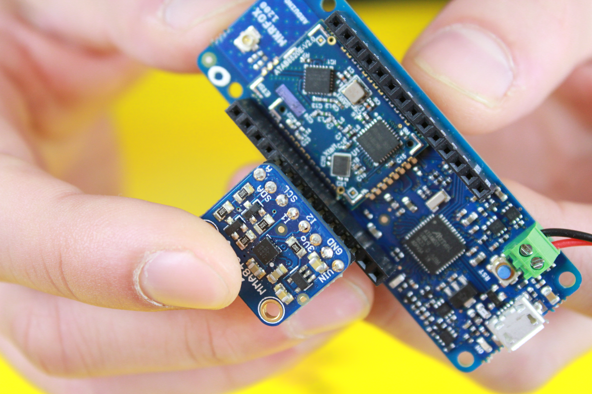

## Components and Supplies

- [Arduino MKR Fox 1200](https://store.arduino.cc/arduino-mkrfox1200)
- [Jumper wires (generic)](https://www.newark.com/88W2571?COM=ref_hackster)
- [AA Batteries](http://www.amazon.com/dp/B00451SSBI/?tag=octopart00-20)
- 2 x AA battery holder
- [Adafruit® MMA8451 3 Axis accelerometer](https://www.adafruit.com/product/2019)

## About This Project

### Background

This project relies on the geolocation feature of the Sigfox network. 

The location computation is based on the data from the Sigfox infrastructure, coming from several replicas of the same messages sent by a device and received by different base stations. The method used is not based on flight time or signal Doppler shift, but on the signal strength (RSSI - Received Signal Stren- gth Indicator) using a probability model (the location with the highest probability is selected). The Sigfox geolocation service will evolve in 2017 to increase its accuracy by using machine learning technology.

### Accelerometer

Another key technology is the micromachined accelerometer inside the MMA8451 device: an I2C interfaced sensor that our project uses to detect movements and trigger the communication with the Sigfox network. Thanks to the low power modes of SAMD21 and Sigfox technology, expect this project to run for several months on a pair of AA Alkaline batteries.

### Components

### Build It

Connect the 3 axis to the MKR FOX 1200 as shown: 

Connect a jumper between pin 14 and pin 0: 

Put in a nice box: 

Place the box inside the car:

## Code

<iframe src='https://create.arduino.cc/editor/Arduino_Genuino/3bcf9f25-65cf-4f91-ae15-64436bbd5bde/preview?embed&snippet' style='height:510px;width:100%;margin:10px 0' frameborder='0'></iframe>

### How It Works

Once the movement sensor triggers, the MKR FOX will send an alert message with the coordinates taken from the network.

### Software

On software side, if you haven't done yet, register your MKR FOX 1200 by following the example [here](https://www.arduino.cc/en/Tutorial/SigFoxFirstConfiguration).

Then go to the [Sigfox backend](https://backend.sigfox.com/) and configure the callback as follows:

