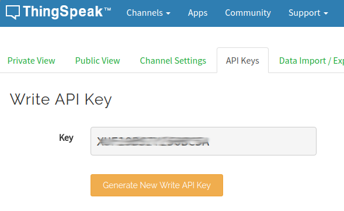

## Components and Supplies

- [Arduino MKR Fox 1200](https://store.arduino.cc/arduino-mkrfox1200)
- [SparkFun Atmospheric Sensor Breakout - BME280](https://www.sparkfun.com/products/13676)
- [TSL2561 digital luminosity light sensor](https://store.arduino.cc/tsl2561-digital-luminosity-light-sensor)
- [HTU 1D](https://www.sparkfun.com/products/retired/12064)

## Apps and Online Services

- [Arduino Web Editor](https://create.arduino.cc/editor)
- [ThingSpeak API](https://github.com/iobridge/ThingSpeak)
- [Sigfox](http://makers.sigfox.com/)

## About This Project

This project shows how to turn a **MKR FOX 1200** and a bunch of I2C sensors into a simple, battery-powered weather station. 

We will use: 

* the onboard temperature sensor (low precision, ± 1 °C)
* HTU21D I2C sensor to get humidity level
* Bosch BMP280 to get the barometric pressure and precise temperature
* TSL2561 light sensor to get luminosity

### Hardware Setup

The hardware connections for this project are quite simple: all the sensors use I2C interfaces and run at 3.3V. 

They need four wires from the MKR FOX 1200: GND, 3.3V, SDA on Pin 11 and SCL on Pin 12. The same four connections can be shared in parallel with the three sensors because each of them has a specific I2C address and therefore the relevant libraries and functions will take care of discriminating each of them. 

The whole project can be powered by two AA or AAA alkaline batteries connected in series to generate 3V and wired to the screw connection terminal block on the board. 

### Sigfox Messages 

Since the Sigfox network can send a maximum of 140 messages per day, we'll optimize the readings and send data in compact binary format.

Data packing is important because the maximum size of a message you can send is 12 bytes. A float occupies 4 bytes, so we'll need to pack our readings into some smaller representation.

The float format is very wide (you can represent numbers as big as 3.402823e+38 (!) ) and we don't need the whole data space; we can then decide safe limits (based on where we are going to deploy the station) and restore the original representation in the backend.

### Configuration of the Cloud Services

We'll use two Cloud services:

* [Sigfox backend](http://backend.sigfox.com/)
* [Thingspeak](https://thingspeak.com/)

Register your board on Sigfox backend using PAC and ID provided by [FirstConfiguration example](https://www.arduino.cc/en/Tutorial/SigFoxFirstConfiguration) (can be skipped if you already did that for a previous project).

Both need to be configured to talk each other and interpret the data in the right format. Register to both and create a couple of *channels* on Thingspeak. The configuration is reported in the image below.

The first channel we configure will be the one which receives the raw data (`readChannelID`), while the second one will collect the re-scaled data (`writeChannelID`).


It's about time to upload the sketch using Arduino Create Editor. The default sketch lets you test extensively all the infrastructure before deploying on the field. 

Remember to declare:

```arduino
oneshot  = false
```

when you are confident that all the backend infrastructure setup is correct. The sketch waits for the serial port, so we won't launch it now. Instead, open the [SigFox backend](http://backend.sigfox.com/) and configure a callback:


You will see a windows like this:


The relevant configurations are reported below. Make sure the callback is setup as:

* TYPE: `DATA/UPLINK`
* Channel: `URL`
* Http method: `GET`

As Custom Payload, set:

```arduino
status::uint:8 temp1::int:16:little-endian temp2::int:16:little-endian press::uint:16:little-endian hum::uint:16:little-endian light::uint:16:little-endian lastMsg::uint:8 
```

This represents the structure we packed in the sketch. We are assigning a variable to each field, so we can reference them in the HTTP callback.

As URL Pattern, set:

```arduino
https://api.thingspeak.com/update?api_key=XXXXXXXXXXXX&field1={customData#temp1}&field2={customData#press}&field3={customData#temp2}&field4={customData#hum}&field5={customData#light}&field6={customData#status}&field7={customData#lastMsg} 
```

Once configured, your windows should be like this: 


Remember to change the API key `api_key`with the one provided by Thingspeak as `Write API Key`for `Channel1`. 



Save and exit. We can now open the serial port and observe the first message being sent. Hooray!

### From Raw to Graphics 

The setup we configured will route our data to the Thingspeak backend, but they are still in raw format; to reconvert them, let's use [Thingspeak analysis tool ](https://thingspeak.com/apps/matlab_analyses)with this snippet

```arduino
% TODO - Replace the [] with channel ID to read data from: 
readChannelID = []; 
% TODO - Enter the Read API Key between the '' below: 
readAPIKey = 'T6UK7XO6A4H2AGT7';  
% TODO - Replace the [] with channel ID to write data to: 
writeChannelID = []; 
% TODO - Enter the Write API Key between the '' below: 
writeAPIKey = 'XU4TGY261P6B5USN';  
%% Read Data %% 
data = thingSpeakRead(readChannelID, 'ReadKey', readAPIKey,'OutputFormat','table');  
analyzedData = data;  
%% Analyze Data %% 
INT16_t_MAX = 32767; 
UINT16_t_MAX = 65536; 
analyzedData.('Temperature1') = data.('Temperature1') / INT16_t_MAX * 120 ; 
analyzedData.('Temperature2') = data.('Temperature2') / INT16_t_MAX * 120 ; 
analyzedData.('Pressure') = data.('Pressure') / UINT16_t_MAX * 200000 ; 
analyzedData.('Light') = data.('Light') / UINT16_t_MAX * 100000 ; 
analyzedData.('Humidity') = data.('Humidity') / UINT16_t_MAX * 110 ; 
%% Write Data %% 
thingSpeakWrite(writeChannelID, analyzedData, 'WriteKey', writeAPIKey); 
%% Schedule action: React -> every 10 minutes
```

By replacing the **channel IDs** with our own we can finally convert back the raw data into actual values. Remember to schedule the analysis action every 10 minutes using **React** or it will never be executed!


## Complete Sketch

<iframe src='https://create.arduino.cc/editor/Arduino_Genuino/f025cb10-c6a7-41d5-911a-0ecad82bbcbb/preview?embed&snippet' style='height:510px;width:100%;margin:10px 0' frameborder='0'></iframe>
