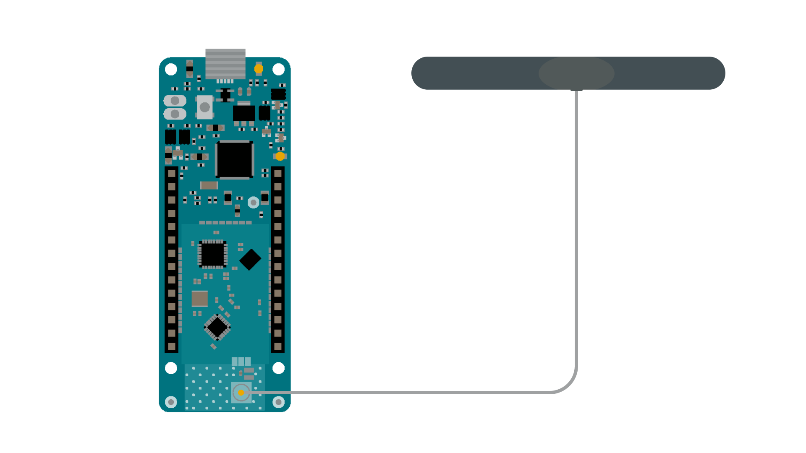
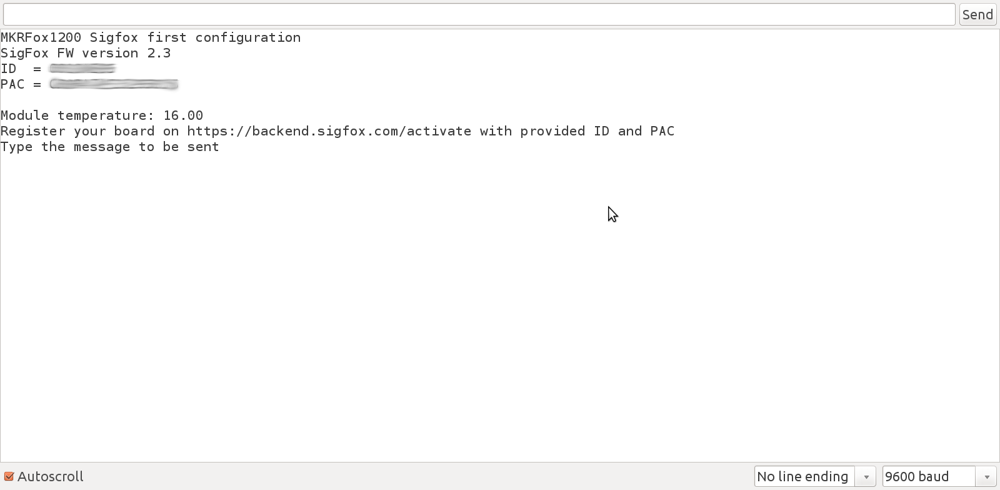
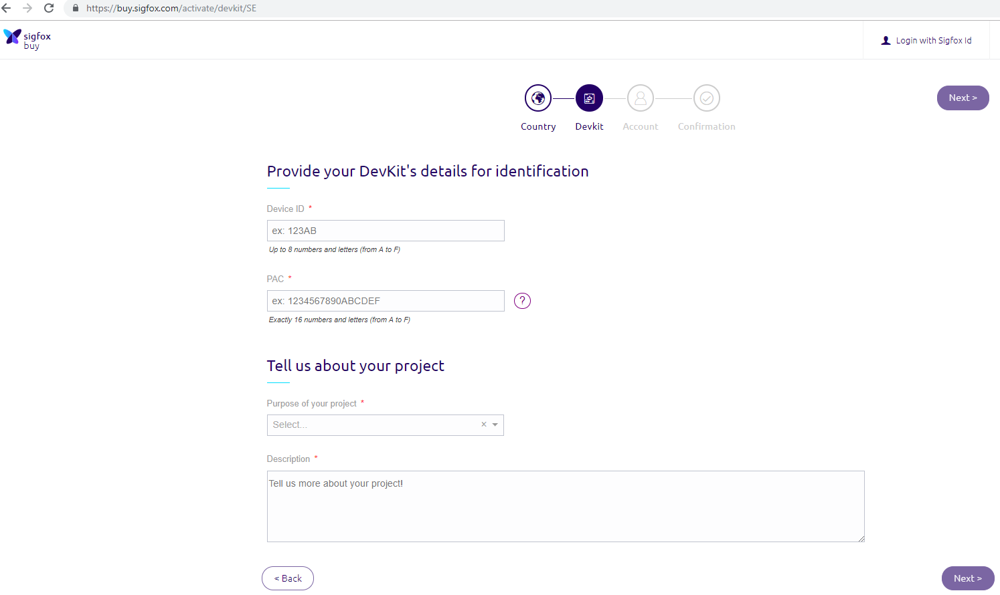
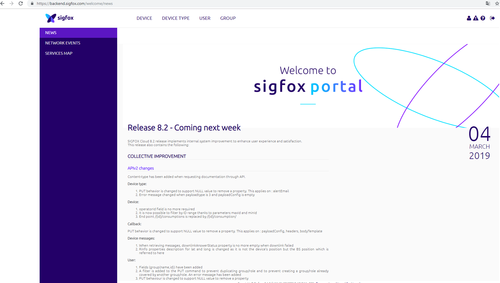
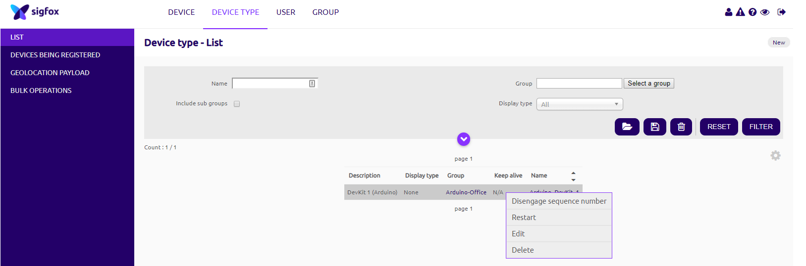
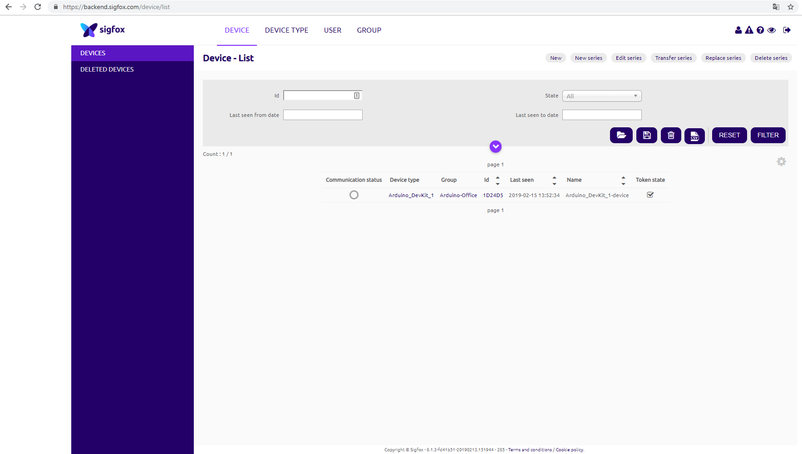
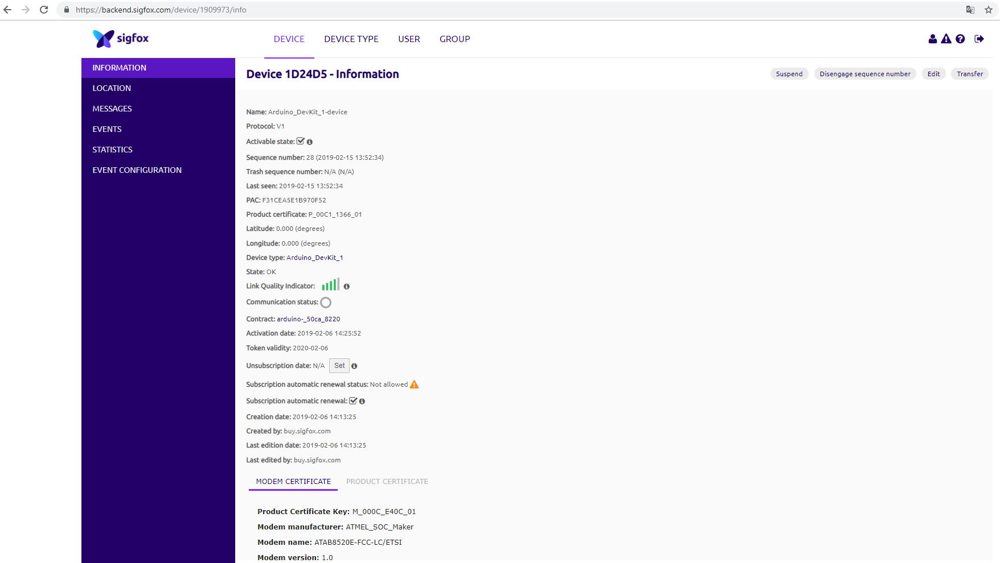
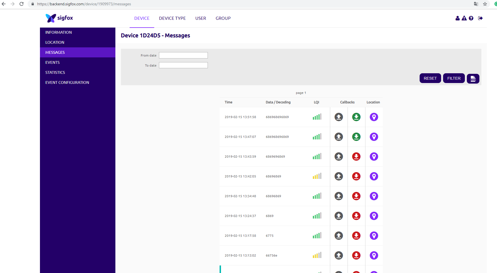
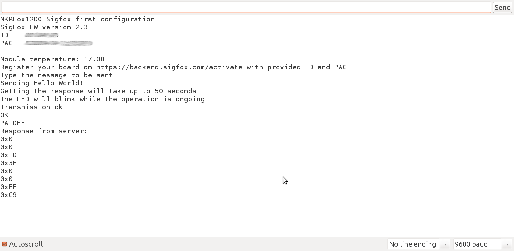
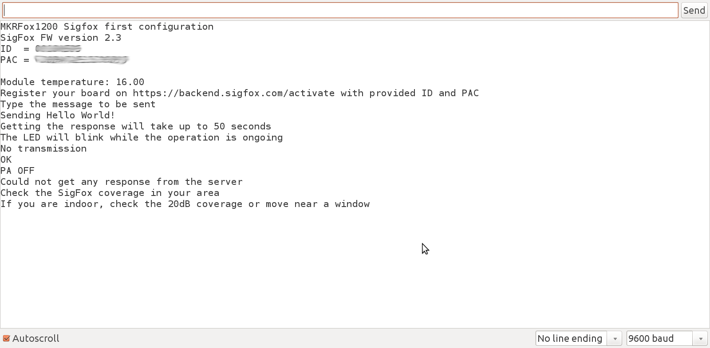

This example for a MKR FOX 1200 device allows you to setup the SigFox's backend for your board.

## Hardware Required

- [MKR FOX 1200](/hardware/mkr-fox-1200)
- Antenna [(link to store)](https://store.arduino.cc/antenna)

### Circuit

Connect the antenna to the MKR FOX 1200 board as shown in the image below.



## Code

In `setup()` the Serial is initialized. This will allow you to insert your first SigFox message and to get the information you need to configure the SigFox's backend. Since the MKRFox1200 doesn't have an auto reset function associated to the Serial monitor opening, a Serial while is present. We also check that the SigFox module is present and can be used.

```arduino
void setup() {

  Serial.begin(9600);

  while(!Serial) {};

  if (!SigFox.begin()) {

    Serial.println("Shield error or not present!");

    return;
}
```

After this, we can read our **ID** and **PAC** that you have to use to register your board.

```arduino
String version = SigFox.SigVersion();

  String ID = SigFox.ID();

  String PAC = SigFox.PAC();

  // Display module information

  Serial.println("MKRFox1200 Sigfox first configuration");

  Serial.println("SigFox FW version " + version);

  Serial.println("ID  = " + ID);

  Serial.println("PAC = " + PAC);

  Serial.println("");

  Serial.print("Module temperature: ");

  Serial.println(SigFox.temperatureInternal());

  Serial.println("Register your board on https://backend.sigfox.com/activate with provided ID and PAC");

  delay(100);

  // Send the module to the deepest sleep

  SigFox.end();
```



### Register Your Board

To register you board you have to navigate to the [SigFox backend](https://backend.sigfox.com/activate). This is an one time registration process, needed once for every MKR FOX 1200 you own.


Select the country where the user is residing or using it right now



After that, enter your ID and PAC number which was shown on the serial monitor after uploading the sketch the FIRST CONFIG.

Now you can check the incoming and outgoing messages from the sigfox back end.


Input your credentials to get to the Sigfox portal home page.



Now we have to make sure that our Downlink mode is set to **Direct** and not **Callback**.



Click on the Device type and then click on the **Keep Alive** and click **Edit**.


So, put **Downlink mode** to **Direct** to receive messages back and forth.

Now you can go back to the main Sigfox portal page and click on the Device on Top left, then click on the ID as shown in the image below.



Select the **messages** item on the left menu bar.



In this page you can see the messages. If it is sent properly, then you can see the green call back otherwise, you can see callback as a red arrow



When the configuration for callback is done properly, you can send your first message! If your message is correctly delivered you will get a response from the server similar to:



Otherwise an error message will be printed on the serial monitor



### Complete Code

```arduino

/*

  SigFox First Configuration

  This sketch demonstrates the usage of MKRFox1200 SigFox module.

  Since the board is designed with low power in mind, it depends directly on ArduinoLowPower library

  This example code is in the public domain.

*/

#include <SigFox.h>
#include <ArduinoLowPower.h>

void setup() {

  Serial.begin(9600);

  while (!Serial) {};

  // Uncomment this line and comment begin() if you are working with a custom board

  //if (!SigFox.begin(SPI1, 30, 31, 33, 28, LED_BUILTIN)) {

  if (!SigFox.begin()) {

    Serial.println("Shield error or not present!");

    return;

  }

  // Enable debug led and disable automatic deep sleep

  // Comment this line when shipping your project :)

  SigFox.debug();

  String version = SigFox.SigVersion();

  String ID = SigFox.ID();

  String PAC = SigFox.PAC();

  // Display module information

  Serial.println("MKRFox1200 Sigfox first configuration");

  Serial.println("SigFox FW version " + version);

  Serial.println("ID  = " + ID);

  Serial.println("PAC = " + PAC);

  Serial.println("");

  Serial.print("Module temperature: ");

  Serial.println(SigFox.internalTemperature());

  Serial.println("Register your board on https://buy.sigfox.com/activate with provided ID and PAC");

  Serial.println("/!\ The displayed PAC is the factory value. It is a throw-away value, which can only be used once for registration.")

  Serial.println("If this device has already been registered, you can retrieve the updated PAC value on https://backend.sigfox.com/device/list");

  Serial.println("Join the Sigfox Builders Slack community to exchange with other developers, get help .. and find new ideas! https://builders.iotagency.sigfox.com/");

  delay(100);

  // Send the module to the deepest sleep

  SigFox.end();

  Serial.println("Type the message to be sent");

  while (!Serial.available());

  String message;

  while (Serial.available()) {

    message += (char)Serial.read();

  }

  // Every SigFox packet cannot exceed 12 bytes

  // If the string is longer, only the first 12 bytes will be sent

  if (message.length() > 12) {

    Serial.println("Message too long, only first 12 bytes will be sent");

  }

  Serial.println("Sending " + message);

  // Remove EOL

  message.trim();

  // Example of message that can be sent

  // sendString(message);

  Serial.println("Getting the response will take up to 50 seconds");

  Serial.println("The LED will blink while the operation is ongoing");

  // Example of send and read response

  sendStringAndGetResponse(message);
}

void loop()
{
}

void sendString(String str) {

  // Start the module

  SigFox.begin();

  // Wait at least 30mS after first configuration (100mS before)

  delay(100);

  // Clears all pending interrupts

  SigFox.status();

  delay(1);

  SigFox.beginPacket();

  SigFox.print(str);

  int ret = SigFox.endPacket();  // send buffer to SIGFOX network

  if (ret > 0) {

    Serial.println("No transmission");

  } else {

    Serial.println("Transmission ok");

  }

  Serial.println(SigFox.status(SIGFOX));

  Serial.println(SigFox.status(ATMEL));

  SigFox.end();
}

void sendStringAndGetResponse(String str) {

  // Start the module

  SigFox.begin();

  // Wait at least 30mS after first configuration (100mS before)

  delay(100);

  // Clears all pending interrupts

  SigFox.status();

  delay(1);

  SigFox.beginPacket();

  SigFox.print(str);

  int ret = SigFox.endPacket(true);  // send buffer to SIGFOX network and wait for a response

  if (ret > 0) {

    Serial.println("No transmission");

  } else {

    Serial.println("Transmission ok");

  }

  Serial.println(SigFox.status(SIGFOX));

  Serial.println(SigFox.status(ATMEL));

  if (SigFox.parsePacket()) {

    Serial.println("Response from server:");

    while (SigFox.available()) {

      Serial.print("0x");

      Serial.println(SigFox.read(), HEX);

    }

  } else {

    Serial.println("Could not get any response from the server");

    Serial.println("Check the SigFox coverage in your area");

    Serial.println("If you are indoor, check the 20dB coverage or move near a window");

  }

  Serial.println();

  SigFox.end();
}
```

## Conclusion

In this tutorial we have connected the MKR FOX 1200 board to the Sigfox network.
