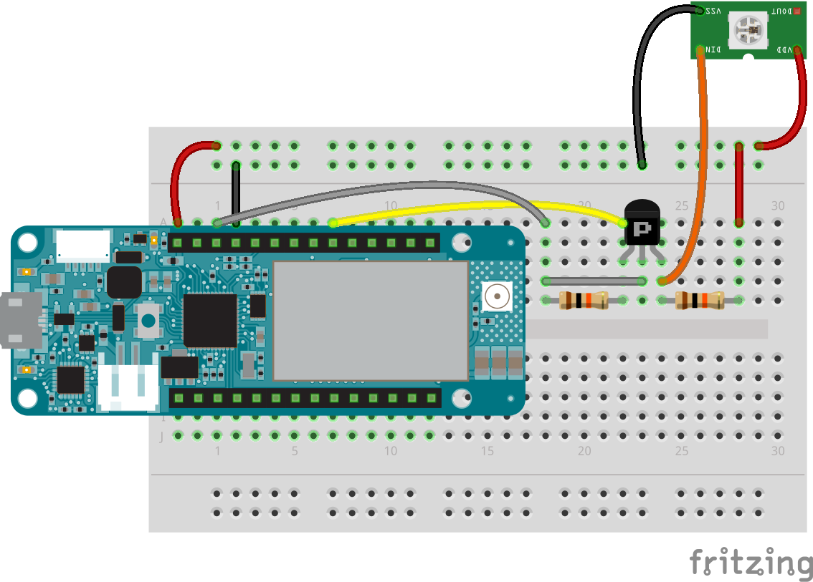

## Components and Supplies

- [Arduino MKR GSM 1400](https://www.newark.com/55AC1187?COM=ref_hackster)
- 3.7 V LiPo Battery
- [Adafruit® NeoPixel Ring: WS2812 5050 RGB LED](http://www.newark.com/26Y8458?COM=ref_hackster)
- [Resistor 10k ohm](https://www.newark.com/multicomp/mccfr0w4j0103a50/carbon-film-resistor-10kohm-250mw/dp/58K5002?COM=ref_hackster)
- [ON Semiconductor 2N7000](https://www.mouser.it/ProductDetail/ON-Semiconductor-Fairchild/2N7000/?qs=sGAEpiMZZMshyDBzk1%2fWi9bHELEahoDnY1fyKF6A6Ko%3d)
- [Breadboard (generic)](https://www.newark.com/99W1759?COM=ref_hackster)
- [Jumper wires (generic)](https://www.newark.com/88W2571?COM=ref_hackster)

## Apps and Online Services

- [Arduino IDE](https://www.arduino.cc/en/main/software)
- [Arduino Cloud Editor](https://create.arduino.cc/editor)

## About This Project

### Introduction

Like every phone, the GSM module on your Arduino MKR GSM 1400 can recognize DTMF tones. These are the tones that you can hear whenever you press a key on your phone's keyboard during a call. 

## How It Works

The operating principle of this tutorial is very simple: every time a phone call is received, the board answers the call and waits for a DTMF tone. When the tone is pressed, the board parses it, prints it on the serial monitor, and changes the LEDs color according to the pressed button.

### Hardware Connections

As you can see from the breadboard layout, a transistor is present between the Arduino board and the NeoPixel input. This is placed since the MKR GSM 1400 operates at 3.3V while the NeoPixel works at 5V. The transistor is used as a voltage translator. In the layout, there is also a single NeoPixel placed instead of the ring just for the sake of simplicity.

## Setup

The setup to use this code is very simple. You just have to:

* Plug the antenna into the board
* Plug a micro SIM card into your board
* Connect the LEDs as shown in the scheme
* Plug the battery into the board
* Plug the micro USB cable and connect it to your PC
* Load the code on the board using the Arduino Java or Web IDE
* Open the serial monitor
* Call the board and enjoy pressing buttons on your keyboard!
  
## Code 
<iframe src='https://create.arduino.cc/editor/Arduino_Genuino/8e87bd19-988e-4082-a2be-d0525519d369/preview?embed&snippet' style='height:510px;width:100%;margin:10px 0' frameborder='0'></iframe>

### Schematics

### See Also

This example is based on the [Arduino MKR GSM](https://www.arduino.cc/en/Reference/MKRGSM) library. 