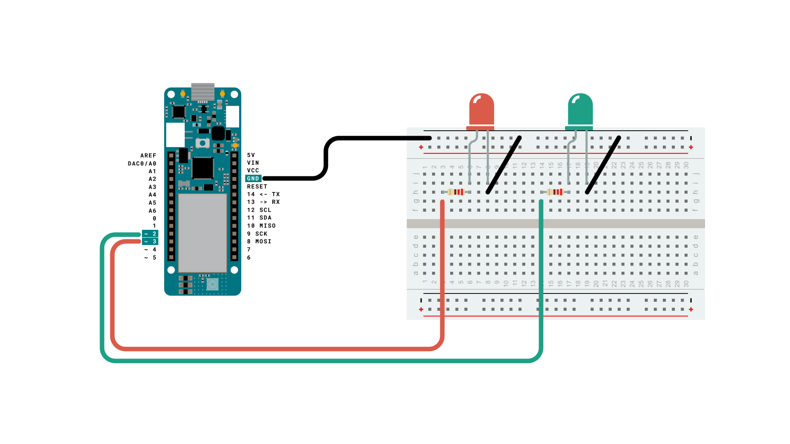
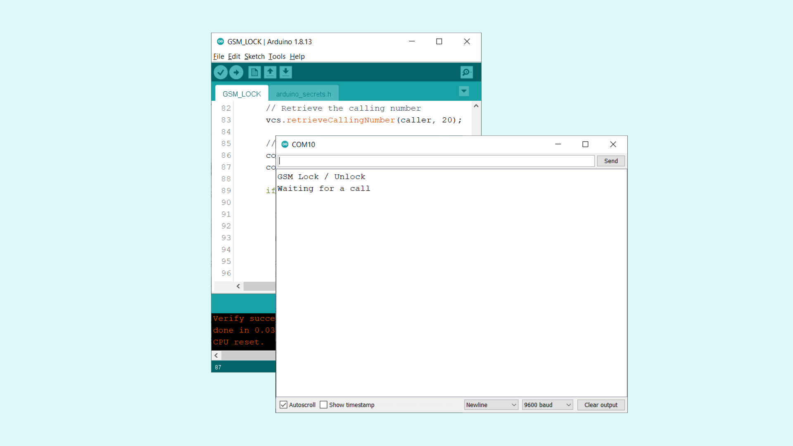
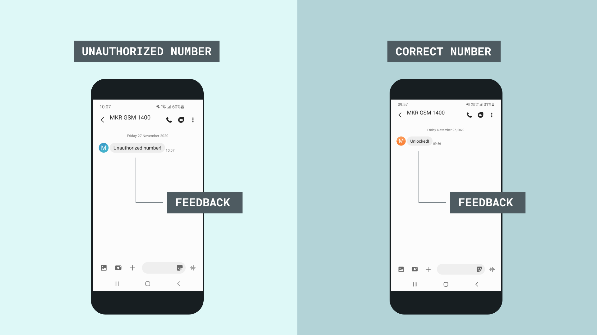

## Introduction 

One of the many cool things you can use the MKR GSM 1400 board for is to place and receive voice calls. In this tutorial we will see how we can create a **smart lock**.

Basically, we will configure the MKR GSM 1400 to only accept incoming calls from a specific number, and if we call from that number, we will be able to "unlock" it, which in this case is represented by a red and green LED. 

## Goals

The goals of this project are:

- Configure our device to listen for incoming calls.
- Configure our device so that only specific numbers can unlock.
- Create a conditional that either switches a red or green LED on or off.
- Send a feedback SMS back to the caller.

## Hardware & Software Needed

- Arduino IDE ([online](https://create.arduino.cc/) or [offline](https://www.arduino.cc/en/main/software)).
- [MKRGSM](https://www.arduino.cc/en/Reference/GSM) library installed. 
- [Arduino MKR GSM 1400](https://store.arduino.cc/mkr-gsm-1400).
- [Antenna](https://store.arduino.cc/antenna).
- SIM card from an operator in your country.

## Smart Locks

Smart locks are becoming increasingly more popular to use for homes, offices, safes and other places that we wish to keep safe. There is a large number of different components, protocols and security measurements that can be used for this, including RFID tags, secure MQTT and SSL. 

As society is rapidly moving towards the digitalization of things, physical objects are starting to disappear. This of course, brings problems in itself, such as cyber-security. But from a positive point of view, it also allows us to manage most of our daily tasks, directly from our phone. Whether it is for purchasing, public transport or identification, we basically use our smartphones for everything these days.

In this project, we will use a very basic method to lock and unlock something: voice calls. The "secure element" that we will use in this will be our very own phone number, which we will use as a comparison variable. This way, if any call in the world comes in, we will not let them in, unless it is identical to the number we compare it to. 

## Circuit




## Programming the Board

We will now get to the programming part of this tutorial. The sketch we will create will include the following features:

- Set up the board to listen for incoming voice calls (using switch statements).
- Create a comparison variable containing a specific number (used to check if incoming number is "safe").
- Create a conditional that either marks incoming call as authorized or unauthorized, and turns on green LED if the call is authorized.
- Send a feedback SMS back to the caller on whether something has been unlocked or not.

**1.** First, let's make sure we have the drivers installed. If we are using the Web Editor, we do not need to install anything. If we are using an offline editor, we need to install it manually. This can be done by navigating to **Tools > Board > Board Manager...**. Here we need to look for the **Arduino SAMD boards (32-bits Arm® Cortex®-M0+)** and install it. 

**2.** Now, we need to install the libraries needed. If we are using the Web Editor, there is no need to install anything. If we are using an offline editor, simply go to **Tools > Manage libraries..**, and search for **MKRGSM** and install it.

**3.** We can now take a look at some of the core functions of this sketch:

- `GSM gsmAccess` - base class for all GSM functions.
- `GSM_SMS sms` - base class for all GSM functions for SMS.
- `GSMVoiceCall vcs` - base class for GSM voice call functions.
- `gsmAccess.begin(pin)` - connects to the GSM network with the pin number as a parameter, e.g. 0123.
- `vcs.getvoiceCallStatus()` - checks if there's a call, and returns: `IDLE_CALL` (no call) or `RECEIVINGCALL` (a call is incoming). 
- `vcs.retrieveCallingNumber(caller, 20)` - retrieves the number of the caller and stores it in `caller` variable. 
- `vcs.hangCall()` - used to hang up on calls.
- `sms.beginSMS(number);` - creates an SMS for a specific number.  
- `sms.endSMS()` - sends the SMS.

The sketch can be found in the snippet below. Upload the sketch to the board.

>**Note:** The `PINNUMBER[]` and `safeNumber` variables needs to be replaced with your credentials (pin number and phone number).

```cpp
// Include the GSM library
#include <MKRGSM.h>

#include "arduino_secrets.h"
// Please enter your sensitive data in the Secret tab or arduino_secrets.h
// PIN Number
const char PINNUMBER[] = "YOUR_PIN";

int greenLED = 2;
int redLED = 3;

String comparison;
String safeNumber = "YOUR_PHONE_NUMBER";

// initialize the library instance
GSM gsmAccess;
GSMVoiceCall vcs;
GSM_SMS sms;

// Array to hold the number for the incoming call
char caller[20];

void setup() {
  // initialize serial communications and wait for port to open:
  Serial.begin(9600);

  pinMode(redLED, OUTPUT);
  pinMode(greenLED, OUTPUT);

  while (!Serial) {
    ; // wait for serial port to connect. Needed for native USB port only
  }

  Serial.println("GSM Lock / Unlock");

  // connection state
  bool connected = false;

  // Start GSM shield
  // If your SIM has PIN, pass it as a parameter of begin() in quotes
  while (!connected) {
    if (gsmAccess.begin(PINNUMBER) == GSM_READY) {
      connected = true;
    } else {
      Serial.println("Not connected");
      delay(1000);
    }
  }

  // This makes sure the modem correctly reports incoming events
  vcs.hangCall();

  Serial.println("Waiting for a call");
}

void loop() {
  // Check the status of the voice call
  switch (vcs.getvoiceCallStatus()) {
    case IDLE_CALL: // Nothing is happening

      break;

    case RECEIVINGCALL: // Yes! Someone is calling us

      Serial.println("RECEIVING CALL");

      // Retrieve the calling number
      vcs.retrieveCallingNumber(caller, 20);

      //clear comparison string
      comparison = "";
      comparison = String(comparison + caller);

      if (comparison.equals(safeNumber)) {
        Serial.println("Phone number matched!");
        Serial.println("Opening lock...");

        vcs.hangCall();

        //Turn on green LED (UNLOCKED)
        digitalWrite(greenLED, HIGH);

        //Send a feedback SMS back to caller.
        sms.beginSMS(caller);
        sms.print("Unlocked!");
        sms.endSMS();

        Serial.println("Unlocked!");
        Serial.println();
      }
      else {
        Serial.println("Unauthorized number!");

        //hang up call
        vcs.hangCall();

        //Turn on red LED (LOCKED)
        digitalWrite(redLED, HIGH);

        //Send a feedback SMS back to caller.
        sms.beginSMS(caller);
        sms.print("Unauthorized number!");
        sms.endSMS();

        break;
      }

      // Print the calling number
      Serial.print("Number:");
      Serial.println(caller);

      break;

}

}
```

## Testing It Out

After the code has been successfully uploaded to the MKR GSM 1400 board, open the Serial Monitor. If everything goes right, we should see the text `"GSM Lock / Unlock"` followed by `"Waiting for a call"` printed in the Serial Monitor. 



We can now test it out by calling the number of the SIM card from our phone. The code is set up to immediately hang up at incoming calls, but it stores the caller's number in the `comparison` variable. 

If the number we entered in the `safeNumber` matches the `caller`, it will turn on the green LED, and print `Unlocked!` in the Serial Monitor. If it is an "unauthorized" caller, it will print `"Unauthorized number!"` in the Serial Monitor, instead. 


Additionally, the board also sends an SMS to the caller, which either contains `"Unlocked!"` or `"Unauthorized number!"`.



### Troubleshoot

If the code is not working, there are some common issues we can troubleshoot:

- We have not installed the **MKRGSM** library.
- We have entered the wrong pin number.
- We are out of coverage (no signal).
- We have tried to call the wrong number.
- SIM card may not be activated.
- The `safeNumber` contains the wrong number (this should be exactly the number that you are calling from).
  
## Conclusion

In this tutorial, we set up a **remote lock** that can only be unlocked when a call from a specific number occurs. The "lock" is unlocked if the `caller` number matches the `safeNumber` variable, and sends a reply to the caller to whether it was successful or not. 

You can now use this security measurement and system feedback in other clever, useful ways. For example, you can take a look at <a href="https://en.wikipedia.org/wiki/Solenoid_valve" target="_blank">solenoid valves</a>, a type of linear motor that can be configured to serve as a locking mechanism. 

Feel free to explore the [MKRGSM](https://www.arduino.cc/en/Reference/GSM) library further, and try out some of the many cool functions in this library.

