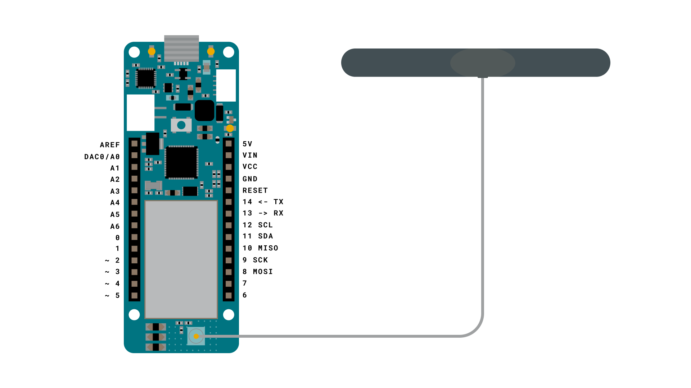
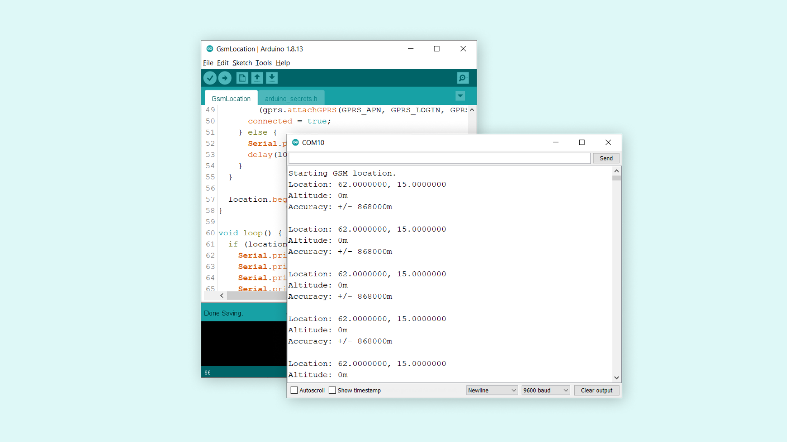
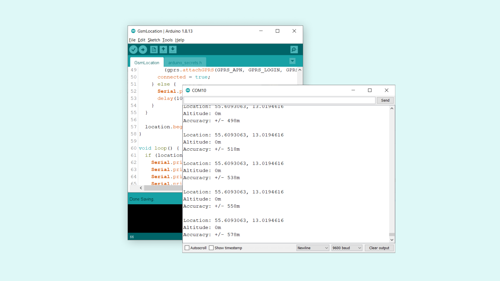

## Introduction 

In this tutorial, we will use the `GSMLocation` class that is part of the [MKRGSM](https://www.arduino.cc/en/Reference/MKRGSM) library. Through `GSMLocation`, we can access data such as longitude, latitude, altitude and the accuracy of the location. This feature is valuable for tracking projects, where location data can be essential for your project to function.

## Goals

The goals of this project are:

- Read the location of the MKR GSM 1400.
- Print the longitude, latitude, altitude values in the Serial Monitor.
- Print the accuracy of the signal (in meters).

## Hardware & Software Needed

- Arduino IDE ([online](https://create.arduino.cc/) or [offline](https://www.arduino.cc/en/main/software)).
- [MKRGSM](https://www.arduino.cc/en/Reference/GSM) library installed. 
- [Arduino MKR GSM 1400](https://store.arduino.cc/mkr-gsm-1400).
- [Antenna](https://store.arduino.cc/antenna).
- SIM card from an operator in your country.

## Using GPRS to Track Location

GPRS, short for General Packet Radio Service, is a platform for mobile communication, which is used to transfer data to and from mobile devices. In comparison to using a Global Positioning System (GPS), GPRS is not quite as accurate. While GPS can pinpoint your exact location with incredible accuracy, GPRS can only give an estimate. It is because the location data is only provided based on cellular networks, while GPS uses several satellites in orbit. 

However, as GPRS is also connected to the Internet, the location can be viewed as an additional feature that can be used for projects that does not require high accuracy. When running the code sample in this tutorial, we started of with an accuracy of **868km** (not very helpful), but after a few minutes, it was able to get within **200 meters** (a bit more helpful).

Using GPRS as a location tracking of course does not guarantee 100% accuracy, but as an additional feature, it does the job quite well. 

## Circuit



## Creating the Program

We will now get to the programming part of this tutorial, in which we will need to:

- Configure the credentials (APN, PIN, USERNAME, PASSWORD).
- Connect to the GPRS network.
- Print location data in the Serial Monitor.

**1.** First, let's make sure we have the drivers installed. If we are using the Web Editor, we do not need to install anything. If we are using an offline editor, we need to install it manually. This can be done by navigating to **Tools > Board > Board Manager...**. Here we need to look for the **Arduino SAMD boards (32-bits Arm® Cortex®-M0+)** and install it. 

**2.** Now, we need to install the libraries needed. If we are using the Web Editor, there is no need to install anything. If we are using an offline editor, simply go to **Tools > Manage libraries..**, and search for **MKRGSM** and install it.

**3.** We can now take a look at some of the core functions of this sketch:

- `GSMLocation location` - base class for GSM functions for location.
- `GSM gsmAccess` - base class for all GSM functions.
- `GPRS gprs` - base class for all GPRS functions.
- `location.available()` - checks for available location data.
- `location.longitude()` - retrieves longitude coordinates.
- `location.latitude()` - retrieves latitude coordinates.
- `location.altitude()` - retrieves altitude data.
- `location.accuracy()` - retrieves accuracy of location.

The sketch can be found in the snippet below. You can also find the sketch in **File > Examples > MKRGSM > GsmLocation**. Upload the code to the board, and make sure the right board and port are selected.

```cpp

// libraries
#include <MKRGSM.h>

#include "arduino_secrets.h"
// Please enter your sensitive data in the Secret tab or arduino_secrets.h
// PIN Number
const char PINNUMBER[]     = SECRET_PINNUMBER;
// APN data
const char GPRS_APN[]      = SECRET_GPRS_APN;
const char GPRS_LOGIN[]    = SECRET_GPRS_LOGIN;
const char GPRS_PASSWORD[] = SECRET_GPRS_PASSWORD;

// initialize the library instance
GSMLocation location;
GPRS gprs;
GSM gsmAccess;

void setup() {
  // initialize serial communications and wait for port to open:
  Serial.begin(9600);
  while (!Serial) {
    ; // wait for serial port to connect. Needed for native USB port only
  }

  Serial.println("Starting GSM location.");
  // connection state
  bool connected = false;

  // After starting the modem with GSM.begin()
  // connect to the GPRS network with the APN, login and password
  while (!connected) {
    if ((gsmAccess.begin(PINNUMBER) == GSM_READY) &&
        (gprs.attachGPRS(GPRS_APN, GPRS_LOGIN, GPRS_PASSWORD) == GPRS_READY)) {
      connected = true;
    } else {
      Serial.println("Not connected");
      delay(1000);
    }
  }

  location.begin();
}

void loop() {
  if (location.available()) {
    Serial.print("Location: ");
    Serial.print(location.latitude(), 7);
    Serial.print(", ");
    Serial.println(location.longitude(), 7);

    Serial.print("Altitude: ");
    Serial.print(location.altitude());
    Serial.println("m");

    Serial.print("Accuracy: +/- ");
    Serial.print(location.accuracy());
    Serial.println("m");

    Serial.println();
  }
}
```

## Testing It Out

After we have uploaded the code successfully, open the Serial Monitor. Now, the text `"Starting GSM location"` will be printed, and shortly after, a first location ping will be completed. This will most likely be **incredibly inaccurate**. In this case, the accuracy was +/- 860 kilometers.



But after a while, the readings get much closer, and accuracy is down to +/- 500 meters. Considerably better than 860 kilometers!



As mentioned earlier in this tutorial, the GPRS module may not be able to pinpoint your exact location, but more of an estimate. As we received a +/- accuracy of 500 meters, we can brainstorm ways of tracking where only an estimated location is needed.

### Troubleshoot

If the code is not working, there are some common issues we can troubleshoot:

- We have not installed the **MKRGSM** library.
- We have entered the wrong pin number.
- We have entered the wrong APN.
- We are out of coverage (no signal).
- SIM card may not be activated.

## Conclusion

In this tutorial we have used the `GSMlocation` class to retrieve a series of location data that can be used to estimate the whereabouts of the MKR GSM 1400 board. While GPRS may not be the most accurate form of location tracking, the major benefit is its capability of connecting directly to the Internet. This means that we can see where our device approximately is, from anywhere in the world, using only the MKR GSM 1400 board + antenna alone. 

For more accurate location tracking, you can check out the [MKR GPS basics tutorial](/tutorials/mkr-gps-shield/mkr-gps-basic), which uses the [MKR GPS Shield](https://store.arduino.cc/arduino-mkr-gps-shield) to track location in a very accurate fashion. This shield can be used directly with the MKR GSM 1400.
