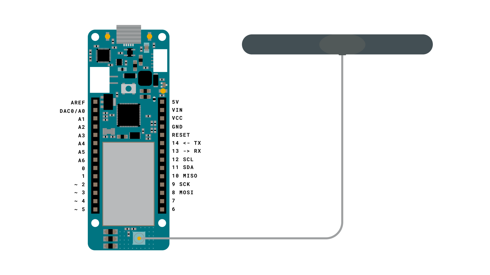
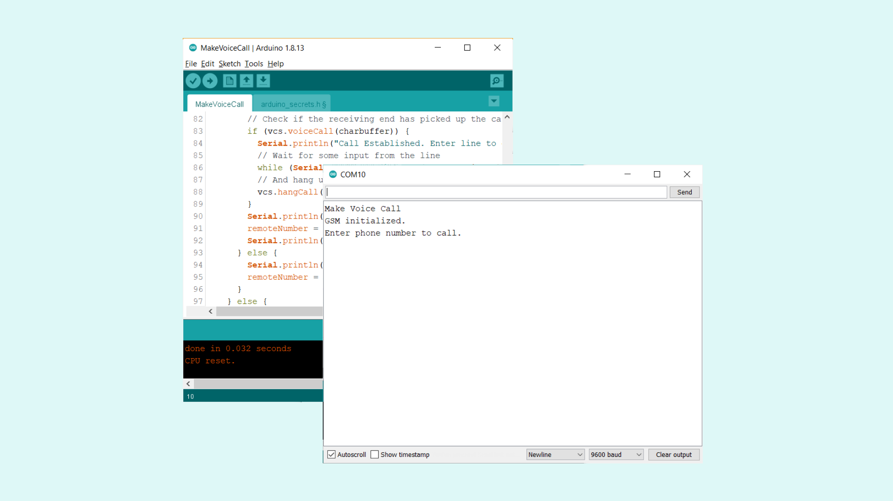
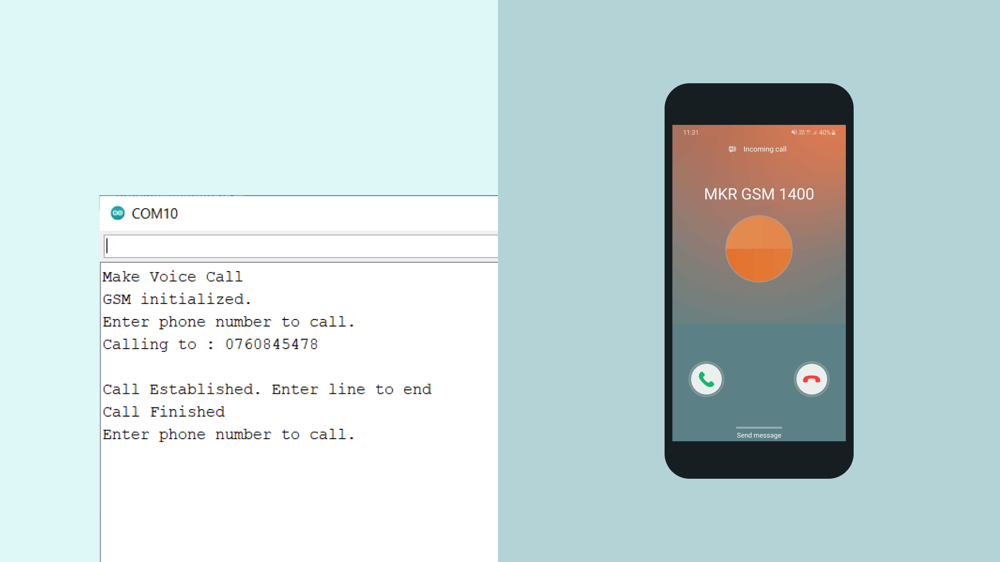

## Introduction 

In this tutorial, we will use an example from the **MKRGSM** library called **MakeVoiceCall**. With it, we will set up the MKR GSM 1400 to create outgoing calls to a number of our liking. The example includes a serial interface that allows us to enter a number, place a call, and hang up on the call.  

Special thanks to Javier Zorzano for providing the sample code in this tutorial.

## Goals

The goals of this project are:

- Make a voice call from the MKR GSM 1400.

## Hardware & Software Needed

- Arduino IDE ([online](https://create.arduino.cc/) or [offline](https://www.arduino.cc/en/main/software)).
- [MKRGSM](https://www.arduino.cc/en/Reference/GSM) library installed.
- [Arduino MKR GSM 1400](https://store.arduino.cc/mkr-gsm-1400).
- [Antenna](https://store.arduino.cc/antenna).
- SIM card from an operator in your country.

## Enter Component/feature Name Here

As the MKR GSM 1400 board is capable of connecting to the GSM network, we also have the possibility to place and receive calls. This feature can be incredibly useful for controlling devices remotely, particularly those in rural / inaccessible areas. 

As most of us know, the past decades has seen a massive increase in the use of smartphones, and with it, the infrastructure for cellular communication has developed significantly. This means more coverage and more reliable services, and an ideal platform to use for IoT projects.

### Useful Scenarios

In this tutorial we will focus on just making an outgoing call. There are some scenarios where this might prove useful:

- **Notification** - A great way of creating reminders for yourself is to have someone actually call you. We can for example setup the board to call you at exactly 6.30 every morning, or at 17.00 to remind you to walk the dog!

- **System alert** - We can also be use it in a more professional capacity. If we are creating an application in a remote location that we cannot access directly, we can set up the board to call you in case something goes wrong. This could for example be overheating, water detected or a gas leak. 

- **Security alert** - Similar to a system alert, we can set up the board to call you in case a sensor has detected any activity. 

>**Note:** The above are suggestions on what to use the MKR GSM 1400's voice call functionality. Please consult an expert if you attempt to build a security system for your home or business.  


### Circuit

The circuit of this board is easy. Simply connect the antenna to the MKR GSM 1400 board and you are good to go!




## Programming the Board

We will now get to the programming part of this tutorial. 

**1.** First, let's make sure we have the drivers installed. If we are using the Web Editor, we do not need to install anything. If we are using an offline editor, we need to install it manually. This can be done by navigating to **Tools > Board > Board Manager...**. Here we need to look for the **Arduino SAMD boards (32-bits Arm® Cortex®-M0+)** and install it. 

**2.** Now, we need to install the libraries needed. If we are using the Web Editor, there is no need to install anything. If we are using an offline editor, simply go to **Tools > Manage libraries..**, and search for **MKRGSM** and install it.

**3.** We can now go to **File > Examples > MKRGSM > MakeVoiceCall** in the editor. This will open a new window, which has a sketch tab, but also a header file, called `arduino_secrets.h`. Inside this file, we need to enter our pin number between the "". 
   
```cpp
#define SECRET_PINNUMBER     "" //enter pin code between ""
```
   
The pin number is often 1234 or 0000, but for more information, check the SIM plan that you bought.

**4.** We can now take a look at some of the core functions of this sketch:

- `GSM gsmAccess` - base class for all GSM functions.
- `GSMVoiceCall vcs` - base class for GSM voice call functions.
- `remoteNumber.toCharArray(charbuffer, 20)` - calls a number entered in the Serial Monitor.
- `vcs.hangCall()` - used to hang up on current calls.

The sketch can be found in the snippet below. Upload the sketch to the board.

```cpp
#include <MKRGSM.h>

#include "arduino_secrets.h" 
// Please enter your sensitive data in the Secret tab or arduino_secrets.h
// PIN Number
const char PINNUMBER[] = SECRET_PINNUMBER;

// initialize the library instance
GSM gsmAccess; // include a 'true' parameter for debug enabled
GSMVoiceCall vcs;

String remoteNumber = "";  // the number you will call
char charbuffer[20];

void setup() {

  // initialize serial communications and wait for port to open:
  Serial.begin(9600);
  while (!Serial) {
    ; // wait for serial port to connect. Needed for native USB port only
  }

  Serial.println("Make Voice Call");

  // connection state
  bool connected = false;

  // Start GSM shield
  // If your SIM has PIN, pass it as a parameter of begin() in quotes
  while (!connected) {
    if (gsmAccess.begin(PINNUMBER) == GSM_READY) {
      connected = true;
    } else {
      Serial.println("Not connected");
      delay(1000);
    }
  }

  Serial.println("GSM initialized.");
  Serial.println("Enter phone number to call.");

}

void loop() {

  // add any incoming characters to the String:
  while (Serial.available() > 0) {
    char inChar = Serial.read();
    // if it's a newline, that means you should make the call:
    if (inChar == '\n') {
      // make sure the phone number is not too long:
      if (remoteNumber.length() < 20) {
        // let the user know you're calling:
        Serial.print("Calling to : ");
        Serial.println(remoteNumber);
        Serial.println();

        // Call the remote number
        remoteNumber.toCharArray(charbuffer, 20);


        // Check if the receiving end has picked up the call
        if (vcs.voiceCall(charbuffer)) {
          Serial.println("Call Established. Enter line to end");
          // Wait for some input from the line
          while (Serial.read() != '\n' && (vcs.getvoiceCallStatus() == TALKING));
          // And hang up
          vcs.hangCall();
        }
        Serial.println("Call Finished");
        remoteNumber = "";
        Serial.println("Enter phone number to call.");
      } else {
        Serial.println("That's too long for a phone number. I'm forgetting it");
        remoteNumber = "";
      }
    } else {
      // add the latest character to the message to send:
      if (inChar != '\r') {
        remoteNumber += inChar;
      }
    }
  }
}

```

## Testing It Out

After successfully uploading the code, open the Serial Monitor to initialize the program. After a while, we should see the text `"GSM initialized"` followed by `"Enter phone number to call"`. This means the board has successfully connected to the GSM network. 



Now, we can enter a phone number that we want to call, and hit enter. We should now receive the call (if we entered the number correctly) on our phone. In the Serial Monitor, we can see the message `"Call established. Enter line to end"`. 



We can of course answer the call on our phone, but it will consist only of noise, as we are not using any microphone in this setup. 


### Troubleshoot

If the code is not working, there are some common issues we can troubleshoot:

- We have not installed the **MKRGSM** library.
- We have entered the wrong pin number.
- We are out of coverage (no signal).
- We have entered the wrong number.
- SIM card may not be activated.

## Conclusion

This simple example demonstrates how to create outgoing voice calls from the MKR GSM 1400 board. Using this feature can be beneficial for various alert systems or for notifications. As it operates over the GSM network, there is typically very good coverage wherever you are, which makes this feature a great option for remote control and feedback. 

Feel free to explore the [MKRGSM](https://www.arduino.cc/en/Reference/GSM) library further, and try out some of the many cool functions in this library.

