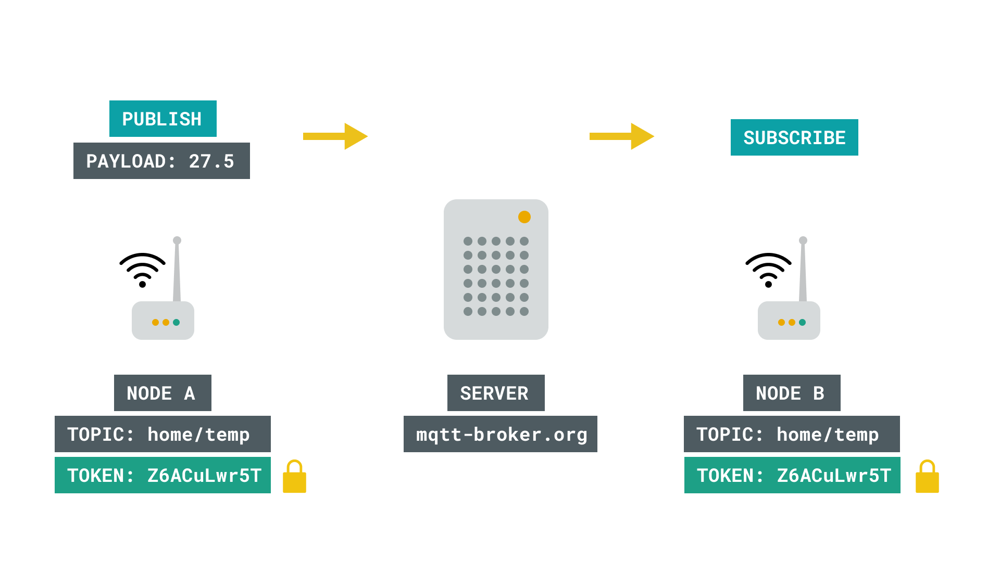
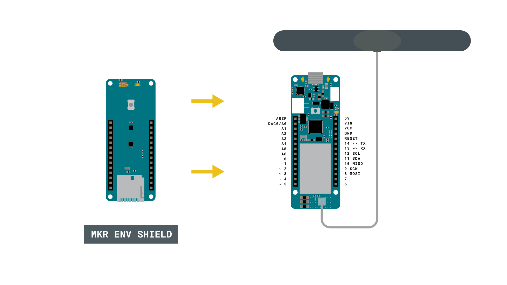
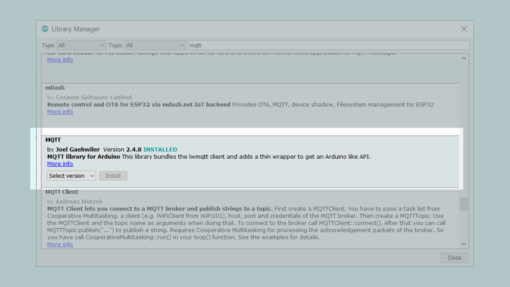
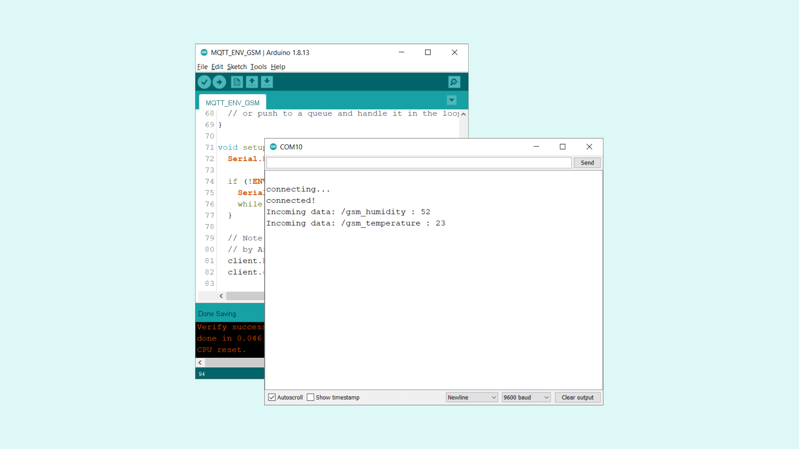

## Introduction 

In this tutorial, we will create a setup that allows a MKR GSM 1400 board to **publish** and **subscribe** to topics, using MQTT (Message Queuing Telemetry Transport). The data we will publish and subscribe to, are environmental data from the [MKR ENV shield](https://store.arduino.cc/arduino-mkr-env-shield), using the [Arduino_MKRENV](https://www.arduino.cc/en/Reference/ArduinoMKRENV) library.

## Goals

The goals of this project are:

- Connect to the GSM network.
- Connect to a broker ([shiftr.io](https://shiftr.io/)).
- Publish a topic (humidity) using MQTT.
- Publish a topic (temperature) using MQTT.
- Subscribe to the same topics.
- Print the results in the Serial Monitor.

## Hardware & Software Needed

- Arduino IDE ([online](https://create.arduino.cc/) or [offline](https://www.arduino.cc/en/main/software)).
- [MKRGSM](https://www.arduino.cc/en/Reference/GSM) library installed. 
- [MQTT](https://github.com/256dpi/arduino-mqtt) library installed. 
- [Arduino_MKRENV](https://www.arduino.cc/en/Reference/ArduinoMKRENV) library installed.
- [Arduino MKR GSM 1400](https://store.arduino.cc/mkr-gsm-1400).
- [MKR ENV shield](https://store.arduino.cc/arduino-mkr-env-shield).
- [Antenna](https://store.arduino.cc/antenna).
- SIM card from an operator in your country.


## Message Queuing Telemetry Transport (MQTT)

The MQTT protocol was first introduced in 1999, as a light-weight **publish** and **subscribe** system. It is particularly useful for devices with low-bandwidth, where we can send commands, sensor values or messages over the Internet with little effort. 

A basic explanation of how it works is that a node, for example an Arduino MKR GSM 1400, sends a payload to a broker. A broker is a kind of "middle-point" server, that essentially stores payloads sent to it, in something called **topics**. A topic, is a definition of what type of data it contains, it could for example be "basement humidity" or "living room temperature". Another node can then subscribe to this information, from the broker, and voilà, data has been moved from Node A to Node B over the Internet. 


There are several different ways this can be practiced, with many different layers of security depending on what type of broker and setup we use. For example, if we are dealing with non-sensitive data, such as temperature of a specific location, we are not too concerned on who might get access to it. But there's cases where data needs to be protected, for example in Social Media messaging services. 

One way to protect the data, is to for example use a **token**, something that is quite common when working with various IoT services. For example, if we are publishing something to a broker, anyone has the URL, e.g. **randombroker.org/randomtopic** can subscribe to it. But if we added a unique token on both sides, they wouldn't. These tokens could for example be **Z6ACuLwr5T**, which is not exactly something easy to guess. 



MQTT is quite the interesting topic, and if you wish to read more about it, check out the links below:

- [mqtt.org](https://mqtt.org/) - all you need to know about MQTT.
- [Mosquitto.org](https://test.mosquitto.org/) - an MQTT broker.
- [Inductive automation](https://inductiveautomation.com/resources/article/what-is-mqtt#:~:text=MQTT%20is%20a%20publish%2Fsubscribe,communication%20between%20the%20two%20devices.&text=When%20another%20client%20publishes%20a,any%20client%20that%20has%20subscribed) - what is MQTT?
- [Randomnerdtutorials](https://randomnerdtutorials.com/what-is-mqtt-and-how-it-works/) - what is MQTT and how it works.

### Circuit



## Creating the Program

We will now get to the programming part of this tutorial. 

**1.** First, let's make sure we have the drivers installed. If we are using the Web Editor, we do not need to install anything. If we are using an offline editor, we need to install it manually. This can be done by navigating to **Tools > Board > Board Manager...**. Here we need to look for the **Arduino SAMD boards (32-bits Arm® Cortex®-M0+)** and install it. 

**2.** Now, we need to install the libraries needed. If we are using the Web Editor, there is no need to install anything. If we are using an offline editor, simply go to **Tools > Manage libraries..**, and search for **MKRGSM** and **Arduino_MKRENV** and install them.

**3.** We will also need to install the **MQTT** library, by Joel Gaehwiler. 
 
>**Note:** there are several MQTT libraries, make sure you install the right one! The image below highlights the library that needs to be installed.




**4.** We can now take a look at some of the core functions of this sketch:

- `pin[]` - stores the pin number of your card.
- `apn[]` - stores the APN of your operator.
- `login[]` - stores the login to your operator (typically a blank field).
- `password[]` - stores the password to your operator (typically a blank field).

- `GSM gsmAccess` - base class for all GSM based functions.
- `GSMClient net` - creates a GSM client.
- `GPRS gprs` - base class for GPRS functions, e.g. Internet, server behaviors.
- `MQTTClient client` - creates a client that can connect to a broker, and publish/subscribe to topics and messages.
- `client.begin(broker, net)` - connects to the broker.
- `client.publish(topic, message)` - publishes a topic with a message.
- `client.subscribe(topic)` - subscribes to a topic.  

- `ENV.begin()` - initializes the **Arduino_MKRENV** library.
- `ENV.readTemperature()` - retrieves temperature from the MKR ENV shield.
- `ENV.readHumidity()` - retrieves humidity from the MKR ENV shield.

The sketch can be found in the snippet below. Upload the sketch to the board.

```cpp

#include <Arduino_MKRENV.h>
#include <MKRGSM.h>
#include <MQTT.h>

const char pin[]      = "0000";
const char apn[]      = "4g.tele2.se";
const char login[]    = "";
const char password[] = "";

GSMClient net;
GPRS gprs;
GSM gsmAccess;
MQTTClient client;

int temperature = 0;
int humidity = 0;

unsigned long lastMillis = 0;

void connect() {
  // connection state
  bool connected = false;

  Serial.print("connecting to cellular network ...");

  // After starting the modem with gsmAccess.begin()
  // attach to the GPRS network with the APN, login and password
  while (!connected) {
    if ((gsmAccess.begin(pin) == GSM_READY) &&
        (gprs.attachGPRS(apn, login, password) == GPRS_READY)) {
      connected = true;
    } else {
      Serial.print(".");
      delay(1000);
    }
  }

  Serial.print("\nconnecting...");
  while (!client.connect("arduino", "try", "try")) {
    Serial.print(".");
    delay(1000);
  }

  Serial.println("\nconnected!");

  client.subscribe("/gsm_humidity");
  client.subscribe("/gsm_temperature");
  // client.unsubscribe("/hello");
}

void messageReceived(String &topic, String &payload) {
  Serial.println("Incoming data: " + topic + " : " + payload);

  // Note: Do not use the client in the callback to publish, subscribe or
  // unsubscribe as it may cause deadlocks when other things arrive while
  // sending and receiving acknowledgments. Instead, change a global variable,
  // or push to a queue and handle it in the loop after calling `client.loop()`.
}

void setup() {
  Serial.begin(115200);

  if (!ENV.begin()) {
    Serial.println("Failed to initialize MKR ENV shield!");
    while (1);
  }

  // Note: Local domain names (e.g. "Computer.local" on OSX) are not supported
  // by Arduino. You need to set the IP address directly.
  client.begin("broker.shiftr.io", net);
  client.onMessage(messageReceived);

  connect();
}

void loop() {
  client.loop();
  if (!client.connected()) {
    connect();
  }

  temperature = ENV.readTemperature();
  humidity    = ENV.readHumidity();

  char tempStr[16];
  itoa(temperature, tempStr, 10);

  char humiStr[16];
  itoa(humidity, humiStr, 10);

  
  
  // publish a message roughly every 8 seconds.

  if (millis() - lastMillis > 8000) {
    lastMillis = millis();
    client.publish("/gsm_humidity", humiStr);
    client.publish("/gsm_temperature", tempStr);
  }
}
```

## Testing It Out

After you have uploaded the code to the board, open the Serial Monitor to initialize the program. If it is successful, after 10 seconds or so, it will print `connected` followed by the MKR ENV shield values.



This means that we have successfully published, and subscribed to a topic containing our MKR ENV shield values, using the **shiftr.io** broker. 

Now, we can actually go and see a live visualization of the data that goes through the broker. To see this visualization, go to [shiftr.io/try](https://shiftr.io/try), and start looking for your message!

To make things easy in this tutorial, we only recorded the temperature and humidity from the MKR ENV shield, but we can also record UVA, UVB, UVindex, LUX & atmospheric pressure. All we have to do is to read the values, create a topic to publish, and subscribe to the same topic. 

>**Note:** In this tutorial, we are only using one single board and sketch. If we have two boards with Internet access, we can simply subscribe to the same topic. You can for example setup one publish device and one subscribe device, and transfer data between them using MQTT.
  
### Troubleshoot

If the code is not working, there are some common issues we can troubleshoot:

- We have not installed the **MKRGSM** library.
- We have not installed the **MQTT** library.
- We have not installed the **Arduino_MKRENV** library.
- We have entered the wrong pin number.
- We have entered the wrong APN (access point name, check the operator of the SIM card).
- We are out of coverage (no signal).
- SIM card may not be activated.

## Conclusion

In this tutorial, we have combined the use of the GSM technology, the MQTT communication protocol and environmental sensors. Practically speaking, we have created a tiny weather station that can provide accurate weather conditions which can be deployed anywhere with GSM coverage.

>**Tip:** As the hardware (MKR GSM 1400 + MKR ENV shield) are both designed to consume little power, we can get creative with the [ArduinoLowPower](https://www.arduino.cc/en/Reference/ArduinoLowPower) library to deploy a complete standalone weather station. The MKR GSM 1400 can be directly powered with a 3.7V LiPo battery with a JST PH connector. 

Feel free to explore the [MKRGSM](https://www.arduino.cc/en/Reference/GSM) library further, and try out some of the many cool functions in this library. You can also check out the [MQTT](https://github.com/256dpi/arduino-mqtt) repository on GitHub. 

Special thanks to Joel Gaehwiler for developing the [MQTT](https://github.com/256dpi/arduino-mqtt) library and to everyone who contributed to this library. 
