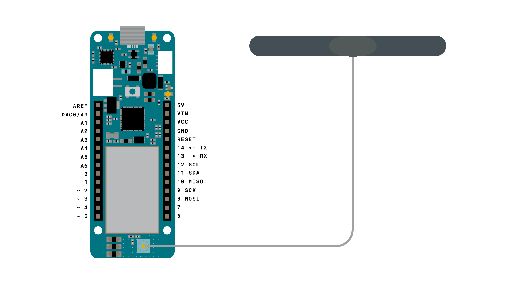
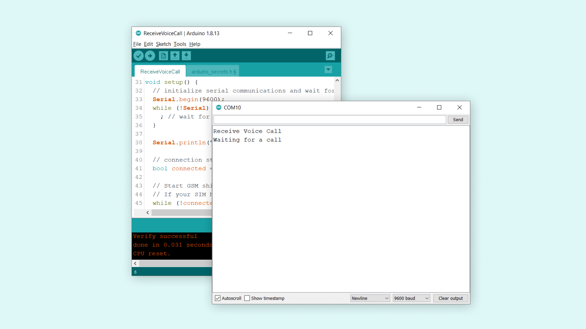
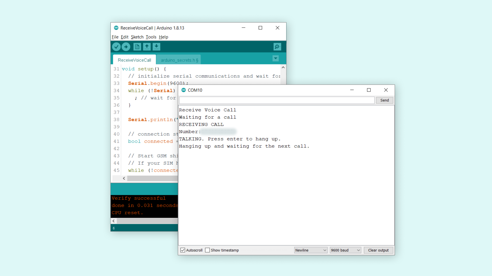

## Introduction 

In this tutorial, we will use the **ReceiveVoiceCall** example from the [MKRGSM](https://www.arduino.cc/en/Reference/GSM) library. It will show how to set up our MKR GSM 1400 board to handle incoming calls, and uses the Serial Monitor to provide information regarding the call.

## Goals

The goals of this project are:

- Set up the MKR GSM 1400 board to receive voice calls.
- Create a function that ends the call.

## Hardware & Software Needed

- Arduino IDE ([online](https://create.arduino.cc/) or [offline](https://www.arduino.cc/en/main/software)).
- [MKRGSM](https://www.arduino.cc/en/Reference/GSM) library installed. 
- [Arduino MKR GSM 1400](https://store.arduino.cc/mkr-gsm-1400).
- [Antenna](https://store.arduino.cc/antenna).
- SIM card from an operator in your country.

## Voice Calls

As the MKR GSM 1400 board is capable of connecting to the GSM network, we also have the possibility to place and receive calls. This feature can be incredibly useful for remotely controlling devices, particularly those in rural / inaccessible areas. 

As most of us know, the past decades has seen a massive increase in the use of smart phones, and with it, the infrastructure for cellular communication has developed significantly. This means more coverage and more reliable services, and an ideal platform to use for IoT projects.

### Useful Scenarios

Some useful scenarios for using the voice call feature includes:

- **Simple feedback** - perhaps the simplest way of using the voice call feature is simply by placing a call to the MKR GSM 1400 board to check if the device is "alive". If we establish a call with the device, we can confirm that it is functioning, but if it goes to voice mail, something is not working!

- **Trigger something** - whenever a call comes in, we can configure a sketch to for example execute a function.

- **Retrieve data** - we can also configure a sketch that, when a call comes in, we can do a reading on X amount of sensors, and send it back to the callers number using the **GSM_SMS** class. 

### Circuit



## Creating the Program

We will now get to the programming part of this tutorial.

**1.** First, let's make sure we have the drivers installed. If we are using the Web Editor, we do not need to install anything. If we are using an offline editor, we need to install it manually. This can be done by navigating to **Tools > Board > Board Manager...**. Here we need to look for the **Arduino SAMD boards (32-bits Arm® Cortex®-M0+)** and install it. 

**2.** Now, we need to install the libraries needed. If we are using the Web Editor, there is no need to install anything. If we are using an offline editor, simply go to **Tools > Manage libraries..**, and search for **MKRGSM** and install it.
   
**3.** We can now go to **File > Examples > MKRGSM > ReceiveVoiceCall** in the editor. This will open a new window, which has a sketch tab, but also a header file, called `arduino_secrets.h`.


Inside this file, we need to enter our pin number between the " ". 
   
```arduino
#define SECRET_PINNUMBER     "" //enter pin code between " "
```
   
The pin number is often 1234 or 0000, but for more information, check the SIM plan that you bought.

**4.** We can now take a look at some of the core functions of this sketch:

- `GSM gsmAccess` - base class for all GSM functions.
- `GSMVoiceCall vcs` - base class for GSM voice call functions.
- `vcs.getvoiceCallStatus()` - checks if there's a call, and returns: `IDLE_CALL` (no call), `RECEIVINGCALL` (a call is incoming) or `TALKING` (a call is happening).
- `vcs.retrieveCallingNumber( , 20)` - retrieves the number of the caller and store in `numtel` variable. 
- `vcs.answerCall()` - used to answer incoming calls.
- `vcs.hangCall()` - used to hang up on current calls.

The sketch can also be found in the snippet below. Upload the sketch to the board.

```cpp
// Include the GSM library
#include <MKRGSM.h>

#include "arduino_secrets.h" 
// Please enter your sensitive data in the Secret tab or arduino_secrets.h
// PIN Number
const char PINNUMBER[] = SECRET_PINNUMBER;

// initialize the library instance
GSM gsmAccess;
GSMVoiceCall vcs;

// Array to hold the number for the incoming call
char numtel[20];

void setup() {
  // initialize serial communications and wait for port to open:
  Serial.begin(9600);
  while (!Serial) {
    ; // wait for serial port to connect. Needed for native USB port only
  }

  Serial.println("Receive Voice Call");

  // connection state
  bool connected = false;

  // Start GSM shield
  // If your SIM has PIN, pass it as a parameter of begin() in quotes
  while (!connected) {
    if (gsmAccess.begin(PINNUMBER) == GSM_READY) {
      connected = true;
    } else {
      Serial.println("Not connected");
      delay(1000);
    }
  }

  // This makes sure the modem correctly reports incoming events
  vcs.hangCall();

  Serial.println("Waiting for a call");
}

void loop() {
  // Check the status of the voice call
  switch (vcs.getvoiceCallStatus()) {
    case IDLE_CALL: // Nothing is happening

      break;

    case RECEIVINGCALL: // Yes! Someone is calling us

      Serial.println("RECEIVING CALL");

      // Retrieve the calling number
      vcs.retrieveCallingNumber(numtel, 20);

      // Print the calling number
      Serial.print("Number:");
      Serial.println(numtel);

      // Answer the call, establish the call
      vcs.answerCall();
      break;

    case TALKING:  // In this case the call would be established

      Serial.println("TALKING. Press enter to hang up.");
      while (Serial.read() != '\n') {
        delay(100);
      }
      vcs.hangCall();
      Serial.println("Hanging up and waiting for the next call.");
      break;
  }
  delay(1000);
}


```

## Testing It Out

After the code has successfully uploaded, open the Serial Monitor. There should now be two messages printed, one after the other: `"Receive Voice Call"` and `"Waiting for a call"`. This means that it has successfully connected to the GSM network and everything is working.



Now, all we need to do is placing a call to the MKR GSM 1400 board. Simply check the phone number of the SIM card that you connected to your board, and call it. When the call is received by the board, it automatically answers it, and prints the caller's number in the Serial Monitor, as shown in the image below.  



Now, in the Serial Monitor, we have the option to hang up on the call by simply pressing enter. This is a configuration in the sketch example. When we press enter, the text `"Hanging up and waiting for the next call."` will be printed. This means the call has ended, and the board is again listening for incoming calls.

>**Note:** This setup is not designed to support a "real" phone call between two devices. There is no speaker or microphone component on the MKR 1400 GSM board, and no function in the **MKRGSM** library supports this feature. 

### Troubleshoot

If the code is not working, there are some common issues we can troubleshoot:

- We have not installed the **MKRGSM** library.
- We have entered the wrong pin number.
- We are out of coverage (no signal).
- We have entered the wrong number.
- SIM card may not be activated.

## Conclusion

In this tutorial, we went through the **ReceiveVoiceCall** example that allows us to receive voice calls on the MKR GSM 1400 board. This feature can be easily configured to handle tasks on the board, such as executing functions, and is relatively easy to setup in terms of hardware and software.  

Feel free to explore the [MKRGSM](https://www.arduino.cc/en/Reference/GSM) library further, and try out some of the many cool functions in this library.

