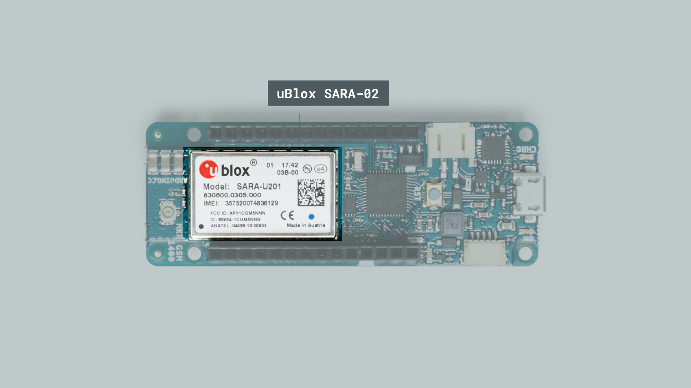
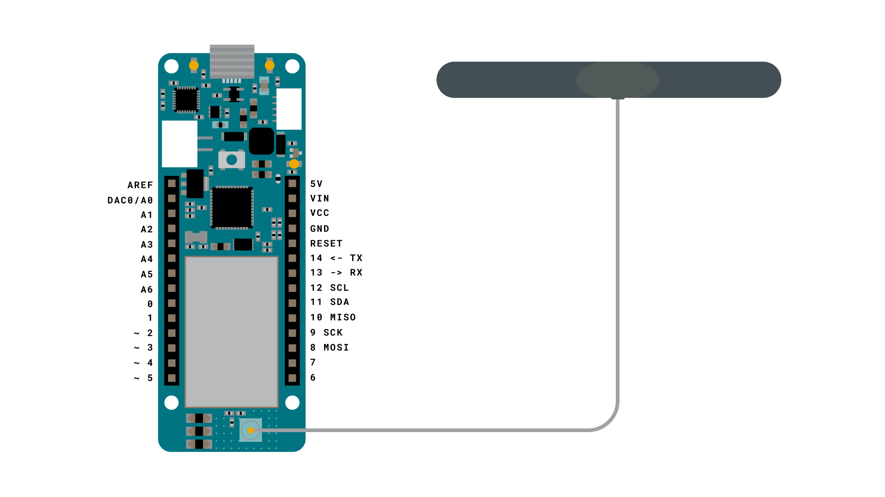
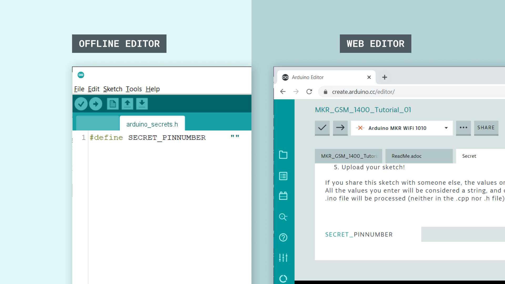
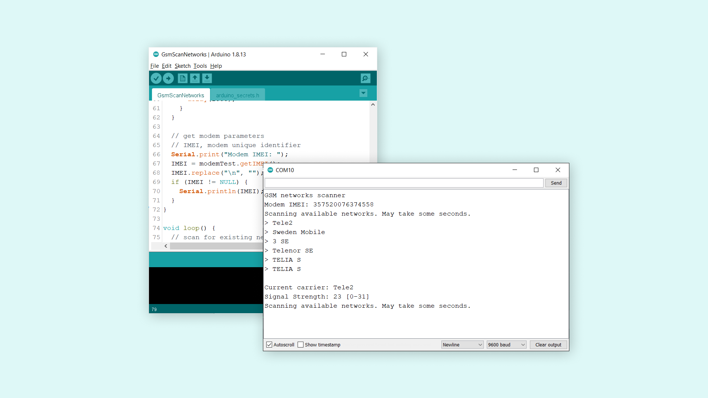

## Introduction 

In this tutorial, we will perform a scan of available GSM networks in the area. The networks available will then be printed in the Serial Monitor along with the signal strength. 

>**Note:** This tutorial was created in Sweden, and as a result, the available networks are only Swedish network operators. The results will vary depending on what location we are in. 

## Goals

The goals of this project are:

- Scan nearby GSM networks
- Print detected networks in the Serial Monitor.

## Hardware & Software Needed

- Arduino IDE ([online](https://create.arduino.cc/) or [offline](https://www.arduino.cc/en/main/software)).
- [MKRGSM](https://www.arduino.cc/en/Reference/GSM) library installed.
- [Arduino MKR GSM 1400](https://store.arduino.cc/mkr-gsm-1400).
- [Antenna](https://store.arduino.cc/antenna).

## The uBlox SARA-02 Module

As every other MKR family board, the MKR GSM 1400 board has a specific module for connectivity. It is called uBlox SARA-02, and is designed to communicate over the GSM network. The High Speed Packet (HSPA) data rates can reach downlink speeds of 7.2 Mbit/s and 5.76 Mbit/s for uplink. 



It is also designed to operate in temperature conditions between -40 °C to +85 °C, making it quite the durable component. It is also low on power consumption, making it ideal to use with batteries in different weather conditions!

The module also provides an interface for SIM cards, and supports both 1.8V and 3V SIM cards, which can be automatically detected. 

You can find out much more information about this component in the <a href="https://www.u-blox.com/sites/default/files/SARA-U2_DataSheet_UBX-13005287.pdf" target="_blank">uBlox SARA-02 datasheet</a>.

### Circuit



## Programming the Board

We will now get to the programming part of this tutorial. 

**1.** First, let's make sure we have the drivers installed. If we are using the Web Editor, we do not need to install anything. If we are using an offline editor, we need to install it manually. This can be done by navigating to **Tools > Board > Board Manager...**. Here we need to look for the **Arduino SAMD boards (32-bits ARM Cortex M0+)** and install it. 

**2.** Now, we need to install the libraries needed. If we are using the Web Editor, there is no need to install anything. If we are using an offline editor, simply go to **Tools > Manage libraries..**, and search for **MKRGSM** and install it.

**3.** After the library is installed, we can now navigate to **File > Examples > MKRGSM > Tools > GsmScanNetworks**. This will open a new sketch window (or direct you to the sketch if you are using the Web Editor). There will also be a separate tab called `arduino_secrets.h`. Here we will simply fill in the pin number of our SIM card. 



>**Note:** A standard pre-paid SIM card typically have 0000 or 1234 as a pin code. This varies from operator to operator,and it is important to find out this before uploading the code. Otherwise, too many unsuccessful attempts may block the SIM card.

**4.** We can now take a look at some of the core functions of this sketch:

- `GSM gsmAccess` - base class for all GSM functions.
- `GSMScanner scannerNetworks` - base class relating to scanning of available networks.
- `GSMModem modemTest` - base class for calls that have specific diagnostic functionality with the modem.
- `gsmAccess.begin(pin)` - connects to the GSM network with the pin number as a parameter, e.g. 0123.
- `getIMEI()` - retrieves the International Mobile Equipment Identity (IMEI) from the modem.

**5.** We can now upload the sketch to the board. The code is also available in the snippet below:

```cpp
#include <MKRGSM.h>

#include "arduino_secrets.h" 
// Please enter your sensitive data in the Secret tab or arduino_secrets.h
// PIN Number
const char PINNUMBER[] = SECRET_PINNUMBER;

// initialize the library instance
GSM gsmAccess;     // include a 'true' parameter to enable debugging
GSMScanner scannerNetworks;
GSMModem modemTest;

// Save data variables
String IMEI = "";

// serial monitor result messages
String errortext = "ERROR";

void setup() {
  // initialize serial communications and wait for port to open:
  Serial.begin(9600);
  while (!Serial) {
    ; // wait for serial port to connect. Needed for Leonardo only
  }

  Serial.println("GSM networks scanner");
  scannerNetworks.begin();

  // connection state
  bool connected = false;

  // Start GSM shield
  // If your SIM has PIN, pass it as a parameter of begin() in quotes
  while (!connected) {
    if (gsmAccess.begin(PINNUMBER) == GSM_READY) {
      connected = true;
    } else {
      Serial.println("Not connected");
      delay(1000);
    }
  }

  // get modem parameters
  // IMEI, modem unique identifier
  Serial.print("Modem IMEI: ");
  IMEI = modemTest.getIMEI();
  IMEI.replace("\n", "");
  if (IMEI != NULL) {
    Serial.println(IMEI);
  }
}

void loop() {
  // scan for existing networks, displays a list of networks
  Serial.println("Scanning available networks. May take some seconds.");
  Serial.println(scannerNetworks.readNetworks());

  // currently connected carrier
  Serial.print("Current carrier: ");
  Serial.println(scannerNetworks.getCurrentCarrier());

  // returns strength and ber
  // signal strength in 0-31 scale. 31 means power > 51dBm
  // BER is the Bit Error Rate. 0-7 scale. 99=not detectable
  Serial.print("Signal Strength: ");
  Serial.print(scannerNetworks.getSignalStrength());
  Serial.println(" [0-31]");

}
```

## Testing It Out

Once we have uploaded the code to the board, we can proceed by opening the Serial Monitor. This will initialize the program, and a scanning of the network will shortly begin. 

If the board fails to connect to the GSM network, it will print `"Not connected"` in the Serial Monitor. This could be a problem with the SIM card, or that we are simply not within range of a network.

If it succeeds, it will start listing the available networks in your area.



### Troubleshoot

If the code is not working, there are some common issues we can troubleshoot:

- We have not installed the **MKRGSM** library.
- We have entered the wrong pin number.
- We are out of coverage (no signal).
- SIM card may not be activated.

## Conclusion

In this tutorial, we took a brief look at the uBlox SARA-02 module that provides the GSM connectivity to the MKR GSM 1400 board. We then configured the sketch (entered the pin number for our SIM card), and performed a scan of available networks. The list of available networks were then printed in the Serial Monitor.

This is a very basic tutorial for testing the connectivity of the MKR GSM 1400 board, and there's much much more we can do. Feel free to explore the [MKRGSM](https://www.arduino.cc/en/Reference/GSM) library further, and try out some of the many cool functions in this library.

