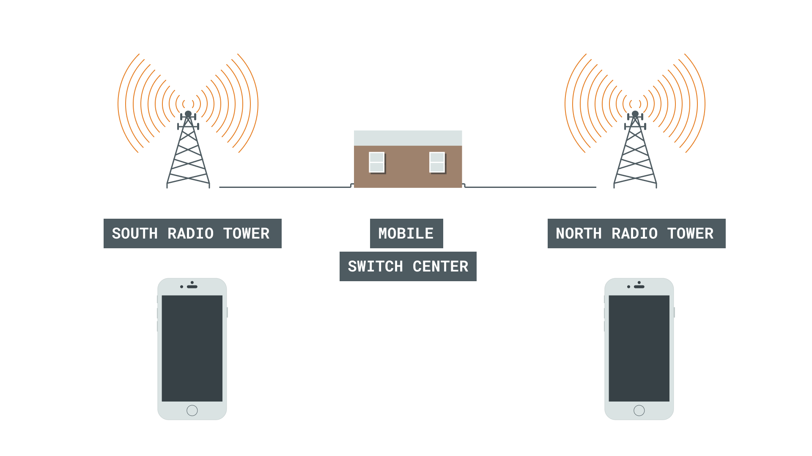
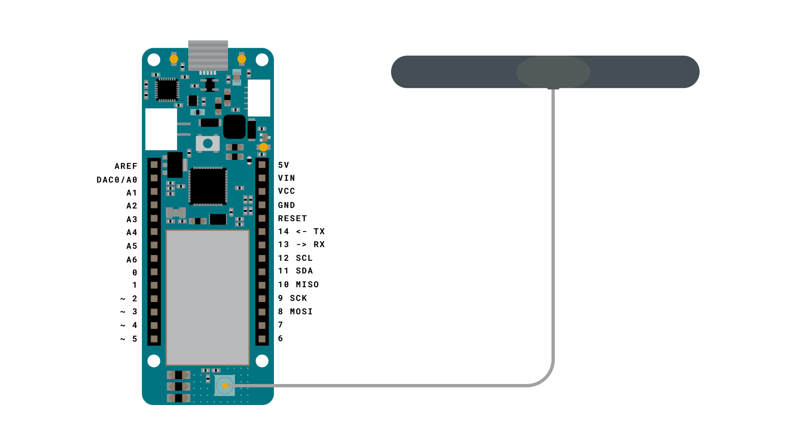
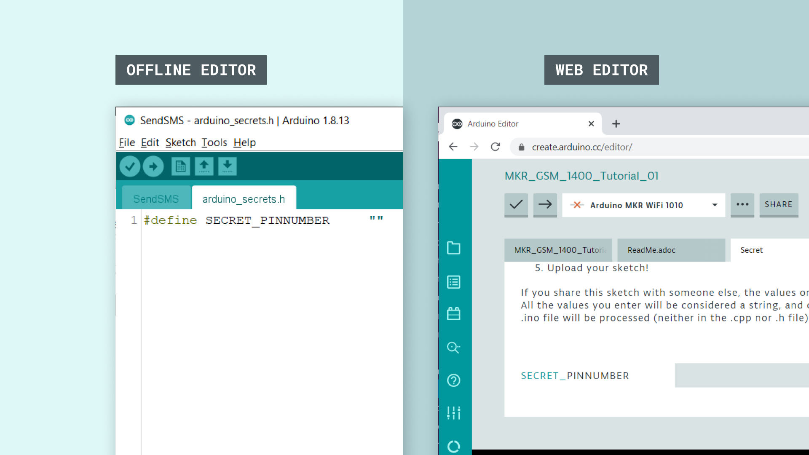
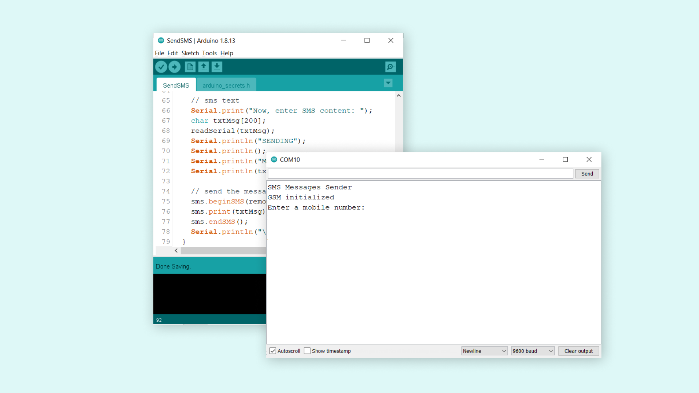
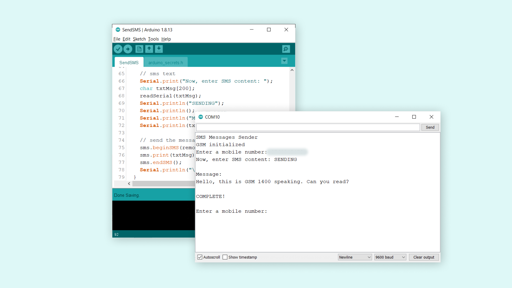
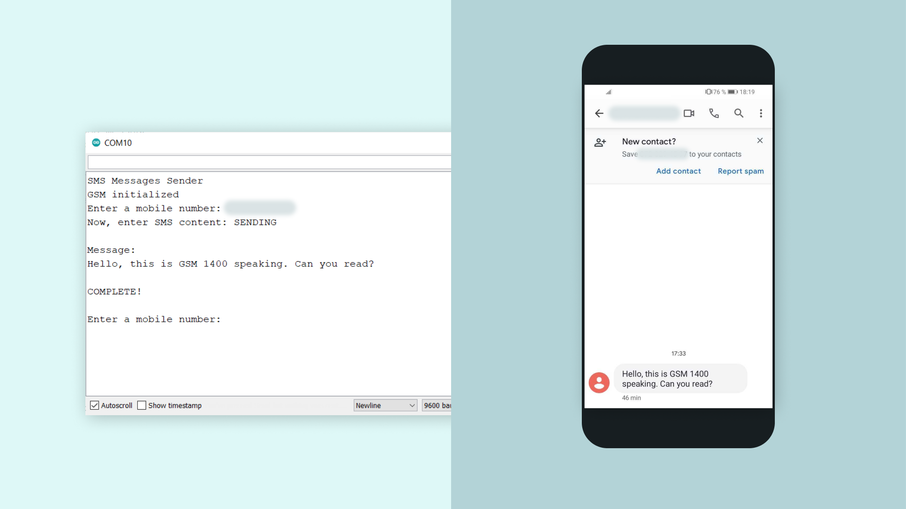

## Introduction 

In this tutorial, we will create a simple sketch that allows us to send a text message, using the [MKRGSM](https://www.arduino.cc/en/Reference/GSM) library. The message is sent over the Global System for Mobile Communications (GSM). 

The sketch will be programmed to record input from the Serial Monitor, where we can enter a number and a message, and send it. 

>**Note:** The Arduino SIM card does not work with this tutorial. A SIM card with a plan from an operator in your country is required. 

## Goals

The goals of this tutorial are:

- Create an input for phone number and message.
- Send a message to a phone over the GSM network.

## Hardware & Software Needed

- Arduino IDE ([online](https://create.arduino.cc/) or [offline](https://www.arduino.cc/en/main/software)).
- [MKRGSM](https://www.arduino.cc/en/Reference/GSM) library installed. 
- [Arduino MKR GSM 1400](https://store.arduino.cc/mkr-gsm-1400).
- [Antenna](https://store.arduino.cc/antenna).
- SIM card from an operator in your country.

## Global System for Mobile Communications (GSM)

GSM is a digital cellular technology used to transmit data wirelessly. It is used by billions of people worldwide, and typically operates around the 900 mHz and 1800 mHz bands. 

It is quite common knowledge that there are several radio towers around the world, which are used for placing phone calls, sending text messages and connecting to the Internet. But how does data transfer from one point to the other, and how can it be done with such precision and speed? Let's take a look.

To understand how GSM works, let's first begin by taking a look at the GSM architecture. There are three major components: 

- **Mobile station** - A transceiver, for example a phone.
- **Base station** - A radio tower that transmits and receives signals.
- **Network subsystem** - This can be mobile switch center, practically designed to delegate where signals are going. 

Let's imagine we are sending a text message from a phone that is connected to GSM. The text message is sent in the southern part of a country, but its destination is a phone that is located in the northern part of a country. 

The message is first sent through electromagnetic waves to the closest radio tower. From here, it goes to something called a Mobile Switch Center (MSC). The MSC is then used to locate where in the world the destination phone is. When it has located the destination, the message is routed to the closest radio tower to the destination phone. This is done through underground cables. The signal is then sent through electromagnetic waves, and the text message arrives. 



Of course, if the phone is not within range, the text won't be delivered until it is close to a radio tower. 

So, when we are calling people we are not really sending signals all over the world, instead signals are sent to the closest radio tower!

### Circuit



## Programming the Board 

In this tutorial, we will use one of the examples from the **MKRGSM** library. The end goal is simple: we want to send a text message from the MKR GSM 1400 to a phone number. 

**1.** Let's begin by taking a look at some of the functions of the sketch we are going to use:

- `GSM gsmAccess` - base class for all GSM functions.
- `GSM_SMS sms` - base class for all GSM functions for SMS.
- `gsmAccess.begin(pin)` - connects to the GSM network with the pin number as a parameter, e.g. 0123.
- `sms.beginSMS(number);` - creates an SMS for a specific number.  
- `sms.print(message);` - prints the content of the SMS.
- `sms.endSMS()` - sends the SMS.

**2.** We need to make sure we have the drivers installed. If we are using the online Web Editor, we do not need to install anything. If we are using an offline editor, we need to install it manually. This can be done by navigating to **Tools > Board > Board Manager...**. Here we need to look for the **Arduino SAMD boards (32-bits Arm® Cortex®-M0+)** and install it. 

**3.** Now, we need to install the libraries needed. If we are using the Web Editor, there is no need to install anything. If we are using an offline editor, simply go to **Tools > Manage libraries..**, search for **MKRGSM** and install it.

**4.** After the library is installed, we can now navigate to **File > Examples > MKRGSM > SendSMS**. This will open a new sketch window (or direct you to the sketch if you are using the Web Editor). There will also be a separate tab called `arduino_secrets.h`. Here we will simply fill in the pin number of our SIM card. 



>**Note:** A standard pre-paid SIM card typically has 0000 or 1234 as a pin code. This varies from operator to operator, and it is important to find this out before uploading the code. Otherwise, too many unsuccessful attempts may block the SIM card.

**5.** We can now upload the sketch to the board. The code can also be found in the snippet below. 

```cpp    

// Include the GSM library
#include <MKRGSM.h>
#include "arduino_secrets.h" 
// Please enter your sensitive data in the Secret tab or arduino_secrets.h
// PIN Number
const char PINNUMBER[] = SECRET_PINNUMBER;

// initialize the library instance
GSM gsmAccess;
GSM_SMS sms;

void setup() {
  // initialize serial communications and wait for port to open:
  Serial.begin(9600);
  while (!Serial) {
    ; // wait for serial port to connect. Needed for native USB port only
  }

  Serial.println("SMS Messages Sender");

  // connection state
  bool connected = false;

  // Start GSM shield
  // If your SIM has PIN, pass it as a parameter of begin() in quotes
  while (!connected) {
    if (gsmAccess.begin(PINNUMBER) == GSM_READY) {
      connected = true;
    } else {
      Serial.println("Not connected");
      delay(1000);
    }
  }

  Serial.println("GSM initialized");
}

void loop() {

  Serial.print("Enter a mobile number: ");
  char remoteNum[20];  // telephone number to send sms
  readSerial(remoteNum);
  Serial.println(remoteNum);

  // sms text
  Serial.print("Now, enter SMS content: ");
  char txtMsg[200];
  readSerial(txtMsg);
  Serial.println("SENDING");
  Serial.println();
  Serial.println("Message:");
  Serial.println(txtMsg);

  // send the message
  sms.beginSMS(remoteNum);
  sms.print(txtMsg);
  sms.endSMS();
  Serial.println("\nCOMPLETE!\n");
}

/*
  Read input serial
 */
int readSerial(char result[]) {
  int i = 0;
  while (1) {
    while (Serial.available() > 0) {
      char inChar = Serial.read();
      if (inChar == '\n') {
        result[i] = '\0';
        Serial.flush();
        return 0;
      }
      if (inChar != '\r') {
        result[i] = inChar;
        i++;
      }
    }
  }
}
```

## Testing It Out

After the sketch has been successfully uploaded to the MKR GSM 1400 board, we need to open the Serial Monitor. After we open the Serial Monitor, the program starts, and it will begin an attempt to connect to the GSM network.

If unsuccessful, it will print `"Not connected"` in the Serial Monitor. Otherwise, it will print, `"GSM initialized"`. 



If we get the latter, we can proceed by entering the phone number we want to send a SMS to and hit enter. We will now be asked to write our message. We can write something simple, such as: 

```
Hello, this is GSM 1400 speaking. Can you read?
```

We can of course be a bit more creative.. But we are just testing things out!

Once we send this message, if it is successful, we will see the message `"COMPLETE!"` in the Serial Monitor.



Now, let's take a look at our phone and see if it worked. We should have received the exact same text message.



Congratulations, you have now managed to connect your MKR GSM 1400 board to the GSM network, and successfully sent an SMS to your phone. 

### Troubleshoot

If the code is not working, there are some common issues we can troubleshoot:

- We have not installed the **MKRGSM** library.
- We have entered the wrong pin number.
- We are out of coverage (no signal).
- We have entered the wrong number.
- SIM card may not be activated.


## Conclusion

In this tutorial, we have used the simple **SendSMS** example from the [MKRGSM](https://www.arduino.cc/en/Reference/GSM) library. We have explored a little bit how GSM works, and finally, we have sent an SMS from our MKR GSM 1400 board to a phone number.

Feel free to explore the [MKRGSM](https://www.arduino.cc/en/Reference/GSM) library further, and try out some of the many cool functions in this library.

