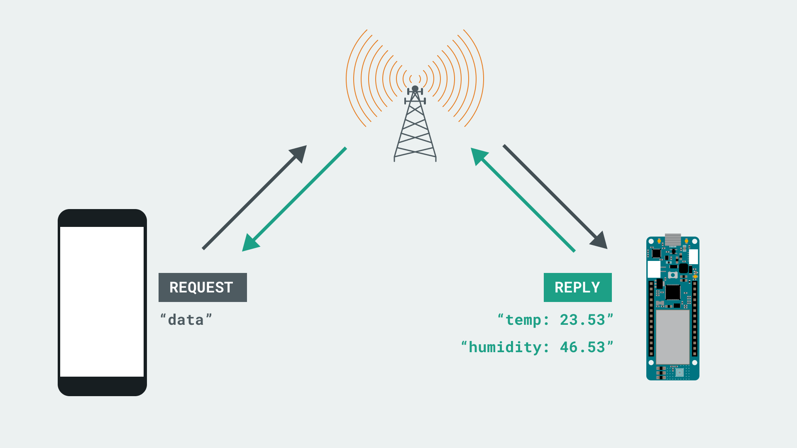
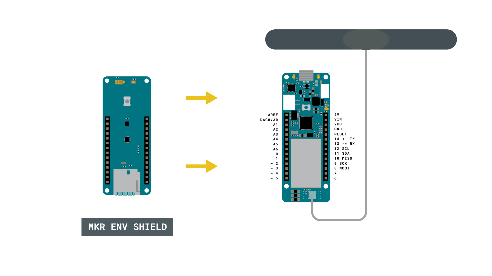
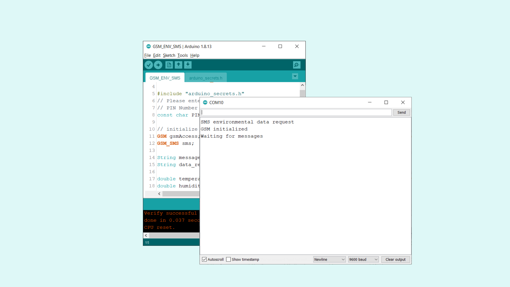
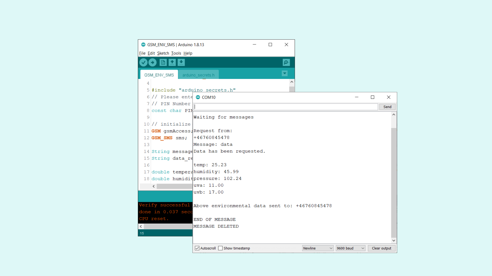

## Introduction 

In this tutorial, we will focus on retrieving environmental data over the GSM network, using the [MKR GSM 1400](https://store.arduino.cc/mkr-gsm-1400) and [MKR ENV shield](https://store.arduino.cc/arduino-mkr-env-shield). We will set it up so that when a phone sends an SMS to the board, it will read the sensors on the shield, and reply to the sender with a list of the sensor data inside an SMS.

## Goals

The goals of this project are:

- Set up a simple data request over GSM.
- Read the sensors on the MKR ENV shield.
- Listen for incoming texts, and if we get a request, reply with the sensor data to the sender's number.

## Hardware & Software Needed

- Arduino IDE ([online](https://create.arduino.cc/) or [offline](https://www.arduino.cc/en/main/software)).
- [MKRGSM](https://www.arduino.cc/en/Reference/GSM) library installed.
- [Arduino MKR GSM 1400](https://store.arduino.cc/mkr-gsm-1400).
- [MKR ENV shield](https://store.arduino.cc/arduino-mkr-env-shield).
- [Antenna](https://store.arduino.cc/antenna).
- SIM card from an operator in your country.

## Requesting Data over GSM

Practically speaking, the setup we will create is very basic: 

- An SMS containing a specific keyword, which we name `data`, is sent to the board. 
- The board checks if the content of the SMS is equal to `data`.
- If it is a match, the board reads the sensors on the MKR ENV shield, and replies with a text message to the sender.
- The text message contains sensor data a description of what type of data it is.



The SMS request method is quite practical, easy to setup and as it operates within the GSM, there is almost always coverage, even in more rural parts. 

## Circuit



## Programming the Board

We will now get to the programming part of this tutorial. 

**1.** First, let's make sure we have the drivers installed. If we are using the Web Editor, we do not need to install anything. If we are using an offline editor, we need to install it manually. This can be done by navigating to **Tools > Board > Board Manager...**. Here we need to look for the **Arduino SAMD boards (32-bits Arm® Cortex®-M0+)** and install it. 

**2.** Now, we need to install the libraries needed. If we are using the Web Editor, there is no need to install anything. If we are using an offline editor, simply go to **Tools > Manage libraries..**, and search for **MKRGSM** and **Arduino_MKRENV** and install them.

**3.** We can now take a look at some of the core functions of this sketch:

- `GSM gsmAccess` - base class for all GSM functions.
- `GSM_SMS sms` - base class for all GSM functions for SMS.
- `gsmAccess.begin(pin)` - connects to the GSM network with the pin number as a parameter, e.g. 0123.
- `sms.available()`
- `sms.remoteNumber(number, 20)` - retrieves a sender's number. 
- `equals()` - function that checks if a `string` is exactly the same as `string2`.  
- `sms.beginSMS(number);` - creates an SMS for a specific number.  
- `sms.print(message);` - prints the content of the SMS.
- `sms.endSMS()` - sends the SMS.
- `sms.flush()` - deletes the message from the modem memory.
- `ENV.begin()` - initializes the **Arduino_MKRENV** library.
- `ENV.readSensor()` - retrieves sensor data from the MKR ENV shield. Replace readSensor with for example readTemperature.

The sketch can be found in the snippet below. Upload the sketch to the board.

```cpp

#include <MKRGSM.h>
#include <Arduino_MKRENV.h>

#include "arduino_secrets.h"
// Please enter your sensitive data in the Secret tab or arduino_secrets.h
// PIN Number
const char PINNUMBER[] = "YOUR_PIN";

// initialize the library instances
GSM gsmAccess;
GSM_SMS sms;

String message;
String data_request = "data"; //used for comparison

//variables for sensor data
double temperature;
double humidity;
double pressure;
double uva;
double uvb;

// Array to hold the number a SMS is retrieved from
char senderNumber[20];

void setup() {
  // initialize serial communications and wait for port to open:
  Serial.begin(9600);
  pinMode(LED_BUILTIN, OUTPUT);

  while (!Serial) {
    ; // wait for serial port to connect. Needed for native USB port only
  }

  if (!ENV.begin()) {
    Serial.println("Failed to initialize MKR ENV shield!");
    while (1);
  }

  Serial.println("SMS environmental data request");

  // connection state
  bool connected = false;

  // Start GSM connection
  while (!connected) {
    if (gsmAccess.begin(PINNUMBER) == GSM_READY) {
      connected = true;
    } else {
      Serial.println("Not connected");
      delay(1000);
    }
  }

  Serial.println("GSM initialized");
  Serial.println("Waiting for messages");
  Serial.println();
}

void loop() {
  int c;

  // If there are any SMS available()
  if (sms.available()) {

  //only read sensors if a request comes in
    temperature = ENV.readTemperature();
    humidity    = ENV.readHumidity();
    pressure    = ENV.readPressure();
    uva         = ENV.readUVA();
    uvb         = ENV.readUVB();

    Serial.println("Request from:");

    // Get remote number
    sms.remoteNumber(senderNumber, 20);
    Serial.println(senderNumber);

    Serial.print("Message: ");
    // Read message bytes and print them
    while ((c = sms.read()) != -1) {
      Serial.print((char)c);

      //print incoming message to the "message" string
      message += (char)c;
    }

    //print empty line to separate incoming message from LED status message
    Serial.println();

    //if incoming message is exactly "ON", turn on LED
    if (message.equals(data_request)) {

      Serial.println("Data has been requested.");
      Serial.println();


      //begin constructing an SMS containing sensor data
      sms.beginSMS(senderNumber);
      sms.print("temp: ");
      sms.print(temperature);
      sms.print(", humidity: ");
      sms.print(humidity);
      sms.print(", pressure: ");
      sms.print(pressure);
      sms.print(", uva: ");
      sms.print(uva);
      sms.print(", uvb: ");
      sms.print(uvb);

      //send the SMS
      sms.endSMS();

      //print the data in the Serial Monitor
      Serial.print("temp: ");
      Serial.println(temperature);
      Serial.print("humidity: ");
      Serial.println(humidity);
      Serial.print("pressure: ");
      Serial.println(pressure);
      Serial.print("uva: ");
      Serial.println(uva);
      Serial.print("uvb: ");
      Serial.println(uvb);
      Serial.println();

      Serial.print("Above environmental data sent to: ");
      Serial.println(senderNumber);
    }

    Serial.println("\nEND OF MESSAGE");

    // Delete message from modem memory
    sms.flush();

    // Clear message string
    message = "";
    Serial.println("MESSAGE DELETED");
    Serial.println();
  }

  delay(1000);

}
```

## Testing It Out

After we have successfully uploaded the code to the board, open the Serial Monitor. We should now see the text `"SMS environmental data request"` followed by `"Waiting for messages"`. This means it is working, and we can now send a data request to the MKR GSM 1400 board, from our phone.



Now we need to create a new SMS that **only** contains the phrase `data`. This needs to be case sensitive, and can't include any spaces etc, because we are using the `equal()` function. This function compares one string to the other, and if it is **an exact match**, it will trigger the rest of the code.

If the incoming message is exactly `data`, the program will first read the sensors and then construct a reply, containing all sensor data. It is then sent to the number which requested it (the sender). 



We should now get a reply on the phone that we sent the request from, which lists the sensor data!

## Troubleshoot

If the code is not working, there are some common issues we can troubleshoot:

- We have not installed the **MKRGSM** library.
- We have entered the wrong pin number.
- We are out of coverage (no signal).
- We have tried to send a request to the wrong number.
- SIM card may not be activated.
- The request is not properly made. Remember that we need to send `data`. If we send `Data` or `DATA`, it will not work.

## Conclusion

In this tutorial, we have created a very basic setup for requesting environmental data, using the MKR GSM 1400 board and the MKR ENV shield. The request, using the GSM_SMS class, simply allows anyone on a phone to send the phrase `data` to a board, and receives a list of environmental data freshly recorded. This setup can be very useful for projects that are used in rural parts, where e.g. Wi-Fi is not available. 

Feel free to explore the [MKRGSM](https://www.arduino.cc/en/Reference/GSM) library further, and try out some of the many cool functions in this library.

