## Components and Supplies

- [Arduino MKR GSM 1400](https://www.newark.com/55AC1187?COM=ref_hackster)
- [Micro-USB to USB Cable (Generic)](https://www.sparkfun.com/products/13244)
- 3.7V Lipo Battery
- Micro SIM card
- Cellular UF.L Antenna

## Apps and Online Services

- [Arduino IDE](https://www.arduino.cc/en/main/software)
- [Google Cloud IoT Core](https://cloud.google.com/iot-core/)

## About This Project

### Introduction

Cloud IoT Core is a fully managed service that allows you to easily and securely connect, manage, and ingest data from millions of globally dispersed devices. Cloud IoT Core, in combination with other services on Cloud IoT platform, provides a complete solution for collecting, processing, analyzing, and visualizing IoT data in real time to support improved operational efficiency.

Devices can connect to GCP IoT Core using HTTP or [MQTT](http://mqtt.org/). This tutorial will walk you through how to connect an [Arduino MKR GSM 1400](https://store.arduino.cc/arduino-mkr-gsm-1400) board securely to GCP IoT Core using an MQTT client. MQTT (Message Queuing Telemetry Transport) is a M2M (machine-to-machine) connectivity protocol which provides a messaging subscription and publish transport.

Devices must use JSON Web Tokens (JWTs) for authentication, more information on JWTs can be found in [RFC 7519](https://tools.ietf.org/html/rfc7519). GCP IoT Core supports both RSA and Elliptic Curve algorithms to verify JSON Web Signatures (JWS). More information on JWS can be found in [RFC 7515](https://tools.ietf.org/html/rfc7515).

Every Arduino MKR board with on-board connectivity, including the MKR GSM 1400, is equipped with a Microchip [ATECC508A](https://www.microchip.com/wwwproducts/en/ATECC508A) or [ATECC608A](https://www.microchip.com/wwwproducts/en/ATECC608A) crypto element. This crypto element can be used to securely generate and store a 256-bit ECC (Elliptic Curve Cryptography) key. We'll be using a private key stored inside the crypto element to sign the JWT.

### Software and Hardware Setup

If you don't have the Arduino IDE installed on your computer, [download](https://www.arduino.cc/en/Main/Software#download) and install it.

Once it is installed, make sure you have the latest "Arduino SAMD Boards" package installed. You can check by opening the Arduino IDE, and opening the **Tools -> Board: "..." -> Board Manager...** menu entry, and searching for "Arduino SAMD". At the time of writing 1.6.20 was the latest version.

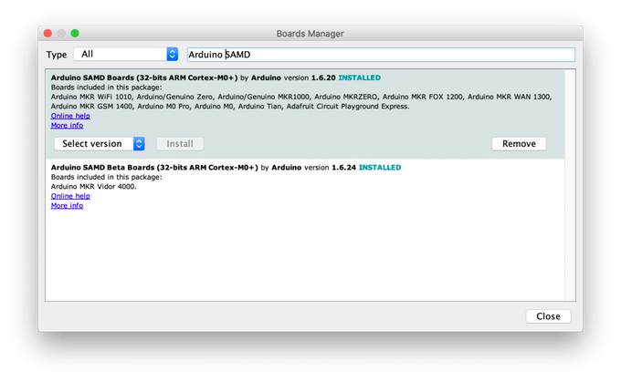

Next you'll need to install the Arduino libraries that will be used, using the Arduino IDE's library manager. Open **Sketch -> Include Library -> Manage Libraries..** menu, search for and individually install each of the following libraries:

* MKRGSM
* Arduino_JSON
* ArduinoECCX08 (version 1.3.0 or later)
* ArduinoMqttClient (version 0.1.3 or later)
* Arduino Cloud Provider Examples (version 1.2.0 or later)

Now insert the micro SIM card in the slot on the bottom of the MKR GSM 1400 board, connect the antenna, and attach the 3.7V Lipo battery to the JST PH connector. Then plug in the MKR GSM 1400 with the micro USB cable to your computer, select the serial port in the Arduino IDE using the **Tools -> Port "..."** menu and also select Arduino MKR GSM 1400 in the **Tools -> Board "..."** menu.

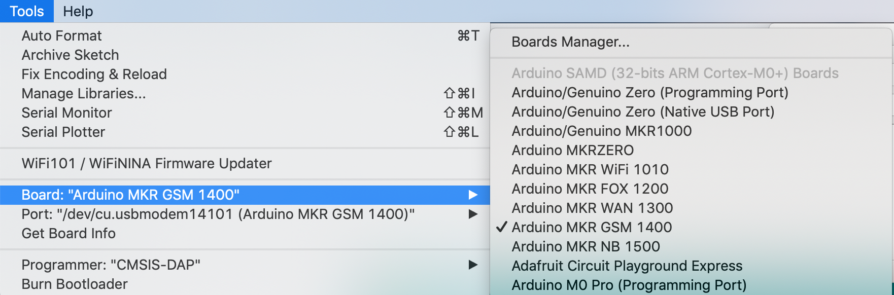

## Configuring and Adding the Board to GCP IoT Core

As mentioned above, GCP IoT Core requires devices that connect using the MQTT protocol to use JWT for authentication. We'll use a sketch to generate a private and public key on the board, then add the PEM value of the public key to the GCP IoT Core console.

The private and public can be generated using an example sketch from the ArduinoECCX08 library. Open the sketch in the Arduino IDE using the **File -> Examples -> ArduinoECCX08 -> Tools -> ECCX08JWSPublicKey**. Click the "Upload" button to build and upload the sketch to your board, then open the Serial Monitor. Make sure the line ending configuration is set to "Both NL & CR."

This sketch will prompt you to permanently configure your ATECC508A to ECC608A crypto element if it is not configured and locked.

 ***NOTE: This locking process is permanent and irreversible, but is needed to use the the crypto element - the configuration the sketch sets allows you to use 5 private key slots with any Cloud provider(or server) and a private key can be regenerated any time for any of the 5 private key slots (0 - 4).***

When the board is shipped from the factory, the crypto element is in an unconfigured and unlocked state.

After this, you will be prompted for what slot to use. For this tutorial we'll be using slot 0 to generate and store the private key used for a public key (slots 1 to 4 can be used to generate and store additional private keys if needed). **Note:** Since the private key is generated inside the crypto element it never leaves the device and is stored securely and cannot be read.

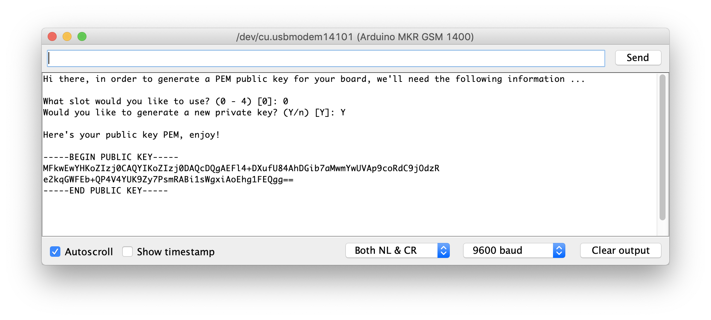

Copy the generated public key value, in this screenshot the value is:

```arduino
-----BEGIN PUBLIC KEY-----
MFkwEwYHKoZIzj0CAQYIKoZIzj0DAQcDQgAEFl4+DXufU84AhDGib7aMwmYwUVAp9coRdC9jOdzR
e2kqGWFEb+QP4V4YUK9Zy7PsmRABi1sWgxiAoEhg1FEQgg==
-----END PUBLIC KEY-----
```

We will use it in a later step when adding the device to GCP IoT Core.

Now that we have a PEM public key, we need to login into the GCP IoT Core console and create a new device for it.

Open a web browser and go to [https://cloud.google.com/](https://cloud.google.com/) and click the "Sign In" link to login with your Google ID.

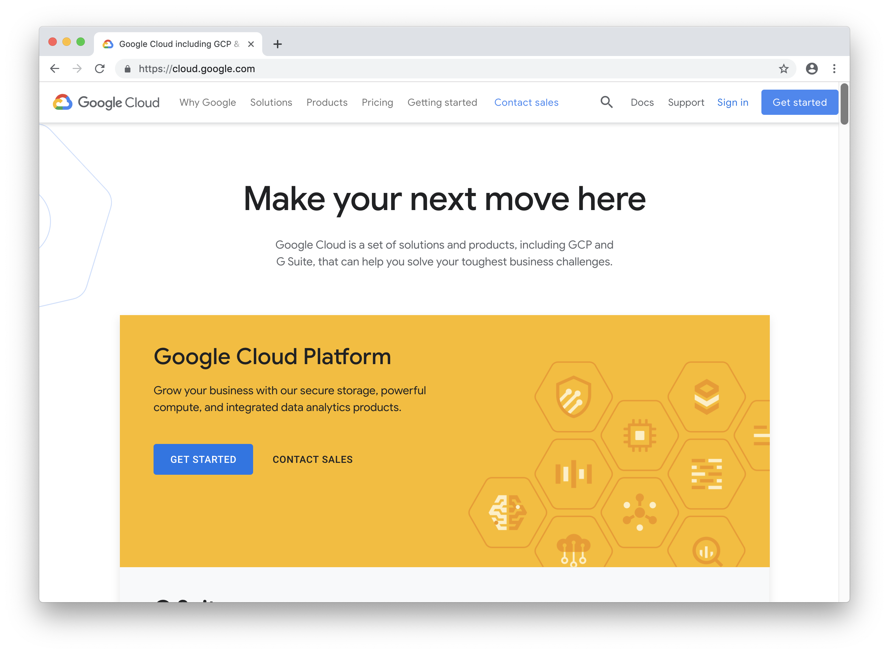


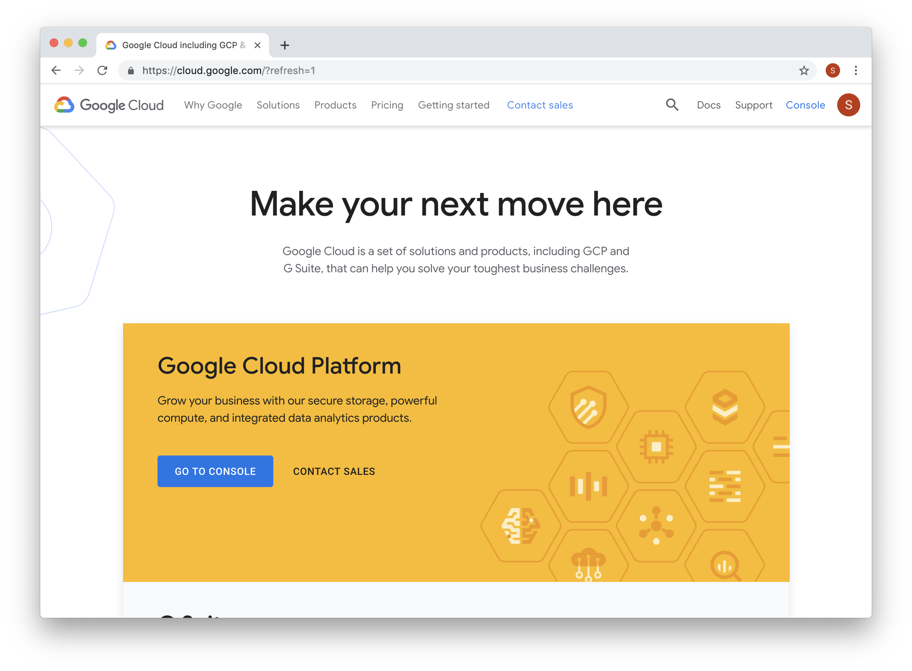


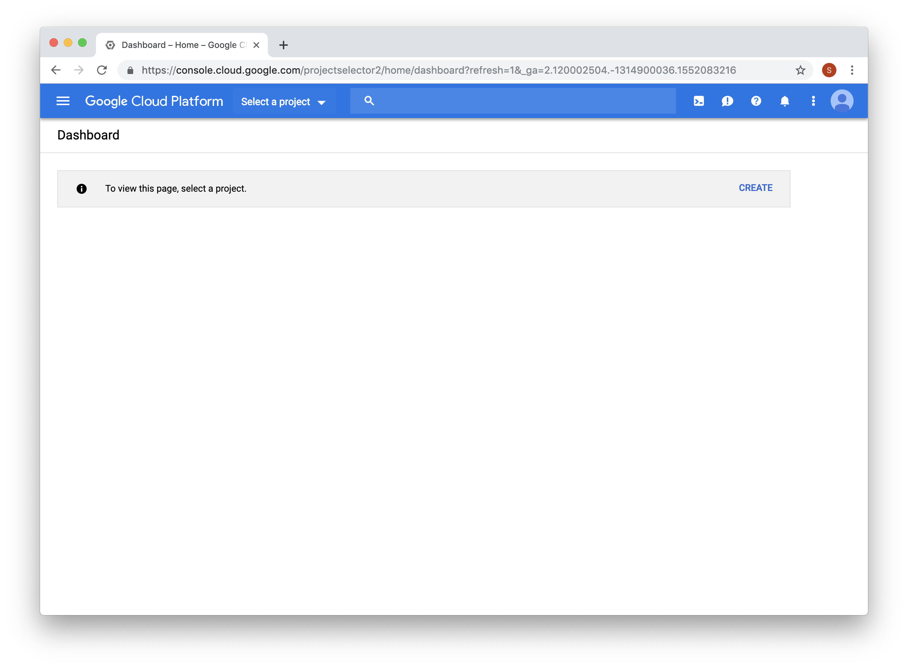

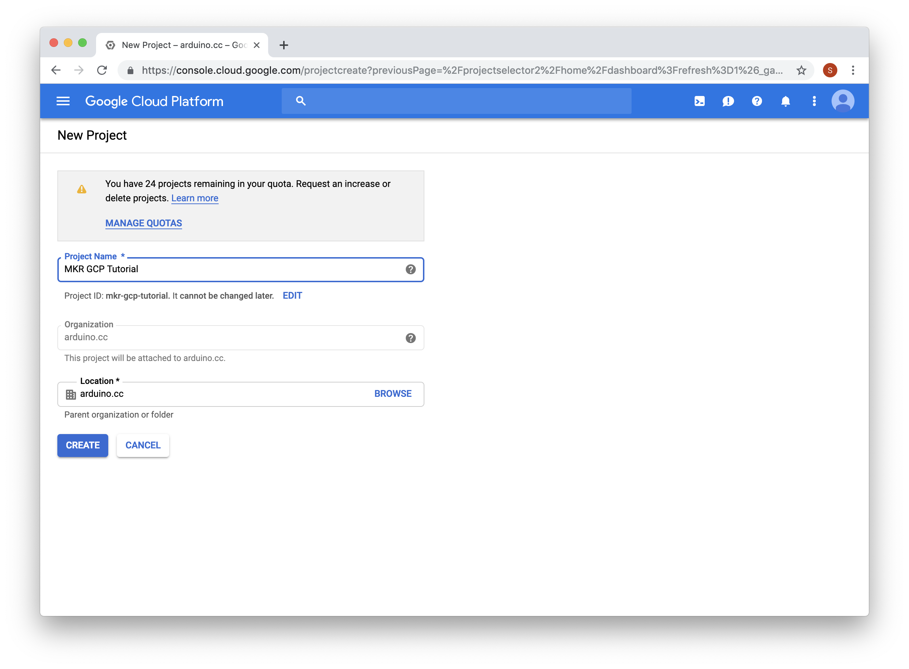


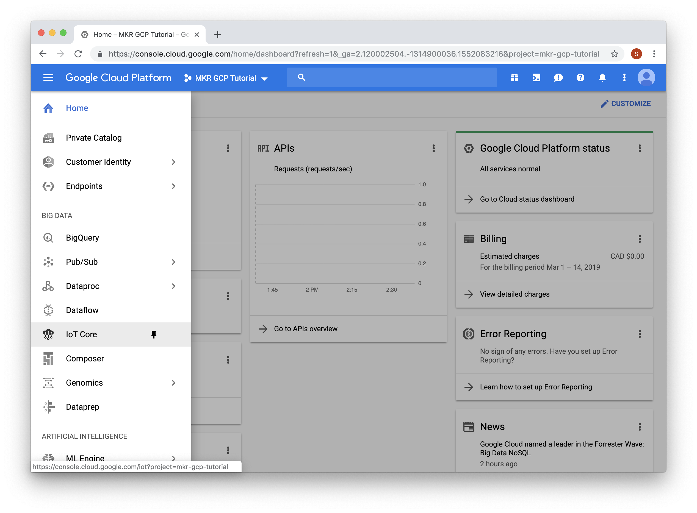


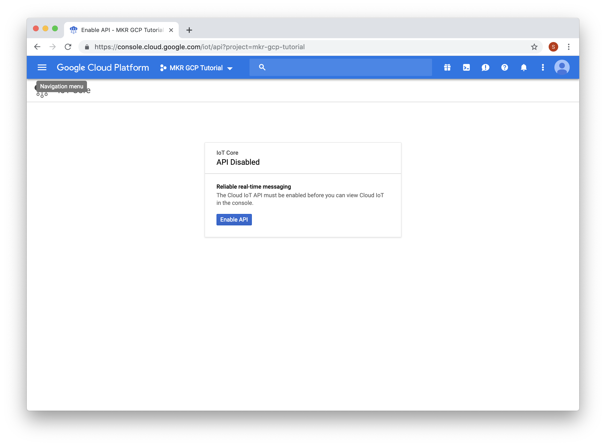


Once the API is enabled, you will be prompted to create a device registry.

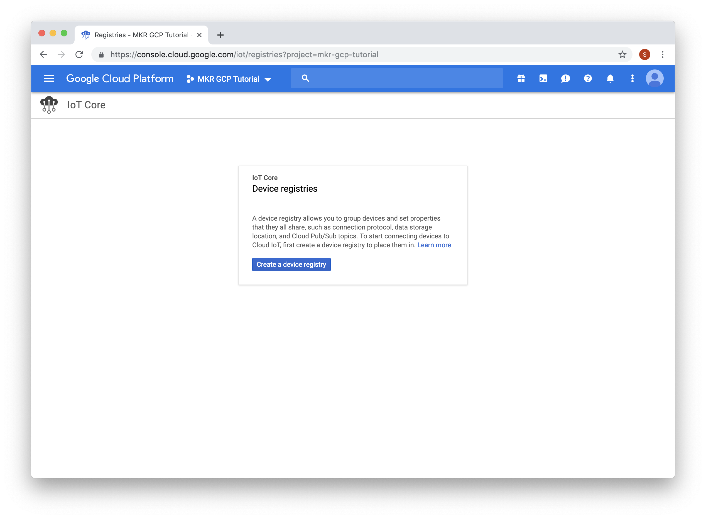

You will then be presented with a form. Fill in the "Registry ID", select a region. In the screenshot below "MKR_GCP_Tutorial" was entered for the registry ID and "us-central1" was selected as the region. After the form has been filled in, click the "Create" button.

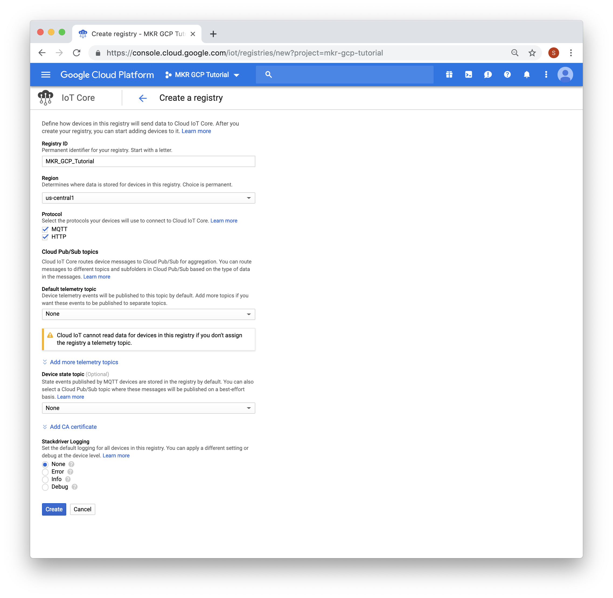


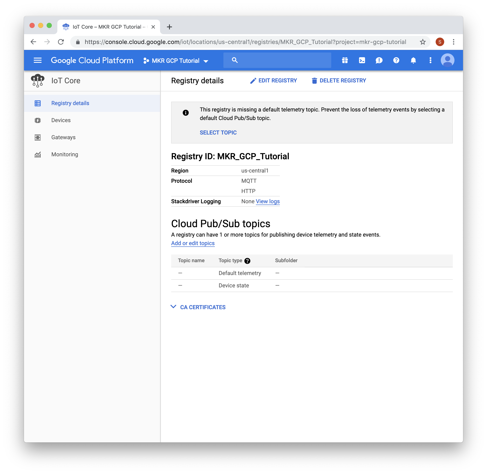


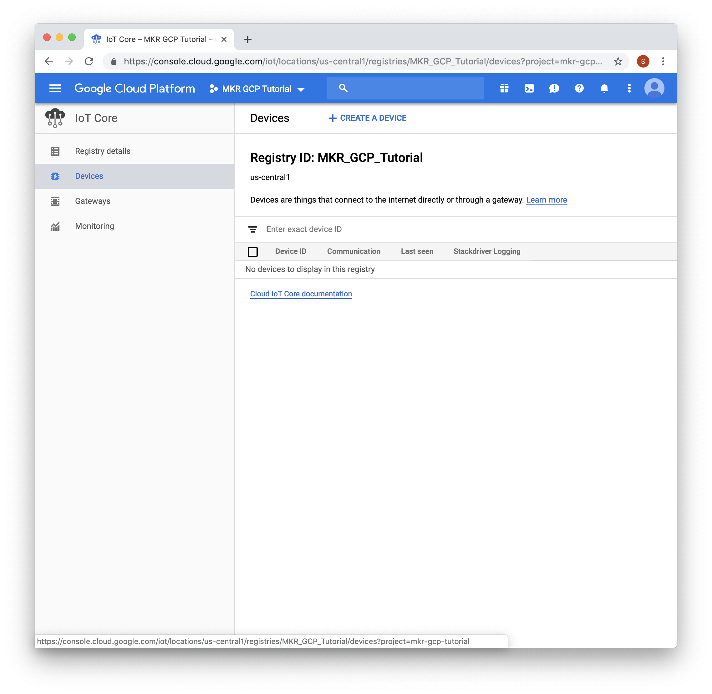

Enter the device name, in the screenshot below "MyMKRGSM1400" was used. "ES256" must be selected as the "Public key format". Paste the PEM public key generated on the board earlier into the "Public key value" text area. Then click the "Create" button.

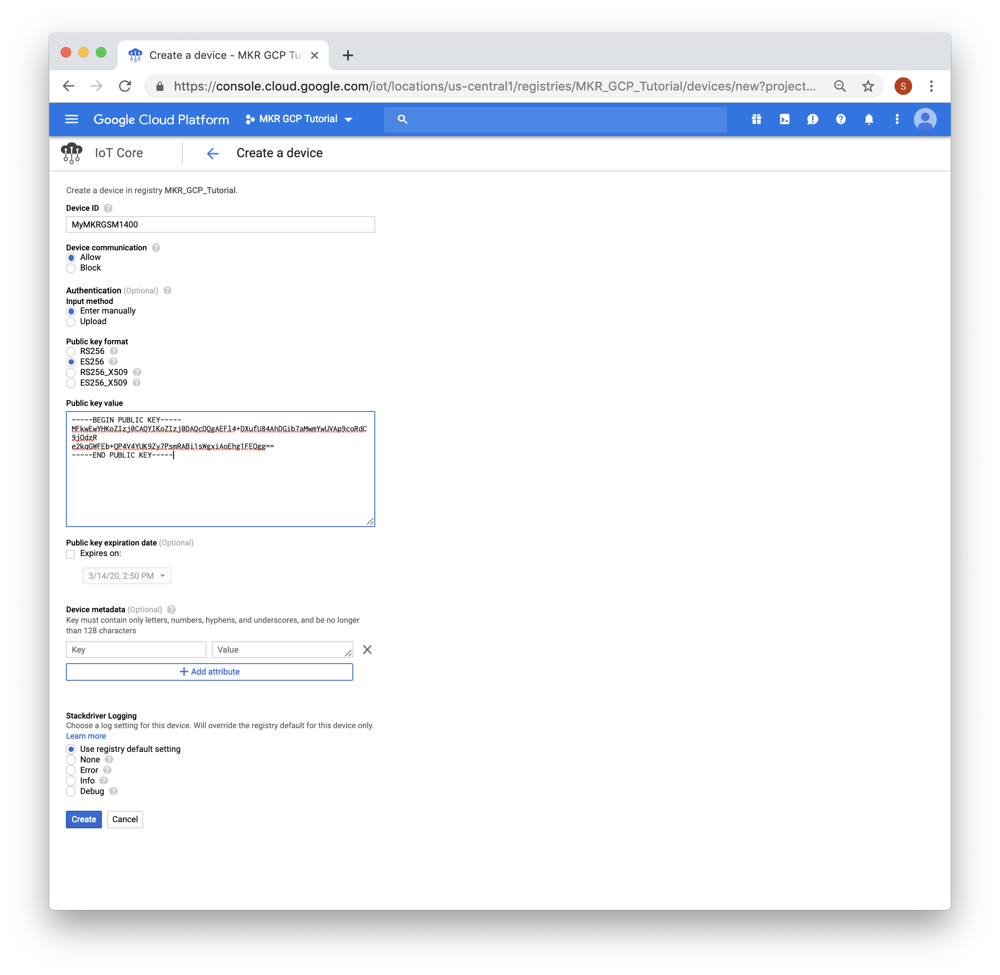

## Connecting the Board to GCP IoT Core

1) Open the GCP IoT Core GSM sketch in the Arduino IDE using **File -> Examples -> Arduino Cloud Provider Examples -> Google Cloud Platform IoT Core -> GCP_IoT_Core_GSM**.

2) In the arduino_secrets.h tab, fill in the pin (if required) for the SIM card, as well as the GPRS APN, username and password for the cellular carrier you are using.

```arduino
// GSM settings
#define SECRET_PINNUMBER     ""
#define SECRET_GPRS_APN      "GPRS_APN" // replace your GPRS APN
#define SECRET_GPRS_LOGIN    "login"    // replace with your GPRS login
#define SECRET_GPRS_PASSWORD "password" // replace with your GPRS password
```

4) Then update the project id, Cloud region, registry id and device id values.

```arduino
// Fill in your Google Cloud Platform - IoT Core info
#define SECRET_PROJECT_ID   ""
#define SECRET_CLOUD_REGION ""
#define SECRET_REGISTRY_ID  ""
#define SECRET_DEVICE_ID    ""
```

The project id value can be found by clicking the menu bar at the top of the GCP console. For the steps above the values are:

```arduino
#define SECRET_PROJECT_ID   "mkr-gcp-tutorial"
#define SECRET_CLOUD_REGION "us-central1"
#define SECRET_REGISTRY_ID  "MKR_GCP_Tutorial"
#define SECRET_DEVICE_ID    "MyMKRGSM1400"
```

5) Upload the sketch below to your board and open the serial monitor. The board will attempt to connect to the cellular network and if successful try to connect to GCP IoT Core using MQTT.

## Complete Sketch

```arduino
/*
  GCP (Google Cloud Platform) IoT Core GSM
  This sketch securely connects to GCP IoT Core using MQTT over GSM/3G.
  It uses a private key stored in the ATECC508A and a JSON Web Token (JWT) with
  a JSON Web Signature (JWS).
  It publishes a message every 5 seconds to "/devices/{deviceId}/state" topic
  and subscribes to messages on the "/devices/{deviceId}/config" and
  "/devices/{deviceId}/commands/#" topics.
  The circuit:
  - MKR GSM 1400 board
  - Antenna
  - SIM card with a data plan
  - LiPo battery
  This example code is in the public domain.
*/

#include <ArduinoECCX08.h>
#include <utility/ECCX08JWS.h>
#include <ArduinoMqttClient.h>
#include <Arduino_JSON.h>
#include <MKRGSM.h>

#include "arduino_secrets.h"

/////// Enter your sensitive data in arduino_secrets.h
const char pinnumber[]     = SECRET_PINNUMBER;
const char gprs_apn[]      = SECRET_GPRS_APN;
const char gprs_login[]    = SECRET_GPRS_LOGIN;
const char gprs_password[] = SECRET_GPRS_PASSWORD;

const char projectId[]     = SECRET_PROJECT_ID;
const char cloudRegion[]   = SECRET_CLOUD_REGION;
const char registryId[]    = SECRET_REGISTRY_ID;
const String deviceId      = SECRET_DEVICE_ID;

const char broker[]        = "mqtt.googleapis.com";

GSM gsmAccess;
GPRS gprs;

GSMSSLClient  gsmSslClient;
MqttClient    mqttClient(gsmSslClient);

unsigned long lastMillis = 0;

void setup() {
  Serial.begin(9600);
  while (!Serial);

  if (!ECCX08.begin()) {
    Serial.println("No ECCX08 present!");
    while (1);
  }

  // Calculate and set the client id used for MQTT
  String clientId = calculateClientId();

  mqttClient.setId(clientId);

  // Set the message callback, this function is
  // called when the MQTTClient receives a message
  mqttClient.onMessage(onMessageReceived);
}

void loop() {
  if (gsmAccess.status() != GSM_READY || gprs.status() != GPRS_READY) {
    connectGSM();
  }

  if (!mqttClient.connected()) {
    // MQTT client is disconnected, connect
    connectMQTT();
  }

  // poll for new MQTT messages and send keep alive
  mqttClient.poll();

  // publish a message roughly every 5 seconds.
  if (millis() - lastMillis > 5000) {
    lastMillis = millis();

    publishMessage();
  }
}

unsigned long getTime() {
  // get the current time from the cellular module
  return gsmAccess.getTime();
}

void connectGSM() {
  Serial.println("Attempting to connect to the cellular network");

  while ((gsmAccess.begin(pinnumber) != GSM_READY) ||
         (gprs.attachGPRS(gprs_apn, gprs_login, gprs_password) != GPRS_READY)) {
    // failed, retry
    Serial.print(".");
    delay(1000);
  }

  Serial.println("You're connected to the cellular network");
  Serial.println();
}

void connectMQTT() {
  Serial.print("Attempting to connect to MQTT broker: ");
  Serial.print(broker);
  Serial.println(" ");

  while (!mqttClient.connected()) {
    // Calculate the JWT and assign it as the password
    String jwt = calculateJWT();

    mqttClient.setUsernamePassword("", jwt);

    if (!mqttClient.connect(broker, 8883)) {
      // failed, retry
      Serial.print(".");
      delay(5000);
    }
  }
  Serial.println();

  Serial.println("You're connected to the MQTT broker");
  Serial.println();

  // subscribe to topics
  mqttClient.subscribe("/devices/" + deviceId + "/config", 1);
  mqttClient.subscribe("/devices/" + deviceId + "/commands/#");
}

String calculateClientId() {
  String clientId;

  // Format:
  //
  //   projects/{project-id}/locations/{cloud-region}/registries/{registry-id}/devices/{device-id}
  //

  clientId += "projects/";
  clientId += projectId;
  clientId += "/locations/";
  clientId += cloudRegion;
  clientId += "/registries/";
  clientId += registryId;
  clientId += "/devices/";
  clientId += deviceId;

  return clientId;
}

String calculateJWT() {
  unsigned long now = getTime();

  // calculate the JWT, based on:
  //   https://cloud.google.com/iot/docs/how-tos/credentials/jwts
  JSONVar jwtHeader;
  JSONVar jwtClaim;

  jwtHeader["alg"] = "ES256";
  jwtHeader["typ"] = "JWT";

  jwtClaim["aud"] = projectId;
  jwtClaim["iat"] = now;
  jwtClaim["exp"] = now + (24L * 60L * 60L); // expires in 24 hours

  return ECCX08JWS.sign(0, JSON.stringify(jwtHeader), JSON.stringify(jwtClaim));
}

void publishMessage() {
  Serial.println("Publishing message");

  // send message, the Print interface can be used to set the message contents
  mqttClient.beginMessage("/devices/" + deviceId + "/state");
  mqttClient.print("hello ");
  mqttClient.print(millis());
  mqttClient.endMessage();
}

void onMessageReceived(int messageSize) {
  // we received a message, print out the topic and contents
  Serial.print("Received a message with topic '");
  Serial.print(mqttClient.messageTopic());
  Serial.print("', length ");
  Serial.print(messageSize);
  Serial.println(" bytes:");

  // use the Stream interface to print the contents
  while (mqttClient.available()) {
    Serial.print((char)mqttClient.read());
  }
  Serial.println();

  Serial.println();
}
```

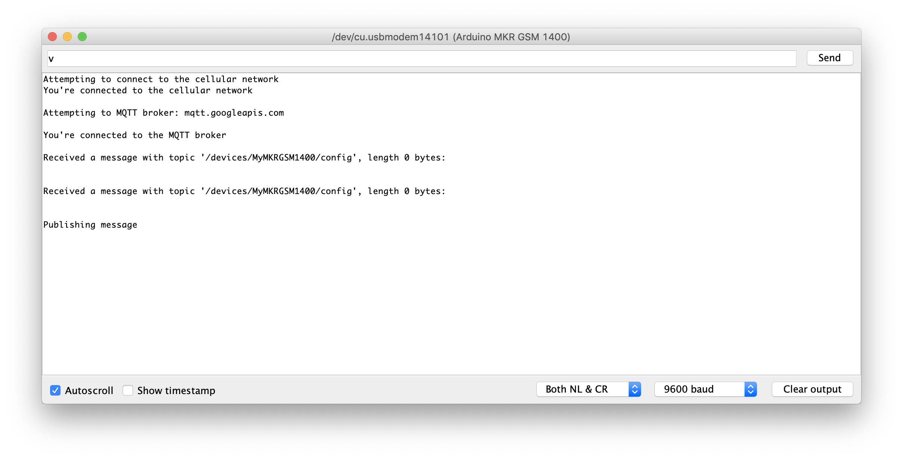

## Interacting with the Board on GCP IoT Core

Now that your board has successfully connected to GCP IoT Core, we can use the GCP IoT Core console to interact with it. The sketch sends a message to the **/devices/{deviceId}/state** topic every 5 seconds and listens for messages on both **/devices/{deviceId}/config** topic and **/devices/{deviceId}/commands/#** topics.


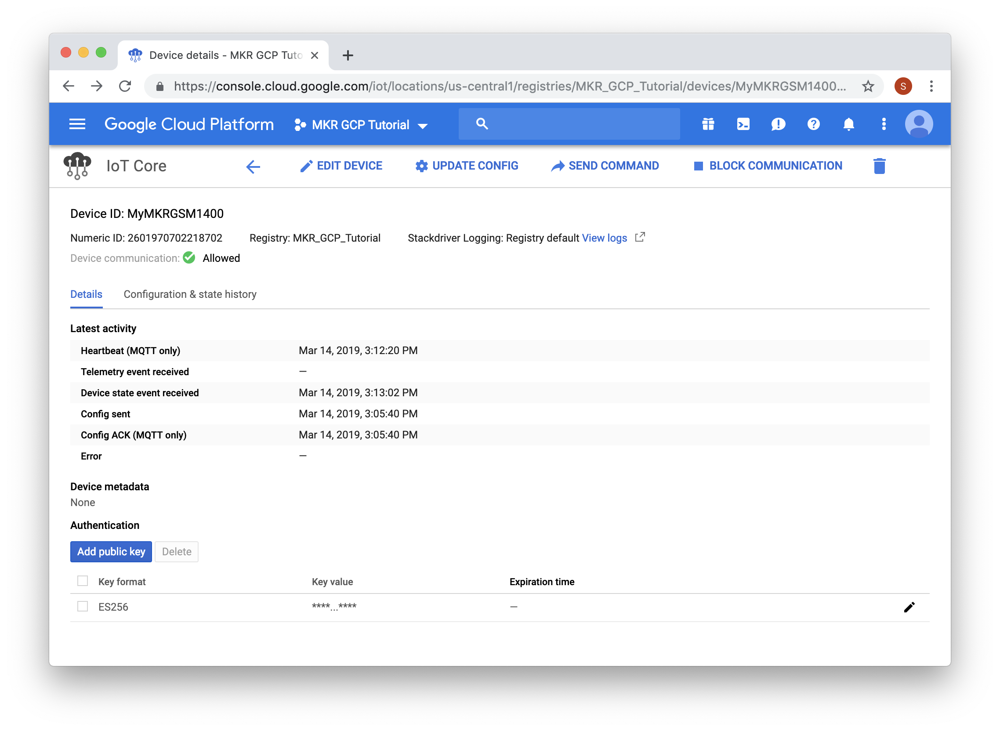

A modal dialog will appear, where you can enter a message to send. In the screenshot below "Hello There!" was entered. Click the "SEND COMMAND" button to send the message.

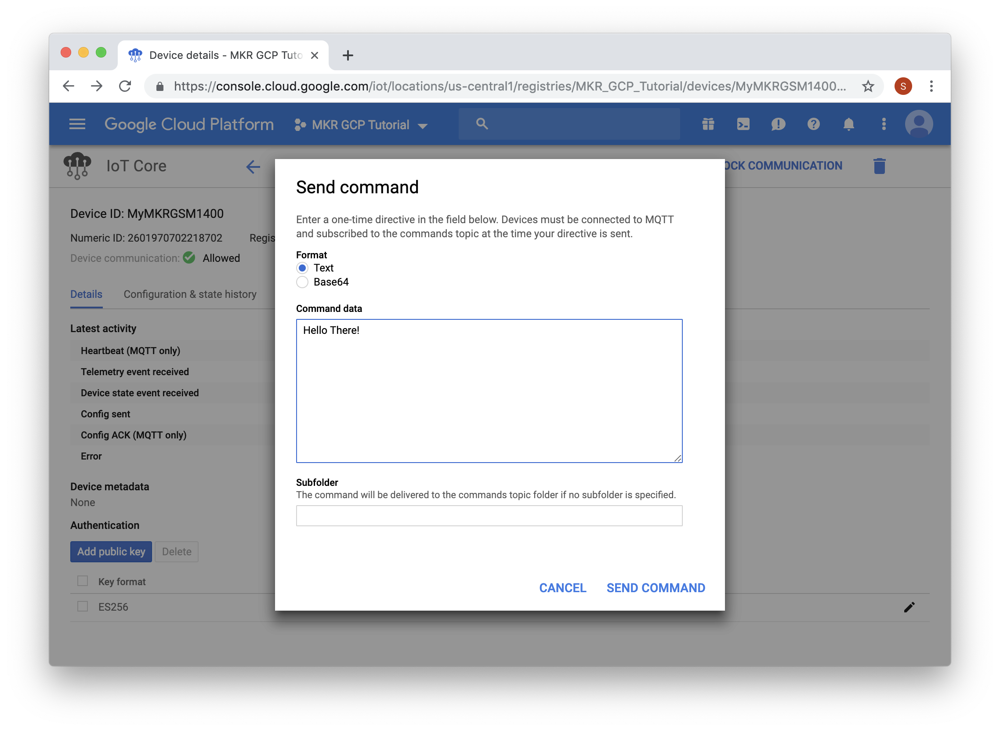

Once the board receives the message it will print it on the Serial Monitor.

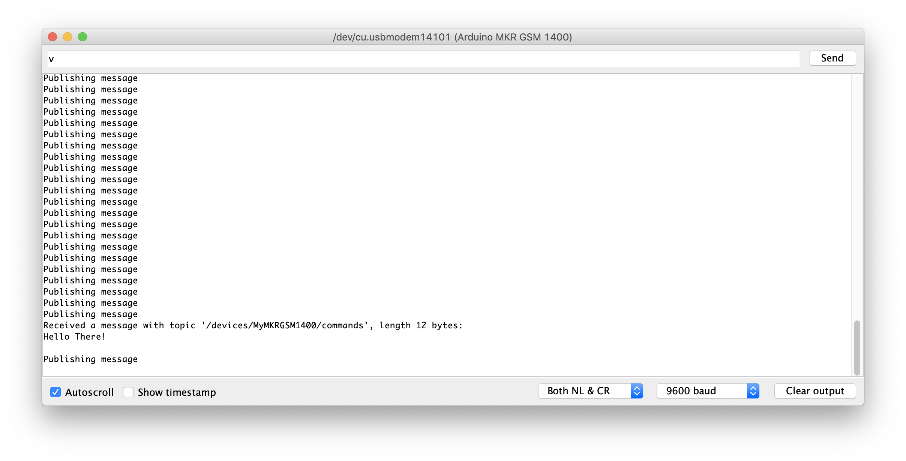

To view the messages the board is sending, click "Configuration & state history" tab.

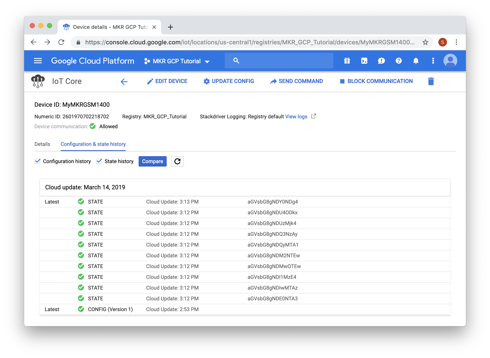

The messages will appear in Base64 encoded format, to view the value click and entry in the list and select the "Text" radio button.

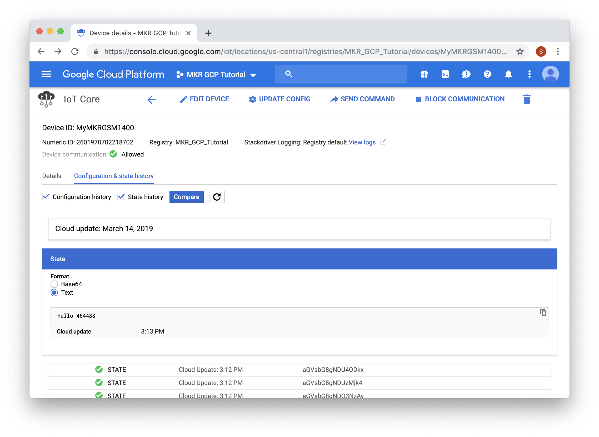

In the screenshot above, the board was sending a **"hello 464488"** value, the 464488 value is the result of the **millis()** function on the board.

## Conclusion

In this tutorial, we covered how to securely use an Arduino MKR GSM 1400 board with GCP IoT Core. A signed JWT was used to authenticate with GCP IoT Core using the MQTT protocol with the ATECC508A or ATECC608A storing the private key used to sign the JWT. MQTT messages were sent to and from the board.

This is just the beginning, you can use GCP IoT Core with many of the other services GCP provides!