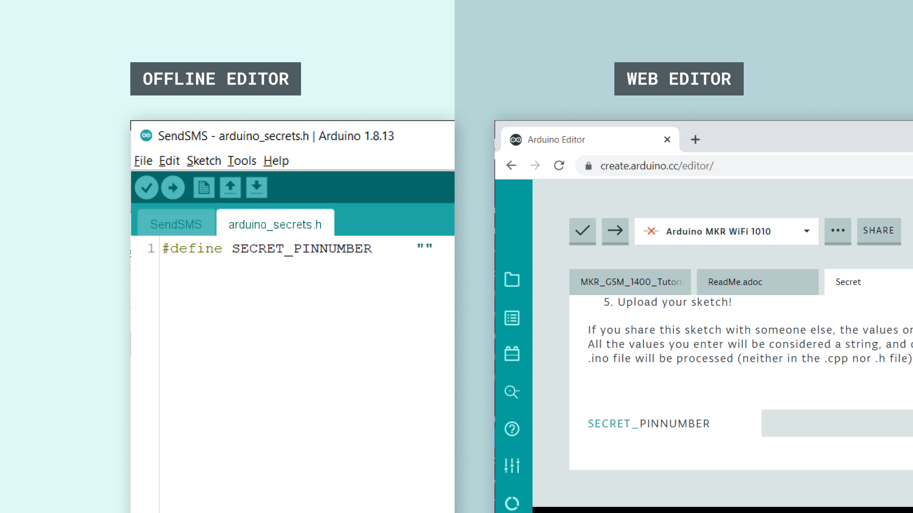
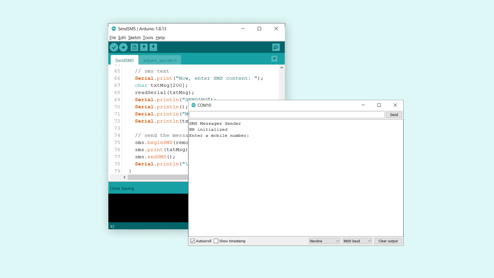
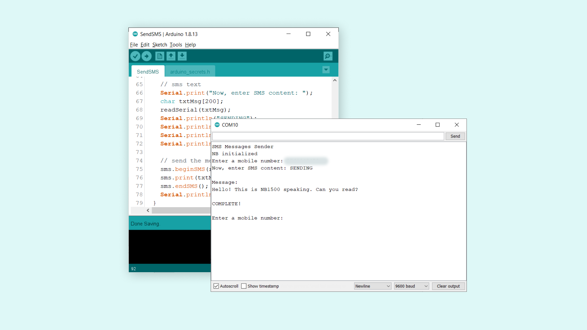
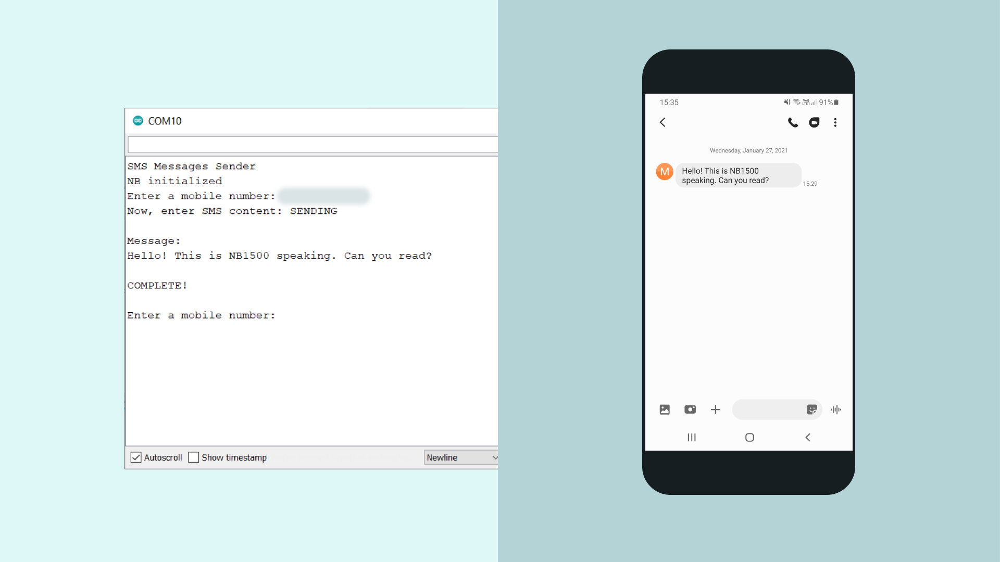

## Introduction 

In this tutorial, we will create a simple sketch that allows us to send a text message, using the [MKRNB](https://www.arduino.cc/en/Reference/MKRNB) library.

The message is sent over Narrow Band IoT (NB IoT) or LTE CAT M1 network.

The sketch will be setup to record input from the Serial Monitor, where we can enter a number and a message, and send it. 

>**Note:** The Arduino SIM card does not work with this tutorial. A SIM card with a plan from an operator in your country is required. 

## Goals

The goals of this tutorial are:

- Create an input for phone number and message.
- Send a message to a phone over NB IoT or LTE CAT M1 network.

## Hardware & Software Needed

- Arduino IDE ([online](https://create.arduino.cc/) or [offline](https://www.arduino.cc/en/main/software)).
- [MKRNB](https://www.arduino.cc/en/Reference/MKRNB) library installed. 
- Arduino MKR NB 1500 ([link to store](https://store.arduino.cc/arduino-mkr-nb-1500-1413)).
- Antenna ([link to store](https://store.arduino.cc/antenna))
- SIM card from an operator in your country.

## NB IoT and LTE CAT M1

LTE-M and NB-IoT are standardized, secure, and operator-managed in licensed spectrum. They are designed for IoT applications that are low cost, use low data rates, require long battery lives and often operate in locations that are hard to reach.

Even though LTE CAT M1 supports voice calls, it was designed for better scalability and wireless broadband. Providing a low speed, low power and long range protocol for the transmission of small amounts of data. LTE CAT M1 supports cellular tower handoffs, so it works with mobile applications

NB-IoT is best suited for simple IoT devices that require small, intermittent data transmissions where latency doesn’t matter. The cellular technology offers long range support and strong signal penetration, so it’s good for long distances, indoor or underground usage. NB-IoT runs in the mobile telephone radio spectrum, and piggybacks on old, unused GSM channels, or free space between LTE channels. NB-IoT can only be used for stationary IoT applications since it doesn’t handle cellular tower handoffs.

### Circuit

The circuit for this tutorial is easy: simply attach the dipole antenna to the board.


## Programming the Board 

In this tutorial, we will use one of the examples from the **MKRNB** library. The end goal is simple: we want to send a text message from the MKR NB 1500 to a phone number. 

**1.** Let's begin by taking a looking at some of the functions of the sketch we are going to use:

- `NB nbAccess` - base class for all NB functions.
- `NB_SMS sms` - base class for all NB functions for SMS.
- `nbAccess.begin(pin)` - connects to the selected network with the pin number as a parameter, e.g. 0123.
- `sms.beginSMS(number);` - creates an SMS for a specific number  
- `sms.print(message);` - prints the content of the SMS.
- `sms.endSMS()` - sends the SMS.

**2.** We need to make sure we have the drivers installed. If we are using the Web Editor, we do not need to install anything. If we are using an offline editor, we need to install it manually. This can be done by navigating to **Tools > Board > Board Manager...**. Here we need to look for the **Arduino SAMD boards (32-bits Arm® Cortex®-M0+)** and install it. 

**3.** Now, we need to install the libraries needed. If we are using the Web Editor, there is no need to install anything. If we are using an offline editor, simply go to **Tools > Manage libraries..**, and search for **MKRNB** and install it.

**4.** After the library is installed, we can now navigate to **File > Examples > MKRNB > SendSMS**. This will open a new sketch window (or direct you to the sketch if you are using the Web Editor). There will also be a separate tab called `arduino_secrets.h`. Here we will simply fill in the pin number of our SIM card. 



>**Note:** A standard pre-paid SIM card typically have 0000 or 1234 as a pin code. This varies from operator to operator,and it is important to find out this before uploading the code. Otherwise, too many unsuccessful attempts may block the SIM card.

We can now upload the sketch to the board. The code can also be found in the snippet below. 

```cpp

// Include the MKRNB library
#include <MKRNB.h>
// #include "arduino_secrets.h" 
// Please enter your sensitive data in the Secret tab or arduino_secrets.h
// PIN Number
const char PINNUMBER[] = SECRET_PINNUMBER;

// initialize the library instance
NB nbAccess;
NB_SMS sms;

void setup() {
  // initialize serial communications and wait for port to open:
  Serial.begin(9600);
  while (!Serial) {
    ; // wait for serial port to connect. Needed for native USB port only
  }

  Serial.println("SMS Messages Sender");

  // connection state
  bool connected = false;

  // If your SIM has PIN, pass it as a parameter of begin() in quotes
  while (!connected) {
    if (nbAccess.begin(PINNUMBER) == NB_READY) {
      connected = true;
    } else {
      Serial.println("Not connected");
      delay(1000);
    }
  }

  Serial.println("NB initialized");
}

void loop() {

  Serial.print("Enter a mobile number: ");
  char remoteNum[20];  // telephone number to send sms
  readSerial(remoteNum);
  Serial.println(remoteNum);

  // sms text
  Serial.print("Now, enter SMS content: ");
  char txtMsg[200];
  readSerial(txtMsg);
  Serial.println("SENDING");
  Serial.println();
  Serial.println("Message:");
  Serial.println(txtMsg);

  // send the message
  sms.beginSMS(remoteNum);
  sms.print(txtMsg);
  sms.endSMS();
  Serial.println("\nCOMPLETE!\n");
}

//Read input serial
int readSerial(char result[]) {
  int i = 0;
  while (1) {
    while (Serial.available() > 0) {
      char inChar = Serial.read();
      if (inChar == '\n') {
        result[i] = '\0';
        Serial.flush();
        return 0;
      }
      if (inChar != '\r') {
        result[i] = inChar;
        i++;
      }
    }
  }
}
```

## Testing It Out

After the sketch has been successfully uploaded to the MKR NB 1500 board, we need to open the Serial Monitor. After we open the Serial Monitor, the program starts, and it will start an attempt to connect to the NB network.

If unsuccessful, it will print `"Not connected"` in the Serial Monitor. Otherwise, it will print, `"NB initialized"`.



If we get the latter, we can proceed by entering a phone number we want to send a SMS to and hit enter. We will now be asked to write our message. We can write something simple, such as: 

```
Hello, this is NB 1500 speaking. Can you read?
```

We can of course be a bit more creative.. But we are just testing things out!

Once we send this message, if it is successful, we will see the message `"COMPLETE!"` in the Serial Monitor.



Now, let's take a look at our phone and see if it worked. We should have received the exact same text message.



Congratulations, you have now managed to connect your MKR NB 1500 board to a network, and successfully sent an SMS to your phone. 

### Troubleshoot

If the code is not working, there are some common issues we can troubleshoot:

- We have not installed the **MKRNB** library.
- We have entered the wrong pin number.
- We are out of coverage (no signal).
- We have entered the wrong number.
- SIM card may not be activated.


## Conclusion

In this tutorial, we have used the simple **SendSMS** example from the [MKRNB](https://www.arduino.cc/en/Reference/MKRNB) library. We have explored a little bit about the features of the different networks, and finally, we have sent an SMS from our MKR NB 1500 board to a phone number.

Feel free to explore the [MKRNB](https://www.arduino.cc/en/Reference/MKRNB) library further, and try out some of the many cool functions in this library.
