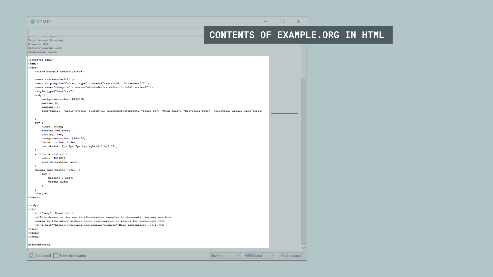

## Introduction 

In this tutorial, we will use the [MKR NB 1500](https://store.arduino.cc/arduino-mkr-nb-1500-1413) and the [MKRNB](https://www.arduino.cc/en/Reference/MKRNB) library to make a request to a web server, and print the content in the Serial Monitor. 

## Goals

The goals of this project are:

- Make a request to a server.
- Print the content in the Serial Monitor.

## Hardware & Software Needed

- Arduino IDE ([online](https://create.arduino.cc/) or [offline](https://www.arduino.cc/en/main/software)).
- [MKRNB](https://www.arduino.cc/en/Reference/MKRNB) library installed. 
- Arduino MKR NB 1500 ([link to store](https://store.arduino.cc/arduino-mkr-nb-1500-1413)).
- Antenna ([link to store](https://store.arduino.cc/antenna))
- SIM card from an operator in your country.


### Circuit

The circuit for this tutorial is easy: simply attach the dipole antenna to the board.


## Creating the Program

We will now get to the programming part of this tutorial. 

**1.** First, let's make sure we have the drivers installed. If we are using the Web Editor, we do not need to install anything. If we are using an offline editor, we need to install it manually. This can be done by navigating to **Tools > Board > Board Manager...**. Here we need to look for the **Arduino SAMD boards (32-bits Arm® Cortex®-M0+)** and install it. 

**2.** Now, we need to install the libraries needed. If we are using the Web Editor, there is no need to install anything. If we are using an offline editor, simply go to **Tools > Manage libraries..**, and search for **MKRNB** and install it.

**3.** We will now take a look at the main functions in this program:

- `const char PINNUMBER[]` - stores the pin number of your card.
- `NB nbAccess` - base class for all NB based functions.
- `GPRS gprs` - base class for GPRS functions, e.g. Internet, server behaviors.
- `char server[] = "example.org"` - server we are connecting to.
- `char path[] = "/"` - additional path (in this case none).
- `int port = 80` - port 80 is default for HTTP.
- `nbAccess.begin(pin)` - starts the modem. 
- `gprs.attachGPRS()` - attach to the GPRS network.
- `client.print()` - prints to the client. This is used to e.g. make the GET request.
- `client.available()` - check if data is available.
- `client.read()` - reads incoming data.

The code is available in the snippet below. Make sure you change the `PINNUMBER` variable to match the pin on your SIM card. This code can also be found in **File > Examples > MKRNB > NBWebClient** in the editor. Note that if you use that example, you need to enter your pin in the `arduino_secrets.h` file. 

```arduino
// libraries
#include <MKRNB.h>

// PIN Number
const char PINNUMBER[]  = "0000";

// initialize the library instance
NBClient client;
GPRS gprs;
NB nbAccess;

// URL, path and port (for example: example.org)
char server[] = "example.org";
char path[] = "/";
int port = 80; // port 80 is the default for HTTP

void setup() {
  // initialize serial communications and wait for port to open:
  Serial.begin(9600);
  while (!Serial) {
    ; // wait for serial port to connect. Needed for native USB port only
  }

  Serial.println("Starting Arduino web client.");
  // connection state
  boolean connected = false;

  // After starting the modem with NB.begin()
  // attach to the GPRS network with the APN, login and password
  while (!connected) {
    if ((nbAccess.begin(PINNUMBER) == NB_READY) &&
        (gprs.attachGPRS() == GPRS_READY)) {
      connected = true;
    } else {
      Serial.println("Not connected");
      delay(1000);
    }
  }

  Serial.println("connecting...");

  // if you get a connection, report back via serial:
  if (client.connect(server, port)) {
    Serial.println("connected");
    // Make a HTTP request:
    client.print("GET ");
    client.print(path);
    client.println(" HTTP/1.1");
    client.print("Host: ");
    client.println(server);
    client.println("Connection: close");
    client.println();
  } else {
    // if you didn't get a connection to the server:
    Serial.println("connection failed");
  }
}

void loop() {
  // if there are incoming bytes available
  // from the server, read them and print them:
  if (client.available()) {
    Serial.print((char)client.read());
  }

  // if the server's disconnected, stop the client:
  if (!client.available() && !client.connected()) {
    Serial.println();
    Serial.println("disconnecting.");
    client.stop();

    // do nothing forevermore:
    for (;;)
      ;
  }
}
```

## Testing It Out

After the code has been successfully uploaded, we need to open the Serial Monitor to initialize the rest of the program. For these type of projects, we use the `while(!Serial)` command, so we can read any available information only after we open the Serial Monitor.

After we open the Serial Monitor, the board will start connecting to the network.


When it connects, it will then make a GET request to [example.org](https://example.org). It basically downloads the contents, and prints it in the Serial Monitor. The result is that you can see the entire page in the Serial Monitor.



### Troubleshoot

Note that the board does not always find a way to connect to the network. There can be several issues behind this.

- Antenna is not working.
- SIM card is not working.
- We're not in range of a network. 

## Conclusion

In this tutorial, we have simply made a GET request to a server, received it, and printed it in the Serial Monitor. There are many different ways we can build on this, such as making requests to servers that has live data updated every so often.  

