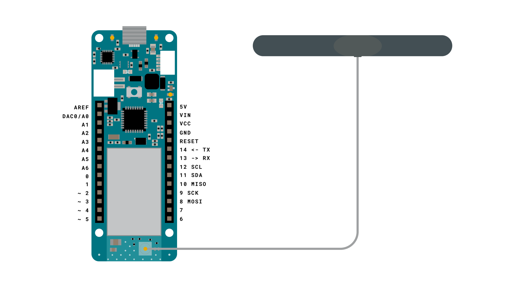
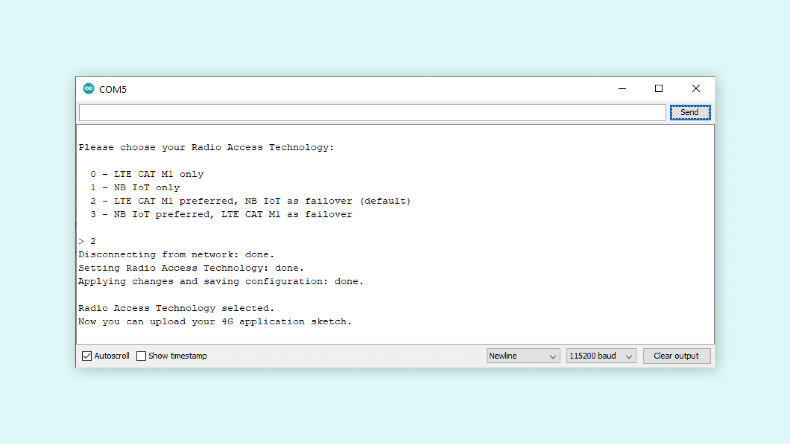

## Introduction 

In this tutorial, we will learn how to set the preferred Narrowband Radio Access Technology (RAT) for the MKR NB 1500 board.

Before we can start using our MKR NB 1500 board with a SIM card, we need to set the preferred RAT. You can choose among LTE CAT-M1, NB-IoT or a combination of both. The chosen configuration will be saved in the modem's internal memory and will be preserved through MKR NB 1500 sketch uploads. 

If you are unsure about what setting is best for your location, please refer to this [mobile IoT deployment map](https://www.gsma.com/iot/deployment-map/). Here we can for example see that most parts of Western Europe, North America and Australia can use both LTE-M and NB-IoT, which means we have multiple options to choose from. Most parts of Asia however, can only use the NB-IoT access technology, while Africa in general does not have much coverage. 

## Goals

The goals of this project are:

- Set preferred narrowband technology.
- Get the NB 1500 ready for use.

## Hardware & Software Needed

- Arduino IDE ([online](https://create.arduino.cc/) or [offline](https://www.arduino.cc/en/main/software)).
- [MKRNB](https://www.arduino.cc/en/Reference/MKRNB) library installed.
- Arduino MKR NB 1500 ([link to store](https://store.arduino.cc/mkr-nb-1500)).
- Antenna ([link to store](https://store.arduino.cc/antenna))
- SIM card enabled for data.

### Circuit

The circuit for this tutorial is very simple. All we need is an antenna connected to the MKR NB 1500 board.




## A Quick Comparison of Radio Technologies

The MKR NB 1500 board has the capability to connect to either NB-IoT or LTE-M, each with their own promising features. Let's take a quick look at them!

### NB-IoT

NB-IoT is a radio technology deployed over mobile networks which is especially suited for indoor coverage, low cost, long battery life, and large number of devices.

### LTE-M
LTE-M supports downlink and uplink speeds up to 1 Mbps with a latency of 50 to 100 ms and can be used for realtime-communication. LTE-M is ideal if you are interested in tracking things such as logistics and transportation.

Every time we decide to change the RAT, we can run this sketch again.


## Creating the Program

We will now get to the programming part of this tutorial. It focuses on two main parts: choosing what RAT the board will use, and saving it to the modem's internal memory.

**1.** First, let's make sure we have the drivers installed. If we are using the Cloud Editor, we do not need to install anything. If we are using an offline editor, we need to install it manually. This can be done by navigating to **Tools > Board > Board Manager...**. Here we need to look for the **Arduino SAMD boards (32-bits Arm® Cortex®-M0+)** and install it. 

**2.** Now, we need to install the libraries needed. If we are using the Cloud Editor, there is no need to install anything. If we are using an offline editor, simply go to **Tools > Manage libraries..**, and search for **MKRNB** and install it.

**3.** With the drivers and library installed, we can now move on to create the sketch. This sketch is available as an example in the **MKRNB** library, and can be accessed directly through the editor by navigating to **File > Examples > MKRNB > Tools > ChooseRadioAccessTechnology**. 

The full code is also available further down this tutorial. But we will now also go through it step by step to understand the sketch a bit better.

First we need to include the **MKRNB** library to access its functionalities. We then initialize the boards modem, making it possible to write to the modems internal memory. Lastly, in setup we then make the code print a text based interface to the serial monitor, enabling us to see our options and select the option that suits us best.

```cpp
#include <MKRNB.h>

void setup() {
  Serial.begin(115200);
  while (!Serial);
  MODEM.begin();
  while (!MODEM.noop());
  Serial.println();
  Serial.println("Please choose your Radio Access Technology:");
  Serial.println();
  Serial.println("  0 - LTE CAT M1 only");
  Serial.println("  1 - NB IoT only");
  Serial.println("  2 - LTE CAT M1 preferred, NB IoT as failover (default)");
  Serial.println("  3 - NB IoT preferred, LTE CAT M1 as failover");
  Serial.println();
}
```

In the **loop()** function, we read the answer given in the serial monitor, giving a variable the appropriate value so that the right setting will be applied to the internal memory. Calling on our custom functions and sending the appropriate variables at the end.

```cpp
void loop() {
  String uratChoice;
  Serial.print("> ");
  Serial.setTimeout(-1);
  while (Serial.available() == 0);
  String uratInput = Serial.readStringUntil('\n'); //Reads the user input that is written before enter is hit
  uratInput.trim();
  int urat = uratInput.toInt(); //Converts the input into an int, making it possible to pass into the switch function
  Serial.println(urat);
  switch (urat) {

    case 0:
      uratChoice = "7";
      break;

    case 1:
      uratChoice = "8";
      break;

    case 2:
      uratChoice = "7,8";
      break;

    case 3:
      uratChoice = "8,7";
      break;

    default:
      //If an invalid value is entered into the serial monitor this case will catch it
      Serial.println("Invalid input. Please, retry.");
      return;
  }
  setRAT(uratChoice);
  apply();
  Serial.println();
  Serial.println("Radio Access Technology selected.");
  Serial.println("Now you can upload your 4G application sketch.");
  while (true);
}
```

**setRAT(String choice)** writes the preferred RAT choice to the modem. We send our choice to this function, using the variable called `choice`. Using our choice from the serial monitor the function sets the preferred RAT for this board.

```cpp
bool setRAT(String choice)
{
  String response;
  Serial.print("Disconnecting from network: ");
  MODEM.sendf("AT+COPS=2");
  MODEM.waitForResponse(2000);
  Serial.println("done.");
  Serial.print("Setting Radio Access Technology: ");
  MODEM.sendf("AT+URAT=%s", choice.c_str());
  MODEM.waitForResponse(2000, &response);
  Serial.println("done.");
  return true;
}
```

**apply()** saves the RAT choice to the modems internal memory. The last function wrote the desired option to the board, this function will save that choice to the modems internal memory. Ensuring that the correct RAT option stays on the boards internal memory, even when uploading new sketches to the board.

```cpp
bool apply()
{
  Serial.print("Applying changes and saving configuration: ");
  MODEM.send("AT+CFUN=15");
  MODEM.waitForResponse(5000);
  delay(5000);
  do {
    delay(1000);
    MODEM.noop();
  } while (MODEM.waitForResponse(1000) != 1);
  Serial.println("done.");
  return true;
}
```

## Complete Code

```arduino
#include <MKRNB.h>

void setup() {
  Serial.begin(115200);
  while (!Serial);
  MODEM.begin();
  while (!MODEM.noop());
  Serial.println();
  Serial.println("Please choose your Radio Access Technology:");
  Serial.println();
  Serial.println("  0 - CAT M1 only");
  Serial.println("  1 - NB IoT only");
  Serial.println("  2 - CAT M1 preferred, NB IoT as failover (default)");
  Serial.println("  3 - NB IoT preferred, CAT M1 as failover");
  Serial.println();
}

void loop() {
  String uratChoice;
  Serial.print("> ");
  Serial.setTimeout(-1);
  while (Serial.available() == 0);
  String uratInput = Serial.readStringUntil('\n');
  uratInput.trim();
  int urat = uratInput.toInt();
  Serial.println(urat);
  switch (urat) {

    case 0:
      uratChoice = "7";
      break;

    case 1:
      uratChoice = "8";
      break;

    case 2:
      uratChoice = "7,8";
      break;

    case 3:
      uratChoice = "8,7";
      break;

    default:
      Serial.println("Invalid input. Please, retry.");
      return;
  }
  setRAT(uratChoice);
  apply();
  Serial.println();
  Serial.println("Radio Access Technology selected.");
  Serial.println("Now you can upload your 4G application sketch.");
  while (true);
}

bool setRAT(String choice)
{
  String response;
  Serial.print("Disconnecting from network: ");
  MODEM.sendf("AT+COPS=2");
  MODEM.waitForResponse(2000);
  Serial.println("done.");
  Serial.print("Setting Radio Access Technology: ");
  MODEM.sendf("AT+URAT=%s", choice.c_str());
  MODEM.waitForResponse(2000, &response);
  Serial.println("done.");
  return true;
}

bool apply()
{
  Serial.print("Applying changes and saving configuration: ");
  MODEM.send("AT+CFUN=15");
  MODEM.waitForResponse(5000);
  delay(5000);
  do {
    delay(1000);
    MODEM.noop();
  } while (MODEM.waitForResponse(1000) != 1);
  Serial.println("done.");
  return true;
}
```

## Testing It Out



After uploading the code, open the Serial Monitor, and make sure that it is open with the 115200 baud option selected. If this is correctly set up, you should see the options being printed in the Serial Monitor. 

Now it is as simple as writing the number corresponding with your desired option. Writing the number and entering it into the serial monitor, will apply the setting to the board. It automatically saves it in the internal memory so that you don't have to run this code more than once, or include it in sketches that you will later upload.

### Troubleshoot

If the code is not working, there are some common issues we can troubleshoot:

- We have not updated the latest firmware for the board.
- We have not installed the Board Package required for the board.
- We have not selected the right port to upload: depending on what computer we use, sometimes the board is duplicated. By simply restarting the editor, this issue can be solved.

## Conclusion

In this tutorial we learned how to set the Radio Access Technology (RAT) for the MKR NB 1500 board, enabling it for further use. This is a necessary step to take before sending and receiving data with a SIM card over a cellular network. Using the code in this tutorial you can easily configure your MKR NB 1500 board to use the RAT that works for your location.
