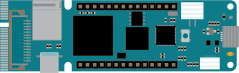
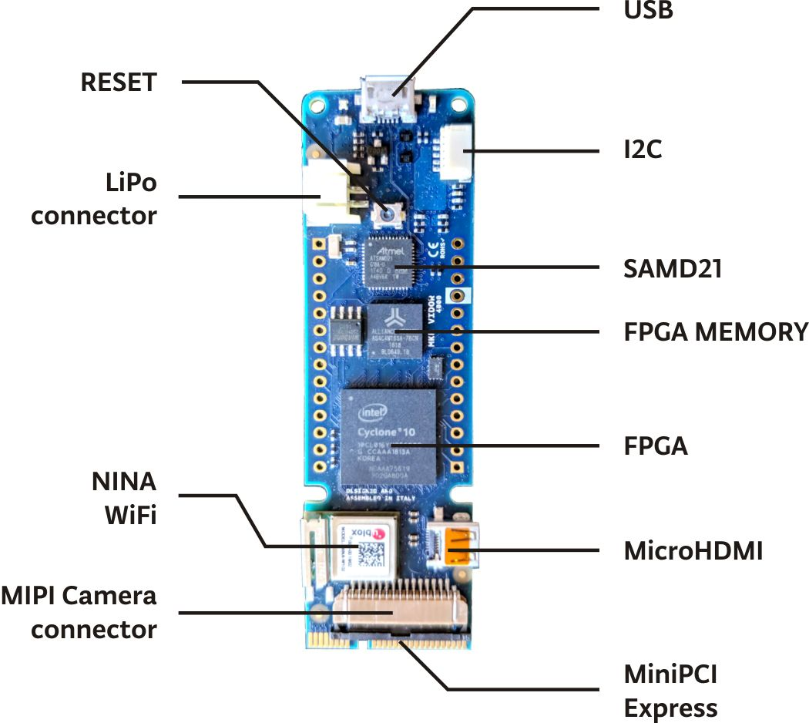
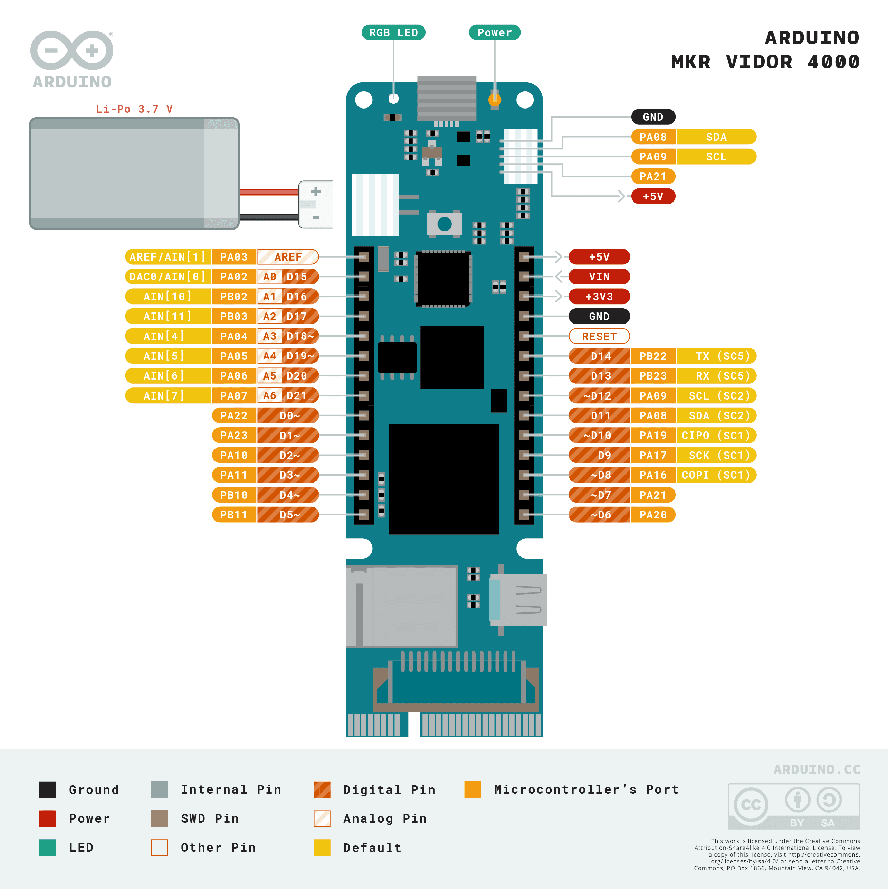
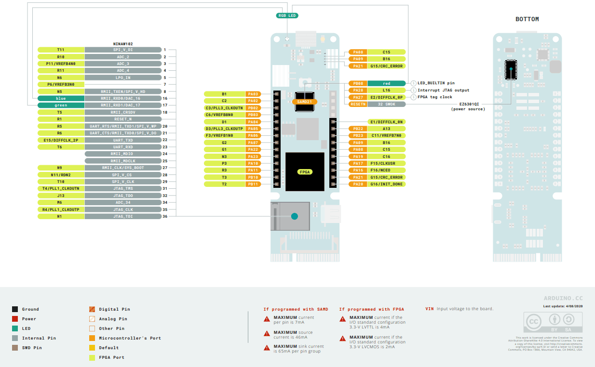

# Description 

The Arduino MKR Vidor 4000 is without a doubt the most advanced and featured-packed board in the MKR family and the only one with a FPGA chip on board. With a camera & HDMI connector, a Wi-Fi® / Bluetooth® module and up to 25 configurable pins, the board offers a huge range of possibilities to implement solutions in different environments and applications.

# Target Areas

FPGA, IoT, automation, industry, smart cities, signal processing

# CONTENTS

## Features

The MKR VIDOR 4000 is nothing less than a powerhouse of a board, packing a huge set of features into a small form factor. It features the Intel® Cyclone® 10CL016 for FPGA (Field Programming Gate Array), allowing you to configure a large set of pins to accommodate any of your preferences. But why stop there? The board also has a camera connector, a Micro HDMI connector, Wi-Fi / Bluetooth® connectivity through the NINA-W102 module, and cyber-security through the ECC508 crypto chip. Just like the other members of the MKR family, it uses the popular Cortex-M0 32-bit SAMD21 microprocessor.

### Microcontroller Block

The board's microcontroller is a low power Arm® Cortex®-M0 32-bit SAMD21, like in the other boards within the Arduino MKR family. The WiFi and Bluetooth® connectivity is performed with a module from u-blox, the NINA-W10, a low power chipset operating in the 2.4GHz range. On top of those, secure communication is ensured through the Microchip® ECC508 crypto chip. Besides that, you can find a battery charger, and a directionable RGB LED on-board.

<table>
    <thead>
        <tr style="text-align: middle;">
            <th width="25%">Component</th>
            <th colspan="2">Details</th>
        </tr>
    </thead>
	<tbody>
		<tr>
			<td rowspan="1">Microcontroller</th>
			<td colspan="2">SAMD21 Cortex®-M0+ 32bit low power ARM MCU</td>
		</tr>
		<tr>
			<td rowspan="1">USB connector</th>
			<td colspan="2">Micro USB (USB-B)</td>
		</tr>
		<tr>
			<td rowspan="6">Pins</th>
			<td rowspan="1">Built-in LED Pin</th>
			<td colspan="1">Pin 6</td>
		</tr>
		<tr>
			<td rowspan="1">Digital I/O Pins</th>
			<td colspan="1">x8</td>
		</tr>
		<tr>
			<td rowspan="1">Analog Input Pins</th>
			<td colspan="1">x7 (ADC 8/10/12 bit)</td>
		</tr>
		<tr>
			<td rowspan="1">Analog Output Pins</th>
			<td colspan="1">x1 (DAC 10 bit)</td>
		</tr>
		<tr>
			<td rowspan="1">PMW Pins</th>
			<td colspan="1">x13 (0 - 8, 10, 12, A3, A4)</td>
		</tr>
		<tr>
			<td rowspan="1">External interrupts</th>
			<td colspan="1">x10 (Pin 0, 1, 4, 5, 6, 7, 8,9, A1, A2)</td>
		</tr>
		<tr>
			<td rowspan="3">Connectivity</th>
			<td rowspan="1">Bluetooth®</th>
			<td colspan="1">Nina W102 uBlox module</td>
		</tr>
		<tr>
			<td rowspan="1">Wi-Fi®</th>
			<td colspan="1">Nina W102 uBlox module</td>
		</tr>
		<tr>
			<td rowspan="1">Secure element</th>
			<td colspan="1">ATECC508A</td>
		</tr>
		<tr>
			<td rowspan="3">Communication</th>
			<td rowspan="1">UART</th>
			<td colspan="1">Yes</td>
		</tr>
		<tr>
			<td rowspan="1">I2C</th>
			<td colspan="1">Yes</td>
		</tr>
		<tr>
			<td rowspan="1">SPI</th>
			<td colspan="1">Yes</td>
		</tr>
		<tr>
			<td rowspan="5">Power</th>
			<td rowspan="1">I/O Voltage</th>
			<td colspan="1">3.3 V</td>
		</tr>
		<tr>
			<td rowspan="1">Input Voltage (nominal)</th>
			<td colspan="1">5-7 V</td>
		</tr>
		<tr>
			<td rowspan="1">DC Current per I/O pin</th>
			<td colspan="1">7 mA</td>
		</tr>
		<tr>
			<td rowspan="1">Supported battery</th>
			<td colspan="1">Li-Po Single Cell, 3.7 V, 1024 mAh Minimum</td>
		</tr>
		<tr>
			<td rowspan="1">Battery connector</th>
			<td colspan="1">JST PH</td>
		</tr>
		<tr>
			<td rowspan="2">Clock speed</th>
			<td rowspan="1">Processor</th>
			<td colspan="1">48 MHz</td>
		</tr>
		<tr>
			<td rowspan="1">RTC</th>
			<td colspan="1">32.768 kHz</td>
		</tr>
		<tr>
			<td rowspan="2">Memory</th>
			<td rowspan="1">SAMD21G18A</th>
			<td colspan="1">256 KB Flash, 32 KB SRAM</td>
		</tr>
		<tr>
			<td rowspan="1">Nina W102 uBlox module</th>
			<td colspan="1">448 KB ROM, 520 KB SRAM, 2 MB Flash</td>
		</tr>
	</tbody>
</table>

### FPGA Block

The FPGA is the Intel® Cyclone® 10CL016. It contains 16K logic elements, 504 kB of embedded RAM, and x56 18x18 bits HW multipliers for high-speed DSP operations. Each pin can toggle at over 150 MHz and can be configured for functions such as UARTs, (Q)SPI, high-resolution/high-frequency PWM, quadrature encoder, I2C, I2S, Sigma Delta DAC, etc.

<table>
    <thead>
        <tr style="text-align: middle;">
            <th width="25%">Component</th>
            <th colspan="2">Details</th>
        </tr>
    </thead>
    <tbody>
        <tr>
          <td rowspan="1">FPGA</th>
          <td colspan="2">Intel® Cyclone® 10CL016</td>
        </tr>
        <tr>
          <td rowspan="1">PCI</th>
          <td colspan="2">Mini PCI Express port with programmable pins</td>
        </tr>
        <tr>
          <td rowspan="1">Camera Connector</th>
          <td colspan="2">MIPI camera connector</td>
        </tr>
        <tr>
          <td rowspan="1">Video Output</th>
          <td colspan="2">Micro HDMI</td>
        </tr>
        <tr>
          <td rowspan="1">Circuit Operating Voltage</th>
          <td colspan="2">3.3 V</td>
        </tr>
        <tr>
          <td rowspan="1">Digital I/O Pins</th>
          <td colspan="2">22 headers + 25 Mini PCI Express</td>
        </tr>
        <tr>
          <td rowspan="1">PWM Pins</th>
          <td colspan="2">All Pins</td>
        </tr>
        <tr>
          <td rowspan="1">UART</th>
          <td colspan="2">Up to 7 (depends on FPGA configuration)</td>
        </tr>
        <tr>
          <td rowspan="1">SPI</th>
          <td colspan="2">Up to 7 (depends on FPGA configuration)</td>
        </tr>
        <tr>
          <td rowspan="1">I2C</th>
          <td colspan="2">Up to 7 (depends on FPGA configuration)</td>
        </tr>
        <tr>
          <td rowspan="1">DC Current per I/O Pin</th>
          <td colspan="2">4 or 8 mA</td>
        </tr>
        <tr>
          <td rowspan="1">Flash Memory</th>
          <td colspan="2">2 MB</td>
        </tr>
        <tr>
          <td rowspan="1">SDRAM</th>
          <td colspan="2">8 MB</td>
        </tr>
        <tr>
          <td rowspan="1">Clock Speed</th>
          <td colspan="2">48 MHz - up to 200 MHz</td>
        </tr>    
    </tbody>
</table>

The board comes with 8 MB of SRAM to support the FPGA operations on video and audio. The FPGA code is stored in a 2 MB QSPI Flash chip, of which 1 MB is allocated for user applications. It is possible to perform high-speed DSP operations for audio and video processing. Therefore, the Vidor includes a Micro HDMI connector for audio and video output and a MIPI camera connector for video input. All of the board's pins are driven both by SAMD21 and FPGA while respecting the MKR family format. Finally, there is a Mini PCI Express connector with up to x25 user-programmable pins that can be used for connecting your FPGA as a peripheral to a computer or to create your own PCI interfaces.

### Wireless Communication

  <table>
    <thead>
      <tr>
        <th>Component</th>
        <th>Details</th>
      </tr>
    </thead>
    <tbody>
      <tr>
        <td rowspan="2">Nina W102 uBlox module</td>
        <td>2.4 GHz Wi-­Fi® (802.11 b/g/n) support</td>
      </tr>
      <tr>
        <td>Bluetooth® 4.2 Low Energy dual-mode</td>
      </tr>
    </tbody>
  </table>

### Security

  <table>
    <thead>
      <tr>
        <th>Component</th>
        <th>Details</th>
      </tr>
    </thead>
    <tbody>
      <tr>
        <td rowspan="7">ATECC508A</td>
        <td>Secure boot process that verifies the authenticity and integrity of the firmware before it is loaded into the device</td>
      </tr>
      <tr>
        <td>Performs High-Speed Public Key (PKI) Algorithms</td>
      </tr>
      <tr>
        <td>NIST Standard P256 Elliptic Curve Support</td>
      </tr>
      <tr>
        <td>SHA-256 Hash Algorithm with HMAC Option</td>
      </tr>
      <tr>
        <td> Host and Client Operations</td>
      </tr>
      <tr>
        <td>256-bit Key Length</td>
      </tr>
      <tr>
        <td>Storage for up to 16 Keys</td>
      </tr>
    </tbody>
  </table>

### Related Products

- Arduino® MKR Family boards 
- Arduino® MKR Family Shields
- Arduino® MKD Family Carriers

**Note**: Check the Arduino® official documentation to know more about the compatibility and specifications of each of these products.

## Ratings

### Recommended Operating Conditions

The following table is a comprehensive guideline for the optimal use of the MKR Vidor, outlining typical operating conditions and design limits. The operating conditions of the Vidor are largely a function based on its component's specifications.

|         **Parameter**                            | **Min** | **Typ** | **Max** | **Unit** |
|:------------------------------------------------:|:-------:|:-------:|:-------:|:--------:|
|     USB Supply Input Voltage                     |    -    |   5.0   |    -    |     V    |
|     Battery Supply Input Voltage                 |    -    |   3.7   |    -    |     V    |
|     Supply Input Voltage                         |    -    |   5.0   |   6.0   |     V    |
|     Microprocessor Circuit Operating Voltage     |    -    |   3.3   |    -    |     V    |
|     FPGA Circuit Operating Voltage               |    -    |   3.3   |    -    |     V    |

## Functional Overview

The cores of the MKR Vidor are the SAMD21 Cortex®-M0+ microcontroller and the Intel® Cyclone® 10CL016 FPGA. The board also contains several peripherals connected to the microcontroller and the FPGA blocks.

****

### Pinout 

The basic pinout is shown in Figure 1.

****

The pinout of the main FPGA connections is shown in Figure 2.

****

Check the official Arduino® documentation to see the full pinout document and the schematics of the product.

### Power Supply

The MKR Vidor can be powered through one of these interfaces:

- **USB:** Micro USB-B port. Used to power the board at 5 V.
- **Vin:** This pin can be used to power the board with a regulated 5 V source. If the power is fed through this pin, the USB power source is disconnected. This is the only way you can supply 5 V (range is 5 V to maximum 6 V) to the board not using USB. The pin is only an INPUT.
- **5V:** This pin outputs 5 V from the board when powered from the USB connector or from the VIN pin of the board. It is unregulated and the voltage is taken directly from the inputs.
- **VCC:** This pin outputs 3.3 V through the on-board voltage regulator. This voltage is 3.3 V if USB or VIN is used.
- **Battery:** 3.7 V single-cell lithium-ion/lithium-polymer battery, connected through the onboard battery connector JST S2B-PH-SM4-TB(LF)(SN). Mating connector is JST PHR-2.

## Device Operation

### Getting Started - IDE

If you want to program your MKR Vidor while offline you need to install the Arduino® Desktop IDE **[1]**. To connect the MKR Vidor to your computer, you will need a Micro USB-B cable.

### Getting Started - Intel Cyclone HDL & Synthesis

If you want to use HDL Languages to design, synthesize and upload new circuits inside the Intel® Cyclone FPGA you need to install the official Intel® Quartus Prime software. Check the following documentation to know more **[2]**.

### Getting Started - Arduino Web Editor

All Arduino® devices work out-of-the-box on the Arduino® Web Editor **[3]** by just installing a simple plugin.

The Arduino® Web Editor is hosted online, therefore it will always be up-to-date with the latest features and support for all boards and devices. Follow **[4]** to start coding on the browser and upload your sketches onto your device.

### Getting Started - Arduino IoT Cloud

All Arduino® IoT enabled products are supported on Arduino® IoT Cloud which allows you to log, graph and analyze sensor data, trigger events, and automate your home or business.

### Sample Sketches

Sample sketches for MKR Vidor can be found either in the “Examples” menu in the Arduino® IDE or the “MKR Vidor Documentation” section of Arduino® **[5]**.

### Online Resources

Now that you have gone through the basics of what you can do with the device, you can explore the endless possibilities it provides by checking exciting projects on ProjectHub **[6]**, the Arduino® Library Reference **[7]** and the online store **[8]** where you will be able to complement your MKR Vidor product with additional extensions, sensors and actuators.

## Mechanical Information

### Board Dimensions

MKR Vidor board dimensions and weight are the following:

  <table>
    <tbody>
      <tr>
        <th rowspan="3">Dimensions & Weight</th>
        <td rowspan="1">Width</th>
        <td colspan="1">25 mm</td>
      </tr>
      <tr>
        <td rowspan="1">Length</th>
        <td colspan="1">83 mm</td>
      </tr>
      <tr>  
        <td rowspan="1">Weight</th>
        <td colspan="1">43.5 g</td>
      </tr>
    </tbody>
  </table>

The MKR Vidor has two 2.22 mm drilled mounting holes to provide for mechanical fixing.

## Certifications

### Declaration of Conformity CE DoC (EU)

We declare under our sole responsibility that the products above are in conformity with the essential requirements of the following EU Directives and therefore qualify for free movement within markets comprising the European Union (EU) and European Economic Area (EEA).

### Declaration of Conformity to EU RoHS & REACH 211 01/19/2021

Arduino boards are in compliance with RoHS 2 Directive 2011/65/EU of the European Parliament and RoHS 3 Directive 2015/863/EU of the Council of 4 June 2015 on the restriction of the use of certain hazardous substances in electrical and electronic equipment.

| **Substance**                          | **Maximum Limit (ppm)** |
|----------------------------------------|-------------------------|
| Lead (Pb)                              | 1000                    |
| Cadmium (Cd)                           | 100                     |
| Mercury (Hg)                           | 1000                    |
| Hexavalent Chromium (Cr6+)             | 1000                    |
| Poly Brominated Biphenyls (PBB)        | 1000                    |
| Poly Brominated Diphenyl ethers (PBDE) | 1000                    |
| Bis(2-Ethylhexyl} phthalate (DEHP)     | 1000                    |
| Benzyl butyl phthalate (BBP)           | 1000                    |
| Dibutyl phthalate (DBP)                | 1000                    |
| Diisobutyl phthalate (DIBP)            | 1000                    |

Exemptions: No exemptions are claimed.

Arduino Boards are fully compliant with the related requirements of European Union Regulation (EC) 1907 /2006 concerning the Registration, Evaluation, Authorization and Restriction of Chemicals (REACH). We declare none of the SVHCs (https://echa.europa.eu/web/guest/candidate-list-table), the Candidate List of Substances of Very High Concern for authorization currently released by ECHA, is present in all products (and also package) in quantities totaling in a concentration equal or above 0.1%. To the best of our knowledge, we also declare that our products do not contain any of the substances listed on the "Authorization List" (Annex XIV of the REACH regulations) and Substances of Very High Concern (SVHC) in any significant amounts as specified by the Annex XVII of Candidate list published by ECHA (European Chemical Agency) 1907 /2006/EC.

### Conflict Minerals Declaration

As a global supplier of electronic and electrical components, Arduino is aware of our obligations concerning laws and regulations regarding Conflict Minerals, specifically the Dodd-Frank Wall Street Reform and Consumer Protection Act, Section 1502. Arduino does not directly source or process conflict minerals such as Tin, Tantalum, Tungsten, or Gold. Conflict minerals are contained in our products in the form of solder, or as a component in metal alloys. As part of our reasonable due diligence, Arduino has contacted component suppliers within our supply chain to verify their continued compliance with the regulations. Based on the information received thus far we declare that our products contain Conflict Minerals sourced from conflict-free areas.

## FCC Caution

Any Changes or modifications not expressly approved by the party responsible for compliance could void the user’s authority to operate the equipment.

This device complies with part 15 of the FCC Rules. Operation is subject to the following two conditions:

1. This device may not cause harmful interference

2. This device must accept any interference received, including interference that may cause undesired operation.

**FCC RF Radiation Exposure Statement:**

1. This Transmitter must not be co-located or operating in conjunction with any other antenna or transmitter

2. This equipment complies with RF radiation exposure limits set forth for an uncontrolled environment

3. This equipment should be installed and operated with a minimum distance of 20 cm between the radiator and your body.

English:
User manuals for license-exempt radio apparatus shall contain the following or equivalent notice in a conspicuous location in the user manual or alternatively on the device or both. This device complies with Industry Canada license-exempt RSS standard(s). Operation is subject to the following two conditions:

1. This device may not cause interference

2. This device must accept any interference, including interference that may cause undesired operation of the device.

French:
Le présent appareil est conforme aux CNR d’Industrie Canada applicables aux appareils radio exempts de licence. L’exploitation est autorisée aux deux conditions suivantes:

1. L’ appareil nedoit pas produire de brouillage

2. L’utilisateur de l’appareil doit accepter tout brouillage radioélectrique subi, même si le brouillage est susceptible d’en compromettre le fonctionnement.

**IC SAR Warning:**

English:
This equipment should be installed and operated with a minimum distance of 20 cm between the radiator and your body.

French:
Lors de l’ installation et de l’ exploitation de ce dispositif, la distance entre le radiateur et le corps est d ’au moins 20 cm.

**Important:** The operating temperature of the EUT can’t exceed 85 °C and shouldn’t be lower than -40 °C.

Hereby, Arduino S.r.l. declares that this product is in compliance with essential requirements and other relevant provisions of Directive 2014/53/EU. This product is allowed to be used in all EU member states.

## Company Information

| **Company name** |                **Arduino SRL**               |
|:----------------:|:--------------------------------------------:|
|  Company address | Via Andrea Appiani, 25 - 20900 MONZA (Italy) |

## Reference Documentation
|        **Ref**                                      | **Link**                                                                                    |
|:---------------------------------------------------:|---------------------------------------------------------------------------------------------|
| Arduino IDE (Desktop)                               | https://www.arduino.cc/en/Main/Software                                                     |
| Getting Started With FPGAs Using the MKR Vidor 4000 | https://www.arduino.cc/en/Main/Software                                                     |
| Arduino IDE (Cloud)                                 | https://create.arduino.cc/editor                                                            |
| Arduino Cloud - Getting started                     | https://docs.arduino.cc/arduino-cloud/getting-started/iot-cloud-getting-started             |
| MKR Vidor Documentation                             | https://docs.arduino.cc/hardware/mkr-vidor-4000                                             |
| Project Hub                                         | https://create.arduino.cc/projecthub?by=part&part_id=11332&sort=trending                    |
| Library Reference                                   | https://www.arduino.cc/reference/en/                                                        |
| Online Store                                        | https://store.arduino.cc/                                                                   |
         

## Document Revision History

|  **Date**  | **Revision** |                       **Changes**                      |
|:----------:|:------------:|:------------------------------------------------------:|
| 07/09/2023 |       1      |                      First release                     |
