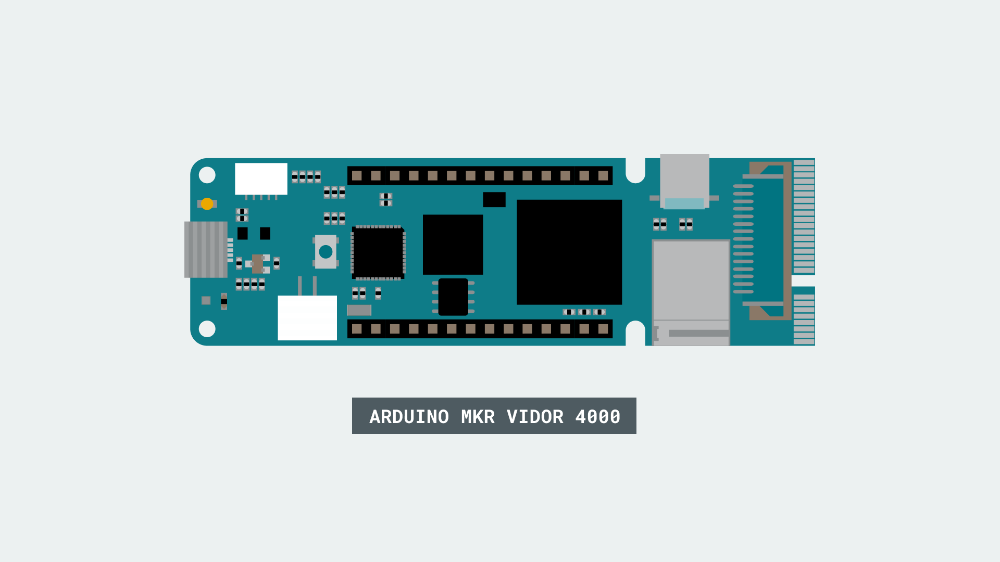

This example activates a compatible camera connected to the MIPI Camera Connector and routes the image in real time to the microHDMI connector. It is a very basic example that shows how simple may be the usage of the advanced features of the Arduino MKR Vidor 4000 board.

## Hardware Required

- [Arduino MKR Vidor 4000](https://store.arduino.cc/arduino-vidor-4000)
- Omnivision OV5647 camera
- microHDMI to HDMI cable or adaptor
- Monitor with HDMI input

## Circuit

There is no circuit for this example.



## Code

Include the VidorCamera library, which is part of VidorGraphics.
`#include "VidorGraphics.h"`
`#include "VidorCamera.h"`

You have a number of functions available to create and manage the camera stream.

- `VidorCamera()` - initialize object

- `int begin()` - initialize cam and starts streaming; return 0 if failed

- `int end()` - stops streaming and shutdown camera

- `int enableStream()` - explicitly enable stream

- `int disableStream()` - exclicitely disable stream

- `int modelDetect(void)` - detect the attached camera model

In our example we create the object `vcam` and then we simply enable I2C communication and initialize the camera with the `vcam.begin()` function. Please note that this function returns a value and we use it to print out an error message if initialization fails.

When the video stream is active and it is routed to the HDMI port, you can stop the video opening the serial monitor and typing **STOP**. This activates the `vcam.end();` function.

The complete sketch is below and you find it in the examples from Libraries, under VidorGraphics :

```arduino

#include "VidorGraphics.h"
#include "VidorCamera.h"

VidorCamera vcam;

void setup() {

  Serial.begin(9600);


  // wait for the serial monitor to open,

  // if you are powering the board from a USB charger remove the next line

  while (!Serial) {}

  if (!FPGA.begin()) {

    Serial.println("Initialization failed!");

    while (1) {}

  }

  // begin() enables the I2C communication and initializes the camera

  if (!vcam.begin()) {

    Serial.println("Camera begin failed");

    while (1) {}

  }

  delay(4000);

  Serial.println("Power On");

  // The camera should be on now, streaming to the HDMI output
}

void loop()
{

  // Wait for the user input to stop the camera

  String res = Serial.readStringUntil('\n');

  if (res.indexOf("STOP") > 0) {

    vcam.end();

  }
}
```


**Last revision 2018/07/22 by SM**
