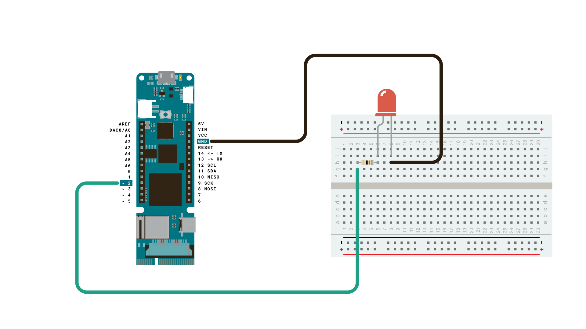
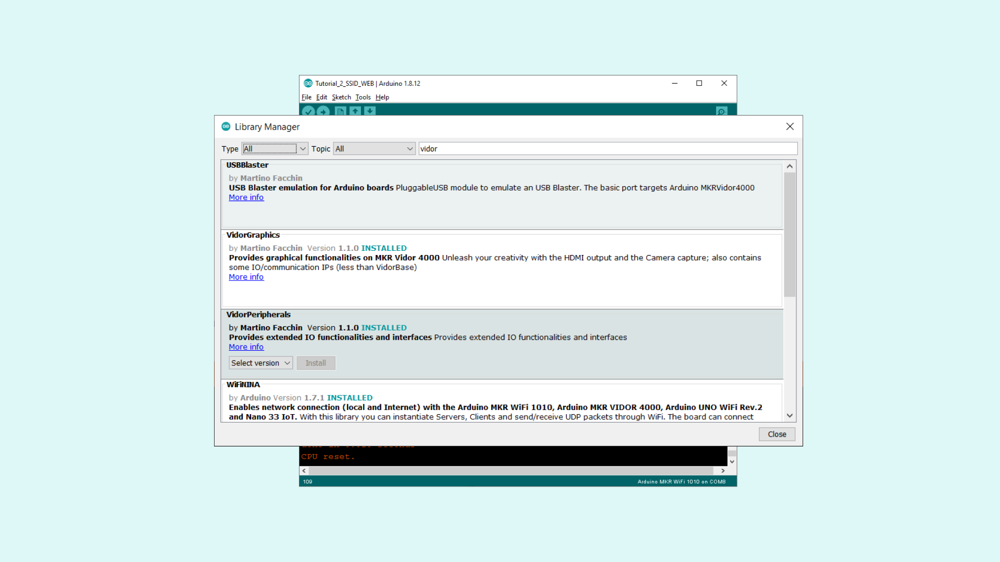
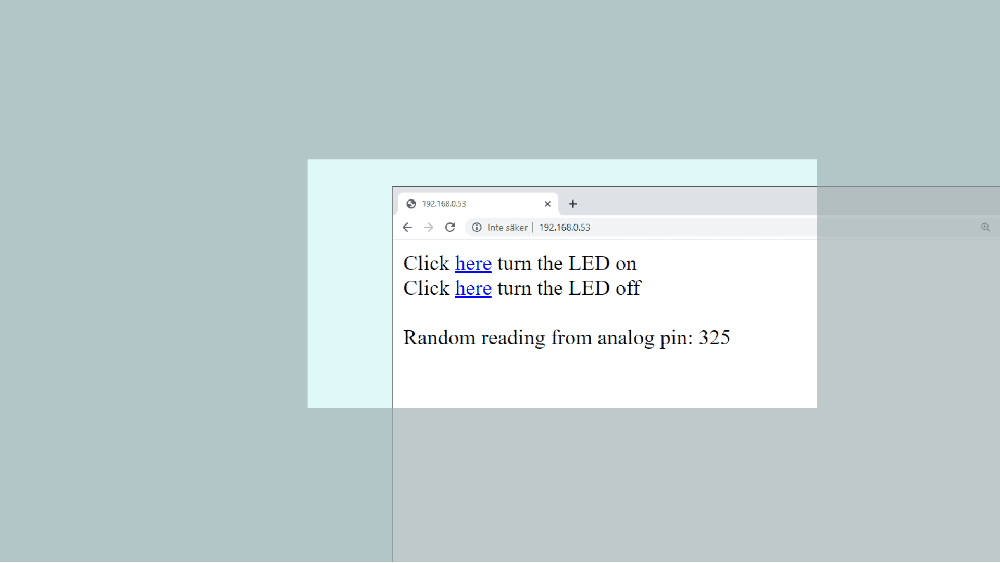

## Introduction

In this tutorial, we will use the MKR Vidor 4000 board to set up a simple web server, using the **WiFiNINA** library. The web server will be used as an interface for our board, where we will create two buttons to remotely turn ON or OFF an LED.

This tutorial is a great starting point for any maker interested in making applications connected to the Internet.

## Hardware & Software Needed

- Arduino IDE ([online](https://create.arduino.cc/) or [offline](https://www.arduino.cc/en/main/software)).
- [WiFiNINA](https://www.arduino.cc/en/Reference/WiFiNINA) library.
- [VidorPeripherals](https://github.com/vidor-libraries/VidorPeripherals) library.
- MKR Vidor 4000 ([link to store](https://store.arduino.cc/arduino-mkr-vidor-4000)).
- Generic LED
- 82 ohm resistor
- Breadboard
- Jumper wires

### Circuit

Follow the wiring diagram below to connect the LED to the MKR Vidor 4000 board.



___

## Let's Start

This tutorial barely uses any external hardware, except an LED that we will control remotely. However, the most interesting aspect lies in the library we are going to use: **WiFiNINA**. This library can be used for many different connectivity projects, where it allows us to connect to WiFi, make GET requests and - as we will explore in this tutorial - to create a web server.

**1.** First, let's make sure we have the drivers installed. If we are using the Cloud Editor, we do not need to install anything. If we are using an offline editor, we need to install it manually. This can be done by navigating to **Tools > Board > Board Manager...**. Here we need to look for the **Arduino SAMD boards (32-bits Arm® Cortex®-M0+)** and install it. 

**2.** Now, we need to install the library needed. If we are using the Cloud Editor, there is no need to install anything. If we are using an offline editor, simply go to **Tools > Manage libraries..**, and search for **WiFiNINA** and install it.

**3.** We will also need to add an additional library, called **VidorPeripherals**. Search for it in the manage libraries and install it. The author of this library is Martino Facchin.



**4.** We can now take a look at some of the core functions of this sketch:

- `char ssid[] = ""` - stores network name.
- `char pass[] = ""` - stores network password.
- `WiFi.begin(ssid, pass)` connects to Wi-Fi with credentials.
- `WiFiServer server(80)` - creates a server that listens for incoming connections on the specified port.
- `WiFiClient client` - creates a client that can connect to to a specified internet IP address.
- `server.begin()` - tells the server to begin listening for incoming connections.
- `client.connected` - checks for connected clients.
- `client.available` - checks for available data.
- `client.read` - reads the available data.
- `client.print()` - print something to the client (e.g. html code).
- `client.stop()` - closes the connection.

The sketch can be found in the snippet below. It is very similar to the sketch found in **File > Examples > WiFiNINA > SimpleWebServerWiFi**, with only minor modifications.

Upload the code to the board, and make sure the right board and port are selected.

```arduino
#include <WiFiNINA.h>

char ssid[] = "";             //  your network SSID (name) between the " "
char pass[] = "";      // your network password between the " "
int keyIndex = 0;                 // your network key Index number (needed only for WEP)
int status = WL_IDLE_STATUS;      //connection status
WiFiServer server(80);            //server socket

WiFiClient client = server.available();

int ledPin = 2;

void setup() {
  Serial.begin(9600);
  pinMode(ledPin, OUTPUT);
  while (!Serial);
  
  enable_WiFi();
  connect_WiFi();

  server.begin();
  printWifiStatus();

}

void loop() {
  client = server.available();

  if (client) {
    printWEB();
  }
}

void printWifiStatus() {
  // print the SSID of the network you're attached to:
  Serial.print("SSID: ");
  Serial.println(WiFi.SSID());

  // print your board's IP address:
  IPAddress ip = WiFi.localIP();
  Serial.print("IP Address: ");
  Serial.println(ip);

  // print the received signal strength:
  long rssi = WiFi.RSSI();
  Serial.print("signal strength (RSSI):");
  Serial.print(rssi);
  Serial.println(" dBm");

  Serial.print("To see this page in action, open a browser to http://");
  Serial.println(ip);
}

void enable_WiFi() {
  // check for the WiFi module:
  if (WiFi.status() == WL_NO_MODULE) {
    Serial.println("Communication with WiFi module failed!");
    // don't continue
    while (true);
  }

  String fv = WiFi.firmwareVersion();
  if (fv < "1.0.0") {
    Serial.println("Please upgrade the firmware");
  }
}

void connect_WiFi() {
  // attempt to connect to Wifi network:
  while (status != WL_CONNECTED) {
    Serial.print("Attempting to connect to SSID: ");
    Serial.println(ssid);
    // Connect to WPA/WPA2 network. Change this line if using open or WEP network:
    status = WiFi.begin(ssid, pass);

    // wait 10 seconds for connection:
    delay(10000);
  }
}

void printWEB() {

  if (client) {                             // if you get a client,
    Serial.println("new client");           // print a message out the serial port
    String currentLine = "";                // make a String to hold incoming data from the client
    while (client.connected()) {            // loop while the client's connected
      if (client.available()) {             // if there's bytes to read from the client,
        char c = client.read();             // read a byte, then
        Serial.write(c);                    // print it out the serial monitor
        if (c == '\n') {                    // if the byte is a newline character

          // if the current line is blank, you got two newline characters in a row.
          // that's the end of the client HTTP request, so send a response:
          if (currentLine.length() == 0) {

            // HTTP headers always start with a response code (e.g. HTTP/1.1 200 OK)
            // and a content-type so the client knows what's coming, then a blank line:
            client.println("HTTP/1.1 200 OK");
            client.println("Content-type:text/html");
            client.println();
           
            //create the buttons
            client.print("Click <a href=\"/H\">here</a> turn the LED on<br>");
            client.print("Click <a href=\"/L\">here</a> turn the LED off<br><br>");
            
            int randomReading = analogRead(A1);
            client.print("Random reading from analog pin: ");
            client.print(randomReading);
           
            
            

            // The HTTP response ends with another blank line:
            client.println();
            // break out of the while loop:
            break;
          }
          else {      // if you got a newline, then clear currentLine:
            currentLine = "";
          }
        }
        else if (c != '\r') {    // if you got anything else but a carriage return character,
          currentLine += c;      // add it to the end of the currentLine
        }

        if (currentLine.endsWith("GET /H")) {
        digitalWrite(ledPin, HIGH);        
        }
        if (currentLine.endsWith("GET /L")) {
        digitalWrite(ledPin, LOW);       
        }

      }
    }
    // close the connection:
    client.stop();
    Serial.println("client disconnected");
  }
}
```


## Testing It Out

Once we have successfully uploaded the code to the board, open the Serial Monitor and it should look like the following image:


Copy the IP address and enter it in a browser. Now, we should see a very empty page with two links at the top left that says **"Click here to turn the LED on"** and **"Click here to turn the LED off"**.



When interacting with the links, you should see the LED, connected to pin 2, turn on and off depending on what you click. Now we have successfully created a way of interacting with our MKR Vidor 4000 remotely.

### Troubleshoot

If the code is not working, there are some common issues we might need to troubleshoot:
- We have not updated the latest firmware for the board.
- We have not installed the Board Package required for the board.
- We have not installed the **WiFiNINA** library.
- We have entered the SSID and PASS incorrectly: remember, it is case sensitive.
- We have not selected the right port to upload: depending on what computer we use, sometimes the board is duplicated. By simply restarting the editor, this issue can be solved.

## Conclusion

In this tutorial, we learned how to create a basic web interface from scratch. We learned how to control an LED remotely, and how to display the value of an analog pin in the browser as well. Using this example, we can build much more complex projects, and if you are familiar with both HTML and CSS, you can create some really cool looking interfaces! If you are new to HTML and CSS, there are plenty of online guides that can guide you, you can visit [w3schools](https://www.w3schools.com/) or [codecademy](https://www.codecademy.com/) for many tips and tricks.

>**Tip:** Check out [fontawesome](https://fontawesome.com/) to get access to thousands of free icons that you can customize your local web server with!
