**Tutorial by [Daniel Hertz](https://www.nerdhut.de/)**, originally published on [Maker.pro](https://maker.pro/arduino/tutorial/how-to-program-the-arduino-mkr-vidor-4000s-fpga-with-intel-quartus-ide)

We covered how to [get started](/tutorials/mkr-vidor-4000/VidorGSVHDL) with the [Arduino MKR Vidor 4000](https://store.arduino.cc/arduino-vidor-4000), showing you how to configure the [FPGA](https://www.altera.com/content/dam/altera-www/global/en_US/pdfs/literature/hb/cyclone-10/c10lp-51001.pdf) on the board. For that purpose, we used a [pre-compiled file](https://content.arduino.cc/assets/SketchVidorFPGA.zip).

In this article, we will introduce you to the basics of working with the [Quartus](https://fpgasoftware.intel.com/18.1/?edition=lite&amp;platform=windows), the default IDE that comes with the FPGA and show you the necessary steps to create a basic Verilog project that can be compiled and uploaded to the Arduino.

## Quartus Installation and First Launch

During the set-up process, you'll be asked to install support files for different Intel FPGAs. However, don't install any boards for now. Instead, navigate to Intel's download page and search for the FPGA family you want to use. Make sure to select the same version of Quartus that you installed on your computer:

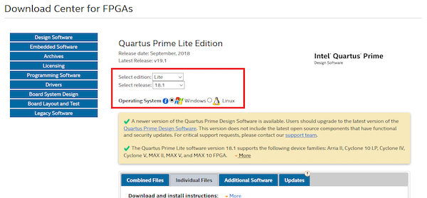

Then, scroll down and select **Cyclone V device support** if you're using the Arduino MKR Vidor 4000. For now, just download the support files and wait for the installation of the IDE to finish.

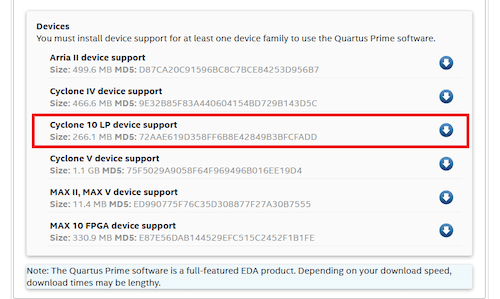

Once it's done, launch the device installer that came with the IDE. In it, select the folder where you just saved the support files. On the next page, pick the devices you want to install.

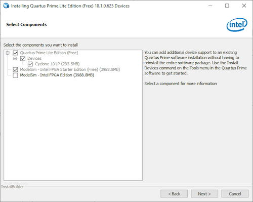

When the assistant is done, start the Quartus IDE.

## User Interface Basics

The user interface consists of six main elements in its default configuration.

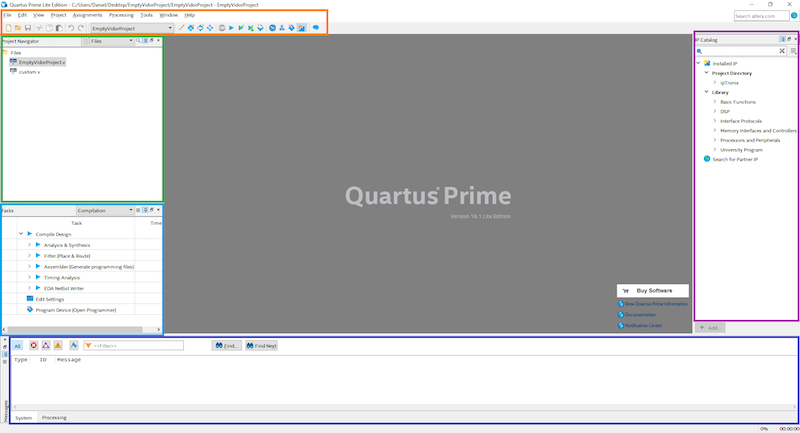

- **Main menu-bar** (orange)

- **Project Navigator** (green): This displays your project's hierarchy and a list of source files it contains.

- **Tasks** (light-blue): This section shows the status of the design and it can be used to run parts of the design flow.

- **Messages** (dark-blue): This panel outputs messages from each task you run, which can also be filtered by category.

- **IP catalog** (purple): This can be used to search and select IPs for your design. IPs (Intellectual Properties) are pre-built blocks for common recurring tasks, like communication protocols and signal generation.

- **Main work area** (middle of the screen)

## How to Set Up a New Project

Launch the project wizard from the main menu-bar.

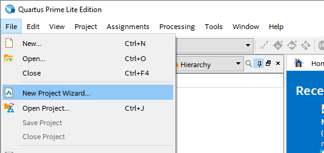

The assistant will take you through the process step by step. On the first screen, simply click Next. Then, enter your project's name and the name of the top-level design entity.

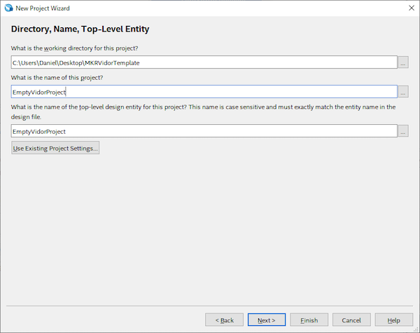

On the third screen, choose **Empty Project** and click next. Skip the next screen, as we will add files to the project later. The fifth pane requires you to select the FPGA you're using. In my case, it's the **10CL016YU256C8G**.

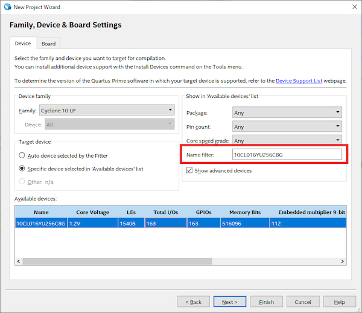

The exact model number is printed on the chip. Skip the sixth screen for now. This pane is only needed if you use other programs outside of the Quartus Toolchain that you need to integrate into the compile process. On the last screen, review the settings and click finish.

## I/O Pin Assignment

Once the new project is created, launch the Pin Planner.

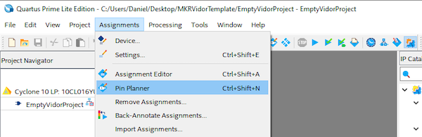

You should see something similar to the screenshot below. Note that, at the moment, no pins are assigned.

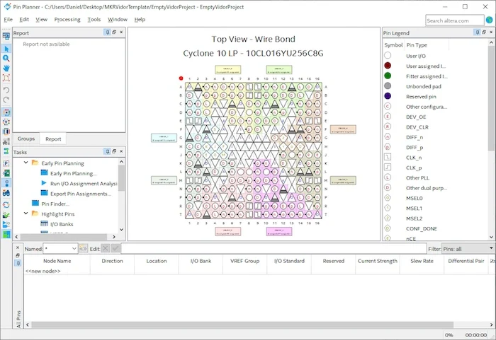

If you own a supported development board, you can load the pin assignments from a preset. Consult your device's manual for further information.

In my case, the pin assignment table was available from this [official Arduino repository](https://github.com/vidor-libraries/VidorFPGA/). Once you load it into your project and look at the pin planner, you should see something similar to this:

## Loading and Creating Files

As you saw in the previous section, it's possible to add external files, allowing the project to use them. To keep this article short, I'll use the data provided by Arduino. Download the following elements from their GitHub repository:

- [Pin mapping](https://github.com/vidor-libraries/VidorBitstream/tree/release/constraints/MKRVIDOR4000)
- [Pin IP folder](https://github.com/vidor-libraries/VidorFPGA/tree/master/ip)

The first element is the pin mapping. The second one contains their IPs you can use. Copy the files into the project folder. It should now look similar to this:

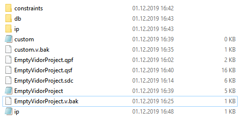

Then, in Quartus, link the newly copied files to your project so that the IDE can locate them. To do this, double click the files node in the project navigator.

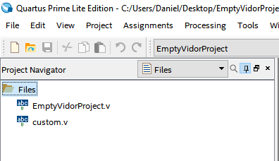

A new window will pop up. In it, select the aforementioned files.

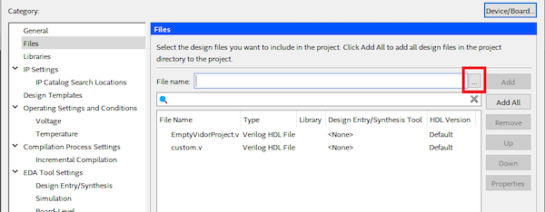

When done correctly, the IP catalog should now list the imported elements.

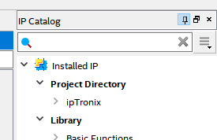

When everything is set up, create a new Verilog file that will serve as your top-level entity. Select **New** and then **File** from the main menu bar. In the window that opens up, choose **Verilog HDL File** and click OK.

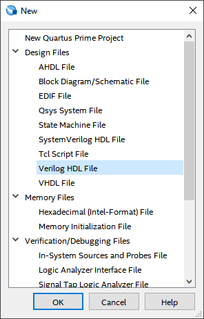

When you first save this file, make sure to enter the name that you chose as the top-level entity earlier. Then, create a second file that'll contain your custom Verilog code, and save it as **custom.v**. Paste the contents of the [Vidor FPGA Github](https://github.com/vidor-libraries/VidorFPGA/blob/master/projects/MKRVIDOR4000_template/MKRVIDOR4000_top.v) into your file and make sure to change the module name, if necessary.

## How to Start the Compilation Process

You should now be able to compile the entire project without any problems. To do so, you can either double-click the **Compile Design** task or you can use this button in the top menu bar (Shortcut: CTRL + L):

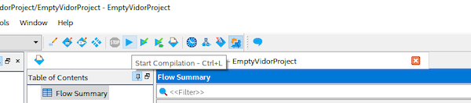

## Uploading the Code

Unfortunately, Quartus can't upload the compiled files to the Vidor directly. However, I demonstrated how you can send the compiled project to the board in the [Getting Started with Arduino MKR Vidor 4000](https://arduino.cc/en/Tutorial/VidorGSVHDL) article.

You can find all of the Empty Vidor Project files by [following the link](https://content.arduino.cc/assets/EmptyVidorProject.zip).

## Vidor 4000's FPGA Is Ready to Go!

This tutorial introduced you to the absolute basics of the Intel Quartus IDE. After reading it, you should be able to create a new project, link the pins of your FPGA, create new HDL files, import existing files, and compile your project. For additional tutorials, visit the Intel training catalog.
