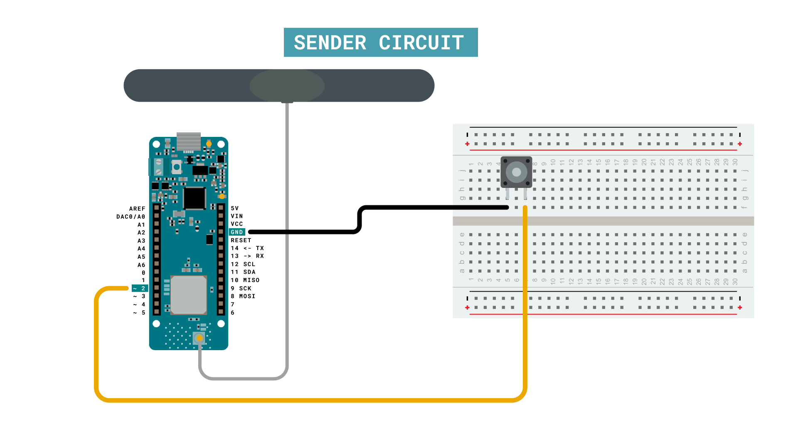
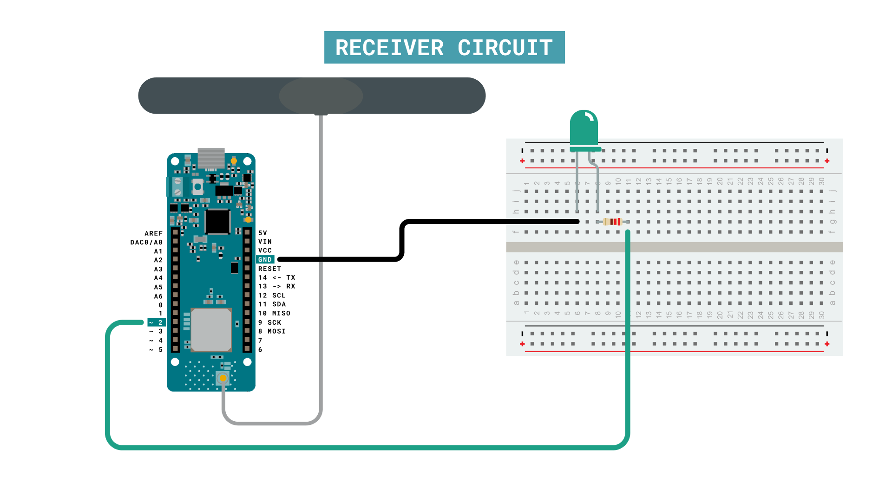

In this tutorial, we will set up two Arduino MKR WAN 1300 to host a remote LED control. One board will be set up as a sender with a pushbutton that when it is pressed, an LED on the other board will turn on or off. 
 
We will use the **LoRa** library for the communication, and we will not use any external service. 
___

## Hardware & Software Needed

- Arduino IDE ([online](https://create.arduino.cc/) or [offline](https://www.arduino.cc/en/main/software)).
- LoRa library installed, see the [github repository](https://github.com/sandeepmistry/arduino-LoRa).
- 2x [Arduino MKR WAN 1300](https://store.arduino.cc/mkr-wan-1300).
- 2x [Antenna](https://store.arduino.cc/antenna).
- 1x Pushbutton.
- 1x Generic LED.
- Jumper wires.
- Breadboard(s).
- 2x Micro USB cable.

### Circuit

Follow the wiring diagrams below to create the circuits for the sender and receiver boards. 

### Sender Circuit



### Receiver Circuit



___

## Let's Start

In this tutorial, we will achieve a basic trigger over the LoRa® network. When we press a button on one of the MKR WAN 1300 boards, an LED will light up on another. This is quite a simple setup, but it can be useful for long range, low power communication! 

But let's take a look at what we need to include in the code. As we are using two different boards, we will also need to create two separate sketches.

**To create the sender sketch, we will have to do the following steps:**

- Initialize the **SPI** and **LoRa** libraries.
- Create a counter variable.
- Set the radio frequency to 868E6 (Europe) or 915E6 (North America).
- Create an if statement that checks if the button is pressed.
- If button is pressed, begin a packet, and print the text "button pressed".
- End packet.
- Increase counter each loop and print it in Serial Monitor.

**To create the receiver sketch, we will have to do the following steps:**

- Initialize the **SPI** and **LoRa** libraries.
- Create a string with the message "button pressed" stored.
- Set the radio frequency to 868E6 (Europe) or 915E6 (North America).
- Create a function to parse incoming packet.
- Check if incoming string matches string we have created.
- Each time string matches, switch a boolean.
- Use boolean as a trigger to turn an LED on or off.

## Creating the Program

**1.** First, let's make sure we have the drivers installed. If we are using the Web Editor, we do not need to install anything. If we are using an offline editor, we need to install it manually. This can be done by navigating to **Tools > Board > Board Manager...**. Here we need to look for the **Arduino SAMD boards (32-bits Arm® Cortex®-M0+)** and install it. 

**2.** Now we need to download the **LoRa** library from [this repository](https://github.com/sandeepmistry/arduino-LoRa), where you can install it by navigating to **Sketch > Include Library > Add .ZIP Library...** in the offline IDE. 

### Programming the Sender

In the initialization we will include the **SPI** and **LoRa** libraries. We will then create the `counter` variable to track how many times we have pressed the button. Next, we will create the `button` and `buttonState` variables, used to assign the pushbutton to pin 2, and to read the state of it.

```arduino
#include <SPI.h>
#include <LoRa.h>

int counter = 0;
int button = 2;
int buttonState;
```

In the `setup()` we will first define the `button` pin as an `INPUT_PULLUP`. We will then begin serial communication, where we will use the command `while(!Serial);` to prevent the program from running until we open the Serial Monitor.

We will then initialize the **LoRa** library, where we will set the radio frequency to 868E6, which is used in Europe for LoRa® communication. If we are located in North America, we need to change this to 915E6.

```arduino
void setup() {
  pinMode(button, INPUT_PULLUP);

  Serial.begin(9600);

  while (!Serial);
  Serial.println("LoRa Sender");

  if (!LoRa.begin(868E6)) {
    Serial.println("Starting LoRa failed!");
    while (1);
  }

  delay(1000);
}
```

In the `loop()` we start by reading the button, and store the state in the `buttonState` variable.

If the button is pressed, we begin a packet by using the command, `LoRa.beginPacket()`. We then print the message "button pressed", which is done by using the `LoRa.print()` function. We then broadcast the package, using the `LoRa.endPacket()` command. 

```arduino
void loop() {
  buttonState = digitalRead(button);

  if (buttonState == LOW) {
    // send packet
    LoRa.beginPacket();
    LoRa.print("button pressed");
    LoRa.endPacket();
    counter++;
    Serial.print("Sending packet: ");
    Serial.println(counter);
    delay(500);
  }
}

```

### Programming the Receiver

In the initialization we will first include the **SPI** and **LoRa** libraries. Then we will create two strings: one empty, and one with the message "button pressed" stored. The `contents` string will be used to store incoming data, and the `buttonPress` string will be used to compare the contents with the incoming data.

We then create the boolean `x`, which will switch from true to false each time `buttonPress` matches `contents`. We will also assign the `led` variable to pin 2. 

```arduino

#include <SPI.h>
#include <LoRa.h>

String contents = "";
String buttonPress = "button pressed";
bool x;

int led = 2;
```

In the `setup()` we will first define the `led` pin as an output. We will then begin serial communication, where we will use the command `while(!Serial);` to prevent the program from running until we open the Serial Monitor.

We will then initialize the **LoRa** library, where we will set the radio frequency to 868E6, which is used in Europe for LoRa® communication. If we are located in North America, we need to change this to 915E6.

```arduino
void setup() {

  pinMode(led, OUTPUT);
  Serial.begin(9600);
  while (!Serial);
  //Wire.begin();
  Serial.println("LoRa Receiver");

  if (!LoRa.begin(868E6)) {
    Serial.println("Starting LoRa failed!");
    while (1);
  }
}
```

Inside the `loop()`, we will not be creating any packets. Instead, we will listen to incoming ones. This is done by first using the command `int packetSize = LoRa.parsePacket();`, and then checking for an incoming packet. If a packet comes in, it is then stored in the `contents` string. After that, we also check the RSSI (Received Signal Strength Indication), and print in the Serial Monitor.

We then compare the `contents` string to the `buttonPress` string. If it matches, we switch the `x` variable by using the command `x = !x;`. A conditional then checks whether `x` is `true` or `false` and turns on or off the LED attached to pin 2. 

Finally, after the action has happened, we reset the `contents` string, otherwise, we would just pile up the messages inside the string.

```arduino
void loop() {
  // try to parse packet
  int packetSize = LoRa.parsePacket();
  if (packetSize) {
    // received a packet
    Serial.print("Received packet '");

    // read packet
    while (LoRa.available()) {  
      contents += (char)LoRa.read();
    }
    
    // print RSSI of packet
    Serial.print("' with RSSI ");
    Serial.println(LoRa.packetRssi());
    Serial.println(contents);

    if(contents.equals(buttonPress)){
      x = !x;
    }

    if(x == true) {
      digitalWrite(led, HIGH);
      Serial.println("led on");
    }
    else {
      digitalWrite(led, LOW);
      Serial.println("led off");
    }
    
    contents = "";
  }
}
```

## Complete Code

If you choose to skip the code building section, the complete code can be found below:

### Sender Code

```arduino
#include <SPI.h>
#include <LoRa.h>

int counter = 0;
int button = 2;
int buttonState;

void setup() {
  pinMode(button, INPUT_PULLUP);
  
  Serial.begin(9600);
  
  while (!Serial);
  Serial.println("LoRa Sender");
  
  if (!LoRa.begin(868E6)) {
    Serial.println("Starting LoRa failed!");
    while (1);
  }
  delay(1000);
}

void loop() {
  buttonState = digitalRead(button);
  
  if (buttonState == LOW) {
    // send packet
    LoRa.beginPacket();
    LoRa.print("button pressed");
    LoRa.endPacket();
    counter++;
    Serial.print("Sending packet: ");
    Serial.println(counter);
    delay(500);
  }
}
```

### Receiver Code

```arduino
#include <SPI.h>
#include <LoRa.h>

String contents = "";
String buttonPress = "button pressed";
bool x;

int led = 2;

void setup() {

  pinMode(led, OUTPUT);
  Serial.begin(9600);
  while (!Serial);
  //Wire.begin();
  Serial.println("LoRa Receiver");

  if (!LoRa.begin(868E6)) {
    Serial.println("Starting LoRa failed!");
    while (1);
  }
}

void loop() {
  // try to parse packet
  int packetSize = LoRa.parsePacket();
  if (packetSize) {
    // received a packet
    Serial.print("Received packet '");

    // read packet
    while (LoRa.available()) {  
      contents += (char)LoRa.read();
    }
    
    // print RSSI of packet
    Serial.print("' with RSSI ");
    Serial.println(LoRa.packetRssi());
    Serial.println(contents);

    if(contents.equals(buttonPress)){
      x = !x;
    }

    if(x == true) {
      digitalWrite(led, HIGH);
      Serial.println("led on");
    }
    else {
      digitalWrite(led, LOW);
      Serial.println("led off");
    }
    
    contents = "";
  }
}
```

## Upload Sketch and Testing the Program

Once we are finished with the coding, we can upload the sketches to each board. The easiest way to go forward is to have two separate computers, as we will need to have the Serial Monitor open for both boards. Alternatively, we can use a Serial interfacing program called Putty. But for demonstration purposes, it is good to use two computers. This way, you can move the boards further away from each other while testing the signal. 

### Sending Package

After we have uploaded the code to the **sender**, we need to open the Serial Monitor to initialize the program. If everything is working, it will start listening for button presses. If the button is pressed, it will print the message `"Sending packet: x" `where `x` represents the number of times the packet has been sent. 


### Receiving Package

After we have uploaded the code to the **receiver**, we need to open the Serial Monitor to initialize the program. If everything works, we should now pick up any package we send from the other device. The package we receive should contain the message "button pressed", followed by RSSI (Received Signal Strength Indication). The closer this value is to 0, the stronger the signal are. After we receive the value, the LED will turn on or off, and print its state in the Serial Monitor.


## Experimenting with This Setup

Now that we have communication between the boards, we can do a simple test with the signal. If we move the sender device away from the receiver device, we will start noticing changes in the RSSI. For example, while conducting this test, the sender device was moved around 20 meters away from the receiver, which decreased the RSSI to about -60. 

### Troubleshoot

If the code is not working, there are some common issues we might need to troubleshoot:

- Antenna is not connected properly.
- The radio frequency is wrong. Remember, 868E6 for Europe and 915E6 for Australia & North America.
- We have not opened the Serial Monitor.
- We are using the same computer for both boards without a serial interfacing program.


## Conclusion

This tutorial demonstrates a simple, yet powerful communication setup, featuring two MKR WAN 1300 boards and how to remotely control an LED using LoRa®.

