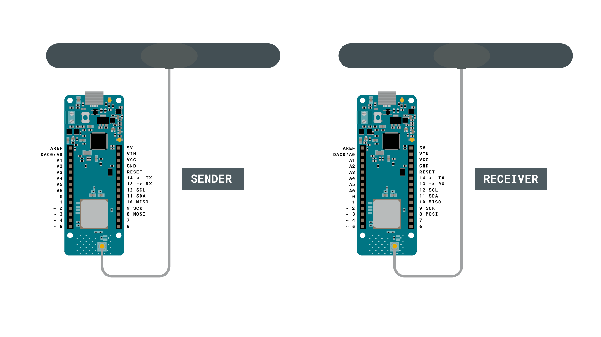
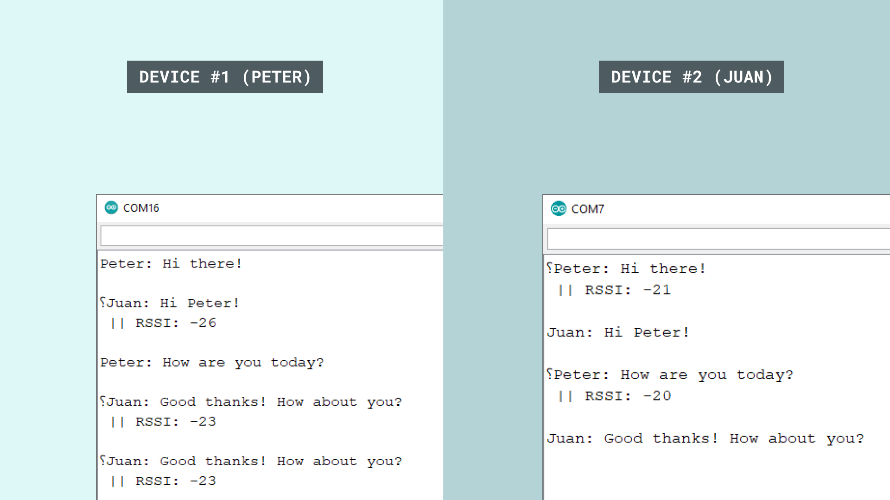
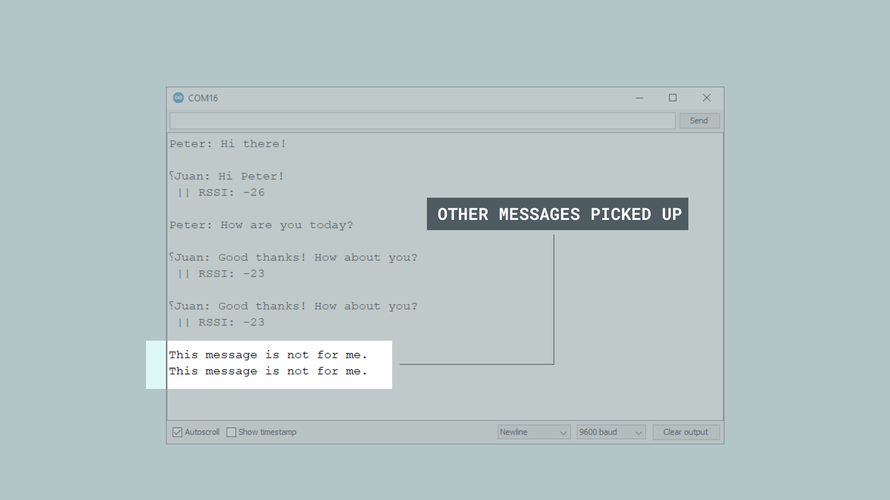

In this tutorial, we will use two MKR WAN 1300's to set up a simple message service over the LoRa® network. This communication will be achieved through the Serial Monitor, where you can send and receive messages directly.

We will use the **LoRa** library to for the communication, and we will not use any external services. Additionally, we will also create specific addresses for each board. This will help ensure that the messages that we send and receive are only displayed on the corresponding devices.

Special thanks to [Sandeep Mistry](https://github.com/sandeepmistry) for creating the [LoRa library](https://github.com/sandeepmistry/arduino-LoRa).

___

## Hardware & Software Needed

-   2x [Arduino MKR WAN 1300](https://store.arduino.cc/mkr-wan-1300).
-   2x [Antenna](https://store.arduino.cc/antenna).
-   2x Micro USB cable .
-   2x Computers.
-   Arduino IDE (offline and online versions available).
-   Arduino SAMD core installed ([follow this link for instructions](/software/ide-v2/tutorials/ide-v2-board-manager)).
-   **LoRa** library installed (see the [github repository](https://github.com/sandeepmistry/arduino-LoRa)).


### Circuit

Follow the wiring diagrams below to create the circuits for the sender and receiver boards.



___

## Let's Start

In this tutorial, we will create a message service that utilizes the LoRa® network. In our other tutorials for the MKR WAN 1300 board, we have typically set up one board as a sender, and one as a receiver. Now, we will instead set them up as **both sender and receiver**. This will allow us to both send and receive packets simultaneously, which works very similar to any messenger service you might be used to!

To do this, we basically only need to create one sketch that we will upload to each of the MKR WAN 1300 boards, with only some minor adjustments made in the code for each.

In the code, we will have to do the following to make it work:

- Initialize the **SPI** and **LoRa** libraries.
- Create a string to store outgoing messages.
- Create two bytes: one for local address, one for the destination address.
- Set the radio frequency to 868E6 (Europe) or 915E6 (North America).
- Create a while loop to read input from the Serial Monitor.
- After input is read, create and send a LoRa® packet to destination address.
- Continuously listen for incoming LoRa® packets.
- If a packet comes in that matches the local address, parse it and print it in the Serial Monitor.
- Print the signal strength (RSSI) each time a packet comes in.

## Code Explanation

We are going to program two separate MKR WAN 1300's in this tutorial. The sketches are 99% identical, but there are two major things that will differ: the `localAddress` and `destination` bytes will be switched on the opposite boards. For personalization, we also added two names to identify who is who in the chat: **Peter** and **Juan**.

The table below provides a better explanation to this:

| **Name** | **Local Address** | **Destination Address** |
| -------- | ---------------- | ----------------------- |
| Peter    | 0xBB             | 0xFF                    |
| Juan     | 0xFF             | 0xBB                    |

{/* This table above is not rendered properly */}


>**Note:** This section is optional and only explains the code. To find the full version of the code, you can find it below this section.

### Programming First Device (Peter)

In the initialization we will include the **SPI** and **LoRa** libraries. We will also create a string named `message`, which will be used to store outgoing messages.

We will also create two bytes: `localAddress` and `destination`. As mentioned above, these hold the addresses `0xFF` and `0xBB`.

> **Important:** these addresses need to be switched on the sketches we upload to the board.

```arduino
#include <SPI.h>
#include <LoRa.h>

String message;

byte localAddress = 0xBB;
byte destination = 0xFF;
```

In the `setup()` we will begin serial communication and initialize the **LoRa** library.

```arduino
void setup() {
  Serial.begin(9600);
  Serial.println("LoRa message service");
  if (!LoRa.begin(868E6)) {
    Serial.println("Starting LoRa failed!");
    while (1);
  }
  delay(1000);
}
```

In the `loop()` we will begin by creating a while loop. Whenever we write a message in the Serial Monitor, we simply read it, and store it in the `message` string.

Then, as the message is entered, we exit the while loop and go to a conditional. If the message is longer than 0 characters, we print `"Peter: "` + `message` in the Serial Monitor. This gives us feedback on the message we just wrote, which is a good way to know it has been registered. After that, begin creating the LoRa® packet. Here, we first print the `destination` and `localAddress`, to indicate where the packet is going, and where it is coming from. Then, we print the same information, and send off the packet by using `LoRa.endpacket()`. Here we also reset the `message` string.

Now we also want to receive packets. This is done by calling the function `onReceive(LoRa.parsePacket());`, which will be explained in the next section.


```arduino
void loop() {
  while (Serial.available()) {
    delay(2);  //delay to allow byte to arrive in input buffer
    char c = Serial.read();
    message += c;
  }

  if (message.length() > 0) {
    Serial.println("Peter: " + message); //name seen in the Serial Monitor
    LoRa.beginPacket();
    LoRa.write(destination);
    LoRa.write(localAddress);
    LoRa.print("Peter: " + message); //name seen on the receiving end
    LoRa.endPacket();
    message = "";
  }

  onReceive(LoRa.parsePacket());

}
```

Whenever the `onReceive()` function is called upon, it first checks whether a packet has come in or not. If no packet has come, it simply returns to the loop.

But if a packet comes in, there are two major things that happen. First, we read the packet, using the command `int recipient = LoRa.read();`, which contains the `localAddress` (sent from the other board). We then create a string called `incoming`, which we then store the incoming message in.

We then compare `recipient` to `localAddress` and `0xFF`, and if it doesn't match, we print "This message is not for me" in the Serial Monitor. As there are many people using the LoRa® network, we might intercept other messages, and if we do, that is the message we will see instead.

Finally, we print the message stored in the `incoming` string in the Serial Monitor, along with RSSI.

```arduino
void onReceive(int packetSize) {
  if (packetSize == 0) return;          // if there's no packet, return

  int recipient = LoRa.read();
  String incoming = "";

  while (LoRa.available()) {
    incoming += (char)LoRa.read();
  }

  if (recipient != localAddress && recipient != 0xFF) {
    Serial.println("This message is not for me.");
    return;                             // skip rest of function
  }

  Serial.print(incoming);
  Serial.print(" || RSSI: ");
  Serial.println(LoRa.packetRssi());
  Serial.println();
}
```

### Programming Second Device (Juan)

As mentioned earlier, the code is almost identical for both devices. The only difference is that we will switch the address in the initialization, and the name printed in the Serial Monitor.

```arduino
#include <SPI.h>
#include <LoRa.h>

String message;

byte localAddress = 0xFF;
byte destination = 0xBB;

void setup() {
  Serial.begin(9600);
  Serial.println("LoRa message service");
  if (!LoRa.begin(868E6)) {
    Serial.println("Starting LoRa failed!");
    while (1);
  }
  delay(1000);
}
void loop() {
  while (Serial.available()) {
    delay(2);  //delay to allow byte to arrive in input buffer
    char c = Serial.read();
    message += c;
  }

  if (message.length() > 0) {
    Serial.println("Juan: " + message); //name seen in Serial Monitor
    LoRa.beginPacket();
    LoRa.write(destination);
    LoRa.write(localAddress);
    LoRa.print("Juan: " + message); //name seen on the receiving end
    LoRa.endPacket();
    message = "";
  }

  onReceive(LoRa.parsePacket());

}


void onReceive(int packetSize) {
  if (packetSize == 0) return;          // if there's no packet, return

  int recipient = LoRa.read();
  String incoming = "";

  while (LoRa.available()) {
    incoming += (char)LoRa.read();
  }

  if (recipient != localAddress && recipient != 0xBB) {
    Serial.println("This message is not for me.");
    return;                             // skip rest of function
  }

  Serial.print(incoming);
  Serial.print(" || RSSI: ");
  Serial.println(LoRa.packetRssi());
  Serial.println();
}
```

## Complete Code

If you choose to skip the code building section, the complete code can be found below:

### Device #1 Full Code

```cpp
#include <SPI.h>
#include <LoRa.h>

int counter = 0;
int button = 2;
int buttonState;

void setup() {
  pinMode(button, INPUT_PULLUP);

  Serial.begin(9600);

  while (!Serial);
  Serial.println("LoRa Sender");

  if (!LoRa.begin(868E6)) {
    Serial.println("Starting LoRa failed!");
    while (1);
  }
  delay(1000);
}

void loop() {
  buttonState = digitalRead(button);

  if (buttonState == LOW) {
    // send packet
    LoRa.beginPacket();
    LoRa.print("button pressed");
    LoRa.endPacket();
    counter++;
    Serial.print("Sending packet: ");
    Serial.println(counter);
    delay(500);
  }
}
```


### Device #2 Full Code

```cpp
#include <SPI.h>
#include <LoRa.h>

String contents = "";
String buttonPress = "button pressed";
bool x;

int led = 2;

void setup() {

  pinMode(led, OUTPUT);
  Serial.begin(9600);
  while (!Serial);
  //Wire.begin();
  Serial.println("LoRa Receiver");

  if (!LoRa.begin(868E6)) {
    Serial.println("Starting LoRa failed!");
    while (1);
  }
}

void loop() {
  // try to parse packet
  int packetSize = LoRa.parsePacket();
  if (packetSize) {
    // received a packet
    Serial.print("Received packet '");

    // read packet
    while (LoRa.available()) {
      contents += (char)LoRa.read();
    }

    // print RSSI of packet
    Serial.print("' with RSSI ");
    Serial.println(LoRa.packetRssi());
    Serial.println(contents);

    if(contents.equals(buttonPress)){
      x = !x;
    }

    if(x == true) {
      digitalWrite(led, HIGH);
      Serial.println("led on");
    }
    else {
      digitalWrite(led, LOW);
      Serial.println("led off");
    }

    contents = "";
  }
}
```


## Upload Sketch and Testing the Program

Once we are finished with the code, we can upload the sketches to each board. At this point, we will need **two computers**, as we are going to write messages between them. When the code has been uploaded, **open the Serial Monitor on each computer**.

If everything goes right, we should be able to write messages over the LoRa® network. This is done by simply typing a message in the Serial Monitor of either device, and hit "enter" once finished. This will store the entered message in a string called `message`. In the code, we also created a packet and printed `message` to it. This is done automatically after we have hit "enter", and should now be sent to the other device.

>**Important:** the Serial Monitor needs to be open for both devices in order to send and receive messages. If we send a message from **Device #1**, we will need to have the Serial Monitor open on **Device #2**.

We should now receive the message in Device #2, along with the RSSI and the name of the sender. As chosen in this tutorial, the name for Device #1 is **Peter** and for Device #2, the name is **Juan**.



It also happens that we pick up messages that were not intended for us. Earlier in the sketch, inside the `receive()` function, we used the following command to handle these messages.

```cpp
  if (recipient != localAddress && recipient != 0xBB) {
    Serial.println("This message is not for me.");
    return;
  }
```

And this is how it looks like in the Serial Monitor:



### Troubleshoot

If the code is not working, there are some common issues we might need to troubleshoot:

- Antenna is not connected properly.
- The radio frequency is wrong. Remember, 868E6 for Europe and 915E6 for Australia & North America.
- We have not opened the Serial Monitor.
- We are using the same computer for both boards without a serial interfacing program.

## Conclusion

In this tutorial, we have created a messaging over LoRa® application, using two MKR WAN 1300 boards and two antennas. In the right conditions, these boards can send messages over very long distances, and can be an ideal solution for remote places where internet access is limited.
