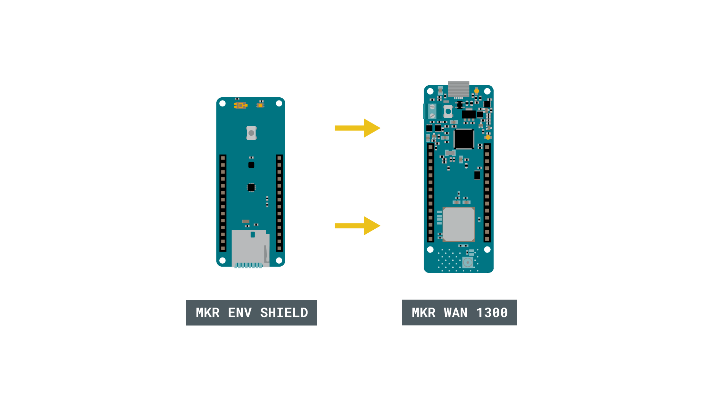
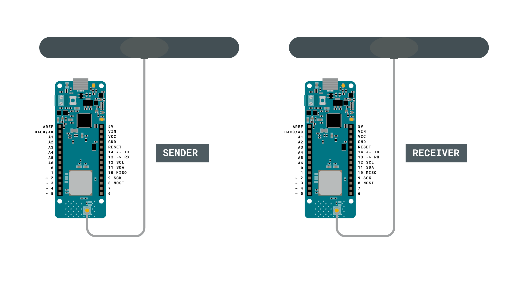
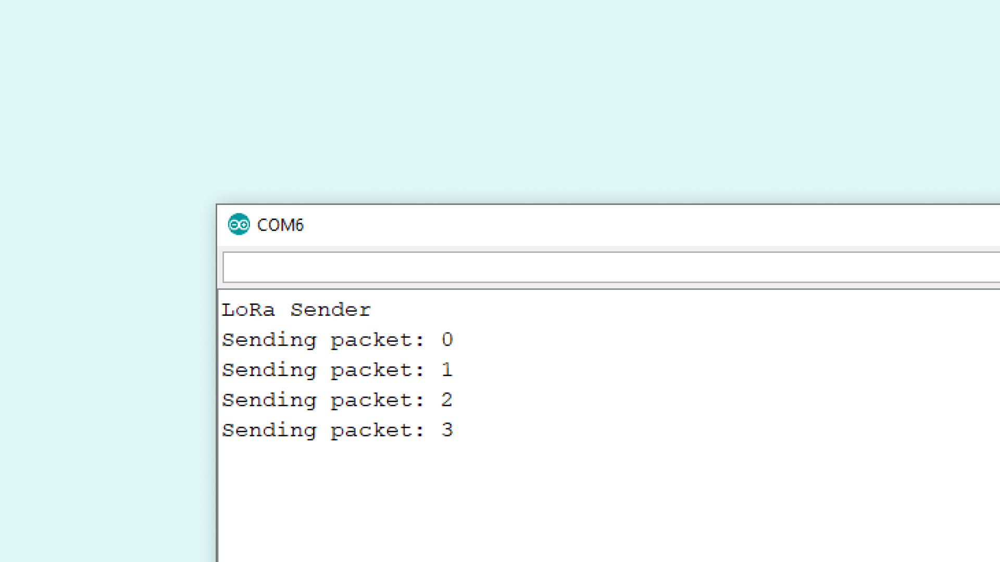
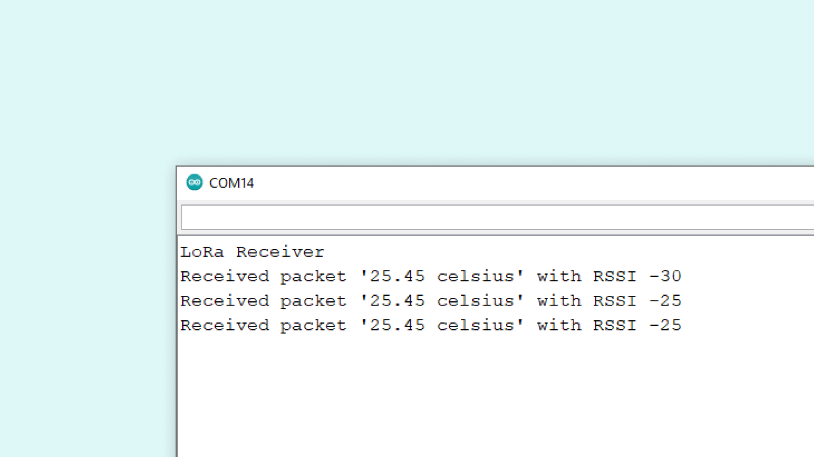

In this tutorial, we will set up a configuration that allows two MKR WAN 1300's to send and receive sensor data. We will use the **LoRa** library to send data, and we will not use any external service. The sensor data will be recorded through the [MKR ENV Shield](https://store.arduino.cc/arduino-mkr-env-shield), a shield that can record temperature, humidity, barometric pressure & ambient light.

## Hardware & Software Needed

- 2x [Arduino MKR WAN 1300](https://store.arduino.cc/mkr-wan-1300).
- 2x [Antenna](https://store.arduino.cc/antenna).
- 1x [MKR ENV shield](https://store.arduino.cc/arduino-mkr-env-shield).
- 2x Micro USB cable.
- Arduino IDE (offline and online versions available).
- Arduino SAMD Board Package installed, [follow this link for instructions](/software/ide-v2/tutorials/ide-v2-board-manager).
- **LoRa** library installed (see the [github repository](https://github.com/sandeepmistry/arduino-LoRa)).
- **Arduino_MKRENV** installed ([click here for more documentation](https://www.arduino.cc/en/Reference/ArduinoMKRENV)).


>**Note:** This tutorial uses the MKR ENV shield which makes it easy to retrieve data from environmental sensors. If you have a temperature sensor or any other sensor you would like to use instead, you can make some easy adjustments to the code.

### Circuit

First, if we are using the MKR ENV shield, simply attach it to one of the MKR WAN 1300 boards.



Follow the wiring diagram below to connect the antennas to the MKR WAN 1300 boards.



## Let's Start

In this tutorial, we will use the MKR WAN 1300 board and the **LoRa** library to create a simple one way communication. It will teach you how to set up one board to be a **sender** and one board to be a **receiver**, and how to set up communication between these two without using any external services. We will learn how to send packages using the **LoRa** library, and how to receive packages.

All data received is printed in the Serial Monitor using a very simple interface.

**To create the sender sketch, we will have to go through the following steps:**

- Initialize the **SPI**, **LoRa** and **Arduino_MKRENV** libraries.
- Create a counter variable.
- Set the radio frequency to 868E6 (Europe) or 915E6 (North America).
- Read temperature from the MKR ENV shield.
- Begin a packet, print temperature variable to it.
- End packet.
- Increase counter each loop and print it in Serial Monitor.

**To create the receiver sketch, we will have to go through the following steps:**

- Initialize the **SPI** and **LoRa** libraries.
- Set the radio frequency to 868E6 (Europe) or 915E6 (North America).
- Create a function to parse incoming packet.
- Print the incoming messages.

## Code Explanation

We are going to program two separate MKR WAN 1300's in this tutorial. We will start with the **sender** device and later on, we will create a sketch for the **receiver** device.

### Programming the Sender

The initialization is quick and easy: we will include the **SPI**, **LoRa** and **Arduino_MKRENV** libraries, and create a counter variable.

```arduino
#include <Arduino_MKRENV.h>
#include <SPI.h>
#include <LoRa.h>

int counter = 0;
```

In the `setup()` we will begin serial communication, where we will use the command `while(!Serial);` to prevent the program from running until we open the Serial Monitor.

We will then initialize the **LoRa** library, where we will set the radio frequency to 868E6, which is used in Europe for LoRa® communication. If we are located in North America, we need to change this to 915E6.

As we are using the MKR ENV shield, we also need to initialize the **Arduino_MKRENV** library by using the line `if (!ENV.begin())` followed by an error message in case it failed to initialize.

>**Note:** If you are using another sensor, there is no need to include the **Arduino_MKRENV** library, or initialize it.

```arduino
void setup() {
  Serial.begin(9600);
  while (!Serial);
  Serial.println("LoRa Sender");

  if (!LoRa.begin(868E6)) {
    Serial.println("Starting LoRa failed!");
    while (1);
  }

delay(1000);

  if (!ENV.begin()) {
    Serial.println("Failed to initialize MKR ENV shield!");
    while (1);
  }
}
```

In the `loop()` we start by printing "Sending packet" in the Serial Monitor and the value of `counter`. This is followed by a reading of the temperature sensor, using the command `double temperature = ENV.readTemperature();`. We use a double variable, as the temperature value we record has a decimal point (e.g. 25.85).

We then begin a packet by using the command, `LoRa.beginPacket()`, and print the temperature, followed by the message "celsius". This is done using the `LoRa.print()` function, which we then broadcast, using the `LoRa.endPacket()` command.

Finally, we add increase counter by 1 each time the loop has run, and a delay of 5 seconds, to limit the message rate. This will print in the Serial Monitor, to keep track on how many transmissions we have made.

```arduino
void loop() {
  Serial.print("Sending packet: ");
  Serial.println(counter);

  double temperature = ENV.readTemperature();

  // send packet
  LoRa.beginPacket();
  LoRa.print(temperature);
  LoRa.print(" celsius");
  LoRa.endPacket();
  counter++;
  delay(5000);
}

```

### Programming the Receiver

The initialization and setup of the receiver is more or less identical to the **sender** sketch, but as we are writing this sketch to only receive data, we can remove the **Arduino_MKRENV** library.

Inside the loop, we will not be creating any packets. Instead, we will listen to incoming ones. This is done by first using the command `int packetSize = LoRa.parsePacket();`, and then check for an incoming packet. If we receive one, it is parsed, and printed in the Serial Monitor.

```arduino

#include <SPI.h>
#include <LoRa.h>

void setup() {
  Serial.begin(9600);
  while (!Serial);

  Serial.println("LoRa Receiver");

  if (!LoRa.begin(868E6)) {
    Serial.println("Starting LoRa failed!");
    while (1);
  }
}

void loop() {
  // try to parse packet
  int packetSize = LoRa.parsePacket();
  if (packetSize) {
    // received a packet
    Serial.print("Received packet '");

    // read packet
    while (LoRa.available()) {
      Serial.print((char)LoRa.read());
    }

    // print RSSI of packet
    Serial.print("' with RSSI ");
    Serial.println(LoRa.packetRssi());
  }
}

```

## Complete Code

If you choose to skip the code building section, the complete code can be found below:

### Sender Code

```cpp
#include <Arduino_MKRENV.h>
#include <SPI.h>
#include <LoRa.h>

int counter = 0;

void setup() {
  Serial.begin(9600);
  while (!Serial);
  Serial.println("LoRa Sender");

  if (!LoRa.begin(868E6)) {
    Serial.println("Starting LoRa failed!");
    while (1);
  }

delay(1000);

  if (!ENV.begin()) {
    Serial.println("Failed to initialize MKR ENV shield!");
    while (1);
  }
}

void loop() {
  Serial.print("Sending packet: ");
  Serial.println(counter);
    double temperature = ENV.readTemperature();
  // send packet
  LoRa.beginPacket();
  LoRa.print(temperature);
  LoRa.print(" celsius");
  LoRa.endPacket();
  counter++;
  delay(5000);
}
```

<iframe src="https://create.arduino.cc/editor/ArduinoEdu/79183b49-15d0-484c-9d77-02ed572c90d4/preview?embed" style="height:510px;width:100%;margin:10px 0" frameborder="0"></iframe>

### Receiver Code

```cpp
#include <SPI.h>
#include <LoRa.h>

void setup() {
  Serial.begin(9600);
  while (!Serial);

  Serial.println("LoRa Receiver");

  if (!LoRa.begin(868E6)) {
    Serial.println("Starting LoRa failed!");
    while (1);
  }
}

void loop() {
  // try to parse packet
  int packetSize = LoRa.parsePacket();
  if (packetSize) {
    // received a packet
    Serial.print("Received packet '");

    // read packet
    while (LoRa.available()) {
      Serial.print((char)LoRa.read());
    }

    // print RSSI of packet
    Serial.print("' with RSSI ");
    Serial.println(LoRa.packetRssi());
  }
}
```

<iframe src="https://create.arduino.cc/editor/ArduinoEdu/a17573e3-b2dd-4277-a5b4-b62b2e520055/preview?embed" style="height:510px;width:100%;margin:10px 0" frameborder="0"></iframe>

{/* Here we explain how to test the program */}
## Upload Sketch and Testing the Program

Once we are finished with the coding, we can upload the sketches to each board. The easiest way to go forward is to have two separate computers, as we will need to have the Serial Monitor open for both boards. Alternatively, we can use a Serial interfacing program called Putty. But for demonstration, it is good to use two computers. This way, you can move the boards further away from each other while testing the signal.

### Sending Values

After we have uploaded the code to the **sender**, we need to open the Serial Monitor to initialize the program. If everything is working, it will start printing the message "Sending packet: x", where x represents the number of times the packet has been sent.



### Receiving Values

After we have uploaded the code to the **receiver**, we need to open the Serial Monitor to initialize the program. If everything works, we should now pick up the package we sent from the other device. The package contains the temperature, followed by RSSI (Received Signal Strength Indication). The closer this value is to 0, the stronger the signal are.




## Experimenting with This Setup

Now that we have communication between the boards, we can do a simple test with the signal. If we move the sender device away from the receiver device, we will start noticing changes in the RSSI. For example, while conducting this test, the sender device was moved around 20 meters away from the receiver, which decreased the RSSI to about -60.

### Troubleshoot

If the code is not working, there are some common issues we might need to troubleshoot:

- Antenna is not connected properly.
- The radio frequency is wrong. Remember, 868E6 for Europe and 915E6 for Australia & North America.
- We have not opened the Serial Monitor.
- We are using the same computer for both boards without a serial interfacing program.


## Conclusion

This tutorial demonstrates a simple communication between two MKR WAN 1300 boards and a MKR ENV shield, using LoRa® technology.
