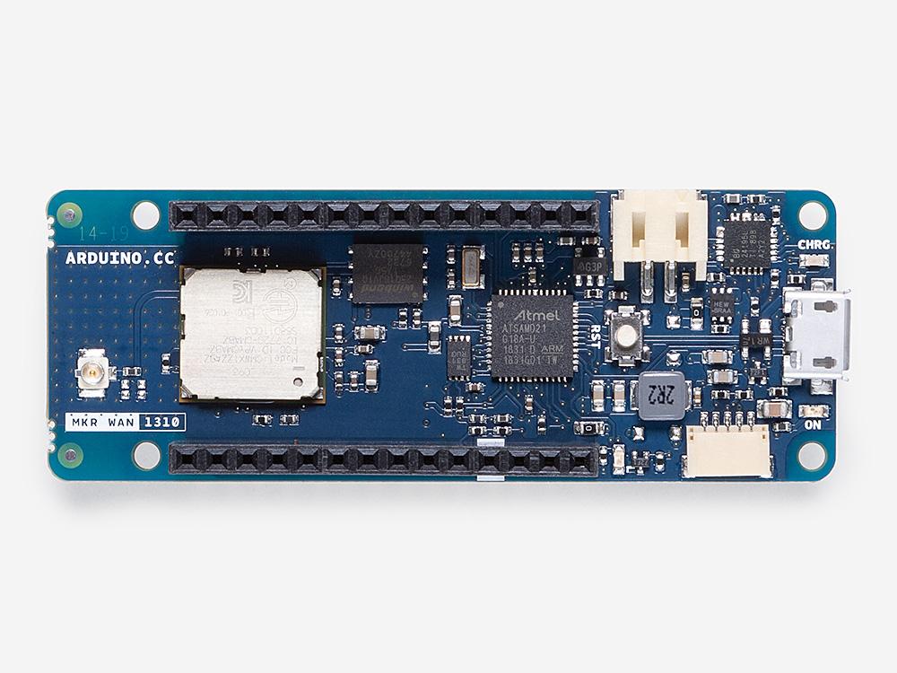
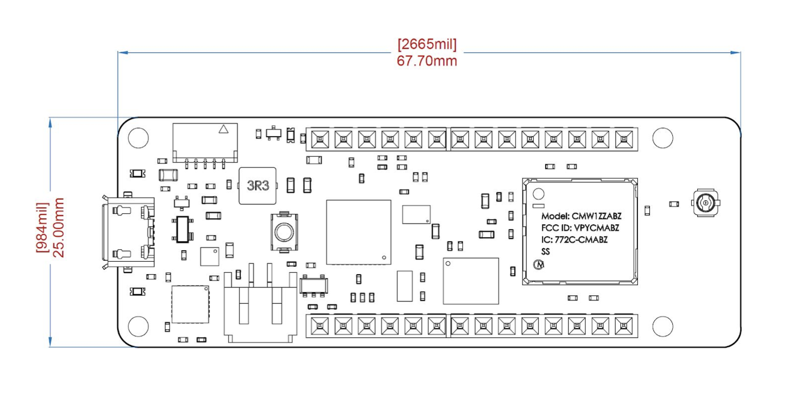
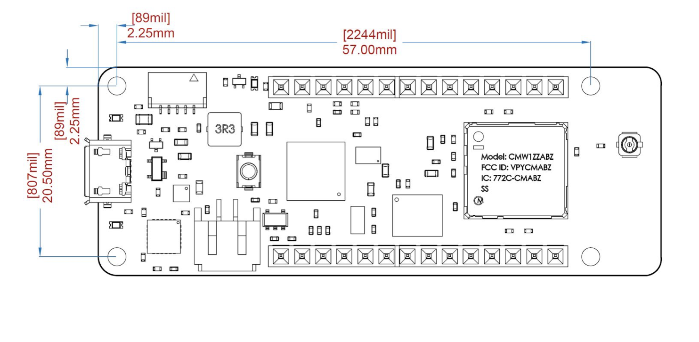
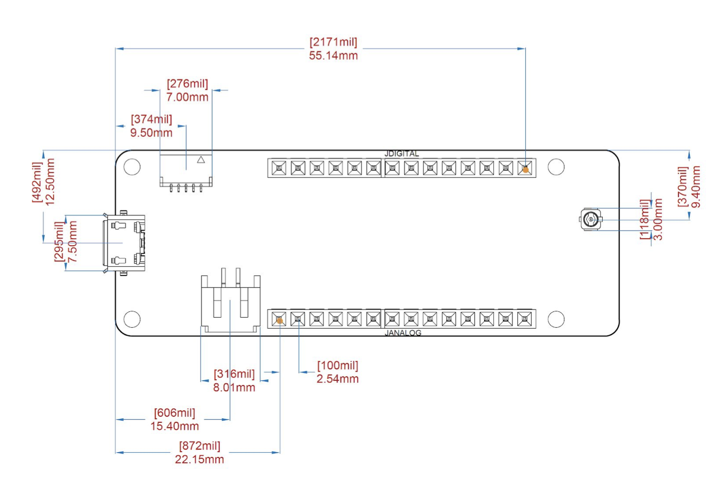

# Description

The Arduino MKR WAN 1310 is a miniature sized module containing a Arm® Cortex®-M0+ SAMD21 processor, the Murata CMWX1ZZABZ LoRa® module, a crypto chip (the ECC508), and a 2MByte SPI Flash. The module can either be mounted as a DIP component throughout the already mounted headers. Like most Arduino MKR form factor boards the MKR WAN 1310 can be powered via USB, via headers orconnecting a Lithium or Lithium Polymer battery to the embedded battery charger (the BQ24195L).

# Target Areas:
Maker

# Features

- **SAMD21G18A** Processor
    - Arm® Cortex®-M0+ at up to 48 MHz
    - 256 KB Flash
    - 32 KB SRAM
    - Power On Reset POR and Brown Out Detection (BOD)
    - Peripherals
        - 12 channel DMA
        - 12 channel event system
        - 5x 16 bit Timer/Counter
        - 3x 24 bit timer/counter with extended functions
        -  32 bit RTC
        - Watchdog Timer
        - CRC-32 generator
        - Full speed Host/Device USB with 8 end points
        - 6x SERCOM (USART, I2C, SPI, LIN)
        - Two channel I2S
        - 12 bit 350ksps ADC (up to 16 bit with oversampling)
        - 10 bit 350ksps DAC
        - External Interrupt Controller (up to 16 lines)
- **Murata CMWX1ZZABZ LORA Module**
    - STMicro STM32L0 series Arm® Cortex®-M0+ 32 bit MCU
    - 192 Kbytes Flash
    - +20dBm RF TX Output Power
    - Semtech SX1276 Radio
- **W25Q16 SPI Flash memory**
    - 16Mbit SPI Flash
    - 4mA active current, <1μA Power-down (typ.)
    - More than 100,000 erase/program cycles
    - More than 20-year data retention
- **ATECC508 Crypto Chip**
    - Cryptographic co-processor with secure hardware based key storage
    - Protected storage for up to 16 keys, certificates or data
    - ECDH: FIPS SP800-56A Elliptic Curve Diffie-Hellman
    - ECDSA: FIPS186-3 Elliptic Curve Digital Signature Algorithm
    - NIST standard P256 elliptic curve support
    - SHA-256 & HMAC hash including off-chip context save/restore
- **BQ24125L I2C Controlled USB/Adapter Charger**
    - 92% Charge Efficiency at 2 A, 90% at 4 A
    - Autonomous Battery Charging
    - 2.5-A Fast Charging

# CONTENTS

**NOTE:** Arduino MKR WAN 1310 battery charger has a minimum of 512mA charge current. Please ensure this charging current is compatible with the battery you will be using.

**NOTE:** Arduino MKR WAN 1310 only supports 3.3V I/Os and is **NOT** 5V tolerant so please make sure you are not directly connecting 5V signals to this board, or it will be damaged. Also the 5V pin does NOT supply voltage but is rather connected, through a jumper, to the USB power input.

## Functional Overview

### Main Processor

Main Processor is an Arm® Cortex®-M0+ running at up to 48MHz. Most of its pins are connected to the external headers, however some are reserved for internal communication to the communication module and to the internal SPI and I2C peripherals (SPI Flash memory and Crypto). 

Communication with Murata CMWX1ZZABZ happens through a I2C and a SPI through the following pins:

| SAMD21 (Pin) | SAMD21 (Acronym) | NINA (Pin) | CMWX1ZZABZ (Acronym) | Description |
|--------------|------------------|------------|----------------------|-------------|
| 39           | PA27             | 34         | MCU_NRST             | Reset       |
| 41           | PA28             | 22         | GPIO0                | IRQ pin     |
| 8            | PB09             | 43         | boot0                | Boot        |
| 23           | PA14             | 17         | GPIO5                | SPI CS      |
| 22           | PA13             | 16         | GPIO18               | SPI CLK     |
| 24           | PA15             | 15         | GPIO21               | SPI MISO    |
| 21           | PA12             | 14         | GPIO12               | SPI MOSI    |
| 14           | PA08             | 36         | PB9/SDA1             | I2C SDA     |
| 13           | PA09             | 35         | PB8/SCL1             | I2C SCL     |

### LoRa Module

LoRa connectivity is provided by a Murata CMWX1ZZABZ module. This module contains a STM32L0 processor along with a Semtech SX1276 Radio. The processor is running on Arduino open source firmware based on Semtech code.

**NOTE:** Although Firmware is open source, modifying it will require recertification of the radio stack.

**NOTE:** This radio transmitter [IC:26792-ABX00029] has been approved by Innovation, Science and Economic Development Canada to operate with the antenna types listed below, with the maximum permissible gain indicated. Antenna types not included in this list that have a gain greater than the maximum gain indicated for any type listed are strictly prohibited for use with this device:

|                      |                                       |
|----------------------|---------------------------------------|
|Antenna Manufacturer: |Dynaflex srl                           |
|Antenna Model:        |505012UFL                              |
|Antenna type:         |external omnidirectional dipole antenna|
|Antenna gain:         |-1dBi                                  |

 
### Crypto (ECC508)

The crypto chip in Arduino IoT boards is what makes the difference with other less secure boards as it provides a secure way to store secrets such as certificates and it also allows accelerating secure protocols while never exposing secrets in plain text.

Source code for the Arduino Library that supports the Crypto is available here [10].

### Flash Memory (W25Q16)

Arduino MKR WAN 1310 is available with additional external SPI Flash memories. External SPI flash can provide up to 16Mb of storage and can be used as a SPI peripheral for data storage.

**NOTE:** Please to correctly usage of the Flash memory follow these steps:

- saving data in ATSAMD21G18A ram
- shutting down the modem
- bringing up the flash and save the data there

Source code for the Arduino Library that supports the Flash Memory is available here [11]

### Power Tree

Board can be powered via USB connector, VIN pin or VUSB pin on headers.

|VUSB                             |VChrg                             |+3V8                               |+3V3                            |3V3 User               |
|--------------------------------------------|---------------------------------------------|-----------------------------------|--------------------------------|-----------------------|
|VUSB VChrg via MOSFET |VUSB VChrg via MOSFET  |                                   |                                |                       |
|VIN VChrg via Diode   |VIN VChrg via Diode    |                                   |                                |                       |
|                                            |VChrg +3V8 via BQ24195L           |VChrg +3V8 via BQ24195L |                                |                       | 
|                                            |                                             |3V8 +3V3 via LDO (600 mA output)   |3V8 +3V3 via LDO (600 mA output)|                       |
|                                            |                                             |                                   |SAMD21G18 (30mA)                |                       |
|                                            |                                             |                                   |CMWX1ZZABZ (128mA)              |                       |
|                                            |                                             |                                   |ECC508 (16mA)                   |                       |
|                                            |                                             |                                   |W25Q16 (30mA)                   |                       |
|                                            |                                             |                                   |                                |User application (300) |

**NOTE:** Since VUSB feeds VIN via a Schottky diode and DC-DC regulator specified minimum input voltage is 4.5V the minimum supply voltage from USB has to be increased to a voltage in the range between 4.8V to 4.96V depending on the current being drawn.

## Board Operation

### Getting Started – IDE

If you want to program your board while offline you need to install the Arduino Desktop IDE [1]

To connect the Arduino MKR WAN 1310 to your computer, you’ll need a Mini-B USB cable. This also provides power to the board, as indicated by the LED.

### Getting Started – Cloud

All Arduino boards, including this one, work out-of-the-box on the Arduino Cloud Editor [2], by just installing a simple plugin.

The Cloud Editor is hosted online, therefore it will always be up-to-date with the latest features and support for all boards. Follow this simple guide [3] to start coding on the browser and upload your sketches onto your board.

### Board Recovery

All Arduino boards have a built-in bootloader that allows flashing the board via USB. In case a sketch locks up the processor and the board is not reachable anymore via USB it is possible to enter bootloader mode by double-tapping the reset button right after power up.

## 4-Connector Pinouts

### USB

|Pin |Function           |Type         |Description                                                                    |
|----|-------------------|-------------|-------------------------------------------------------------------------------|
|1   |VUSB    |Power        |Power Supply Input. Output is board is powered via VUSB from header |
|2   |D-                 |Differential |USB differential data -                                                        |
|3   |D+                 |Differential |USB differential data +                                                        |
|4   |ID                 |Analog       |Selects Host/Device functionality                                              |
|5   |GND                |Power        |Supply Ground                                                                  |

Note that the board can support USB host mode only if powered via the VUSB pin and if the jumper close to the VUSB pin is shorted.

### Headers

Board exposes two 28 pin connectors assembled with pin headers.

|Pin |Function |Type      |Description                                        |
|----|---------|----------|---------------------------------------------------|
|1   |AREF     |Analog    |Analog Reference                                   |
|2   |A0/DAC0  |Analog    |ADC in/DAC out, can be used as GPIO                |
|3   |A1       |Analog    |ADC in, can be used as GPIO                        |
|4   |A2       |Analog    |ADC in, can be used as GPIO                        |
|5   |A3       |Analog    |ADC in, can be used as GPIO                        |
|6   |A4/SDA   |Analog    |ADC in, I2C SDA, can be used as GPIO    |
|7   |A5/SCL   |Analog    |ADC in, I2C SCL, can be used as GPIO    |
|8   |A6       |Analog    |ADC in, can be used as GPIO                        |
|9   |D0       |Digital   |GPIO, can be used as PWM                           |
|10  |D1       |Digital   |GPIO, can be used as PWM                           |
|11  |D2/PWM   |Digital   |GPIO, can be used as PWM                           |
|12  |D3/PWM   |Digital   |GPIO, can be used as PWM                           |
|13  |D4/PWM   |Digital   |GPIO, can be used as PWM                           |
|14  |D5/PWM   |Digital   |GPIO, can be used as PWM                           |
|15  |D6       |Digital   |GPIO, can be used as PWM                           |
|16  |D7       |Digital   |GPIO, can be used as PWM                           |
|17  |D8/MOSI  |Digital   |SPI MOSI, can  be used as GPIO, can be used as PWM |
|18  |D9/SCK   |Digital   |SPI SCK, can be  used as GPIO, can be used as PWM  |
|19  |D10/MISO |Digital   |SPI MISO, can be used as GPIO                      |
|20  |D11/SDA  |Digital   |I2C SDA, can be used as GPIO                       |
|21  |D12/SCL  |Digital   |I2C SCL, can be used as GPIO                       |
|22  |D13/RX   |Digital   |USART RX, can be used as GPIO                      |
|23  |D14/TX   |Digital   |USART TX, can be used as GPIO                      |
|24  |RESETN   |Digital   |Reset input                                        |
|25  |GND      |Power     |Power Ground                                       |
|26  |+3V3     |Power Out |                                                   |
|27  |VIN      |Power In  |Vin Power input                                    |
|28  |+5V      |Power Out |Power Ground                                       |

### Debug

On the back side of the board, under the ATSAMD21G18, there is a footprint for a 3x2 test pads with 100 mil pitch of which only 5 pads are populated.

|Pin |Function |Type      |Description                |
|----|---------|----------|---------------------------|
|1   |+3V3     |Power Out |                           |
|2   |SWD      |Digital   |Single Wire Debug Data     |
|3   |RESETN   |Digital   |In Processor Reset         |
|4   |SWCLK    |Digital   |In Single Wire Debug Clock |
|5   |GND      |Power     |                           |

## Mechanical Information

### Board Outline

Board measures are mixed between metric and imperial. Metric measures are used to maintain 100 mil pitch grid between pin rows to allow them to fit a breadboard.

### Mounting Holes

### Connector Positions

The view below is from top however it shows Debug connector pads which are on the bottom side. Highlighted pins are pin 1 for each connector.

## Ratings

### Absolute Maximum

|Symbol             |Description                              |Min  |Typ |Max |Unit |
|-------------------|-----------------------------------------|-----|----|----|-----|
|VINMax  |Maximum input voltage from VIN pad       |-0.3 |    |5.5 |V    |
|VUSBMax |Maximum input voltage from USB connector |-0.3 |    |5.5 |V    |
|PMax    |Maximum Power Consumption                |     |    |TBC |mW   |

### Thermal

|Symbol         |Description           |Min |Typ |Max |Unit |
|---------------|----------------------|----|----|----|-----|
|TST |Storage Temperature   |-40 |    |85  |°C   |
|TOP |Operating Temperature |-40 |    |85  |°C   |

### Recommended Operating Conditions

|Symbol           |Description|Min|Typ|Max|Unit|
|-----------------|----------------------------------------------------------|------|----|-----|---|
|VIN   |Input voltage from VIN pad                                |4.5   |5   |5.5  |V  |
|VUSB  |Input voltage from USB connector                          |4.8   |5   |5.5  |V  |
|V3V3  |3.3V output to user application                           |      |3.3 |     |V  |
|I3V3  | 3.3V output current available for user application       |      |    |300  |mA |
|VIH   |Input high-level voltage                                  |1.815 |-   |-    |V  |
|VIL   |Input low-level voltage                                   |-     |-   |0.99 |V  |
|VOH   |Output high-level voltage @IOH Max, PORT.PINCFG.DRVSTR=1 |-     |-   |7    |mA |
|VOL   |Output low-level voltage @IOL Max, PORT.PINCFG.DRVSTR=1  |-     |-   |10   |mA |

### Power Consumption

|Symbol           |Description                         |Min |Typ |Max |Unit |
|-----------------|------------------------------------|----|----|----|-----|
|PBL   |Power consumption with busy loop    |    |TBC |    |mW   |
|PLP   |Power consumption in low power mode |    |TBC |    |mW   |
|PMAX  |Maximum Power Consumption           |    |TBC |    |mW   |

## FCC Caution

Any Changes or modifications not expressly approved by the party responsible for compliance could void the user’s authority to operate the equipment.

This device complies with part 15 of the FCC Rules. Operation is subject to the following two conditions:
(1) This device may not cause harmful interference, and (2) this device must accept any interference received, including interference that may cause undesired operation.

FCC RF Radiation Exposure Statement:

1. This Transmitter must not be co-located or operating in conjunction with any other antenna or transmitter.

2. This equipment complies with RF radiation exposure limits set forth for an uncontrolled environment.

3. This equipment should be installed and operated with minimum distance 20cm between the
radiator& your body.

User manuals for licence-exempt radio apparatus shall contain the following or equivalent notice in a conspicuous location in the user manual or alternatively on the device or both. This device complies with Industry Canada licence-exempt RSS standard(s). Operation is subject to the following two conditions:

(1) this device may not cause interference, and

(2) this device must accept any interference, including interference that may cause undesired operation of the device.

Le présent appareil est conforme aux CNR d’Industrie Canada applicables aux appareils radio exempts de licence. L’exploitation est autorisée aux deux conditions suivantes :

(1) l’ appareil nedoit pas produire de brouillage, et

(2) l’utilisateur de l’appareil doit accepter tout brouillage radioélectrique subi, même si le brouillage est susceptible d’en compromettre le fonctionnement.

IC SAR Warning :

This equipment should be installed and operated with minimum distance 20 cm between the radiator
and your body. Lors de l’ installation et de l’ exploitation de ce dispositif, la distance entre le radiateur et le corps est d ’au moins 20 cm.

The operating temperature of the EUT can’t exceed 85°C and shouldn’t be lower than -40°C.

Hereby, Arduino S.r.l. declares that this product is in compliance with essential requirements and other relevant provisions of Directive 2014/53/EU. This product is allowed to be used in all EU member states.

| Frequency bands |Maximum output power (ERP) |
|-----------------|---------------------------|
|863-870Mhz       |-3.22dBm                   |

## Company Information

| Company name   | Company Address                           |
|----------------|-------------------------------------------|
| Arduino S.r.l. | Via Andrea Appiani,25 20900 MONZA（Italy) |

## Reference Documentation

|No. |Ref                          |Link                                                            |
|----|-----------------------------|----------------------------------------------------------------|
|1   |Arduino IDE (Desktop)        |https://www.arduino.cc/en/software                              |
|2   |Arduino IDE (Cloud)          |https://app.arduino.cc                                          |
|3   |Cloud IDE Getting Started    |https://docs.arduino.cc/arduino-cloud/guides/editor/            |
|4   |Forum                        |http://forum.arduino.cc/                                        |
|5   |SAMD21G18                    |http://ww1.microchip.com/downloads/en/devicedoc/40001884a.pdf   |
|6   |CMWX1ZZABZ                   |https://wireless.murata.com/datasheet?/RFM/data/type_abz.pdf    |
|7   |ECC508                       |https://ww1.microchip.com/downloads/en/DeviceDoc/20005928A.pdf  |
|8   |W25Q16                       |https://www.winbond.com/resource-files/w25q16dw_revj_090114.pdf |
|9   |CMWX1ZZA BZ Firmware         |https://github.com/arduino/mkrwan1300-fw                        |
|10  |ECC508 Library               |https://github.com/arduino-libraries/ArduinoECCX08              |
|11  |W25Q16 Library               |https://github.com/arduino-libraries/Arduino_MKRMEM             |

## Revision History

| **Date**   | **Revision** | **Changes**                                        |
| ---------- | ------------ | -------------------------------------------------- |
| 04/09/2025 | 2            | Formatting, reference links & nomenclature update  |
| 23/12/2020 | 1            | First Release                                      |

