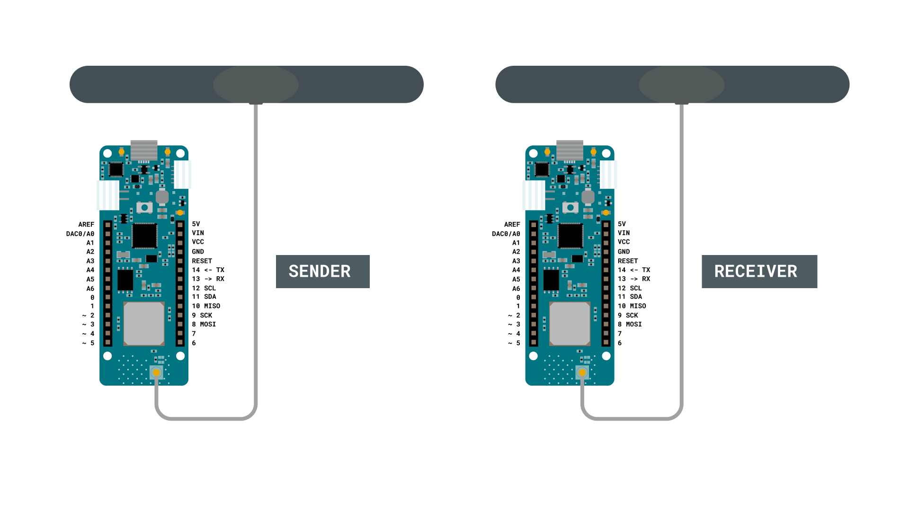

The Arduino MKR WAN 1310 is an excellent entry point to get started with low-powered, wide-area networks (LPWAN). In this tutorial, we will go through some of the core concepts such as long range (LoRa®) and the LoRaWAN® protocol.

We will create a basic sketch that will allow communication between two **MKR WAN 1310** boards. The communication will be established firstly through the radio module on the board, where we will also attach an antenna to each board.

## Long Range, Low Power Networks

There are many different terms to be familiar with in the world of LoRa® technology, so let's go through some of them!

### LoRa®

LoRa® is short for long range modulation technique based on a technology called chirp spread spectrum (CSS). It is designed to carry out long-range transmissions with minimal power consumption. LoRa® defines as the "lower layer" or **"physical layer"**, according to the **OSI model**. The physical layer is defined by hardware, signals and frequencies.

LoRa® uses different radio frequencies depending on where you are located in the world. The most common are Europe (868 MHz) and North America & Australia (915 MHz), but it differs from country to country. You can also read more about a [country's unique radio frequency](https://www.thethingsnetwork.org/docs/lorawan/frequencies-by-country.html).

LoRa® is also often used to describe hardware devices supported by LoRa®, e.g. modules or gateways. The Arduino MKR WAN 1310 has a LoRa® module called **Murata CMWX1ZZABZ**.

### LoRaWAN®

LoRaWAN® can be defined as the networking protocol used in an Low-Power, Wide-Area networks (LPWAN). The architecture of the network consists of different gateways that relay messages from low-power devices over long ranges, to central network servers. The protocol is defined as the **upper networking layers**.

### The Benefits of LoRa®

There are three distinct benefits of using LoRa® technology.

**1.** **Price:** LoRa® chips are quite inexpensive for its performance levels. The MKR WAN 1310 is one of the cheapest long-range connectivity boards produced. Also, operating under free licenses means, that's right, not paying for licenses!

**2.** **Low power:** Both hardware and software is designed to run on minimal energy, which boosts its value significantly. In present day and future, energy consumption is a large problem to tackle.

**3.** **Long range:** To transmit data over long distances brings more accessibility to more remote regions, and is ideal for agricultural, forestry and weather applications.

___


## Hardware & Software Needed

-   2x Arduino MKR WAN 1310  ([link to store](https://store.arduino.cc/mkr-wan-1310))
-   2x Antenna ([link to store](https://store.arduino.cc/antenna))
-   2x Micro USB cable
-   Arduino IDE (offline and online versions available)
-   Arduino SAMD Board Package installed, [follow this link for instructions](https://www.arduino.cc/en/Guide/MKRWiFi1010#installing-drivers-for-the-mkr-wifi-1010)
-   LoRa library installed, see the [github repository](https://github.com/sandeepmistry/arduino-LoRa)


### Circuit

Follow the wiring diagram below to connect the antennas to the MKR WAN 1310 boards.



### Schematic

This is the schematic of our circuit.


___

## Let's Start

We are going to create two sketches: one for the sender, and one for the receiver. In this tutorial, we will simply focus on sending a simple message that can be read in the Serial Monitor. The sender will have a counter that increases each time the loop has run, and a delay of 5 seconds. Each time the loop runs, we will send a "packet" containing the message "hello" and the number of the counter variable. This is to ensure that we receive messages continuously.

**To create the sender sketch, we will have to do the following steps:**

- Initialize the **SPI** and **LoRa** libraries.
- Create a counter variable.
- Set the radio frequency to 868E6 (Europe) or 915E6 (North America).
- Begin a packet, print a message & counter variable to it.
- End packet.

**To create the receiver sketch, we will have to do the following steps:**

- Initialize the **SPI** and **LoRa** libraries.
- Set the radio frequency to 868E6 (Europe) or 915E6 (North America).
- Create a function to parse incoming packet.
- Print the incoming messages.

## Creating the Program

We are going to program two separate MKR WAN 1310's in this tutorial. We will start with the **sender** device and later on, we will create a sketch for the **receiver** device.

**1.** First, let's make sure we have the drivers installed. If we are using the Web Editor, we do not need to install anything. If we are using an offline editor, we need to install it manually. This can be done by navigating to **Tools > Board > Board Manager...**. Here we need to look for the **Arduino SAMD boards (32-bits ARM Cortex M0+)** and install it.

**2.** Now we need to download the **LoRa** library from [this repository](https://github.com/sandeepmistry/arduino-LoRa), where you can install it by navigating to **Sketch > Include Library > Add .ZIP Library...** in the offline IDE.

### Programming the Sender

The initialization is quick and easy: we will only include the **SPI** and **LoRa** libraries, and create a counter variable.

```arduino
#include <SPI.h>
#include <LoRa.h>

int counter = 0;
```

In the `setup()` we will first begin serial communication, where we will use the command `while(!Serial);` to prevent the program from running until we open the Serial Monitor.

We will then initialize the **LoRa** library, where we will set the radio frequency to 868E6, which is used in Europe for LoRa® communication. If we are located in North America, we need to change this to 915E6.


```arduino
void setup() {
  Serial.begin(9600);
  while (!Serial);

  Serial.println("LoRa Sender");

  if (!LoRa.begin(868E6)) {
    Serial.println("Starting LoRa failed!");
    while (1);
  }
}

```

In the `loop()` we start by printing "Sending packet" in the Serial Monitor + the value of `counter`. We then begin a packet by using the command, `LoRa.beginPacket()`, and print "hello" and the value of `counter`. This is done using the `LoRa.print()` function, then we broadcast it by using `LoRa.endPacket()`.

Finally, we add increase counter by 1 each time the loop has run, and a delay of 5 seconds, to limit the message rate.

```arduino
void loop() {
  Serial.print("Sending packet: ");
  Serial.println(counter);

  // send packet
  LoRa.beginPacket();
  LoRa.print("hello ");
  LoRa.print(counter);
  LoRa.endPacket();

  counter++;

  delay(5000);
}

```


### Programming the Receiver

The initialization and setup of the receiver is more or less identical to the **sender** sketch.

But inside the loop, we will not be creating any packets. Instead, we will listen to incoming ones. This is done by first using the command `int packetSize = LoRa.parsePacket();`, and then check for an incoming packet. If we receive one, it is parsed and printed in the Serial Monitor.

```cpp
#include <SPI.h>
#include <LoRa.h>

void setup() {
  Serial.begin(9600);
  while (!Serial);

  Serial.println("LoRa Receiver");

  if (!LoRa.begin(868E6)) {
    Serial.println("Starting LoRa failed!");
    while (1);
  }
}

void loop() {
  // try to parse packet
  int packetSize = LoRa.parsePacket();
  if (packetSize) {
    // received a packet
    Serial.print("Received packet '");

    // read packet
    while (LoRa.available()) {
      Serial.print((char)LoRa.read());
    }

    // print RSSI of packet
    Serial.print("' with RSSI ");
    Serial.println(LoRa.packetRssi());
  }
}

```

{/* Here we link the full program from create */}
## Complete Code

If you choose to skip the code building section, the complete code can be found below:

### Sender Code

```arduino
#include <SPI.h>
#include <LoRa.h>

int counter = 0;

void setup() {
  Serial.begin(9600);
  while (!Serial);

  Serial.println("LoRa Sender");

  if (!LoRa.begin(868E6)) {
    Serial.println("Starting LoRa failed!");
    while (1);
  }
}

void loop() {
  Serial.print("Sending packet: ");
  Serial.println(counter);

  // send packet
  LoRa.beginPacket();
  LoRa.print("hello ");
  LoRa.print(counter);
  LoRa.endPacket();

  counter++;

  delay(5000);
}
```

### Receiver Code

```arduino
#include <SPI.h>
#include <LoRa.h>

void setup() {
  Serial.begin(9600);
  while (!Serial);

  Serial.println("LoRa Receiver");

  if (!LoRa.begin(868E6)) {
    Serial.println("Starting LoRa failed!");
    while (1);
  }
}

void loop() {
  // try to parse packet
  int packetSize = LoRa.parsePacket();
  if (packetSize) {
    // received a packet
    Serial.print("Received packet '");

    // read packet
    while (LoRa.available()) {
      Serial.print((char)LoRa.read());
    }

    // print RSSI of packet
    Serial.print("' with RSSI ");
    Serial.println(LoRa.packetRssi());
  }
}
```

## Upload Sketch and Testing the Program

Once we are finished with the coding, we can upload the sketches to the different boards. Remember that we need to upload the **sender sketch to the sender board** and the **receiver sketch to the receiver board.** This will require us to switch between the ports listed in the board manager.

When we open the Serial Monitor, we start the program. Let's start with the **sender** device. First, choose the **port** for your board, and open the Serial Monitor. The output should now be:

```
LoRa Sender
Hello 0
Hello 1
Hello 2
Hello 3
```

Now let's change ports to the **receiver** device, and open the Serial Monitor. We should now see the following:

```
LoRa Receiver
Hello 0
Hello 1
Hello 2
Hello 3
```

If we are receiving

### Troubleshoot

If the code is not working, there are some common issues we might need to troubleshoot:

- Antenna is not connected properly.
- The radio frequency is wrong. Remember, 868E6 for Europe and 915E6 for Australia & North America.
- We have not opened the Serial Monitor.
- We are using the same computer for both boards without a serial interfacing program.

## Conclusion

In this tutorial, we have introduced some fundamental concepts around LoRa®, where we have setup a basic communication line between two boards using the LoRa® network. With this basic framework, you can go on to combine this tutorial with sensors and other software libraries, so that you can create your own long-range, low-powered devices!


