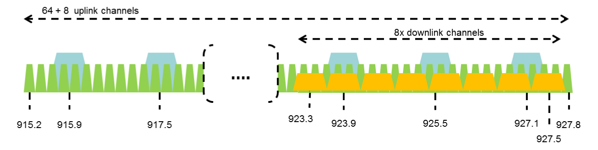
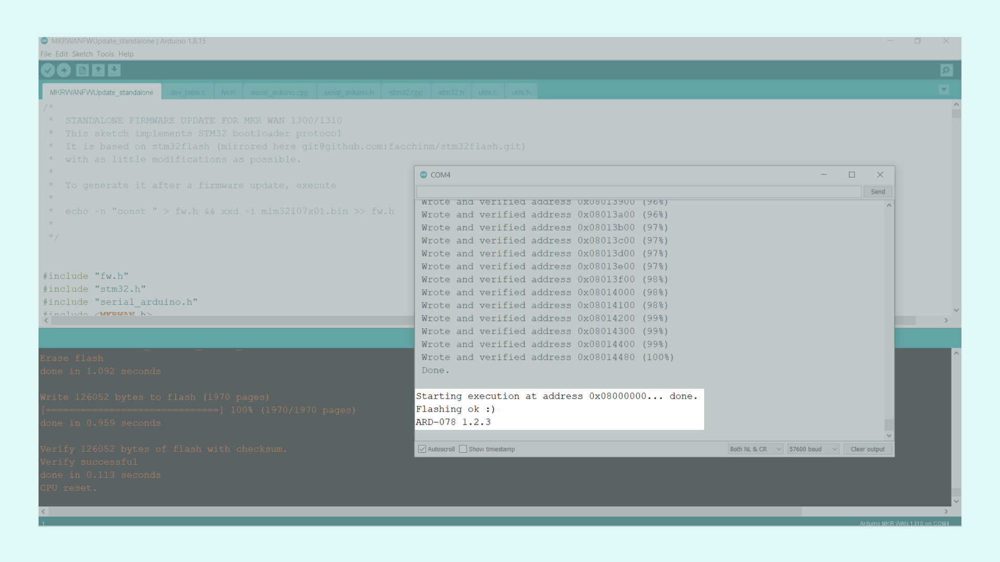
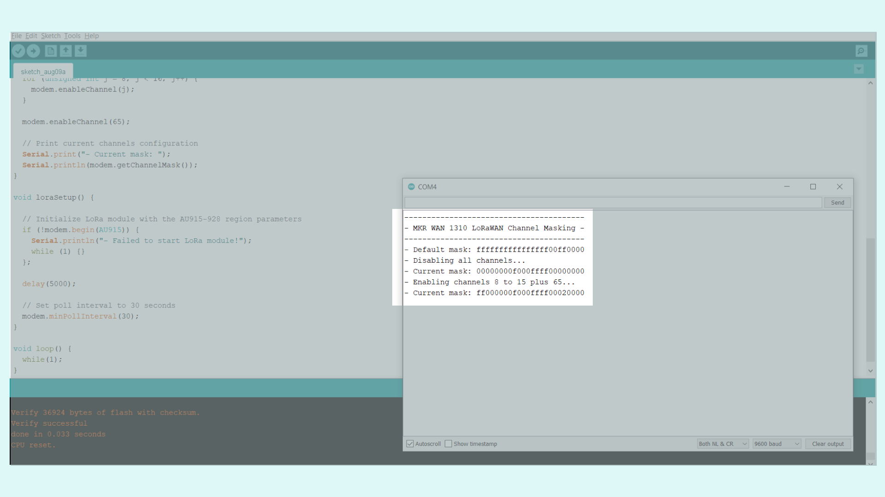

## Introduction

In this tutorial, we will learn how to set up specific LoRaWAN® regional parameters for the LoRa® module (Murata CMWX1ZZABZ-078) of the [Arduino® MKR WAN 1310](https://store.arduino.cc/mkr-wan-1310) and [Arduino® MKR WAN 1300](https://store.arduino.cc/arduino-mkr-wan-1300-lora-connectivity-1414) boards. For doing this, we are going to use the [Arduino MKRWAN library](https://github.com/arduino-libraries/MKRWAN) functionalities. 

### Goals

- Learn LoRaWAN® networking protocol basics. 
- Learn about the [LoRaWAN® Regional Parameters](https://lora-alliance.org/wp-content/uploads/2020/11/RP_2-1.0.2.pdf) specification.
- Use the Arduino [MKRWAN library](https://github.com/arduino-libraries/MKRWAN) for setting up specific LoRaWAN® regional parameters in the LoRa® module (Murata CMWX1ZZABZ-078) of the [Arduino® MKR WAN 1310](https://store.arduino.cc/mkr-wan-1310) board.

### Required Hardware and Software

- Arduino IDE ([online](https://create.arduino.cc/) or [offline](https://www.arduino.cc/en/main/software)).
- [Arduino MKRWAN library](https://github.com/arduino-libraries/MKRWAN).
- [Arduino® MKR WAN 1310](https://store.arduino.cc/mkr-wan-1310) board.
- Micro USB cable (x1).

## LoRaWAN® Networking Protocol Overview

LoRaWAN® is a "Low Power Wide Area (LPWA) end-to-end system architecture designed to wirelessly connect battery operated "things" to the internet in regional, national or global networks. The architecture includes protocol standards and features that support low-cost, mobile, and secure bi-directional communication for Internet of Things (IoT), machine-to-machine (M2M), smart city & industrial applications". LoRaWAN® is optimized for low-power consumption and it is designed to scale from a simple gateway up to a large global network of billions of connected devices. 

LoRaWAN® **fundamental characteristics** are the following:

* **Long-range**: typically two to 5 km in urban areas (obstacles) and 5 to 15 km in rural areas.
* **Long battery duration**: up to 10 years without a replacement (note that long battery duration will require an increased downlink latency configuration).
* **Low cost**: regarding sensors and maintenance.
* **License-free spectrum**: LoRaWAN® networks operates on license-free and cost-​free ISM (Industrial, Scientific, Medical) bands; however, **region-specific regulations apply**. 
* **Limited payload**: 51 to 256 bytes (depending on data rate).
* **Limited data rate**: 0.3 to 27 Kbps.

The LoRa Alliance® specifies the LoRaWAN® networking protocol in the **LoRaWAN® specification** documents. These documents are developed and maintained by the LoRa® Alliance, an open association of collaborating members. As stated before, though LoRaWAN® operates on **license-free and cost-​free ISM bands**, **manufacturers and operators of LoRaWAN® devices still have to fulfill various country-specific regulations**. 

## LoRa Alliance® Regional Parameters Overview

The **LoRaWAN® Regional Parameters specification** is a companion to the LoRaWAN® Link Layer specification. While the LoRaWAN® Link Layer specification defines the air interface between a compliant end-device (sensor, actuator, tracker, etc.) and a compliant network core, the LoRaWAN® Regional Parameters specification defines the **adaptation of the LoRaWAN® Link Layer specification to comply with the various regulations enforced throughout the world on the use of various frequency bands of the unlicensed spectrum which are available**. 

Also, the LoRaWAN® Regional Parameters specification documents the **physical layer configurations required for the compliant operation of LoRaWAN® Link Layer radios** using various radio frequency modulation techniques. 

***The idea behind the LoRaWAN® Regional Parameters specification is to create the smallest number of regional channel plans covering the largest possible number of regulatory regions. With this, complexity is decreased to implementers as well as the certification cost (end-device certification is enumerated by Link Layer, Regional Parameters and channel plan revision).***

LoRaWAN® Regional Parameters specifications do not specify everything. They only cover a region by specifying the common denominator. For example, the LoRaWAN® Regional Parameters for Asia only specify a common subset of channels, but there are variations between regulations in Asian countries. Furthermore, each **network server operator**, for example [The Things Network](https://www.thethingsnetwork.org/) (TTN), is free to select additional parameters, such as additional emission channels. 

For more information, you can read the RP002-1.0.2 LoRaWAN® Regional Parameters document [here](https://lora-alliance.org/wp-content/uploads/2020/11/RP_2-1.0.2.pdf). 

## Regional Parameters Configuration Example: Australia

Let's use **Australia** (AU915-928) as an example of how we can set up, or configure, it's specific LoRaWAN® regional parameters in the LoRa® module of our MKR WAN 1310 board and connect it to TTN. TTN also have specific LoRaWAN® protocol characteristics for every region, including Australia, that must be configured. You can read more about The Things Network and the LoRaWAN® Regional Parameters [here](https://www.thethingsnetwork.org/docs/lorawan/regional-parameters/).

As stated in [section 2.8](https://lora-alliance.org/wp-content/uploads/2020/11/RP_2-1.0.2.pdf) of the LoRaWAN® Regional Parameters specification, in Australia the LoRaWAN® frequency spectrum has **64 uplink channels** available, channels 0 to 63 (125 kHz each), starting at 915.2 MHz which increment every 200 kHz up to 927.8 MHz. There are also **8 additional uplink channels**, channels 64 to 71 (500 kHz each), starting at 915.9 MHz which increment every 1.6 MHz up to 927.1 MHz. The frequency spectrum for those is overlapping with the basic 64 channels. For **gateway to end-node device communication** there are **8 downlink channels**, channels 0 to 7 (500 KHz each), starting at 923.3 MHz which increment every 600 KHz up to 927.5 MHz. This information is shown in the table below:

|   **Frequency Bands**  | **Frequency Range (MHz)** | **Channels** |
|:------------------:|:---------------------:|:--------:|
|      Australia     |     915.2 - 927.8     |  0 - 63  |
|  **Uplink Sub-Bands**  | **Frequency Range (MHz)** | **Channels** |
|     Sub-Band 1     |     915.2 - 916.6     |   0 - 7  |
|     Sub-Band 2     |     916.8 - 918.2     |  8 - 15  |
|     Sub-Band 3     |     918.4 - 919.8     |  16 - 23 |
|     Sub-Band 4     |     920.0 - 921.4     |  24 - 31 |
|     Sub-Band 5     |     921.6 - 923.0     |  32 - 39 |
|     Sub-Band 6     |     923.2 - 924.6     |  40 - 47 |
|     Sub-Band 7     |     924.8 - 926.2     |  48 - 55 |
|     Sub-Band 8     |     926.4 - 927.8     |  56 - 63 |
| Additional Sub Band | 915.9 - 927.1 | 64 - 71 |
| **Downlink Sub-Bands** | **Frequency Range (MHz)** | **Channels** |
|  Downlink Sub-Band |     923.3 - 927.5     | 0 - 7 |

 

For **8 channel gateways**, TTN in Australia uses **sub-band 2 plus channel 65 only** (uplink). This means that **we need to program those specific channels (channel masking) in our MKR WAN 1310 board in order to make it work with a gateway connected to TTN**. This can be easily done for our MKR WAN 1310 board using the Arduino MKRWAN library. Note that the downlink channels don't need to be configured.

### Channel Masking on the MKR WAN 1310 Board

First, let's make sure our board drivers are installed. If we are using the online IDE, we do not need to install anything. If we are using the offline IDE, we need to go to **Tools > Board > Board Manager...**. Here we need to look for **Arduino SAMD boards (32-bits Arm® Cortex®-M0+)** and install the latest version. After installing the drivers remember to select the board and the port, to which it is connected, in the **Tools** menu. 

After installing our board drivers, we need to install also the MKRWAN library. If we are using the online IDE, there is no need to install anything. If we are using the offline IDE, we need to go to **Tools > Manage Libraries...**. Here we need to search for **MKRWAN** and install the latest version.

Before we can use the MKRWAN library a firmware update of the LoRa® module of our MKR 1310 board is recommended. Updating the module's firmware can be done easily with the **MKRWANFWUpdate_standalone sketch**. We can find this sketch in **File > Examples > MKRWAN > MKRWANFWUpdate_standalone**. After uploading the sketch, we should see the following output in the Arduino IDE Serial Monitor when the firmware update is done:



For **enabling** or **disabling**, or masking, specific LoRaWAN® frequency spectrum channels in our MKR WAN 1310 board we can use the `enableChannel()` and `disableChannel()` functions from the [MKRWAN library](https://github.com/arduino-libraries/MKRWAN). Channel masking should be made in the initialization function like in the example code shown below:

```arduino 
#include <MKRWAN.h>

LoRaModem modem;

void setup() {
  int status;

  // Initialize serial port at 9600 bauds
  Serial.begin(9600);
  while (!Serial);

  loraSetup();
  
  Serial.println("--------------------------------");
  Serial.println("- MKR WAN 1310 Channel Masking -");
  Serial.println("--------------------------------");

  // Print default channels configuration
  Serial.print("- Default mask: ");
  Serial.println(modem.getChannelMask());

  // Disable all channels
  Serial.println("- Disabling all channels...");  
  for (unsigned int i = 0; i < 72; i++) {
    modem.disableChannel(i);
  }
  
  // Print current channels configuration
  Serial.print("- Current mask: ");
  Serial.println(modem.getChannelMask());
  
  // Enable AU915-928 channels
  // LoRaWAN® Regional Parameters and TTN specification: channels 8 to 15 plus 65 
  Serial.println("- Enabling channels 8 to 15 plus 65...");  
  for (unsigned int i = 8; i <= 15; i++) {
    modem.enableChannel(i);
  }

  modem.enableChannel(65);

  // Print current channels configuration
  Serial.print("- Current mask: ");
  Serial.println(modem.getChannelMask());
}

void loraSetup() {
  // Initialize LoRa module with the AU915-928 region parameters
  if (!modem.begin(AU915)) {
    Serial.println("- Failed to start LoRa module!");
    while (1);
  };

  delay(5000);  
}

void loop() {}
```

After uploading the sketch, we should see the following output in the Arduino IDE Serial Monitor:



`ff000000f000ffff00020000` is the channel mask we get if we block all channels except those from sub-band 2 plus channel 65. Now, with this mask and the `sendMask()` function from the [MKRWAN library](https://github.com/arduino-libraries/MKRWAN), we can try a common Over-The-Air-Activation (OTAA) join to TTN like in the example code shown below:

```arduino
#include <MKRWAN.h>
#include "arduino_secrets.h"

LoRaModem modem;

// Enter your sensitive data in the secret tab or arduino_secrets.h
String appEui = SECRET_APP_EUI;
String appKey = SECRET_APP_KEY;

void setup() {
  // Initialize serial port at 9600 bauds
  Serial.begin(9600);
  while (!Serial);
  
  // Initialize LoRa module with the AU915-928 region parameters
  if (!modem.begin(AU915)) {
    Serial.println("Failed to start module");
    while (1) {}
  };

  // Device module version and EUI
  delay(5000);
  Serial.print("Your module version is: ");
  Serial.println(modem.version());
  Serial.print("Your device EUI is: ");
  Serial.println(modem.deviceEUI());

  // Enable AU915-928 channels
  // LoRaWAN® Regional Parameters and TTN specification: channels 8 to 15 plus 65 
  modem.sendMask("ff000001f000ffff00020000");
  Serial.println(modem.getChannelMask());
  modem.setADR(true);
  join();
}

void join() {
  // Try to connect
  int connected = modem.joinOTAA(appEui, appKey);
  if (!connected) {
    Serial.println("Something went wrong, retrying...");
    join();
  }
}

void loop(){}
```

That's it! Now you should be able to configure your own LoRaWAN® Regional Parameters using the `enableChannel()`, `disableChannel()` and `sendMask()` functions.

## Conclusion

In this tutorial we learned how to set up specific LoRaWAN® Regional Parameters for the LoRa® module (Murata CMWX1ZZABZ-078) of the [Arduino® MKR WAN 1310](https://store.arduino.cc/mkr-wan-1310) board using the `enableChannel()`, `disableChannel()` and `sendMask()` functions from the [MKRWAN library](https://github.com/arduino-libraries/MKRWAN).
