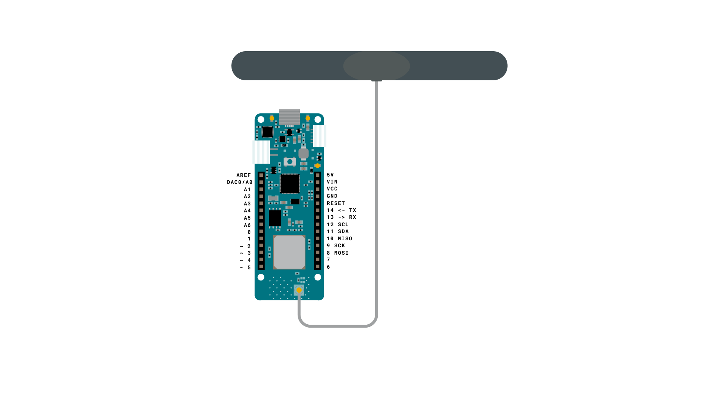

These examples will show you how to set up your board to use the LoRa® network and how to send and receive data from the LoRa® network.

## Hardware Required

- [Arduino MKR WAN 1300](https://store.arduino.cc/mkr-wan-1300) or 
- [Arduino MKR WAN 1310](https://store.arduino.cc/mkr-wan-1310)
- [Antenna](https://store.arduino.cc/products/dipole-pentaband-waterproof-antenna)

## Circuit



## Examples

### MKR WAN First Configuration

This example for a MKR WAN 1300 allows you to setup your board to use the LoRa® network.

```arduino
/*

  First Configuration

  This sketch demonstrates the usage of MKR WAN 1300/1310 LoRa module.

  This example code is in the public domain.

*/

#include <MKRWAN.h>

LoRaModem modem;

// Uncomment if using the Murata chip as a module
// LoRaModem modem(Serial1);

String appEui;

String appKey;

String devAddr;

String nwkSKey;

String appSKey;

void setup() {

  // put your setup code here, to run once:

  Serial.begin(115200);

  while (!Serial);

  Serial.println("Welcome to MKRWAN1300/1310 first configuration sketch");

  Serial.println("Register to your favourite LoRa network and we are ready to go!");

  // change this to your regional band (eg. US915, AS923, ...)

  if (!modem.begin(EU868)) {

    Serial.println("Failed to start module");

    while (1) {}

  };

  Serial.print("Your module version is: ");

  Serial.println(modem.version());

  Serial.print("Your device EUI is: ");

  Serial.println(modem.deviceEUI());

  int mode = 0;

  while (mode != 1 && mode != 2) {

    Serial.println("Are you connecting via OTAA (1) or ABP (2)?");

    while (!Serial.available());

    mode = Serial.readStringUntil('\n').toInt();

  }

  int connected;

  if (mode == 1) {

    Serial.println("Enter your APP EUI");

    while (!Serial.available());

    appEui = Serial.readStringUntil('\n');

    Serial.println("Enter your APP KEY");

    while (!Serial.available());

    appKey = Serial.readStringUntil('\n');

    appKey.trim();

    appEui.trim();

    connected = modem.joinOTAA(appEui, appKey);

  } else if (mode == 2) {

    Serial.println("Enter your Device Address");

    while (!Serial.available());

    devAddr = Serial.readStringUntil('\n');

    Serial.println("Enter your NWS KEY");

    while (!Serial.available());

    nwkSKey = Serial.readStringUntil('\n');

    Serial.println("Enter your APP SKEY");

    while (!Serial.available());

    appSKey = Serial.readStringUntil('\n');

    devAddr.trim();

    nwkSKey.trim();

    appSKey.trim();

    connected = modem.joinABP(devAddr, nwkSKey, appSKey);

  }

  if (!connected) {

    Serial.println("Something went wrong; are you indoor? Move near a window and retry");

    while (1) {}

  }

  delay(5000);

  int err;

  modem.setPort(3);

  modem.beginPacket();

  modem.print("HeLoRA world!");

  err = modem.endPacket(true);

  if (err > 0) {

    Serial.println("Message sent correctly!");

  } else {

    Serial.println("Error sending message :(");

  }
}

void loop() {

  while (modem.available()) {

    Serial.write(modem.read());

  }

  modem.poll();
}
```

### MKR WAN Lora® Send and Receive

This sketch demonstrates how to send and receive data with the MKR WAN 1300 LoRa® module.

```arduino

/*

  Lora Send And Receive

  This sketch demonstrates how to send and receive data with the MKR WAN 1300/1310 LoRa module.

  This example code is in the public domain.

*/

#include <MKRWAN.h>

LoRaModem modem;

// Uncomment if using the Murata chip as a module
// LoRaModem modem(Serial1);

#include "arduino_secrets.h"
// Please enter your sensitive data in the Secret tab or arduino_secrets.h

String appEui = SECRET_APP_EUI;

String appKey = SECRET_APP_KEY;

void setup() {

  // put your setup code here, to run once:

  Serial.begin(115200);

  while (!Serial);

  // change this to your regional band (eg. US915, AS923, ...)

  if (!modem.begin(EU868)) {

    Serial.println("Failed to start module");

    while (1) {}

  };

  Serial.print("Your module version is: ");

  Serial.println(modem.version());

  Serial.print("Your device EUI is: ");

  Serial.println(modem.deviceEUI());

  int connected = modem.joinOTAA(appEui, appKey);

  if (!connected) {

    Serial.println("Something went wrong; are you indoor? Move near a window and retry");

    while (1) {}

  }

  // Set poll interval to 60 secs.

  modem.minPollInterval(60);

  // NOTE: independently by this setting the modem will

  // not allow to send more than one message every 2 minutes,

  // this is enforced by firmware and can not be changed.
}

void loop() {

  Serial.println();

  Serial.println("Enter a message to send to network");

  Serial.println("(make sure that end-of-line 'NL' is enabled)");

  while (!Serial.available());

  String msg = Serial.readStringUntil('\n');

  Serial.println();

  Serial.print("Sending: " + msg + " - ");

  for (unsigned int i = 0; i < msg.length(); i++) {

    Serial.print(msg[i] >> 4, HEX);

    Serial.print(msg[i] & 0xF, HEX);

    Serial.print(" ");

  }

  Serial.println();

  int err;

  modem.beginPacket();

  modem.print(msg);

  err = modem.endPacket(true);

  if (err > 0) {

    Serial.println("Message sent correctly!");

  } else {

    Serial.println("Error sending message :(");

    Serial.println("(you may send a limited amount of messages per minute, depending on the signal strength");

    Serial.println("it may vary from 1 message every couple of seconds to 1 message every minute)");

  }

  delay(1000);

  if (!modem.available()) {

    Serial.println("No downlink message received at this time.");

    return;

  }

  char rcv[64];

  int i = 0;

  while (modem.available()) {

    rcv[i++] = (char)modem.read();

  }

  Serial.print("Received: ");

  for (unsigned int j = 0; j < i; j++) {

    Serial.print(rcv[j] >> 4, HEX);

    Serial.print(rcv[j] & 0xF, HEX);

    Serial.print(" ");

  }

  Serial.println();
}

```