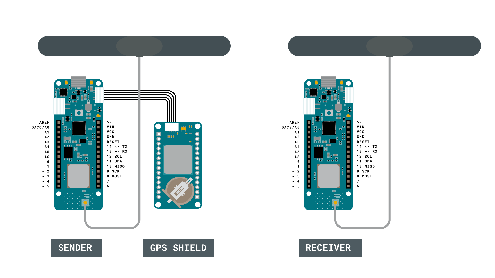
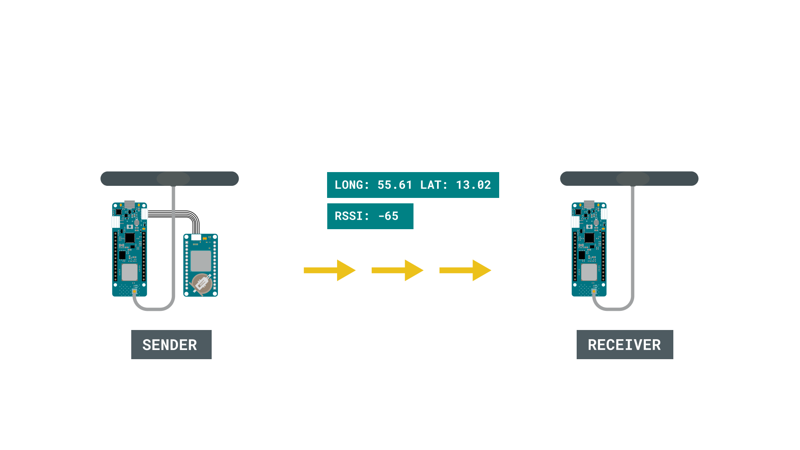
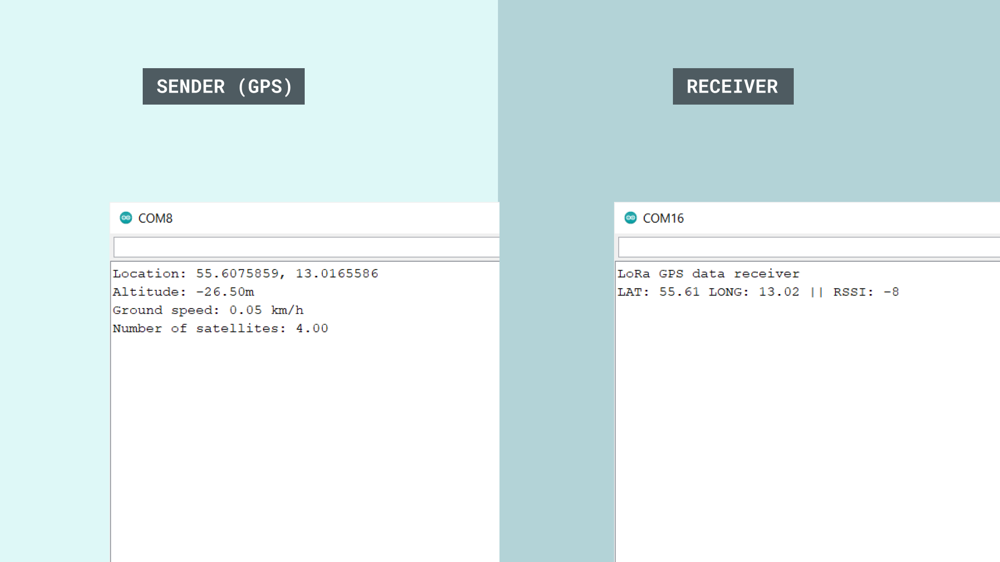

## Introduction

In this tutorial, we will use the [MKR GPS Shield](https://store.arduino.cc/arduino-mkr-gps-shield) to record the longitude and latitude, and transmit it to another board using LoRa® technology. This setup can be very useful for scenarios involving remote areas, where tracking location might be essential. 

Special thanks to [Sandeep Mistry](https://github.com/sandeepmistry) for creating the [LoRa library](https://github.com/sandeepmistry/arduino-LoRa).

## Goals

The goals of this project are:

- Learn some basics of how GPS works.
- Learn some basics of the [Arduino_MKRGPS](https://www.arduino.cc/en/Reference/ArduinoMKRGPS) library.
- Record the longitude and latitude of the device.
- Send the data over the LoRa® network to another MKR WAN 1310 board.

## Hardware & Software Needed

- Arduino IDE ([online](https://create.arduino.cc/) or [offline](https://www.arduino.cc/en/main/software))
- LoRa library installed, see the [github repository](https://github.com/sandeepmistry/arduino-LoRa)
- [Arduino_MKRGPS](https://www.arduino.cc/en/Reference/ArduinoMKRGPS) library installed
- 2x Arduino MKR WAN 1310  ([link to store](https://store.arduino.cc/mkr-wan-1310))
- 2x antenna ([link to store](https://store.arduino.cc/antenna))
- MKR GPS Shield ([link to store](https://store.arduino.cc/arduino-mkr-gps-shield))

## Global Positioning System (GPS)

The GPS is an incredible technology that is used to pinpoint an exact location. Even more interesting, it uses a series of satellites orbiting the Earth to do so. Basically, a satellite in orbit continuously sends signals towards the Earth, which are picked up by GPS receivers, that exist in e.g. smartphones. As the satellite has a positioning system, it knows where it is, relative to the Earth. But this signal can only pinpoint that you are in a certain part of the world, e.g. in the Atlantic Ocean or Asia. For more accuracy, data from other satellites are also used, where for every satellite the accuracy increases.

It is quite spectacular, that something 20.000 kilometers above the Earth can pinpoint your exact location. What is even more interesting, is that we can create our own projects using this technology. The MKR GPS shield can get extremely accurate readings on where we are in the world. This can be used to first locate where we are in the world, but we can also use it to record for example speed.

There is, of course, much more behind the GPS technology. If we want to read more, why not start at [NASA's own article](https://www.nasa.gov/directorates/heo/scan/communications/policy/what_is_gps) on how GPS works.

### Circuit




## Programming the Boards

We will now go through a series of step by steps, to set up our GPS + LoRa® device. 

Before starting, we will need to make sure that we have all the dependencies. For this setup, we are using **two** MKR WAN 1310 boards, two antennas and one MKR GPS Shield. We will also need to install the **Arduino_MKRGPS** library, the **LoRa** library. The latter can be downloaded from the [LoRa® repository](https://github.com/sandeepmistry/arduino-LoRa), where you can install it by navigating to **Sketch > Include Library > Add .ZIP Library...** in the offline IDE. 

Since we are using two boards, we will also need to program them separately. 

### Programming the First Board (Sender)

We will first need to program the board that will have the GPS shield attached to it. In this program, we will be using the **Arduino_MKRGPS** library, which is used to record various GPS data, such as longitude, latitude, number of satellites reached and speed. We will record all of them, but we will only send the longitude and latitude. This will be done using the **LoRa** library.

Some of the main functions of this sketch are listed below:

- `byte localAddress = 0xBB;` - create a local address for our board.
- `byte destination = 0xFF;` - create a destination address we will send our data to. 
- `LoRa.begin(868E6)` - initializes the LoRa® module to operate on 868 MHz frequency (European, for American, change to 915E6).
- `GPS.begin` - initializes the GPS library.
- `GPS.latitude()` - records latitude.
- `GPS.longitude()` - records longitude.
- `LoRa.beginPacket()` - creates a LoRa® packet.
- `LoRa.print()` - prints data to the LoRa® packet.
- `LoRa.endPacket()` - sends the LoRa® packet.

We can now upload the code below to the MKR WAN 1310 board that has the GPS shield connected to it. 


```cpp    
#include <SPI.h>
#include <LoRa.h>
#include <Arduino_MKRGPS.h>

float latitude;
float longitude;
float altitude;
float speed;
float satellites;

byte localAddress = 0xBB;  //address of this device
byte destination = 0xFF;   //where we are sending data to

void setup() {

  // initialize serial communications and wait for port to open:
  Serial.begin(9600);

    while (!Serial)
    if (!LoRa.begin(868E6)) {
    Serial.println("Starting LoRa failed!");
    while (1);
  }

  if (!GPS.begin()) {
    Serial.println("Failed to initialize GPS!");
    while (1);
  }
}

void loop() {
  // check if there is new GPS data available
  if (GPS.available()) {

    // read GPS values
    latitude   = GPS.latitude();
    longitude  = GPS.longitude();
    altitude   = GPS.altitude();
    speed      = GPS.speed();
    satellites = GPS.satellites();

    // print GPS values
    printValues();
    
    // Create and send LoRa packet
    LoRa_send();
  }
  delay(1);
}

//function to send information over LoRa network
void LoRa_send() {
    LoRa.beginPacket();  //creates a LoRa packet
    LoRa.write(destination);  //destination address
    LoRa.print("LAT: ");
    LoRa.print(latitude);
    LoRa.print(" LONG: ");
    LoRa.print(longitude);
    LoRa.endPacket(); //sends the LoRa packet
    delay(10000); //a 10 second delay to limit the amount of packets sent
}

//function that prints all readings in the Serial Monitor
void printValues() {
  Serial.print("Location: ");
  Serial.print(latitude, 7);
  Serial.print(", ");
  Serial.println(longitude, 7);
  Serial.print("Altitude: ");
  Serial.print(altitude);
  Serial.println("m");
  Serial.print("Ground speed: ");
  Serial.print(speed);
  Serial.println(" km/h");
  Serial.print("Number of satellites: ");
  Serial.println(satellites);
  Serial.println();
}

```

### Programming the Second Board (Receiver)

Now that we have successfully uploaded the code to the first board (the sender), we can move on to configure the second board. 

- First, it is a good idea to use two computers if possible, otherwise, we will have to manually change between ports. It is important now to keep track on which board you are uploading to, as if accidentally upload the same sketch to both boards, it won't work. 

- The second sketch we need to upload is a bit more basic. It basically only listens for incoming messages, and if we receive a message from the other board, we print it in the Serial Monitor. Some of the core functions of this sketch are:

- `byte localAddress = 0xFF;` - create a local address.  
- `LoRa.available()` - checks if there's any available data.
- `LoRa.parsePacket()` - parses the incoming data.
- `LoRa.read()` - reads the incoming data.
- `LoRa.packetRssi()` - signal strength from packet sender.

We can now copy and paste the code from below and upload it to the second MKR WAN 1310 board. Make sure we have selected the right MKR WAN 1310 board to upload to. 

```cpp
#include <SPI.h>
#include <LoRa.h>

String message;

byte localAddress = 0xFF;  


void setup() {
  Serial.begin(9600);
  while (!Serial);
  Serial.println("LoRa GPS data receiver");
  if (!LoRa.begin(868E6)) {
    Serial.println("Starting LoRa failed!");
    while (1);
  }
  delay(1000);
}
void loop() {

  onReceive(LoRa.parsePacket());
}

void onReceive(int packetSize) {
  if (packetSize == 0) return;          // if there's no packet, return

  int recipient = LoRa.read();
  String incoming = "";

  while (LoRa.available()) {
    incoming += (char)LoRa.read();
  }

  if (recipient != localAddress && recipient != 0xFF) {
    Serial.println("This message is not for me.");
    return;                             // skip rest of function
  }

  Serial.print(incoming);
  Serial.print(" || RSSI: ");
  Serial.println(LoRa.packetRssi());
  Serial.println();
}
```

## Testing It Out

Now the two MKR WAN 1310s have two unique sketches uploaded to each board. We will begin by initializing the first board (the sender) and then initialize the second board (the receiver).

- Let's begin with the first board. Open the Serial Monitor and make sure we have selected the right board if you are using the same computer. Then, we will need to wait some time for the GPS to make readings and calculate our position. It may take some time initially, and it is a good idea to keep it close to a window. When it has retrieved our position, the data will be printed in the Serial Monitor. It will also create a packet which contains the position. This will happen every 10 seconds, as we use `delay(10000)` in the sketch after each packet is sent.



- We will continue by now opening the Serial Monitor for the other board (the receiver). This is a simple receiving device, and its functionality is to receive packets. If we are within range of the other board, and everything is working properly, we should now see coordinates printed on the Serial Monitor. 



Congratulations, you have now managed to combine the tracking of GPS signals, and transfer the coordinates over LoRa, to another board. This setup can be extremely useful for remote areas, where we for example need to send an emergency signal to notify our location. 

This tutorial combines both the use of LoRa® and GPS technologies, but you can of course explore them separately as well. The GPS shield can for example be used for more than just positioning, it can also be used to measure speed, for example how fast we are traveling by bike.  

### Troubleshoot

If the code is not working, there are some common issues we can troubleshoot:

- We have missed to install some of the libraries.
- We have forgot to initialize one of the programs.
- We have the wrong Serial Port selected when we read a board.


## Conclusion

This tutorial combines both the LoRa® and GPS technologies, but you can of course explore them separately as well. The MKR GPS Shield can for example be used for more than just positioning, it can also be used to measure speed, for example how fast we are traveling by bike.  
