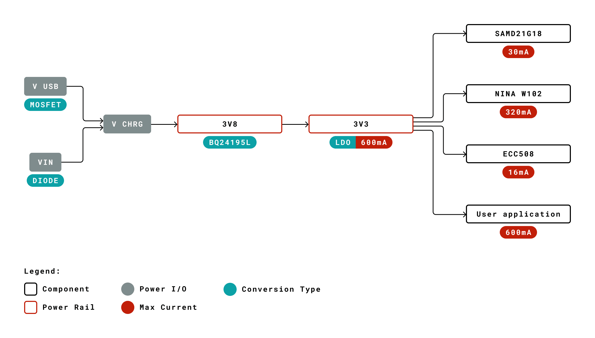
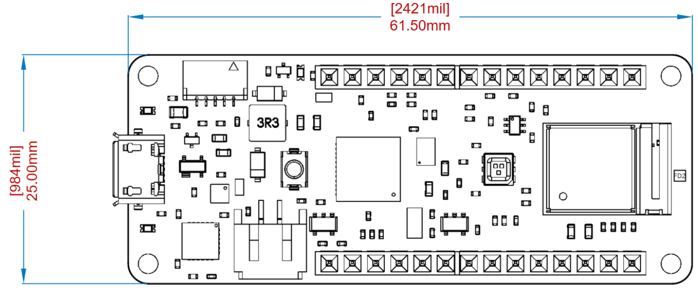
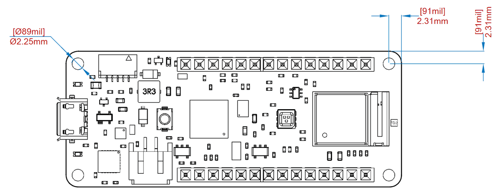
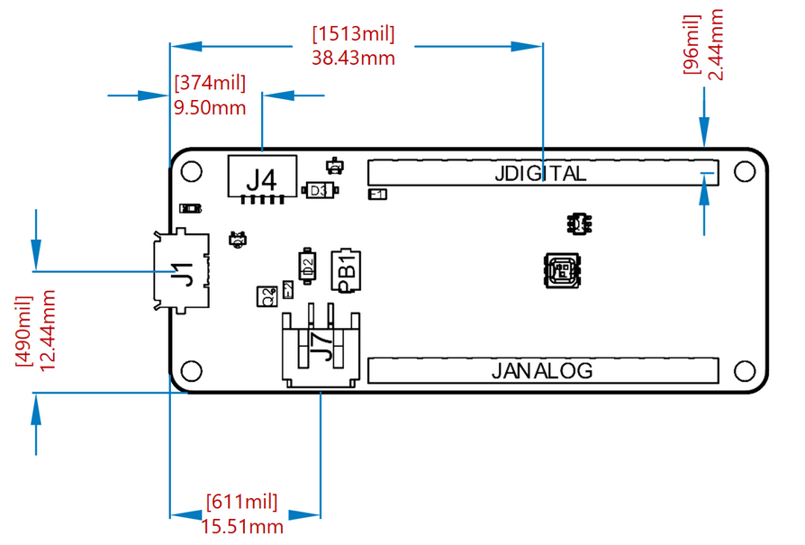

# Description
The MKR WiFi 1010 is a miniature sized module containing a SAMD21G18A Processor, the Nina W102 Module and a crypto chip (the ATECC508). 

# Target Areas
Prototyping, IoT application examples

# Features
- **SAMD21G18A**
  - **Processor**
      - ARM Cortex M0+ at up to 48 MHz
      - 256KB Flash
      - 32KB SRAM
      - Power On Reset (POR) and Brown Out Detection (BOD)

  - **Peripherals**
      - 12 channel DMA
      - 12 channel event system
      - 5x 16 bit Timer/Counter
      - 3x 24 bit timer/counter with extended functions
      - 32 bit RTC
      - Watchdog Timer
      - CRC-32 generator
      - Full speed Host/Device USB with 8 end points
      - 6x SERCOM (USART, I2C, SPI, LIN)
      - Two channel I2S
      - 12 bit 350ksps ADC (up to 16 bit with oversampling)
      - 10 bit 350ksps DAC
      - External Interrupt Controller (up to 16 lines)

- **ATECC508 Crypto Chip**
    - Cryptographic co-processor with secure hardware based key storage
    - Protected storage for up to 16 keys, certificates or data
    - ECDH: FIPS SP800-56A Elliptic Curve Diffie-Hellman
    - ECDSA: FIPS186-3 Elliptic Curve Digital Signature Algorithm
    - NIST standard P256 elliptic curve support
    - SHA-256 & HMAC hash including off-chip context save/restore

- **Nina W102 Module**
    - Dual Core Tensilica LX6 CPU at up to 240MHz

  - **WiFi**
      - IEEE 802.11b up to 11Mbit
      - IEEE 802.11g up to 54MBit
      - IEEE 802.11n up to 72MBit
      - 2.4 GHz, 13 channels
      - 96 dBm sensitivity

  - **Bluetooth BR/EDR**
      - Max 7 Clients
      - 2.4 GHz, 79 channels
      - Up to 3 Mbit/s
      - -88 dBm sensitivity
      - Bluetooth Low Energy
      - Bluetooth 5.0 dual mode
      - 2.4GHz 40 channels
      - -88 dBm sensitivity
      - Up to 1 Mbit/s

- **BQ24125L I2C Controlled USB/Adapter Charger**
    - 92% Charge Efficiency at 2 A, 90% at 4 A
    - Autonomous Battery Charging
    - 2.5-A Fast Charging

# Contents

## The Board

Like most Arduino MKR form factor boards the MKR WiFi 1010  can be powered via USB, via headers or connecting a Lithium or Lithium Polymer battery to the embedded battery charger (the BQ24195L).
**NOTE:** Arduino MKR WiFi 1010 battery charger has a minimum of 512 mA charge current. Please ensure this charging is compatible with the battery you will be using.
**NOTE:** Arduino MKR WiFi 1010 only supports 3.3V I/Os and is NOT 5V tolerant.
Please make sure you are not directly connecting 5V signals to this board, or it will be damaged.
Also the 5V pin does NOT supply voltage but is rather connected, through a jumper, to the USB power input.

### Application Examples

**Bluetooth:** The communications chipset on the MKR WiFi 1010 is something pretty unique in the world of microcontroller platforms, since this can be both a BLE and Bluetooth® client and host device. 

**WiFi:**  The WiFi connectivity is performed with a module from u-blox, the NINA-W10, a low power chipset operating in the 2.4GHz range. 

**IoT:** Whether you are looking at building a sensor network connected to your office or home router, or if you want to create a BLE device sending data to a cell phone, the MKR WiFi 1010 is your one-stop-solution for many of the basic IoT application scenarios.

## Ratings

### Recommended Operating Conditions
| Symbol | Description                                       | Min        | Max     |
| ------ | ------------------------------------------------- | ---------- | ------- |
|        |  Conservative thermal limits for the whole board: |  -40 °C    | 85 °C   |

### Power Consumption
| Symbol          | Description                              | Min | Typ | Max | Unit |
| --------------- | ---------------------------------------- | --- | --- | --- | ---- |
|   $VIN_{Max}$   | Maximum input voltage from VIN pad       | -0.3| - | 5.5 |  V  |
|   $VUSB_{Max}$  | Maximum input voltage from USB connector | -0.3| - | 5.5 |  V  |
|   $P_{Max}$  | Maximum power consumption | -| - | TBC |  mW  |

## Functional Overview

### Processor

The Main Processor is a ARM Cortex M0+  running at up to 48 MHz
Most of its pins are connected to the external headers, however some are reserved for internal communication to the communication module and to the internal SPI and  I2C peripherals (Crypto).
Communication with  NINA Module W102 happens through UART and SPI through the following pins.

| Pin | Acronym | NINA Pin | Acronym   | Description |
| --- | ------- | -------- | --------- | ----------- |
| 21  | PA12    | 36       | GPIO12    | SPI MOSI    |
| 22  | PA13    | 21       | SPIV\_DI  | NINA\_MISO  |
| 23  | PA14    | 28       | SPIV\_CS  | SPI CS      |
| 24  | PA15    | 29       | SPIV\_CLK | SPI CLK     |
| 39  | PA27    | 27       | GPIO0     | NINA\_GPIO0 |
| 7   | PB08    | 19       | RESET     | NINA RESET  |
| 41  | PA28    | 7        | GPIO\_33  | NINA\_ACK   |
| 23  | PA14    | 21       | UART\_CTS | NINA\_CS    |
| 24  | PA15    | 20       | UART\_CTS | NINA\_SCK   |
| 38  | PB23    | 22       | UART\_RXD | Serial1\_RX |
| 37  | PA22    | 23       | UART\_TXD | Serial1\_TX |

### WiFi Module

WiFi connectivity is provided by a Nina W102 Module. This module contains a STM32L0 processor along with a Semtech SX1276 Radio. The processor is running on Arduino open source firmware based on Semtech code.
NOTE: Although Firmware is open source, modifying it will require recertification of the radio stack.

### Crypto Chips
The crypto chip in Arduino IoT boards is what makes the difference with other less secure boards as it provides a secure way to store secrets such as certificates and it also allows accelerating secure protocols while never exposing secrets in plain text.

### Power Tree

## Board Operation
### Getting Started - IDE
If you want to program your Arduino MKR WiFi 1010 while offline you need to install the Arduino Desktop IDE [1] To connect the Arduino MKR WiFi 1010 to your computer, you’ll need a Micro-B USB cable. This also provides power to the board, as indicated by the LED.

### Getting Started - Arduino Web Editor
All Arduino boards, including this one, work out-of-the-box on the Arduino Web Editor [2], by just installing a simple plugin.
The Arduino Web Editor is hosted online, therefore it will always be up-to-date with the latest features and support for all boards. Follow [3] to start coding on the browser and upload your sketches onto your board.

### Getting Started - Arduino Cloud
All Arduino IoT enabled products are supported on Arduino Cloud which allows you to Log, graph and analyze sensor data, trigger events, and automate your home or business.

### Arduino Forum
Discussions and ideas for the Arduino MKR WiFi 1010 can be found in the Arduino Forum [4].

### Online Resources
Now that you have gone through the basics of what you can do with the board you can explore the endless possibilities it provides by checking exciting projects on ProjectHub [5], the Arduino Library Reference [6] and the online store [7] where you will be able to complement your board with sensors, actuators and more.

### Board Recovery
All Arduino boards have a built-in bootloader which allows flashing the board via USB. In case a sketch locks up the processor and the board is not reachable anymore via USB it is possible to enter bootloader mode by double-tapping the reset button right after power up.

## Connector Pinouts

### USB

| Pin | Function | Type         | Description                                                         |
| --- | -------- | ------------ | ------------------------------------------------------------------- |
| 1   | VUSB     | Power        | Power Supply Input. Output is powered via VUSB from header          |
| 2   | D-       | Differential | USB differential data -                                             |
| 3   | D+       | Differential | USB differential data +                                             |
| 4   | ID       | Analog       | Selects Host/Device functionality                                   |
| 5   | GND      | Power        | Supply Ground                                                       |

**NOTE:** This board can support USB host mode only if powered via the VUSB pin and if the jumper close to the VUSB pin is shorted.

### Headers

Board exposes two 28 pin connectors assembled with pin headers.

| Pin | Function | Type      | Description                                       |
| --- | -------- | --------- | ------------------------------------------------- |
| 1   | AREF     | Analog    | Analog Reference.                                 |
| 2   | A0/DAC0  | Analog    | ADC in/DAC out, Can be used as GPIO               |
| 3   | A1       | Analog    | ADC in, Can be used as GPIO                       |
| 4   | A2       | Analog    | ADC in, Can be used as GPIO                       |
| 5   | A3       | Analog    | ADC in, Can be used as GPIO                       |
| 6   | A4/SDA   | Analog    | ADC in, I2C SDA, Can be used as GPIO              |
| 7   | A5/SCL   | Analog    | ADC in, I2C SCL, Can be used as GPIO              |
| 8   | A6       | Analog    | ADC in, Can be used as GPIO                       |
| 9   | D0       | Digital   | GPIO, can be used as PWM                          |
| 10  | D1       |           | GPIO, can be used as PWM                          |
| 11  | D2/PWM   | Digital   | GPIO, can be used as PWM                          |
| 12  | D3/PWM   | Digital   | GPIO, can be used as PWM                          |
| 13  | D4/PWM   | Digital   | GPIO, can be used as PWM                          |
| 14  | D5/PWM   | Digital   | GPIO, can be used as PWM                          |
| 15  | D6       | Digital   | GPIO, can be used as PWM                          |
| 16  | D7       | Digital   | GPIO can be used as PWM                           |
| 17  | D8/MOSI  | Digital   | SPI MOSI, can be used as GPIO, can be used as PWM |
| 18  | D9/SCK   | Digital   | SPI SCK, can be used as GPIO, can be used as PWM  |
| 19  | D10/MISO | Digital   | SPI MISO, can be used as GPIO                     |
| 20  | D11/SDA  | Digital   | I2C SDA, can be used as GPIO                      |
| 21  | D12/SCL  | Digital   | I2C SCL, can be used as GPIO                      |
| 22  | D13/RX   | Digital   | USART RX, can be used as GPIO                     |
| 23  | D14/TX   | Digital   | USART TX, can be used as GPIO                     |
| 24  | RESETN   | Digital   | Reset input                                       |
| 25  | GND      | Power     | Power Ground                                      |
| 26  | +3V3     | Power Out |                                                   |
| 27  | VIN      | Power In  | Vin Power input                                   |
| 28  | +5V      | Power Out |                                                   |

### Debug

| Pin | Function | Type       | Description             |
| --- | -------- | ---------- | ----------------------- |
| 1   | +3V3     | Power Out  |                         |
| 2   | SWD      | Digital    | Single Wire Debug Data  |
| 3   | RESETN   | Digital In | Processor Reset         |
| 4   | SWCLK    | Digital In | Single Wire Debug Clock |
| 5   | GND      | Power      |                         |

## Mechanical Information

Board measures are mixed between metric and imperial. Metric measures are used to maintain 100 mil pitch grid between pin rows to allow them to fit in a breadboard.

### Board Outline

### Mounting Holes

### Connector Positions

## Certifications
### Declaration of Conformity CE DoC (EU)
We declare under our sole responsibility that the products above are in conformity with the essential requirements of the following EU Directives and therefore qualify for free movement within markets comprising the European Union (EU) and European Economic Area (EEA).

**ROHS 2 Directive 2011/65/EU**
Conforms to: EN50581:2012

**Directive 2014/35/EU. (LVD)**
Conforms to: EN 60950-1:2006/A11:2009/A1:2010/A12:2011/AC:2011

**Directive 2004/40/EC & 2008/46/EC & 2013/35/EU, EMF**
Conforms to: EN 62311:2008

### Declaration of Conformity to EU RoHS & REACH 211 01/19/2021
Arduino boards are in compliance with RoHS 2 Directive 2011/65/EU of the European Parliament and RoHS 3 Directive 2015/863/EU of the Council of 4 June 2015 on the restriction of the use of certain hazardous substances in electrical and electronic equipment.

| **Substance**                          | **Maximum Limit (ppm)** |
| -------------------------------------- | ----------------------- |
| Lead (Pb)                              | 1000                    |
| Cadmium (Cd)                           | 100                     |
| Mercury (Hg)                           | 1000                    |
| Hexavalent Chromium (Cr6+)             | 1000                    |
| Poly Brominated Biphenyls (PBB)        | 1000                    |
| Poly Brominated Diphenyl ethers (PBDE) | 1000                    |
| Bis(2-Ethylhexyl} phthalate (DEHP)     | 1000                    |
| Benzyl butyl phthalate (BBP)           | 1000                    |
| Dibutyl phthalate (DBP)                | 1000                    |
| Diisobutyl phthalate (DIBP)            | 1000                    |

Exemptions : No exemptions are claimed.

Arduino Boards are fully compliant with the related requirements of European Union Regulation (EC) 1907 /2006 concerning the Registration, Evaluation, Authorization and Restriction of Chemicals (REACH). We declare none of the SVHCs (https://echa.europa.eu/web/guest/candidate-list-table), the Candidate List of Substances of Very High Concern for authorization currently released by ECHA, is present in all products (and also package) in quantities totaling in a concentration equal or above 0.1%. To the best of our knowledge, we also declare that our products do not contain any of the substances listed on the "Authorization List" (Annex XIV of the REACH regulations) and Substances of Very High Concern (SVHC) in any significant amounts as specified by the Annex XVII of Candidate list published by ECHA (European Chemical Agency) 1907 /2006/EC.

### Conflict Minerals Declaration
As a global supplier of electronic and electrical components, Arduino is aware of our obligations with regards to laws and regulations regarding Conflict Minerals, specifically the Dodd-Frank Wall Street Reform and Consumer Protection Act, Section 1502. Arduino does not directly source or process conflict minerals such as Tin, Tantalum, Tungsten, or Gold. Conflict minerals are contained in our products in the form of solder, or as a component in metal alloys. As part of our reasonable due diligence Arduino has contacted component suppliers within our supply chain to verify their continued compliance with the regulations. Based on the information received thus far we declare that our products contain Conflict Minerals sourced from conflict-free areas.

### FCC Caution
Any Changes or modifications not expressly approved by the party responsible for compliance could void the user’s authority to operate the equipment.

This device complies with part 15 of the FCC Rules. Operation is subject to the following two conditions:

(1) This device may not cause harmful interference

(2) this device must accept any interference received, including interference that may cause undesired operation.

**FCC RF Radiation Exposure Statement:**

1. This Transmitter must not be co-located or operating in conjunction with any other antenna or transmitter.

2. This equipment complies with RF radiation exposure limits set forth for an uncontrolled environment.

3. This equipment should be installed and operated with minimum distance 20cm between the radiator & your body.

English:
User manuals for license-exempt radio apparatus shall contain the following or equivalent notice in a conspicuous location in the user manual or alternatively on the device or both. This device complies with Industry Canada license-exempt RSS standard(s). Operation is subject to the following two conditions:

(1) this device may not cause interference

(2) this device must accept any interference, including interference that may cause undesired operation of the device.

French:
Le présent appareil est conforme aux CNR d’Industrie Canada applicables aux appareils radio exempts de licence. L’exploitation est autorisée aux deux conditions suivantes :

(1) l’ appareil nedoit pas produire de brouillage

(2) l’utilisateur de l’appareil doit accepter tout brouillage radioélectrique subi, même si le brouillage est susceptible d’en compromettre le fonctionnement.

**IC SAR Warning:**

English
This equipment should be installed and operated with minimum distance 20 cm between the radiator and your body.

French:
Lors de l’ installation et de l’ exploitation de ce dispositif, la distance entre le radiateur et le corps est d ’au moins 20 cm.

**Important:** The operating temperature of the EUT can’t exceed 80℃ and shouldn’t be lower than -20℃.

Hereby, Arduino S.r.l. declares that this product is in compliance with essential requirements and other relevant provisions of Directive 2014/53/EU. This product is allowed to be used in all EU member states. 

| Frequency bands       | Maximum output power (EIRP) |
| --------------------- | --------------------------- |
| WiFi(2412-2472MHz)    | 14.49 dBm                   |
| BT EDR(2402-2480 MHz) | 2.16 dBm                    |
| BT BLE(2402-2480 MHz) | 1.24 dBm                    |

## Company Information

| Company name    | Arduino S.r.l.                                                |
| --------------- | ------------------------------------------------------------- |
| Company Address | Via Andrea Appiani 25, 20900 MONZA, Italy                  |

## Reference Documentation

| Ref                       | Link                                                                                                |
| ------------------------- | --------------------------------------------------------------------------------------------------- |
| Arduino IDE (Desktop)     | https://www.arduino.cc/en/software                                                                  |
| Arduino IDE (Cloud)       | https://create.arduino.cc/editor                                                                    |
| Cloud IDE Getting Started | https://create.arduino.cc/projecthub/Arduino_Genuino/getting-started-with-arduino-web-editor-4b3e4a |
| Arduino Documentation     | https://docs.arduino.cc/hardware/mkr-wifi-1010                                                      |
| Project Hub               | https://create.arduino.cc/projecthub?by=part&part_id=11332&sort=trending                            |
| Library Reference         | https://www.arduino.cc/reference/en/libraries/                                                      |
| Online Store              | https://store.arduino.cc/                                                                           |

## Revision History

| **Date**   | **Revision** | **Changes**                           |
| ---------- | ------------ | ------------------------------------- |
|27/09/2022|3|Rendering problems fixed|
|20/09/2022|2|Migration to Markdown, links updated, small typos fixed|
|22/03/2021|1|First Release|
