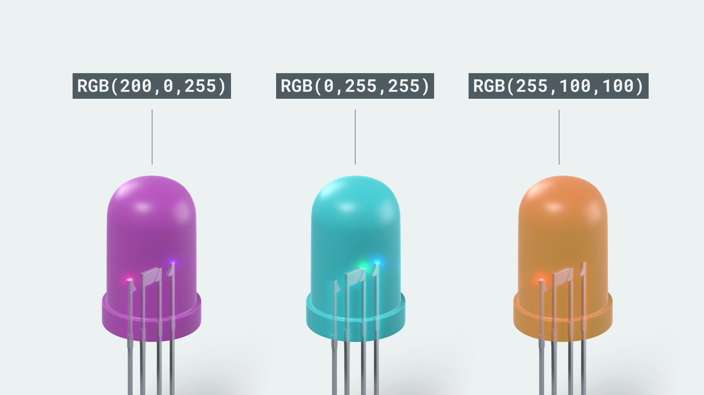
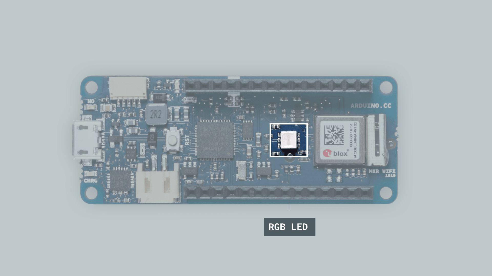
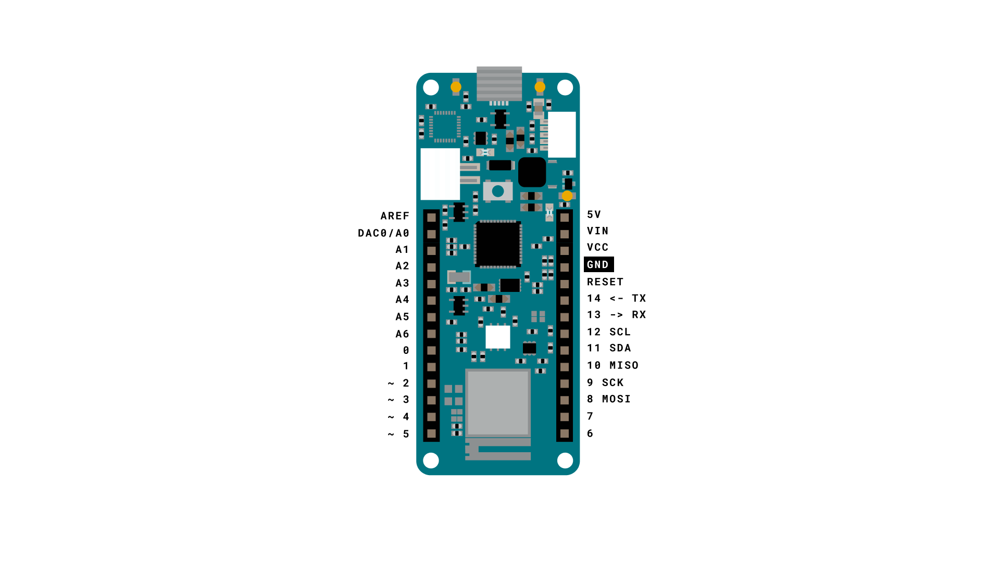
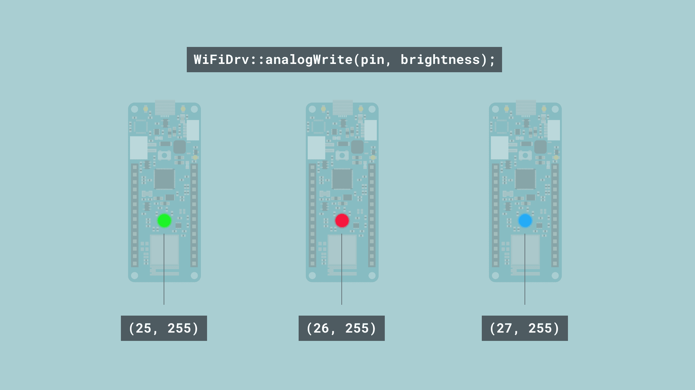

## Introduction

In this tutorial, we are going to find out how to control the MKR WiFi 1010's built-in RGB LED. This component is a really good tool for any type of development: we can use it to prototype a smart light, or perhaps use it as a feedback component.

## Goals

The goals of this project are:

- Learn what commands we can use to control the built-in RGB.
- Make the RGB blink in three different colors.

## Hardware & Software Needed

- Arduino IDE ([online](https://create.arduino.cc/) or [offline](https://www.arduino.cc/en/main/software)).
- [WiFiNINA](https://www.arduino.cc/en/Reference/WiFiNINA) library.
- Arduino MKR WiFi 1010 ([link to store](https://store.arduino.cc/mkr-wifi-1010)).

## RGB (Red, Green, Blue)

There is a good chance that you have already seen or heard the term **RGB**. RGB simply stands for **Red**, **Green** and **Blue**, which are the three colors we need to basically create any type of color. An RGB exists of three small LEDs, one red, one blue and one green. Take a look at the image below, and the values. These values represent each of the color, and when we write these values to the component, it **magically** switches to that color!



The RGB component is used for many different purposes. They can be particularly useful to signify the state of something. For example: if we want to signify that everything is OK, we can simply change the color to green, if there's a minor error we can change the color to yellow, and if there is a major error we can change it to red.

### Controlling the Built-in RGB

The built-in RGB is located right next to the **NINA-W102** Wi-Fi module on the MKR 1010 board.



Controlling the RGB on the MKR WiFi 1010 is slightly different from any previous experiences you might have had with a similar component. First of all, we cannot access it directly, we need to use the functionalities of the [WiFiNINA](https://www.arduino.cc/en/Reference/WiFiNINA) library. More specifically, we need to access a file called `wifi_drv.h` in order to work with it. Below is a code snippet that explains how to include this file in your sketch:

```arduino
#include <WiFiNINA.h>
#include <utility/wifi_drv.h>
```

After we have included it, it is pretty straightforward. The RGB component uses 25 (green), 26 (red) and 27 (blue), so we need to define those pins by using the following commands:

```arduino
  WiFiDrv::pinMode(25, OUTPUT); //define GREEN LED
  WiFiDrv::pinMode(26, OUTPUT); //define RED LED
  WiFiDrv::pinMode(27, OUTPUT); //define BLUE LED
```

***Please note that in some older versions, the green and red LEDs are swapped (pin `25` and `26`).***

And to control them inside the `loop()`, we simply use:

```arduino
  WiFiDrv::analogWrite(25, 255); //GREEN
  WiFiDrv::analogWrite(26, 0);   //RED
  WiFiDrv::analogWrite(27, 0);   //BLUE
```

Or, if we want to use `digitalWrite()` (for simply turning on with full brightness), we can write it like this:

```arduino
  WiFiDrv::digitalWrite(25, HIGH); //GREEN
  WiFiDrv::digitalWrite(26, LOW);   //RED
  WiFiDrv::digitalWrite(27, LOW);   //BLUE
```

### Circuit

This tutorial requires only the MKR WiFi 1010 board. No additional circuit is required.




## Programming the Board

**1.** First, let's make sure we have the drivers installed. If we are using the Web Editor, we do not need to install anything. If we are using an offline editor, we need to install it manually. This can be done by navigating to **Tools > Board > Board Manager...**. Here we need to look for the **Arduino SAMD boards (32-bits ARM Cortex M0+)** and install it.

**2.** Now, we need to install the library needed. If we are using the Web Editor, there is no need to install anything. If we are using an offline editor, simply go to **Tools > Manage libraries..**, and search for **WiFiNINA** and install it.

**3.** We can now take a look at some of the core functions of this sketch:

- `#include <WiFiNINA.h>` - includes the WiFiNINA library.
- `#include <utility/wifi_drv.h>` - includes the `wifi_drv.h` file.
- `WiFiDrv::pinMode(pin, OUTPUT)` - defines the pin as an output.
- `WiFiDrv::analogWrite(pin, brightness)` - writes the brightness value to the pin. For example, (27, 127) sets the blue LED to half brightness.

The sketch can be found in the snippet below. Upload the sketch to the board.

```arduino
#include <WiFiNINA.h>
#include <utility/wifi_drv.h>

void setup() {
  WiFiDrv::pinMode(25, OUTPUT); //define green pin
  WiFiDrv::pinMode(26, OUTPUT); //define red pin
  WiFiDrv::pinMode(27, OUTPUT); //define blue pin
}

void loop() {
  WiFiDrv::analogWrite(25, 255);
  WiFiDrv::analogWrite(26, 0);
  WiFiDrv::analogWrite(27, 0);

  delay(1000);

  WiFiDrv::analogWrite(25, 0);
  WiFiDrv::analogWrite(26, 255);
  WiFiDrv::analogWrite(27, 0);

  delay(1000);

  WiFiDrv::analogWrite(25, 0);
  WiFiDrv::analogWrite(26, 0);
  WiFiDrv::analogWrite(27, 255);

  delay(1000);

  WiFiDrv::analogWrite(25, 0);
  WiFiDrv::analogWrite(26, 0);
  WiFiDrv::analogWrite(27, 0);

  delay(1000);
}
```

## Testing It Out

Shortly after we have uploaded the sketch to the board, we should see the RGB start changing colors. The correct order should be:

- Green.
- Red.
- Blue.
- Off.

At the end of the `loop()`, we wrote a value of `0` to all RGBs, which simply turns them all off. It should be changing at an interval of 1 second, as we used `delay(1000)` between each color change.



### Troubleshoot

If the code is not working, there are some common issues we can troubleshoot:

- We have not installed the **WiFiNINA** library.
- We are not using the MKR WiFi 1010 board (only this MKR board has an RGB built in).

## Conclusion

In this tutorial we have covered the basics of simply turning ON and OFF an the built-in RGB LED on the MKR WiFi 1010. It can be a very useful tool for signalling the state of something (such as connection, signal strength), or simply if we want to play around with an RGB without having to connect anything.
