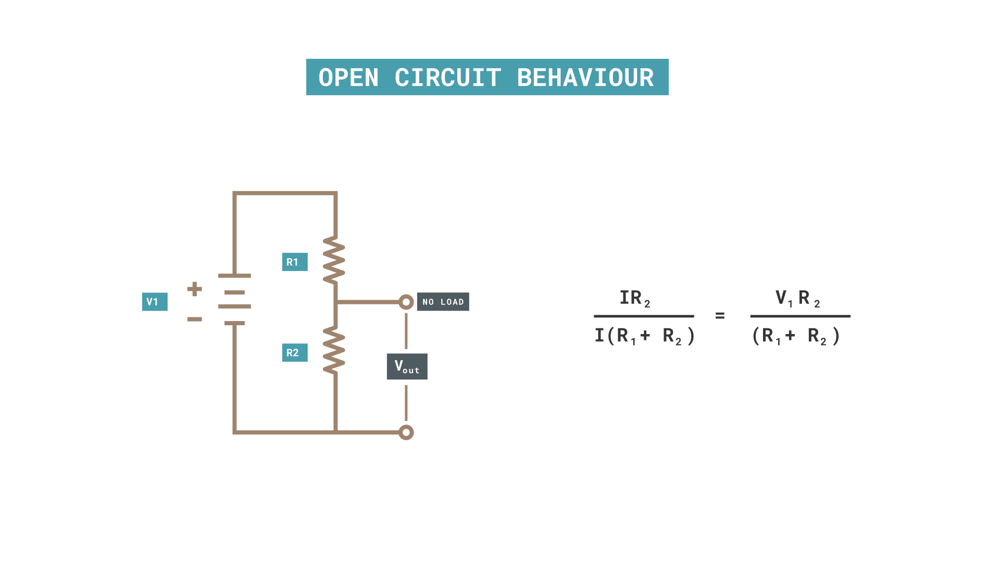
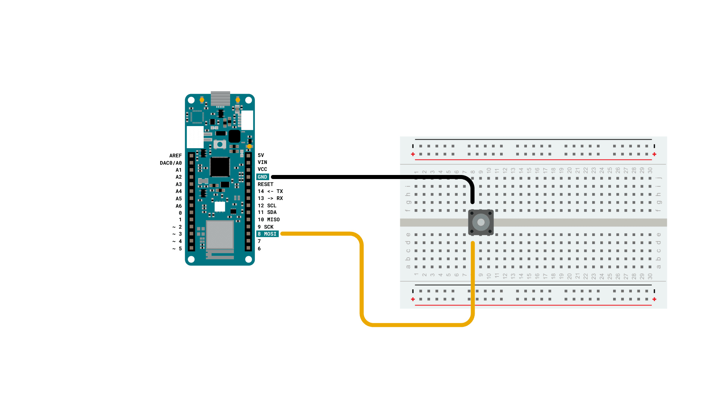
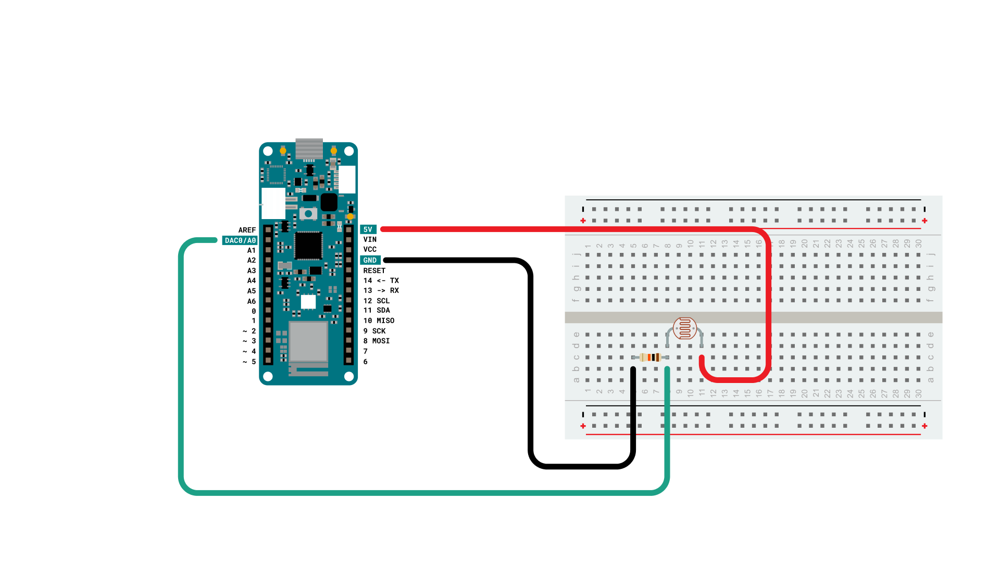
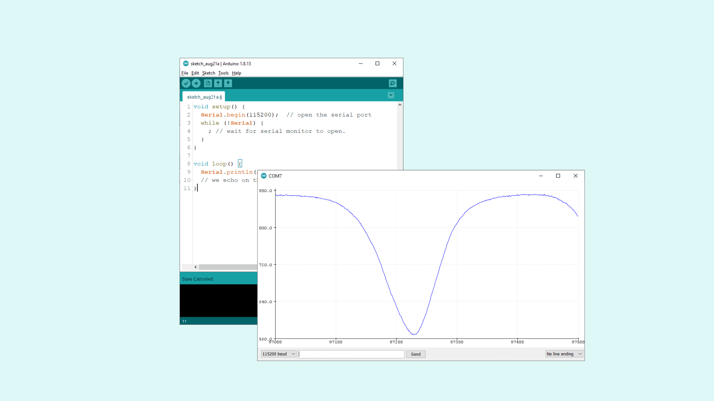
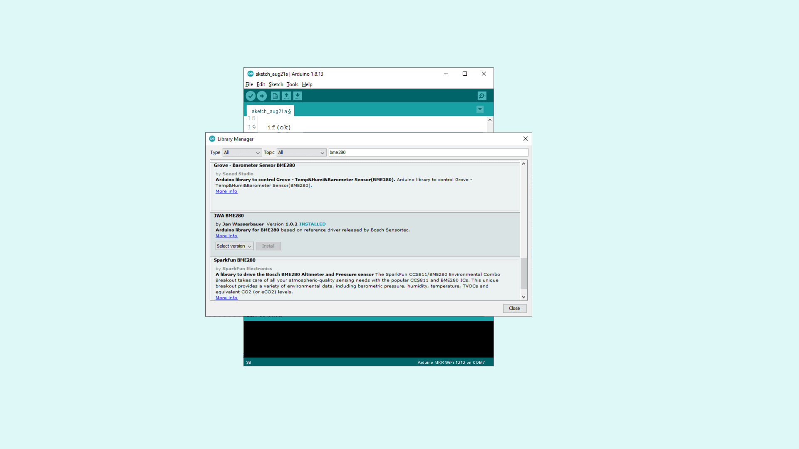
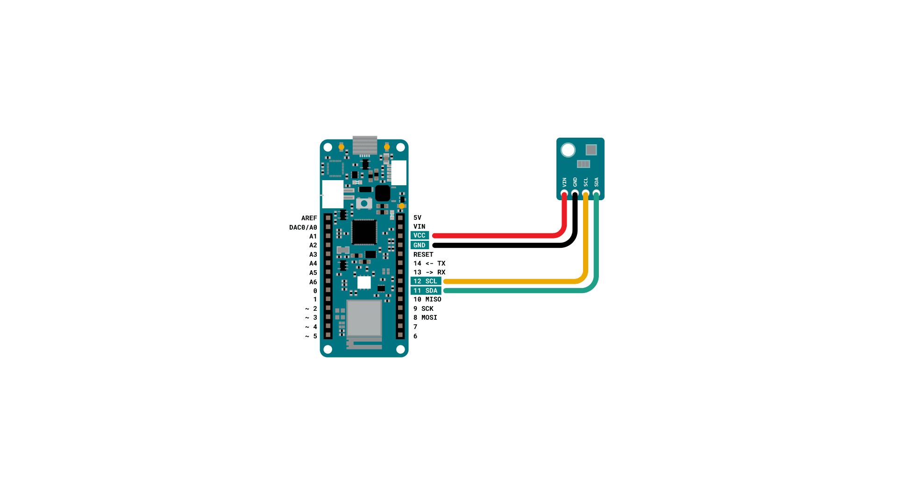
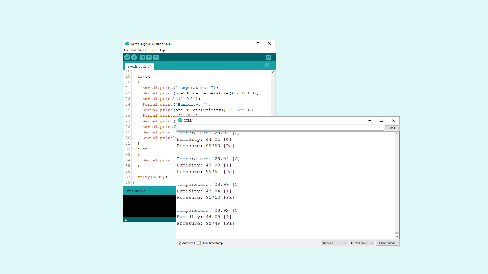

## Introduction

In this tutorial we will learn how to connect different sensors to our Arduino MKR WiFi 1010 board to achieve interaction and sensing of the environment. There are several types of sensors but we will go through the three main types, giving you the basic knowledge to deal with each type.

The types we will cover are analog, digital and I2C digital sensors. With the term sensor we define circuits and devices that allow our Arduino board to get an input of some type, according to a change in the surroundings.

## Goals

- Learn three main types of sensors.
- Learn how to get raw data from sensors.
- Use the JWA BME280 library.

___

## Hardware & Software Needed

- Arduino IDE ([online](https://create.arduino.cc/) or [offline](https://www.arduino.cc/en/main/software)).
- Arduino MKR WiFi 1010 ([link to store](https://store.arduino.cc/mkr-wifi-1010)).
- Micro USB cable
- 10k ohm photoresistor
- 10k ohm resistor
- Pushbutton
- I2C BME280 pressure, humidity and temperature sensor
- Breadboard
- Jumper wires

___

## Sensor Types

We will begin by taking a look at the different type of sensors we will be covering in this tutorial.

### Digital

The first type of sensor, the simplest one, is basically a contact that can be open and closed at will by some mechanical action. A pushbutton, a microswitch, a magnetic reed are examples of such sensor and they can all be read by Arduino, using the `digitalRead()` function. This type of sensor returns either a HIGH (3.3V) or a LOW (0V) value when IDLE or ACTIVE. Depending on the wiring, this sensor can produce one of these values in the idle status and we will see how to get the easiest and safest solution for our digital sensor.

What is important to remember is that the inputs can’t be left “floating” (unconnected) and read reliably: if your pushbutton or sensor is connected and normally open, the reading could pick a random value of High or Low. To avoid these uncertainties it is necessary to use a pullup or pulldown resistor: a high value resistor that keeps the input at a known level when the sensor circuit is open.

To make things easier, the microcontroller has an internal pullup resistor that can be enabled or disabled via software. With a NO (Normally Open) pushbutton we should connect it to ground and enable the pullup resistor with the `pinMode(pin, INPUT_PULLUP)`.  At reset or powerup the pullup resistors are disabled.

### Analog

The analog sensors offer a continuous range of values in an interval, depending on their type. A photoresistor is a passive component that varies its resistance from as low as 4k ohm in full light, down to 30k ohm in darkness, while a moisture sensor reads the amount of water in soil returning a voltage that is proportional to the water content.

In all these cases we have to take in account some details: the sensor can be active or passive and in both cases we use the Arduino circuitry to turn a value that varies in an **analog** fashion, into a digital value that has a limited number of steps to cover the whole range available. The conversion is made by a special circuitry that quantizes the analog value to the nearest digital step available with 0 or 0v, corresponding to lowest and 1023 or 3.3V, to the highest. The circuit reads a voltage, but this voltage can be a consequence of a resistance by a passive sensor, or a real voltage generated by an active sensor (a solar cell, a piezo trigger, a current sensor). {/* This last sentence is a little confusing */}

If a voltage is the consequence of a resistance of some passive component (soil moisture, photoresistor) we need to consider that the voltage read is proportional to the current that flows into the resistor. Arduino analog inputs have a very high input resistance and therefore they do not represent a load. In other words with a negligible flow of current, the voltage read at the analog input will almost always be the same to the sensor. To get a variation in the reading we need to create a resistive divider. It is a simple circuit where we have two resistors connected in series, as shown in the graphic.



We have the open circuit formula because the Arduino Analog Input has a negligible load. If the R1 and R2 have a fixed value, **Vout** will have a fixed value as well, but if we have our photoresistor as one of the two resistors, we will have a varying Vout according to the change of illumination on the sensor. The variation direction depends on where you put the photoresistor in this circuit: R1 to get a higher value from `analogRead()` when light goes up, R2 to get a lower value from `analogRead()` when light goes up.

In any case, we can’t have the full range of 1023 steps from this circuit because the photoresistor has a minimum and a maximum resistance that goes into our equation together with the fixed resistor. It is easy to see that we can get very close to either 0V or 3.3V adjusting the value of the resistor,  but the range will be biased towards one side or the other.

An active sensor can solve this using some circuitry that defines a minimum and a maximum and that will translate to the  full range from 0V to 3.3V. An important reminder is that our MKR WiFi 1010 is a 3.3V microcontroller and any input can tolerate up to this voltage. Any level of 5V or more to any of its input will damage the microcontroller.

### I2C

These sensors use a serial two wire interface that allows the coexistence of several devices on the same bus. Each device is connected to the same two lines (Serial Data / SDA and Serial Clock / SCL) and each has a unique 7 bit address that is used to communicate with it. The communication is initiated by the controlling device (the Arduino) and the device with the corresponding address executes the command received. Each device has its own set of commands and functionalities, this is why we usually have a library for each device together with the standard wire library that takes care of I2C protocol.

The nice thing about I2C is that we can also have actuators, like an LCD screen, on the bus making the wiring of an entire device with sensors and actuators a quite simple matter: just four wires going from one device to the next one (VCC, GND, SDA, SCL). Some devices have additional connections for special functions.

The number of addresses available for I2C devices is 127 (7 bit) and 0 is the “general call” address. As you may imagine, the number of devices that use I2C are more than 127 and there are many cases where you need to use more than one device of the same type in the same circuit. Addressing, offers some flexibility and it is possible to change the address of some devices by hardware or software. An alternative is to use I2C on different buses (connections) with a circuit that allows us to select the proper bus.

Last, but not least important, every Arduino can be either the controller or the controlled device on an I2C bus; the software library that takes care of I2C communication is **Wire** and supports both roles.

## Creating the Programs

First, let's make sure we have the drivers installed. If we are using the Web Editor, we do not need to install anything. If we are using an offline editor, we need to install it manually. This can be done by navigating to **Tools > Board > Board Manager...**. Here we need to look for the **Arduino SAMD boards (32-bits ARM Cortex M0+)** and install it.

---

### Digital Sensor Example

In this example we connect a pushbutton to the board, on D8 and to the GND. To avoid a floating value on our digital pin when the pushbutton is not pressed, we use `pinMode(D8, INPUT_PULLUP)` that activates the internal pullup resistor and therefore reads a 1 when the contact is open.
It is worth noting that this solution gives a 0 when the button is pressed and usually this value is associated with the logic state **false**.

If you want to reverse the situation, with a 1 read when the pushbutton is pressed, you need to connect a high value resistor (10k ohm is fine) to ground and to the digital pin to which you connect the pushbutton, that in turn goes to VCC. When the pushbutton is open the digital pin reads the ground level through the resistor (a pull down resistor) and when the pushbutton closes, the VCC will show up at the digital pin.

Here is the wiring diagram for the internal pullup solution:



You can find the code in the snippet below:

```arduino
void setup() {
  pinMode(8, INPUT_PULLUP);  // Pin 8 reads 1 if not connected to GND
  pinMode(LED_BUILTIN, OUTPUT); // We can now use the built in LED
}
void loop() {
 digitalWrite(LED_BUILTIN, digitalRead(8));
  // we echo the status of the pin 8 input on the built in LED
}
```

---

### Analog Sensor Example

The Light Dependent Resistor (LDR) is a passive component that varies its resistance according to the light hitting its active area (the brown material between the conducive fingers - cadmium sulphide). It is a passive component as it does not amplify or add energy to the circuit. For instance, we can say that it works as a potentiometer with the knob substituted by light intensity.

In this example we create a resistor divider with the LDR and a 10K ohm resistor. The LDR is connected to the VCC pin (3.3V) on one side and A0 on the other. The 10K ohm is connected to A0 and GND.

Here is the wiring diagram for connecting the LDR:



```cpp
void setup() {
  Serial.begin(115200);  // open the serial port
  while (!Serial) {
    ; // wait for serial monitor to open.
  }
}

void loop() {
  Serial.println(analogRead(A0));
  // we echo on the serial port the value read on the analog pin
}
```

The code is simplified to the essential and the best results are achieved by opening the Serial Plotter. The graph will float and clearly show the variation of the resistance when you move your hand in front of it.



---

### I2C Sensor Example

In the sea of I2C sensors we chose a classic to provide a simple but effective example. The choice fell on [BME280 by Bosch Sensortec](https://www.bosch-sensortec.com/products/environmental-sensors/humidity-sensors-bme280/). This sensor measures temperature, humidity and pressure, allowing you to calculate some theoretical altitude if you know the sea level pressure of your location.

It is compatible with the MKR board that works with 3.3V and most of the modules you find on the market have support circuitry to support 5V and 3.3V.

The VCC and GNC go to MKR VCC and GND pins, while SDA (Data) and SCL (Clock) correspond to the pins 11 and 12. These pins are the default ones, but it is possible to reprogram the SAMD21 to use different pins. You can find more information at [this link](https://www.arduino.cc/en/Tutorial/SamdSercom).

The four wires are all it is needed for our sensor. If you want to connect other sensors, you just daisy chain them bringing the same four wires from this sensor to the next device.

The BME280, as almost all other I2C devices, requires a BME280 library to be used. You can easily install this in the library manager.



Here is the wiring diagram for connecting the BME280 sensor:



```arduino

#include <Bme280BoschWrapper.h>

Bme280BoschWrapper bme280(true);

void setup() {
  Serial.begin(9600);
  Serial.println("BME280 Bosch test");

  while(!bme280.beginI2C(0x76))
  {
    Serial.println("Cannot find sensor.");
    delay(1000);
  }
}

void loop() {
  bool ok = bme280.measure();

  if(ok)
  {
    Serial.print("Temperature: ");
    Serial.print(bme280.getTemperature() / 100.0);
    Serial.println(" [C]");
    Serial.print("Humidity: ");
    Serial.print(bme280.getHumidity() / 1024.0);
    Serial.println(" [%]");
    Serial.print("Pressure: ");
    Serial.print(bme280.getPressure());
    Serial.println(" [Pa]");
    Serial.println();
  }
  else
  {
    Serial.println("Measuring failed.");
  }

  delay(5000);
}
```

The output of this example should look, with different values like this:



___

### Troubleshoot

If the code is not working, there are some common issues we can troubleshoot:
- We have not updated the latest firmware for the board.
- We have not installed the Board Package required for the board.
- We have not installed the **JWA BME280** library.
- We have selected the wrong port to upload: depending on what computer we use, sometimes the board is duplicated. By simply restarting the editor, this issue can be solved.

## Conclusion

Sensors are a very important part of physical computing and the Arduino boards are made to support a huge variety of them. In this tutorials we gave you the right clues to connect the main types and you can find a lot more of specific examples for I2C sensors on our Project Hub.

