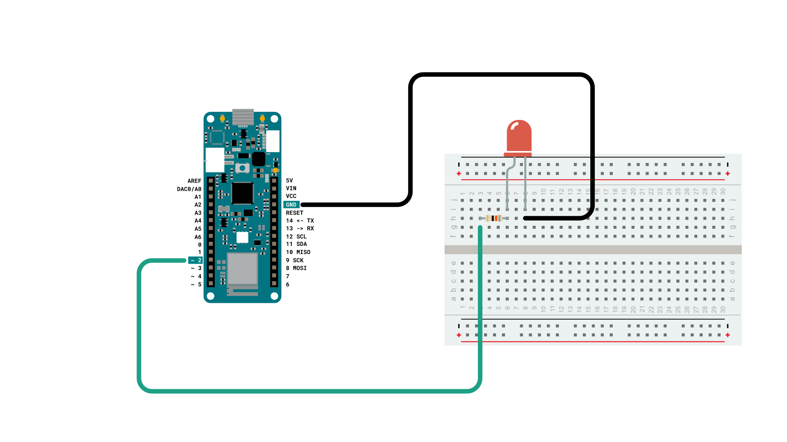
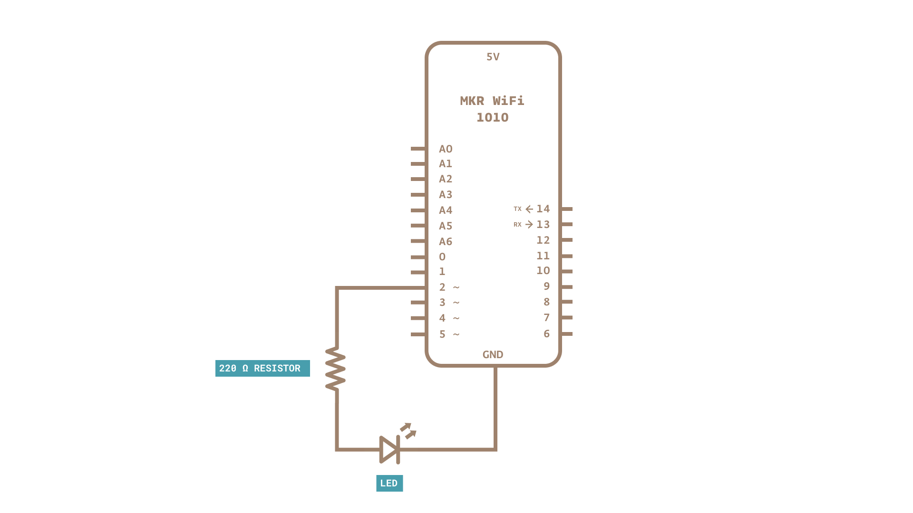
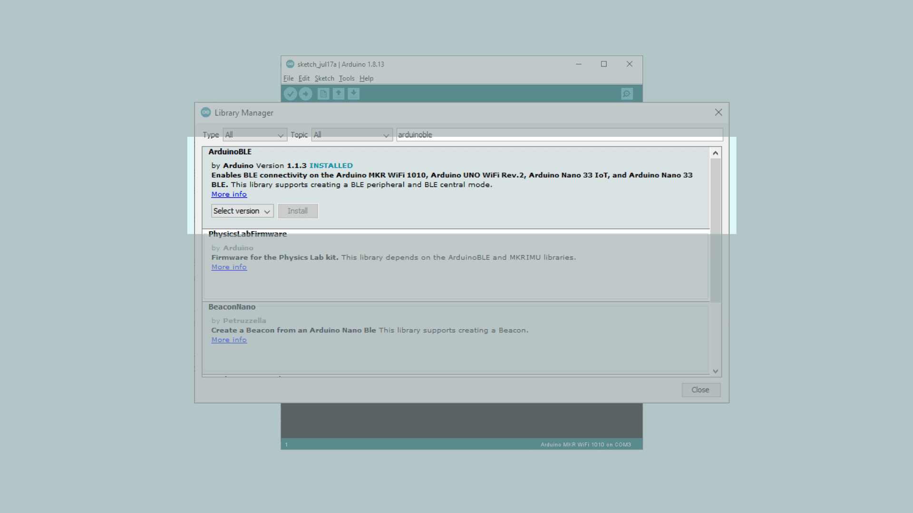
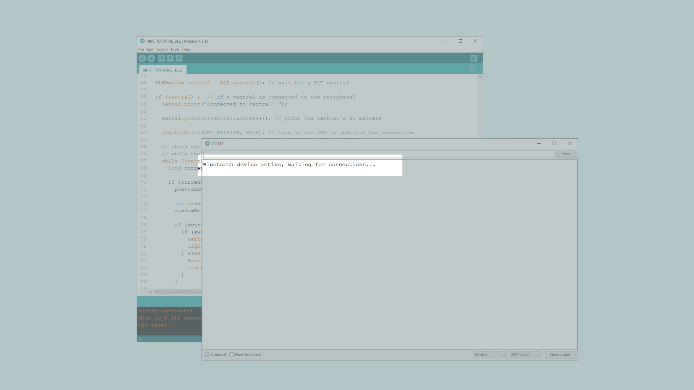
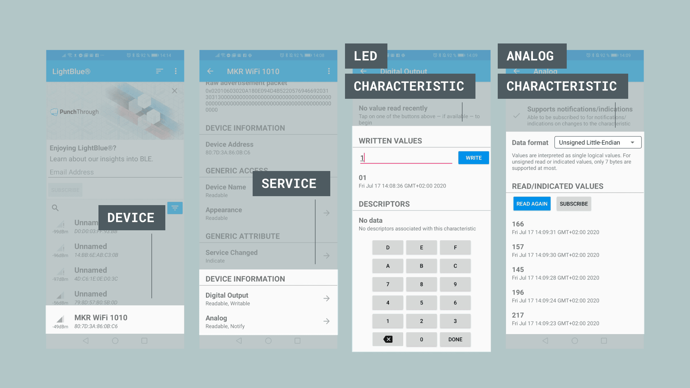

## Enabling Bluetooth® Low Energy
Bluetooth® Low Energy separates itself from what is now known as “Bluetooth® Classic” by being optimized to use low power with low data rates. There are two different types of Bluetooth® devices: central or peripheral. A central Bluetooth® device is designed to read data from peripheral devices, while the peripheral devices are designed to do the opposite. Peripheral devices continuously post data for other devices to read, and it is precisely what we will be focusing on today. 

This tutorial is a great starting point for any maker interested in creating their own Bluetooth® projects.


## Hardware & Software Needed

- Arduino IDE ([online](https://create.arduino.cc/) or [offline](https://www.arduino.cc/en/main/software)).
- [ArduinoBLE](https://www.arduino.cc/en/Reference/ArduinoBLE) library installed.  
- Arduino MKR WiFi 1010 ([link to store](https://store.arduino.cc/mkr-wifi-1010)).
- Micro USB cable
- LED
- 220 ohm resistor
- Breadboard
- Jumper wires


## Service & Characteristics

A service can be made up of different data measurements. For example, if we have a device that measures wind speed, temperature and humidity, we can set up a service that is called “Weather Data”. Let’s say the device also records battery level and energy consumption, we can set up a service that is called “Energy information”. These services can then be subscribed to central Bluetooth® devices. 

Characteristics are components of the service we mentioned above. For example, the temperature or battery level are both characteristics, which record data and update continuously. 

## Unique Universal Identifier (UUID)

When we read data from a service, it is important to know what type of data we are reading. For this, we use UUIDs, who basically give a name to the characteristics. For example, if we are recording temperature, we want to label that characteristic as temperature, and to do that, we have to find the UUID, which in this case is “2A6E”. When we are connecting to the device, this service will then appear as “temperature”. This is very useful when tracking multiple values. 

If you want to read more about UUIDs, services, and characteristics, check the links below:

- <a href="https://www.bluetooth.com/specifications/gatt/services/" target="_blank">GATT services</a>. 
- <a href="https://www.bluetooth.com/specifications/gatt/characteristics/" target="_blank">GATT characteristics</a>. 

___

### Circuit

Follow the wiring diagram below to connect the LED to the MKR WiFi 1010 board.




### Schematic

Follow the wiring diagram below to connect the LED to the MKR WiFi 1010 board.



___

## Creating the Program

The goal with this tutorial is to be able to access our MKR WiFi 1010 board via Bluetooth®, and control an LED onboard it.  We will also retrieve the latest readings from an analog pin. We will then use UUIDs from the official Bluetooth® page, that are compliant with GATT (Generic Attribute Profile). This way, when we access our device later, the service and characteristics can be recognized! 

We will go through the following steps in order to create our sketch:

- Create a new service.
- Create an LED characteristic.
- Create an analog pin characteristic.
- Set the name for our device.
- Start advertising the device.
- Create a conditional that works only if an external device is connected (smartphone).
- Create a conditional that turns on an LED over Bluetooth®.
- Read an analog pin over Bluetooth®.

**1.** First, let's make sure we have the drivers installed. If we are using the Web Editor, we do not need to install anything. If we are using an offline editor, we need to install it manually. This can be done by navigating to **Tools > Board > Board Manager...**. Here we need to look for the **Arduino SAMD boards (32-bits Arm® Cortex®-M0+)** and install it. 

**2.** Now, we need to install the library needed. If we are using the Web Editor, there is no need to install anything. If we are using an offline editor, simply go to **Tools > Manage libraries..**, and search for **ArduinoBLE** and install it.



With the dependencies installed, we will now move on to the programming part.

___

### Code Explanation

>**NOTE:** This section is optional, you can find the complete code further down on this tutorial. 

First, we need to include the **ArduinoBLE** library, and create a new service. We will name the service **"180A"** which is translated to **"Device Information"**.  We will then create two characteristics, one for the LED, and one for the analog pin. The name **"2A57"** is translated to **"Digital Output"** and **"2A58** is translated to **"Analog"**. 

```arduino
#include <ArduinoBLE.h>
BLEService newService("180A"); // creating the service

BLEUnsignedCharCharacteristic randomReading("2A58", BLERead | BLENotify); // creating the Analog Value characteristic
BLEByteCharacteristic switchChar("2A57", BLERead | BLEWrite); // creating the LED characteristic

const int ledPin = 2;
long previousMillis = 0;

```

In the `setup()`, we will start by initializing serial communication, define both the in-built LED and the LED we connected to pin 2, and initialize the **ArduinoBLE** library.

We then set the name for our device, using the command `BLE.setLocalName("MKR WiFi 1010");`, then add the characteristics we defined previously to the service created earlier, `newService`. After they have been added, we will also add the service, using the command `BLE.addService(newService);`.

The final steps we will take is to set the starting value of 0 for both characteristics. This is mostly important for the LED, since 0 means it will be OFF from the start.

The setup is finished by using the command `BLE.advertise();`, which makes it visible for other devices to connect to.

```arduino
void setup() {
  Serial.begin(9600);    // initialize serial communication
  while (!Serial);       //starts the program if we open the serial monitor.

  pinMode(LED_BUILTIN, OUTPUT); // initialize the built-in LED pin to indicate when a central is connected
  pinMode(ledPin, OUTPUT); // initialize the built-in LED pin to indicate when a central is connected

  //initialize ArduinoBLE library
  if (!BLE.begin()) {
    Serial.println("starting Bluetooth® Low Energy failed!");
    while (1);
  }

  BLE.setLocalName("MKR WiFi 1010"); //Setting a name that will appear when scanning for Bluetooth® devices
  BLE.setAdvertisedService(newService);

  newService.addCharacteristic(switchChar); //add characteristics to a service
  newService.addCharacteristic(randomReading);

  BLE.addService(newService);  // adding the service

  switchChar.writeValue(0); //set initial value for characteristics
  randomReading.writeValue(0);

  BLE.advertise(); //start advertising the service
  Serial.println(" Bluetooth® device active, waiting for connections...");
}
```

In the `loop()` we will use the command `BLEDevice central = BLE.central();` to start waiting for a connection. When a device connects, the address of the connecting device (the central) will be printed in the Serial Monitor, and the in-built LED will turn ON. 

After this, we use a `while` loop that only runs as long as a device is connected. Here, we do a reading of Analog pin 1, which will record random values between 0 and 1023. We then use a conditional to check if there's an incoming value: if any value other than 0 comes in, the LED turns ON, but if 0 comes in, it turns it OFF.

If our device (smartphone) disconnects, we exit the `while` loop. Once it exits, it turns off the in-built LED and the message **"Disconnected from central"** prints in the Serial Monitor. 

```cpp
void loop() {
  
  BLEDevice central = BLE.central(); // wait for a Bluetooth® Low Energy central

  if (central) {  // if a central is connected to the peripheral
    Serial.print("Connected to central: ");
    
    Serial.println(central.address()); // print the central's BT address
    
    digitalWrite(LED_BUILTIN, HIGH); // turn on the LED to indicate the connection


    
    while (central.connected()) { // while the central is connected:
      long currentMillis = millis();
      
      if (currentMillis - previousMillis >= 200) { 
        previousMillis = currentMillis;

        int randomValue = analogRead(A1);
        randomReading.writeValue(randomValue);

        if (switchChar.written()) {
          if (switchChar.value()) {   // any value other than 0
            Serial.println("LED on");
            digitalWrite(ledPin, HIGH);         // will turn the LED on
          } else {                              // a 0 value
            Serial.println(F("LED off"));
            digitalWrite(ledPin, LOW);          // will turn the LED off
          }
        }

      }
    }
    
    digitalWrite(LED_BUILTIN, LOW); // when the central disconnects, turn off the LED
    Serial.print("Disconnected from central: ");
    Serial.println(central.address());
  }
}
```


## Complete Code

If you choose to skip the code building section, the complete code can be found below:

```arduino
#include <ArduinoBLE.h>
BLEService newService("180A"); // creating the service

BLEUnsignedCharCharacteristic randomReading("2A58", BLERead | BLENotify); // creating the Analog Value characteristic
BLEByteCharacteristic switchChar("2A57", BLERead | BLEWrite); // creating the LED characteristic

const int ledPin = 2;
long previousMillis = 0;


void setup() {
  Serial.begin(9600);    // initialize serial communication
  while (!Serial);       //starts the program if we open the serial monitor.

  pinMode(LED_BUILTIN, OUTPUT); // initialize the built-in LED pin to indicate when a central is connected
  pinMode(ledPin, OUTPUT); // initialize the built-in LED pin to indicate when a central is connected

  //initialize ArduinoBLE library
  if (!BLE.begin()) {
    Serial.println("starting Bluetooth® Low Energy failed!");
    while (1);
  }

  BLE.setLocalName("MKR WiFi 1010"); //Setting a name that will appear when scanning for Bluetooth® devices
  BLE.setAdvertisedService(newService);

  newService.addCharacteristic(switchChar); //add characteristics to a service
  newService.addCharacteristic(randomReading);

  BLE.addService(newService);  // adding the service

  switchChar.writeValue(0); //set initial value for characteristics
  randomReading.writeValue(0);

  BLE.advertise(); //start advertising the service
  Serial.println(" Bluetooth® device active, waiting for connections...");
}

void loop() {
  
  BLEDevice central = BLE.central(); // wait for a Bluetooth® Low Energy central

  if (central) {  // if a central is connected to the peripheral
    Serial.print("Connected to central: ");
    
    Serial.println(central.address()); // print the central's BT address
    
    digitalWrite(LED_BUILTIN, HIGH); // turn on the LED to indicate the connection

    // check the battery level every 200ms
    // while the central is connected:
    while (central.connected()) {
      long currentMillis = millis();
      
      if (currentMillis - previousMillis >= 200) { // if 200ms have passed, we check the battery level
        previousMillis = currentMillis;

        int randomValue = analogRead(A1);
        randomReading.writeValue(randomValue);

        if (switchChar.written()) {
          if (switchChar.value()) {   // any value other than 0
            Serial.println("LED on");
            digitalWrite(ledPin, HIGH);         // will turn the LED on
          } else {                              // a 0 value
            Serial.println(F("LED off"));
            digitalWrite(ledPin, LOW);          // will turn the LED off
          }
        }

      }
    }
    
    digitalWrite(LED_BUILTIN, LOW); // when the central disconnects, turn off the LED
    Serial.print("Disconnected from central: ");
    Serial.println(central.address());
  }
}
```

## Testing It Out

Once we are finished with the coding, we can upload the sketch to the board. When it has been successfully uploaded, open the Serial Monitor. In the Serial Monitor, the text **" Bluetooth® device active, waiting for connections..."** will appear. 



We can now discover our MKR WiFi 1010 board in the list of available Bluetooth® devices. To access the service and characteristic we recommend using the **LightBlue** application. Follow <a href="https://apps.apple.com/us/app/lightblue/id557428110">this link for iPhones</a> or <a href="https://play.google.com/store/apps/details?id=com.punchthrough.lightblueexplorer&hl=en">this link for Android phones</a>. 

Once we have the application open, follow the image below for instructions:



To control the LED, we simply need to write any value other than 0 to turn it on, and 0 to turn it off. This is within the **"Digital Output"** characteristic, which is located under **"Device Information"**. We can also go into the **"Analog"** characteristic, where we need to change the data format to **"Unsigned Little-Endian"**, and click the **"Read Again"** button. Once we click the button, we will retrieve the latest value. 


### Troubleshoot

If the code is not working, there are some common issues we can troubleshoot:

- We haven't updated the latest firmware for the board.
- We haven't installed the Board Package required for the board.
- We haven't installed the ArduinoBLE library.
- We haven't opened the Serial Monitor to initialize the program.
- The device you are using to connect has its Bluetooth® turned off.

## Conclusion
In this tutorial we have created a basic Bluetooth® peripheral device. We learned how to create services and characteristics, and how to use UUIDs from the official Bluetooth® documentation. In this tutorial, we did two practical things: turning an LED, ON and OFF, and reading a value from an analog pin. You can now start experimenting with this code, and create your own amazing Bluetooth® applications! 

Now that you have learned a little bit how to use the **ArduinoBLE** library, you can try out some of our other tutorials for the MKR WiFi 1010 board. You can also check out the [ArduinoBLE](https://www.arduino.cc/en/Reference/ArduinoBLE) library for more examples and inspiration for creating Bluetooth® projects!


