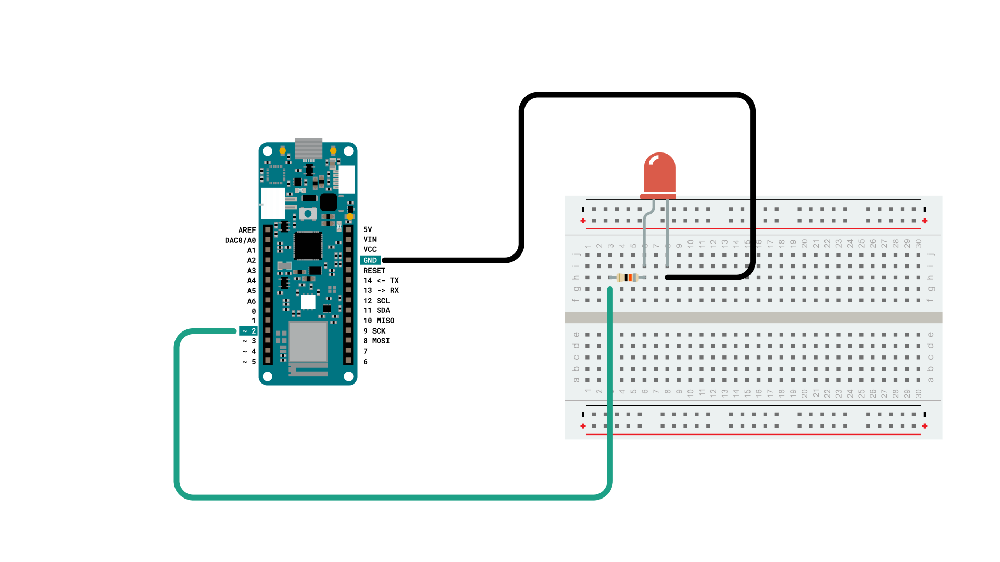
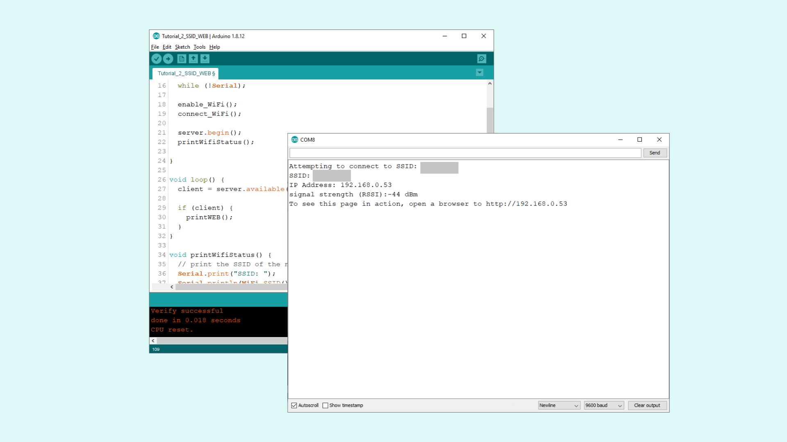
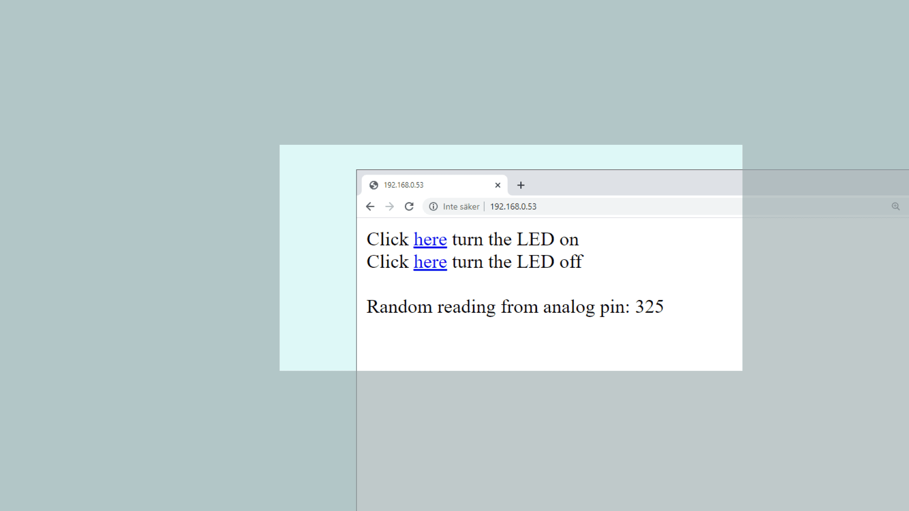

## Introduction

In this tutorial, we will use the MKR WiFi 1010 to set up a simple web server, using the **WiFiNINA** library. The web server will be used as an interface for our board, where we will create two buttons to remotely turn ON or OFF an LED.

___

## Hardware & Software Needed

- Arduino IDE ([online](https://create.arduino.cc/) or [offline](https://www.arduino.cc/en/main/software)).
- [WiFiNINA](https://www.arduino.cc/en/Reference/WiFiNINA) library.
- Arduino MKR WiFi 1010 ([link to store](https://store.arduino.cc/mkr-wifi-1010)).
- Generic LED 
- 220 ohm resistor
- Breadboard
- Jumper wires


### Circuit

Follow the wiring diagram below to connect the LED to the MKR WiFi 1010 board.



### Schematic

This is the schematic of our circuit.


___

## Let's Start

This tutorial barely uses any external hardware, except an LED that we will control remotely. However, the most interesting aspect lies in the library we are going to use: **WiFiNINA**. This library can be used for many different connectivity projects, where it allows us to connect to WiFi, make GET requests and - as we will explore in this tutorial - to create a web server.

In order to create a web server on our MKR WiFi 1010, we will go through the following steps:

- First, we need to initialize the **WiFiNINA** library.
- Then, we will connect to our local Wi-Fi by entering our `SSID` (name of network) and `PASS` (password of network).
- Once connected, it will start hosting a server, and start waiting for a client.
- If we now enter the IP address of our board in our regular browser (e.g. Chrome, Firefox) we connect as a client.
- As long as we are connected, the program detects it and enters a `while()` loop.
- In the `while()` loop, two links are simply printed in HTML format, which are visible in the browser.
- These links control the LED we connected to the board, by turning it "ON" or "OFF".
- If we press the "ON" link, the program is configured to add an "H" to the end of the URL, or if we press the "OFF" link, we add an "L" to the end of the URL.
- If the URL ends with "H", it will turn on the LED, and if it ends with "L" it turns it off. The "H" stands for "HIGH" and the "L" for "LOW".

And that is the summary of the configuration we will be using in this tutorial. There are a few other functionalities, such as: checking if we have the latest firmware and if we are using the right board, where any of the aforementioned potential errors will be printed in the Serial Monitor.

## Creating the Program

**1.** First, let's make sure we have the drivers installed. If we are using the Web Editor, we do not need to install anything. If we are using an offline editor, we need to install it manually. This can be done by navigating to **Tools > Board > Board Manager...**. Here we need to look for the **Arduino SAMD boards (32-bits Arm® Cortex®-M0+)** and install it. 

**2.** Now, we need to install the library needed. If we are using the Web Editor, there is no need to install anything. If we are using an offline editor, simply go to **Tools > Manage libraries..**, and search for **WiFiNINA** and install it.

### Code Explanation

>**Note:** This section is optional, you can find the complete code further down on this tutorial. 

The initialization begins by including the **WiFiNINA** library, afterwards we need to enter our credentials to our network.

```cpp

#include <WiFiNINA.h>

char ssid[] = " ";             //  your network SSID (name) between the " "
char pass[] = " ";      // your network password between the " "
int keyIndex = 0;                 // your network key Index number (needed only for WEP)
int status = WL_IDLE_STATUS;      //connection status
WiFiServer server(80);            //server socket

WiFiClient client = server.available();

int ledPin = 2;
```

We can then configure the `setup().` Here we set the Serial Communication to 9600, configure the `pinMode` for our LED, and use the line `while(!Serial);` to only initialize the rest of the program as long as we open the Serial Monitor. We do this since important information is printed in the Serial Monitor, and if we upload it, we may risk missing it. Then, we execute two functions: `enable_WiFi()` and `connect_WiFi`, which we will use to connect to our WiFi. We then use `server.begin()` to start hosting the server, once we are connected. The final function, `printWiFiStatus()` simply prints the information about the connection status in the Serial Monitor. Here, we will see the IP address we need to connect to.

```arduino
void setup() {
  Serial.begin(9600);
  pinMode(ledPin, OUTPUT);
  while (!Serial);

  enable_WiFi();
  connect_WiFi();

  server.begin();
  printWifiStatus();

}
```

The loop of this program is very short. First, we use `client` to check if the `server` is available. If it is, we execute the `printWEB()` function.

```arduino

void loop() {
  client = server.available();

  if (client) {
    printWEB();
  }
}

```

Next up is the functions that we used in `setup()`. These are `printWiFiStatus()`, `enableWiFi()`, and `connect_WiFi()`.

If we look at `printWiFiStatus()`, you can see that it basically prints different things in the Serial Monitor. Most importantly, it prints the board's IP address, which we will need to enter in the browser to control the Arduino.


```arduino

void printWifiStatus() {
  // print the SSID of the network you're attached to:
  Serial.print("SSID: ");
  Serial.println(WiFi.SSID());

  // print your board's IP address:
  IPAddress ip = WiFi.localIP();
  Serial.print("IP Address: ");
  Serial.println(ip);

  // print the received signal strength:
  long rssi = WiFi.RSSI();
  Serial.print("signal strength (RSSI):");
  Serial.print(rssi);
  Serial.println(" dBm");

  Serial.print("To see this page in action, open a browser to http://");
  Serial.println(ip);
}

void enable_WiFi() {
  // check for the WiFi module:
  if (WiFi.status() == WL_NO_MODULE) {
    Serial.println("Communication with WiFi module failed!");
    // don't continue
    while (true);
  }

  String fv = WiFi.firmwareVersion();
  if (fv < "1.0.0") {
    Serial.println("Please upgrade the firmware");
  }
}

void connect_WiFi() {
  // attempt to connect to Wifi network:
  while (status != WL_CONNECTED) {
    Serial.print("Attempting to connect to SSID: ");
    Serial.println(ssid);
    // Connect to WPA/WPA2 network. Change this line if using open or WEP network:
    status = WiFi.begin(ssid, pass);

    // wait 10 seconds for connection:
    delay(10000);
  }
}

```

Now, we will look at the core of this program: the `printWEB()` function, which we call from the `loop()`.

Here, we first begin by checking if `client` is available, and if it is, we enter a `while()` loop. Inside the while loop, we will use `client.print` to start printing HTML code that can be viewed from the browser. To not overload the Arduino's board memory, we use a very basic setup: two links that turn an LED either ON or OFF.

- This line of code is used to turn **ON** the LED, by adding **/H** to the end of the URL.
 
`client.print("Click <a href=\"/H\">here</a> turn the LED on<br>");`

- This line of code is used to turn **OFF** the LED, by adding **/L** to the end of the URL.

`client.print("Click <a href=\"/L\">here</a> turn the LED off<br>");`

- We will also make a reading on an analog pin (A1). Even though we do not have anything connected, we can simply see how we can read something connected to the board, and then print it to the client.

`client.print("Random reading from analog pin: ");`

`client.print(randomReading);`

When the printing is done, we use `break;` to exit the while loop. Now, we configure the program to check whether there's a **H** or **L** added to the URL, where we use `digitalWrite(ledPin, STATE)` to turn the LED ON or OFF.

```cpp

void printWEB() {

  if (client) {                             // if you get a client,
    Serial.println("new client");           // print a message out the serial port
    String currentLine = "";                // make a String to hold incoming data from the client
    while (client.connected()) {            // loop while the client's connected
      if (client.available()) {             // if there's bytes to read from the client,
        char c = client.read();             // read a byte, then
        Serial.write(c);                    // print it out the serial monitor
        if (c == '\n') {                    // if the byte is a newline character

          // if the current line is blank, you got two newline characters in a row.
          // that's the end of the client HTTP request, so send a response:
          if (currentLine.length() == 0) {

            // HTTP headers always start with a response code (e.g. HTTP/1.1 200 OK)
            // and a content-type so the client knows what's coming, then a blank line:
            client.println("HTTP/1.1 200 OK");
            client.println("Content-type:text/html");
            client.println();

            //create the links
            client.print("Click <a href=\"/H\">here</a> turn the LED on<br>");
            client.print("Click <a href=\"/L\">here</a> turn the LED off<br>");

            int randomReading = analogRead(A1);
            client.print("Random reading from analog pin: ");
            client.print(randomReading);

            // The HTTP response ends with another blank line:
            client.println();
            // break out of the while loop:
            break;
          }
          else {      // if you got a newline, then clear currentLine:
            currentLine = "";
          }
        }
        else if (c != '\r') {    // if you got anything else but a carriage return character,
          currentLine += c;      // add it to the end of the currentLine
        }

        if (currentLine.endsWith("GET /H")) {
        digitalWrite(ledPin, HIGH);
        }
        if (currentLine.endsWith("GET /L")) {
        digitalWrite(ledPin, LOW);
        }

      }
    }
    // close the connection:
    client.stop();
    Serial.println("client disconnected");
  }
}

```

## Complete Code

If you choose to skip the code building section, the complete code can be found below:

```arduino
#include <WiFiNINA.h>

char ssid[] = "";             //  your network SSID (name) between the " "
char pass[] = "";      // your network password between the " "
int keyIndex = 0;                 // your network key Index number (needed only for WEP)
int status = WL_IDLE_STATUS;      //connection status
WiFiServer server(80);            //server socket

WiFiClient client = server.available();

int ledPin = 2;

void setup() {
  Serial.begin(9600);
  pinMode(ledPin, OUTPUT);
  while (!Serial);
  
  enable_WiFi();
  connect_WiFi();

  server.begin();
  printWifiStatus();

}

void loop() {
  client = server.available();

  if (client) {
    printWEB();
  }
}

void printWifiStatus() {
  // print the SSID of the network you're attached to:
  Serial.print("SSID: ");
  Serial.println(WiFi.SSID());

  // print your board's IP address:
  IPAddress ip = WiFi.localIP();
  Serial.print("IP Address: ");
  Serial.println(ip);

  // print the received signal strength:
  long rssi = WiFi.RSSI();
  Serial.print("signal strength (RSSI):");
  Serial.print(rssi);
  Serial.println(" dBm");

  Serial.print("To see this page in action, open a browser to http://");
  Serial.println(ip);
}

void enable_WiFi() {
  // check for the WiFi module:
  if (WiFi.status() == WL_NO_MODULE) {
    Serial.println("Communication with WiFi module failed!");
    // don't continue
    while (true);
  }

  String fv = WiFi.firmwareVersion();
  if (fv < "1.0.0") {
    Serial.println("Please upgrade the firmware");
  }
}

void connect_WiFi() {
  // attempt to connect to Wifi network:
  while (status != WL_CONNECTED) {
    Serial.print("Attempting to connect to SSID: ");
    Serial.println(ssid);
    // Connect to WPA/WPA2 network. Change this line if using open or WEP network:
    status = WiFi.begin(ssid, pass);

    // wait 10 seconds for connection:
    delay(10000);
  }
}

void printWEB() {

  if (client) {                             // if you get a client,
    Serial.println("new client");           // print a message out the serial port
    String currentLine = "";                // make a String to hold incoming data from the client
    while (client.connected()) {            // loop while the client's connected
      if (client.available()) {             // if there's bytes to read from the client,
        char c = client.read();             // read a byte, then
        Serial.write(c);                    // print it out the serial monitor
        if (c == '\n') {                    // if the byte is a newline character

          // if the current line is blank, you got two newline characters in a row.
          // that's the end of the client HTTP request, so send a response:
          if (currentLine.length() == 0) {

            // HTTP headers always start with a response code (e.g. HTTP/1.1 200 OK)
            // and a content-type so the client knows what's coming, then a blank line:
            client.println("HTTP/1.1 200 OK");
            client.println("Content-type:text/html");
            client.println();
           
            //create the buttons
            client.print("Click <a href=\"/H\">here</a> turn the LED on<br>");
            client.print("Click <a href=\"/L\">here</a> turn the LED off<br><br>");
            
            int randomReading = analogRead(A1);
            client.print("Random reading from analog pin: ");
            client.print(randomReading);
           
            
            

            // The HTTP response ends with another blank line:
            client.println();
            // break out of the while loop:
            break;
          }
          else {      // if you got a newline, then clear currentLine:
            currentLine = "";
          }
        }
        else if (c != '\r') {    // if you got anything else but a carriage return character,
          currentLine += c;      // add it to the end of the currentLine
        }

        if (currentLine.endsWith("GET /H")) {
        digitalWrite(ledPin, HIGH);        
        }
        if (currentLine.endsWith("GET /L")) {
        digitalWrite(ledPin, LOW);       
        }

      }
    }
    // close the connection:
    client.stop();
    Serial.println("client disconnected");
  }
}
```


## Upload Sketch and Testing the Program

Once we are finished with the coding, we can upload the sketch to the board. Once it is successful, open the Serial Monitor and it should look like the following image:



Copy the IP address and enter it in a browser. Now, we should see a very empty page with two links at the top left that says **"Click here to turn the LED on"** and **"Click here to turn the LED off"**.



When interacting with the links, you should see the LED, connected to pin 2, turn on and off depending on what you click. Now we have successfully created a way of interacting with our MKR WiFi 1010 board remotely.

### Troubleshoot

If the code is not working, there are some common issues we might need to troubleshoot:

- We have not updated the latest firmware for the board.
- We have not installed the Board Package required for the board.
- We have not installed the **WiFiNINA** library.
- We have entered the SSID and PASS incorrectly: remember, it is case sensitive.
- We have not selected the right port to upload: depending on what computer we use, sometimes the board is duplicated. By simply restarting the editor, this issue can be solved.

## Conclusion

In this tutorial, we learned how to create a basic web interface from scratch. We learned how to control an LED remotely, and how to display the value of an analog pin in the browser as well. Using this example, we can build much more complex projects, and if you are familiar with both HTML and CSS, you can create some really cool looking interfaces! If you are new to HTML and CSS, there are plenty of online guides that can guide you, you can visit [w3schools](https://www.w3schools.com/) or [codecademy](https://www.codecademy.com/) for many tips and tricks.

>**Note:** The memory of the Arduino MKR WiFi 1010 is not infinite. It is encouraged to use external CSS files if you are planning a bigger project, as it reduces the memory.

>**Tip:** Check out [fontawesome](https://fontawesome.com/) to get access to thousands of free icons that you can customize your local web server with!
