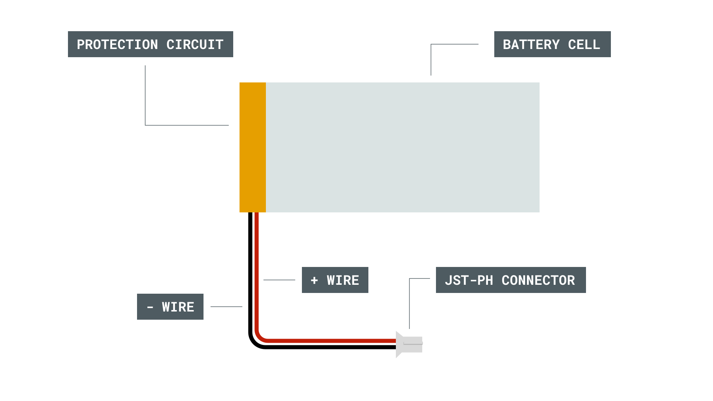
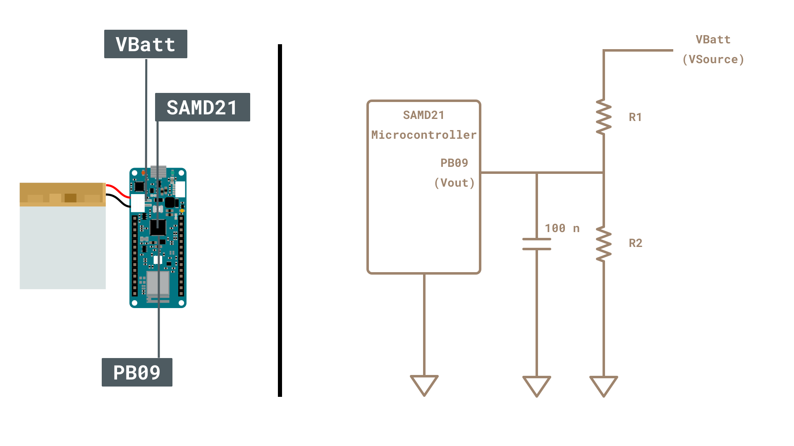

## Introduction

While you can run your MKR board from USB , you can make best use of it when your MKR board is able to operate independantly of your computer and a USB cable. This is particulary useful for many IoT applications, use of relays with high current draw and remote sensing. Batteries can help us in this regard and a special connector is included in the MKR products for this end. In this application note, we will take a closer look at the battery capabilities of the MKR boards. 

### Goals
The goals of this project are:
- Understand what the terms `charging capacity` and `charging current`
- Distinguish between LiPo and Li-Ion batteries
- Learn how to identify connector polarity
- Understand how the SAMD chip reads battery voltage via a voltage divider
- Export data to the Arduino IoT CLoud to read values in real time

### Hardware & Software Needed
- [Arduino MKR WiFi 1010](https://store.arduino.cc/products/arduino-mkr-wifi-1010)
- Multimeter
- IDE 2.0
- LiPo battery with JST-PH connector
- Arduino IoT Cloud

### LiPo vs Fe vs Li-ion batteries
Several different chemistries of rechargeable batteries are commerically avalible. The two main types are Li-Po and Li-Ion. Lithium Ion batteries have been around for a longer time and are generally cheaper. Lithium Polymer batteries have a higher energy density, allowing you to run your board for longer with a similar sized battery. 
You can see a comparison between these three in the table below.

| Battery Chemistry | Cost   | Energy Density (mass) | Energy density (size) | Stability | Nominal voltage (single cell) |
|-------------------|--------|-----------------------|-----------------------|-----------|-------------------------------|
| LiPo              | Higher | higher                | lower                 | Higher    | 3.7V                          |
| Li-ion            | Lower  | Lower                 | Higher                | Lower     | 3.7V                          |

***Warning: Please make sure that the battery terminals do NOT touch each other. The short circuit can cause permanent damage to the battery and even explosion.***

Apart from being a single cell (3.7V), a key factor to selecting the correct battery is that the connector is compatible.

### Connector
You can connect a battery to the MKR WIFI 1010 via a 2-pin JST-PH female connector. The PH varient of JST connectors are identified by a pin-to-pin distance of 2 mm. Here are several examples of LiPo batteries with a 2-pin JST-PH connector. Each individual connector is made of one plastic housing and two metal crimp terminals. A crimping device may be required. Note that when looking from above (with the notch facing you), the red (positive) wire should be on your left. 

### Protection circuit
A protection circuit cuts off the battery if overcurrent or under/over voltage is detected. This adds an additional layer of safety.


### BQ24195L Power Management IC
The BQ24195L IC is responsible for charging the single cell lion battery, as well as boosting the battery voltage to 3.3V for use on the board internally. An Arduino library ([Arduino_BQ24165](https://github.com/arduino-libraries/Arduino_BQ24195)) has been developed, to help control the features of this battery over I2C. 

### Electrical Properties

**Voltage**
The nominal voltage of both LiPo and Li-Ion batteries is around 3.7V and is commonly refered to as the voltage of single cell batteries. However, this is an ideal scenario since as a battery is used the voltage changes. We can see this represented in the image below. The voltage can be considered similar to a waterfall. The higher the waterfall, the higher the voltage.


In the MKR boards, the battery terminal is connected to the SAMD21 via a reserved pin (PB09) known as `ADC_BATTERY` within the Arduino Core. This pin is used internally on the board, and is not accesssible via the MKR pins. Since the voltage of a Li-ion battery exceeds 3.3V (the AREF value), a voltage divider must be used to extend the range while also ensure that only safe voltages are applied to the microcontroller. We can calculate the output voltage using the following formula

$$ V_{out} = \frac{V_{source} \times R2} {R_1 + R_2} $$

In the MKR WIFI 1010, $R_1$ and $R_2$ are 330k ohm and 1M ohm respectively. Therefore, for a resolution of 12 bits, the board is subject to 3.3V that corresponds to about 4.39V on the battery side. Therefore, we can cover the operating value of a whole battery. The high values reduce the leakage current that may pass throught, increasing the life of the battery. The capacitor acts to clean the signal.



**Capacity**
Continuing with the waterfall analogy, the volume of water passing through a waterfall represents the current. Therefore, the amount of water stored behind the waterfall is considered the capacity. It is common to discuss the capacity in terms of milliamp hours (mAh), which is the current that can be potentially extracted in an hour to discharge it. Note that changes in temperature and elevated current demands can change the effective capacity of your battery. 

While the MKR boards do not provide a mechanism for identifying capacity, we can get a general idea of the current status by mapping the voltage to the capacity. A more precise value can be obtained with the help of a fuel gauge IC (Integrated Circuit), avaliable in the Portenta X8 and H7.

**Discharge rating**
When the battery is fully charged, or when it is near to discharge the discharge rate changes considerably. Yet, there is a region where the discharge rate constant (change in voltage over change in discharge capacity does not flunctuate). Within this region, the maximum current draw is defined as:

$$\text{maximum current draw } = \text{ battery capacity } \times \text{ discharge rating} $$

The discharge rating (C) is often provided in the datasheet of the battery. If the C rating of a battery is 1, then it can discharge the maximum current for one hour before running out. As a rule of thumb, higher discharge rates lead reduce the effective capacity and lifetime of the battery. 

## Multimeter battery measurements

**1.** Test the battery voltage with a multimeter. In this case, we have used a 1200mAh battery. It should be between 3.3V and 4.2V, regardless of the capacity. If the battery voltage is outside this range, your battery may be damaged.


***Warning: Please make sure that the battery terminals do NOT touch each other. The short circuit can cause permanent damage to the battery and even explosion.***

**2.** Connect your battery to the MKR WIFI 1010 then check the voltage of VCC using your multimeter. 

You should notice that the voltage of VCC is about 3.3V, regardless of the battery level. The voltage that comes out of the PMIC enters the VCC.

## Read battery values over Serial

We will go through the lines needed to create a Sketch to read the battery values over Serial and give a short descipriotn of what part does. At the end, the full code will be provided so you can copy and paste into your IDE and upload to your Arduino board.

**0.** Open a new sketch in the Arduino IDE. We will create a sketch to read the ADC voltage that is sensed by the SAMD controller. As a first step, we will We will call the library to be included in the sketch. 
```
#include <BQ24195.h>
```

**1.**  Then, we will create variables to store the variables for the raw ADC value (from pin PB09), the equivilent voltage expereienced by PB09 and finally the calculated battery voltage.

```arduino
  float rawADC;
  float voltADC;
  float voltBat;
```

**2.** According to the schematics for the MKR WIFI 1010, we will now define the values for the R1 and R2 resistor. These will be used to calculate `voltBat`.

```arduino
  int R1 =  330000;
  int R2 = 1000000;
```

**3.** We will now create a variable to store the maximum source voltage `max_Source_voltage` as well as the upper (`batteryFullVoltage`) and lower (`batteryEmptyVoltage`) values for the battery.

```arduino
  int max_Source_voltage;

  float batteryFullVoltage = 4.2;
  float batteryEmptyVoltage = 3.3;
```

**4.** Now we can configure the `setup()` function. We need to initiate the Serial connection (`Serial.begin(9600)`) and set the input current limit.
```arduino
void setup() {
  Serial.begin(9600);          
  PMIC.setInputCurrentLimit(2.0);
```


ensure the analog reference is set to the default value of 3.3V (`analogReference(AR_Default)`), set the ADC resolution to 12 bits (`analogReadResolution(12)`) and finally calculate the maximum output of the voltage divider (`max_Source_voltage = (3.3 * (R1 + R2))/R2`)

```arduino
void setup() {
  Serial.begin(9600);          
  analogReference(AR_DEFAULT); 
  analogReadResolution(12);    

  max_Source_voltage = (3.3 * (R1 + R2))/R2;
}
```

**5.** With the variables and setup function clearly defined, we will now specify the loop function. These commands will continuously run and provide information about the battery status to the Serial Monitor in the PC. First, we read the value of PB09 (specified internall as `ADC_BATTERY`)

```arduino
void loop()
{

  rawADC = analogRead(ADC_BATTERY);
```

**6.** The valure represented by `rawADC` is a number between 0 to 4095, given that it has 12 bit resolution. In order to conver that into a voltage reading (`voltADC`) we will divide `rawADC` by 4095 and then multiply by the analog reference voltage (3.3V). 

```arduino
voltADC = rawADC * (3.3/4095.0);
```

**7.** The `voltADC` variable gives us the voltage sensed directly on the PB09 pin. This voltage is passed through the voltage divider, so it is a fraction of the actually battery voltage. We can then calculate the equivilanet battery voltage as follows.
```arduino
voltBat = voltADC * (max_Source_voltage/3.3);
```

**8.** We can approximate the battery voltage to be propotional to the capacity level. Since the `map()` function does not work with float variables, we manually map the values.
```arduino
int new_batt = (voltBat - batteryEmptyVoltage) * (100) / (batteryFullVoltage - batteryEmptyVoltage);
```

**9.** We can now send the obtained values over Serial.
```arduino
  Serial.print("The ADC on PB09 reads a value of ");
  Serial.print(rawADC);
  Serial.print(" which is equivialent to ");
  Serial.print(voltADC);
  Serial.print("V. This means the battery voltage is ");
  Serial.print(voltBat);
  Serial.print("V. Which is equivalent to a charge level of ");
  Serial.print(new_batt);
  Serial.println("%.");
```

**10.** Finally, we will add a half second delay at the end of the `loop()` function to allow variables to come slowly through the Serial Monitor.
```arduino
  delay(500);
}
```

**11.** The complete code is as follows. You can copy and paste this directly into your IDE
```arduino
/*
  Read battery voltage on MKR WIFI 1010 and log values to Arduino Cloud

  Author: Ali Jahangiri & Karl Soderby

  Last Edit: 2nd August 2022
*/

//define variables
  float rawADC;
  float voltADC;
  float voltBat;

  //define the resistor values in the voltage divider
  //                             ┌─────── VBatt
  //                             │
  //                             /
  //                             \  330k
  //  ┌────────────┐             /
  //  │   SAMD21   │             \
  //  │            │             │
  //  │       PB09 ├────┬────────┤
  //  │            │    │        │
  //  │            │    │ 100n   /
  //  │            │  ──┴───     \  1M
  //  │            │  ──┬───     /
  //  │            │    |        \
  //  │            │    │        |
  //  │            │    │        │
  //  └─────┬──────┘    |        |
  //        │           |        |
  //        ▼           ▼        ▼ 
  
  int R1 =  330000; // resistor between battery terminal and SAMD pin PB09
  int R2 = 1000000; // resistor between SAMD pin PB09 and ground

  int max_Source_voltage;

  // define voltage at which battery is full/empty
  float batteryFullVoltage = 4.2;
  float batteryEmptyVoltage = 3.3;

void setup() {
  
  // put your setup code here, to run once:
  
  Serial.begin(9600);          // start series port with a buad rate of 9600bps
  analogReference(AR_DEFAULT); // the upper value of ADC is set to 3.3V
  analogReadResolution(12);    // this will give us 4096 (2^12) levels on the ADC

  // The formula for calculating the output of a voltage divider is
  // Vout = (Vsource x R2)/(R1 + R2)
  // If we consider that 3.3V is the maximum that can be applied to Vout then the maximum source voltage is calculated as
  max_Source_voltage = (3.3 * (R1 + R2))/R2;

}

void loop()
{
  
  rawADC = analogRead(ADC_BATTERY); //the value obtained directly at the PB09 input pin
  voltADC = rawADC * (3.3/4095.0);  //convert ADC value to the voltage read at the pin
  voltBat = voltADC * (max_Source_voltage/3.3);                                                           //we cannot use map since it requires int inputs/outputs
  int new_batt = (voltBat - batteryEmptyVoltage) * (100) / (batteryFullVoltage - batteryEmptyVoltage);    //custom float friendly map function

  Serial.print("The ADC on PB09 reads a value of ");
  Serial.print(rawADC);
  Serial.print(" which is equivialent to ");
  Serial.print(voltADC);
  Serial.print("V. This means the battery voltage is ");
  Serial.print(voltBat);
  Serial.print("V. Which is equivalent to a charge level of ");
  Serial.print(new_batt);
  Serial.println("%.");

  delay(500);
}

```

**12.** Connect the MKR WIFI 1010 to the USB port of your PC. Make sure that the ArduinoMKR WIFIF 1010 is selected and that the port is correct. Upload the code to the board. You will see a message similar to the following.


## Measure battery voltage via the Arduino IoT Cloud

Since we had connected the board via USB, the board is charging. In order to better realise the status of the battery in a more realistic environment, we will use the Arduino IoT Cloud. We will use three different dashboard elements to display the data.

**1.** In order to evaluate the performance of the device in a real world setting, we need to be able to test it remotely. To do so, we will use the Arduino Cloud to transfer data. The Arduino IoT Cloud makes it easy ton create IoT solutions. In the free plan, you have to connect the board to the cable, but in the money money tier, you can program the board wirelessley.

**2.** First, we will create a simple digital output to display the value of the ADC. Go to https://create.arduino.cc/iot/dashboards and click on **Create** to make a new dashboard and give it a name. Here, we are calling our dashboard MKR Remote Battery Status.

**3.** Click on the Add button and in the list select the Value widget. You can also search by entering the name in the box. Click it in order to add it. 

**4.** Name the widget raw ADC value. Then click on **Done**. 

**5.** In order for the ADC value to be shown on the widget, we need to first configure the sketch to create a linked variable. A linked variable is a variable that is sent by your Arduino device to the cloud. 

**6.** Go to the Devices tab and click on Add. Then Select Setup an Arduino device. Make sure your board is connected via a USB cable. If you have not done already, you may be requested to install the Arduino Create Adgent. Install it if needed. 

**7.** After you have setup the device, go the the things tab. Click on the device you linked and add the sketch as well as the rawADC varaible.

**8.** Upload the sketch

***If using a paid cloud account, you can send the sketch over the air. Otherwise, you will need to have the board conencted every time you upload a new sketch***

**9.** Now go to the dashboard, and link the variable to the value widget you made. You should see a four digit value.

**10.** Now let us link three other variables, in a similar manner. The upload again.

**11.** In the dashboard, we will create two objects. First, we create a chart. Select voltADC and voltBatt as the linked variables to display on the graph.

**12.** Then, add a Percentage widget and link the new_batt variable. 

**13.** You now can view the battery status through a wide range of widgets.

## Extract plots

**1.** In the Dashboard, click on the download historical data button to the right of your screen.

**2.** Clic

**2.** Plot with Google Sheets

after i the usb port, the battery is disconnected as well? I have to reconnect battery for it to work? How are you supposed to charge it in a practical setting 

### Troubleshoot
- You cannot upload OTA with 

## Conclusion

## Further Ideas

- An averaging function is used to increase the stability of the values obtained
- Evaluate the performance of a sketch and compare how the voltage falls for various loads and frequencies
- Use the BatterySense library to get a better approximation of the battery capacity
- Use the Arduino Portenta series to have access to a onboard fuel guage.
- Try calculating the discharge rating in the linear region

## References
battery charge level is tied to the voltage. don't need a table, but have explanation. depending on a battery used. from 4.2 to 4.0 and from 3.5 to 3.3 very little energy is released.