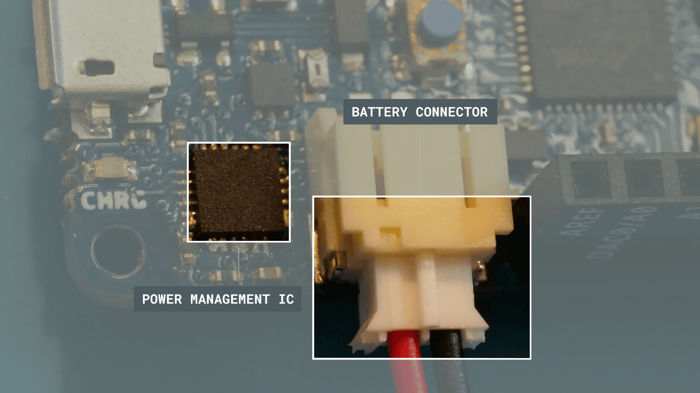
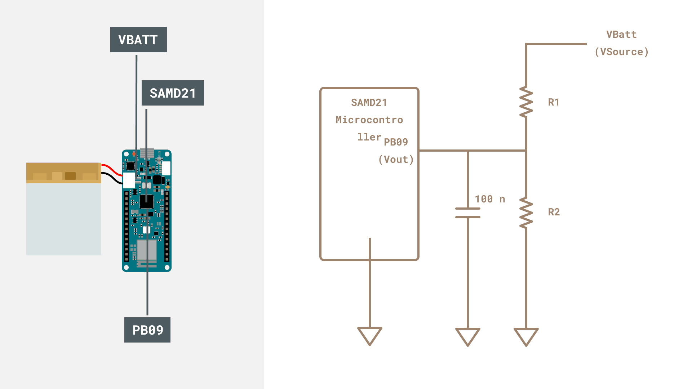
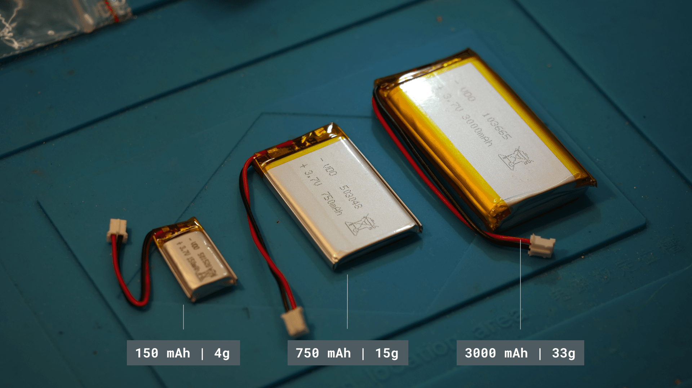
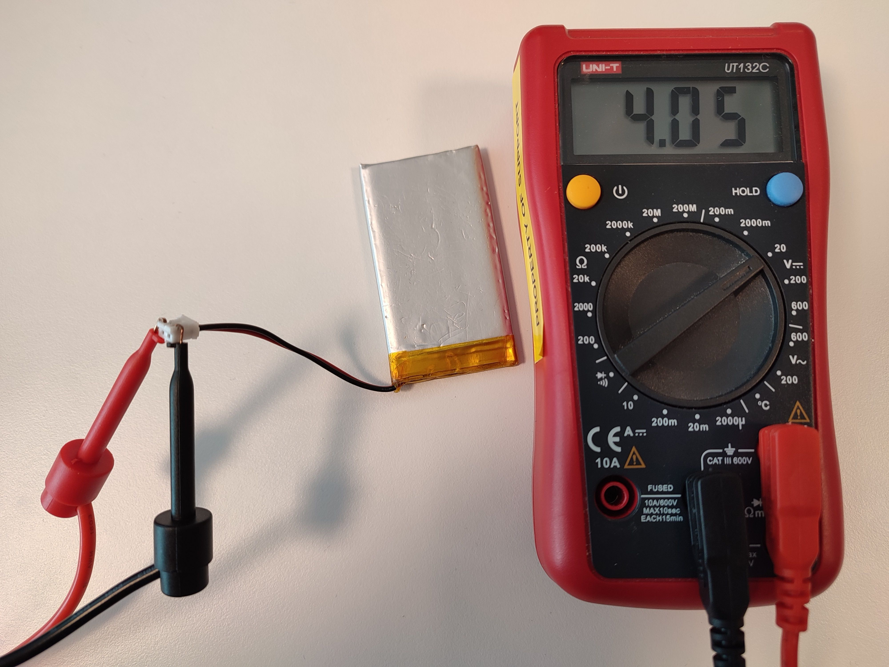
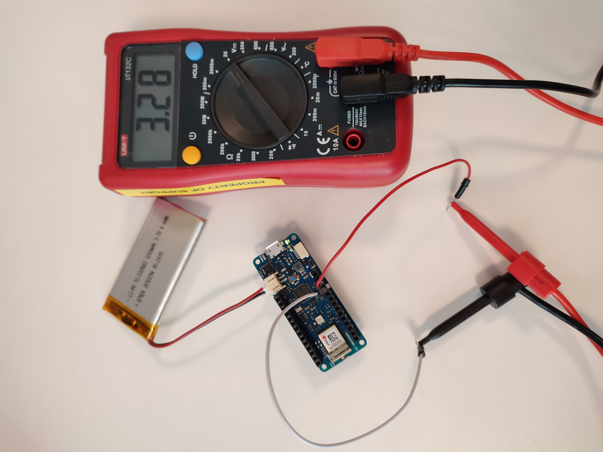
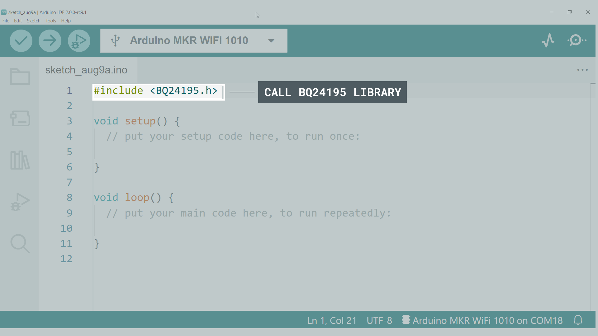
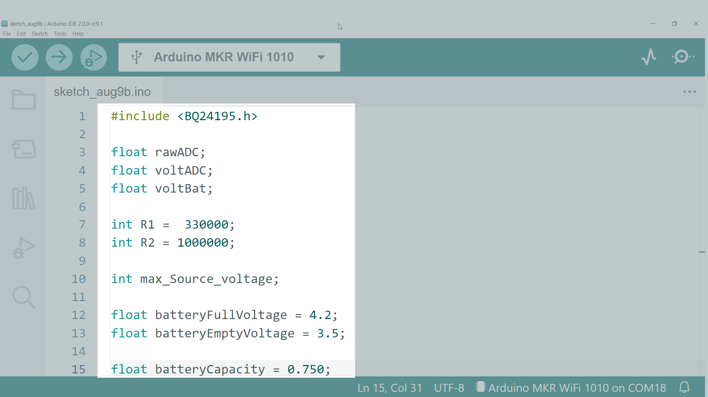
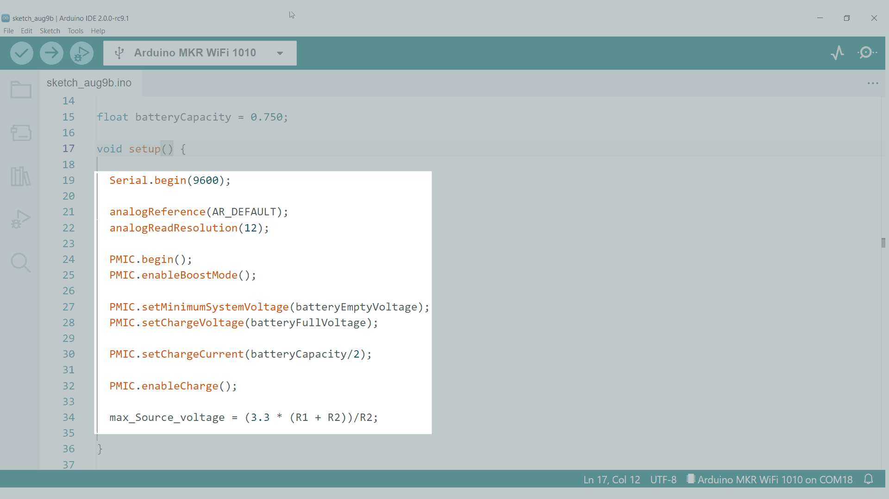
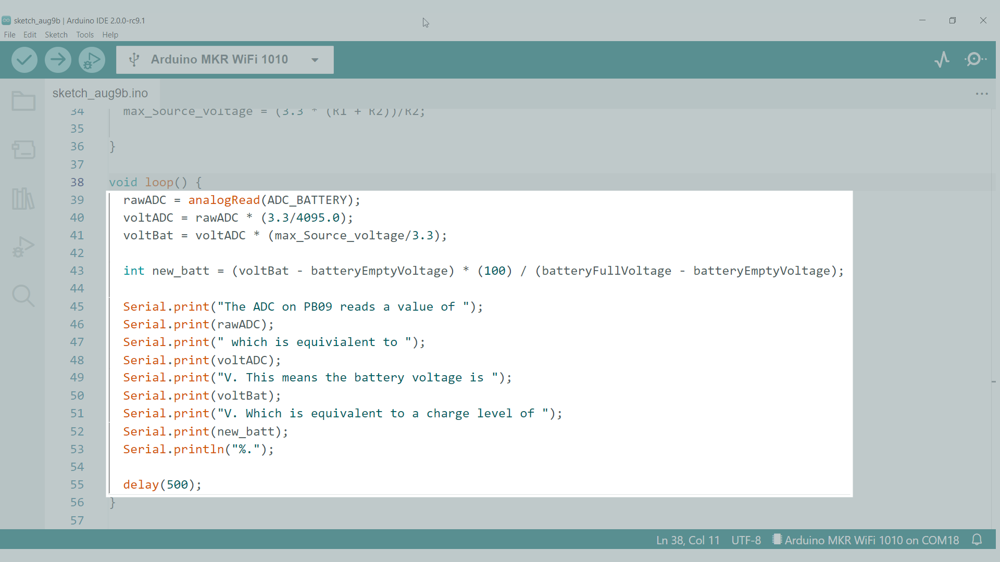

## Introduction

While you can run your MKR board from USB, you can make best use of it when your MKR board is able to operate independently of your computer and a USB cable. This is particularly useful for many IoT applications, use of relays with high current draw and remote sensing. Batteries can help us in this regard and a special connector is included in the MKR products for this end. In this application note, we will take a closer look at the battery capabilities of the MKR boards. 

### Goals
The goals of this project are to:
- Understand what the terms **charging capacity** and **charging current** mean.

- Distinguish between LiPo and Li-Ion batteries
- Learn how to identify connector polarity
- Understand how the SAMD chip reads battery voltage via a voltage divider

### Hardware & Software Needed
- [Arduino MKR WiFi 1010](https://store.arduino.cc/products/arduino-mkr-wifi-1010)
- Multimeter
- [Arduino IDE](https://www.arduino.cc/en/software)

- LiPo battery with JST-PH connector

### LiPo Vs Li-Ion Batteries
Several different chemistries of rechargeable batteries are commercially available. The two main types are Li-Po and Li-Ion. Lithium Ion batteries have been around for a longer time and are generally cheaper. Lithium Polymer batteries have a higher energy density, allowing you to run your board longer with a similar sized battery. 
You can see a comparison between these three in the table below.

| Battery Chemistry | Cost   | Energy Density (mass) | Energy density (size) | Stability | Nominal voltage (single cell) |
|-------------------|--------|-----------------------|-----------------------|-----------|-------------------------------|
| LiPo              | Higher | higher                | lower                 | Higher    | 3.7V                          |
| Li-ion            | Lower  | Lower                 | Higher                | Lower     | 3.7V                          |

***Warning: Please make sure that the battery terminals do NOT touch each other. The short circuit can cause permanent damage to the battery and even explosion.***

Apart from being a single cell (3.7V), a key factor to selecting the correct battery is that the connector is compatible.

### Connector
You can connect a battery to the MKR WIFI 1010 via a 2-pin JST-PH female connector. The PH variant of JST connectors are identified by a pin-to-pin distance of 2 mm. Here are several examples of LiPo batteries with a 2-pin JST-PH connector. Each individual connector is made of one plastic housing and two metal crimp terminals. A crimping device may be required. Note that when looking from above (with the notch facing you), the red (positive) wire should be on your left.


You can connect a battery to the MKR WIFI 1010 via a 2-pin JST-PH female connector. The PH variant of JST connectors are identified by a pin-to-pin distance of 2mm. Here are several examples of LiPo batteries with a 2-pin JST-PH connector. Each individual connector is made of one plastic housing and two metal crimp terminals. A crimping device may be required. Note that when looking from above (with the notch facing you), the red (positive) wire should be on your left. 

### Protection Circuit
A protection circuit cuts off the battery if overcurrent or under/over voltage is detected. This adds an additional layer of safety.


### BQ24195L Power Management IC
The BQ24195L IC is responsible for charging the single cell lion battery, as well as boosting the battery voltage to 3.3V for use on the board internally. An Arduino library ([Arduino_BQ24165](https://github.com/arduino-libraries/Arduino_BQ24195)) has been developed, to help control the features of this battery over I2C. 

### Electrical Properties

**Voltage**
The nominal voltage of both LiPo and Li-Ion batteries is around 3.7V and is commonly referred to as the voltage of single cell batteries. However, this is an ideal scenario since as a battery is used the voltage changes. The voltage can be considered similar to a waterfall. The higher the waterfall, the higher the voltage.

In the MKR boards, the battery terminal is connected to the SAMD21 via a reserved pin (PB09) known as `ADC_BATTERY` within the Arduino Core. This pin is used internally on the board, and is not accessible via the MKR pins. Since the voltage of a Li-ion battery exceeds 3.3V (the AREF value), a voltage divider must be used to extend the range while also ensure that only safe voltages are applied to the microcontroller. We can calculate the output voltage using the following formula


In the MKR WIFI 1010, $R_1$ and $R_2$ are 330k ohm and 1M ohm respectively. Therefore, for a resolution of 12 bits, the board is subject to 3.3V that corresponds to about 4.39V on the battery side. Therefore, we can cover the operating value of a whole battery. The high values reduce the leakage current that may pass through, increasing the life of the battery. The capacitor acts to clean the signal.



**Capacity**
Continuing with the waterfall analogy, the volume of water passing through a waterfall represents the current. Therefore, the amount of water stored behind the waterfall is considered the capacity. It is common to discuss the capacity in terms of milliamp hours (mAh), which is the current that can be potentially extracted in an hour to discharge it. Note that changes in temperature and elevated current demands can change the effective capacity of your battery.




While the MKR boards do not provide a mechanism for identifying capacity, we can get a general idea of the current status by mapping the voltage to the capacity. A more precise value can be obtained with the help of a fuel gauge IC (Integrated Circuit), available in the Portenta X8 and H7.

**Discharge rating**
When the battery is fully charged or when it is near to discharge, the discharge rate changes considerably. Yet, there is a region where the discharge rate is constant (change in voltage over change in discharge capacity does not flunctuate). Within this region, the maximum current draw is defined as:


The discharge rating (C) is often provided in the datasheet of the battery. If the C rating of a battery is 1, then it can discharge the maximum current for one hour before running out. As a rule of thumb, higher discharge rates lead to the reduction of the effective capacity and lifetime of the battery. 

## Multimeter Battery Measurements

**1.** Test the battery voltage with a multimeter. In this case, we have used a 1200mAh battery. It should be between 3.3V and 4.2V, regardless of the capacity. If the battery voltage is outside this range, your battery may be damaged.


***Warning: Please make sure that the battery terminals do NOT touch each other. The short circuit can cause permanent damage to the battery and even explosion.***

**2.** Connect your battery to the MKR WIFI 1010 then check the voltage of VCC using your multimeter. 

You should notice that the voltage of VCC is about 3.3V, regardless of the battery level. The voltage that comes out of the PMIC enters the VCC.

## Read Battery Values Over Serial

We will go through the lines needed to create a Sketch to read the battery values over Serial and give a short description of what each part does. At the end, the full code will be provided so you can copy and paste it into your IDE and upload it to your Arduino board.

**1.** Open a new sketch in the Arduino IDE. We will create a sketch to read the ADC voltage that is sensed by the SAMD controller. As a first step, we will call the library to be included in the sketch.

```arduino
#include <BQ24195.h>
```



**2.**  Then, we will create variables to store the variables for the raw ADC value (from pin PB09), the equivalent voltage expereienced by PB09 and finally the calculated battery voltage.

```arduino
  float rawADC;
  float voltADC;
  float voltBat;
```

**3.** According to the schematics for the MKR WIFI 1010, we will now define the values for the R1 and R2 resistor. These will be used to calculate `voltBat`.

```arduino
  int R1 =  330000;
  int R2 = 1000000;
```

**4.** We will now create a variable to store the maximum source voltage `max_Source_voltage` as well as the upper (`batteryFullVoltage`) and lower (`batteryEmptyVoltage`) values for the battery. We will also define the battery capacity as `batteryCapacity` so as to determine the charging current. Since we are using a 750 mAh battery in this example, we will set the value to `0.750`.

```arduino
  float max_Source_voltage;

  float batteryFullVoltage = 4.2;
  float batteryEmptyVoltage = 3.3;

  float batteryCapacity = 0.750;
```

**5.** Your IDE should look similar to the screenshot below.


**6.** Now we can configure the `setup()` function. We need to initiate the Serial connection (`Serial.begin(9600)`), ensure the analog reference is set to the default value of 3.3V (`analogReference(AR_Default)`) and set the ADC resolution to 12 bits (`analogReadResolution(12)`). A 12bit ADC will provide an output from 0 (0V) to 4093 (3.3V), depending on the voltage the ADC experiences.
```arduino
void setup() {
  Serial.begin(9600);       

  analogReference(AR_DEFAULT); 
  analogReadResolution(12); 
```

**7.** Now we can establish the SAMD21-BQ24195 connection over I2C and enable the boost mode. By default, the PMIC provides an output close to 3.3V to reduce the power loss over the 3.3V linear regulator. By enabling boost mode, we can access 5V on the VCC pin.
```arduino
  PMIC.begin();
  PMIC.enableBoostMode();
```

**8.** Here, we will define the minimum output voltage of the PMIC as well as the maximum level to which the battery is charged. 
```arduino
  PMIC.setMinimumSystemVoltage(batteryEmptyVoltage);
  PMIC.setChargeVoltage(batteryFullVoltage);
```

**9.** As a rule of thumb, we can now set the maximum charging current to half of the battery capacity. With the configurations made for the battery, we can now enable the charging circuit.
```arduino
  PMIC.setChargeCurrent(batteryCapacity/2);

  PMIC.enableCharge();
```

**10.** We will add a final line to the `setup()` function that will calculate the voltage that when applied to the input of the voltage divider will yield 3.3V at PB09. This is the upper limit for the voltage sensing capabilities.
```arduino
  max_Source_voltage = (3.3 * (R1 + R2))/R2;
}
```

**11.** Your `setup()` function should now look as follows.



**12.** With the variables and setup function clearly defined, we will now specify the loop function. These commands will continuously run and provide information about the battery status to the Serial Monitor in the PC. First, we read the value of PB09 (specified internally as `ADC_BATTERY`). The value represented by `rawADC` is a number between 0 to 4094, given that it has 12 bit resolution.

```arduino
void loop()
{

  rawADC = analogRead(ADC_BATTERY);
```

**13.** In order to convert `rawADC` into a voltage reading (`voltADC`) we will divide `rawADC` by 4095 and then multiply it by the analog reference voltage (3.3V). 

```arduino
voltADC = rawADC * 3.3 / 4096.0;
```

**14.** The `voltADC` variable gives us the voltage sensed directly on the PB09 pin. This voltage is passed through the voltage divider, so it is a fraction of the actual battery voltage. We can then calculate the equivilanet battery voltage as follows.
```arduino
voltBat = max_Source_voltage * rawADC / 4096.0;
```

**15.** We can approximate the battery voltage to be proportional to the capacity level. Since the `map()` function does not work with float variables, we will manually map the values.
```arduino
int new_batt = (voltBat - batteryEmptyVoltage) * (100) / (batteryFullVoltage - batteryEmptyVoltage);
```

**16.** We can now send the obtained values over Serial.
```arduino
  Serial.print("The ADC on PB09 reads a value of ");
  Serial.print(rawADC);
  Serial.print(" which is equivialent to ");
  Serial.print(voltADC);
  Serial.print("V. This means the battery voltage is ");
  Serial.print(voltBat);
  Serial.print("V. Which is equivalent to a charge level of ");
  Serial.print(new_batt);
  Serial.println("%.");
```

**17.** Finally, we will add a half a second delay at the end of the `loop()` function to allow variables to come slowly through the Serial Monitor.
```arduino
  delay(500);
}
```

**18.** You section for the `loop()` function should look as follows.


**19.** The complete code (with the addition of comments) is as follows. You can copy and paste this directly into your IDE

```arduino
/*
  Read battery voltage on MKR WIFI 1010 and log values to the serial monitor


                            ┌─────── VBatt
                            │
                            /
                            \  330k
  ┌────────────┐             /
  │   SAMD21   │             \
  │            │             │
  │       PB09 ├────┬────────┤
  │            │    │        │
  │            │    │ 100n   /
  │            │  ──┴───     \  1M
  │            │  ──┬───     /
  │            │    |        \
  │            │    │        |
  │            │    │        │
  └─────┬──────┘    |        |
        │           |        |
        ▼           ▼        ▼ 


  Author: Ali Jahangiri & Karl Soderby

  Last Edit: 9th August 2022
*/

// Include the library for the BQ24195 IC
#include <BQ24195.h>

//define variables
float rawADC;           //unprocessed ADC value
float voltADC;          //ADC converted into voltage
float voltBat;          //calculated voltage on battery

//define the resistor values in the voltage divider
  
int R1 =  330000;       // resistor between battery terminal and SAMD pin PB09
int R2 = 1000000;       // resistor between SAMD pin PB09 and ground

float max_Source_voltage; // upper source voltage for the battery

// define voltage at which battery is full/empty
float batteryFullVoltage = 4.2;   //upper voltage limit for battery
float batteryEmptyVoltage = 3.5;  //lower voltage limit for battery

float batteryCapacity = 0.750;            //set battery capacity in Ah

void setup() {
   
  Serial.begin(9600);               // start Serial port with a baudrate of 9600bps
  
  analogReference(AR_DEFAULT);      // the upper value of ADC is set to 3.3V
  analogReadResolution(12);         // this will give us 4096 (2^12) levels on the ADC

  //configure BQ24195 PMIC
  PMIC.begin();                                               // start the PMIC I2C connection
  PMIC.enableBoostMode();                                     // boost battery output to 5V
  
  PMIC.setMinimumSystemVoltage(batteryEmptyVoltage);          // set the minimum battery output to 3.5V
  PMIC.setChargeVoltage(batteryFullVoltage);                  // set battery voltage at full charge

  PMIC.setChargeCurrent(batteryCapacity/2);                   // set battery current to C/2 in amps

  PMIC.enableCharge();                                        // enable charging of battery

  // The formula for calculating the output of a voltage divider is
  // Vout = (Vsource x R2)/(R1 + R2)
  // If we consider that 3.3V is the maximum that can be applied to Vout then the maximum source voltage is calculated as
  max_Source_voltage = (3.3 * (R1 + R2))/R2;

}

void loop()
{
  
  rawADC = analogRead(ADC_BATTERY);                     //the value obtained directly at the PB09 input pin
  voltADC = rawADC * 3.3 / 4096.0;                      //convert ADC value to the voltage read at the pin
  voltBat = max_Source_voltage * rawADC / 4096.0;       //we cannot use map since it requires int inputs/outputs
  
  int new_batt = (voltBat - batteryEmptyVoltage) * (100) / (batteryFullVoltage - batteryEmptyVoltage);    //custom float friendly map function

  //report information over Serial
  Serial.print("The ADC on PB09 reads a value of ");
  Serial.print(rawADC);
  Serial.print(" which is equivialent to ");
  Serial.print(voltADC);
  Serial.print("V. This means the battery voltage is ");
  Serial.print(voltBat);
  Serial.print("V. Which is equivalent to a charge level of ");
  Serial.print(new_batt);
  Serial.println("%.");

  delay(500);
}

```

**12.** Connect the LiPo battery to your MKR WIFI 1010, without the USB cable connected.

***The battery must be connected to the MKR WIFI 1010 before connecting via USB, otherwise it may not work.***

**13.** Connect the MKR WIFI 1010 to the USB port of your PC. Make sure that the Arduino MKR WIFI 1010 is selected and that the port is correct. Upload the code to the board and open the terminal monitor. You will see information about the battery level displayed in the Serial monitor

  
## Conclusion
In this Application Note, you have gained an understanding of how the batteries connect to the MKR WiFi 1010, both physically via the JST-PH connector as well as the I2C-controlled BQ24195 IC. You can now select the correct battery capacity and configure it for your application.

## Further Ideas

- Try disabling the charging circuit with `disableCharge()` in order to read the battery voltage, while it isn't charging
- Try experimenting with different battery capacities, and see how long it can power your application.
- Send a just the `voltBat` over the serial and use the Serial Plotter to view the values as a graph.
