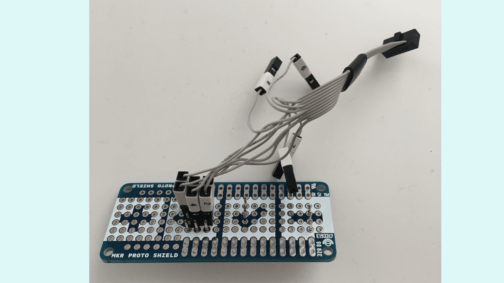
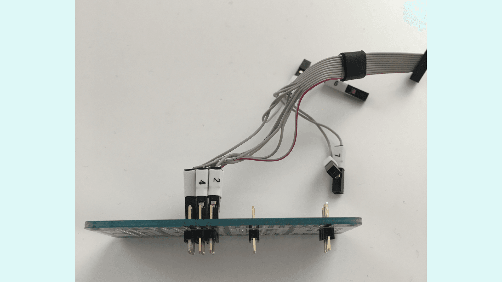
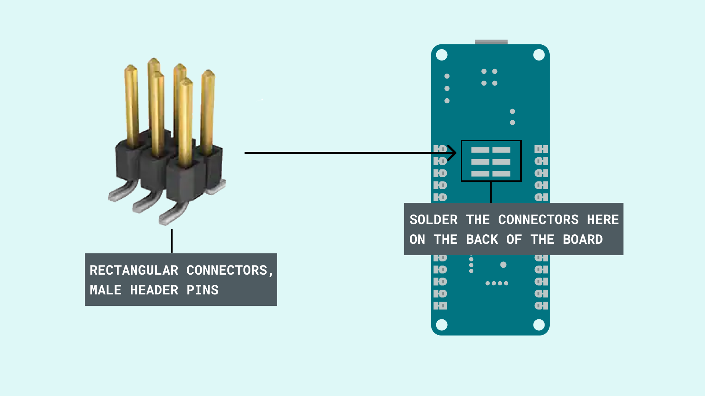
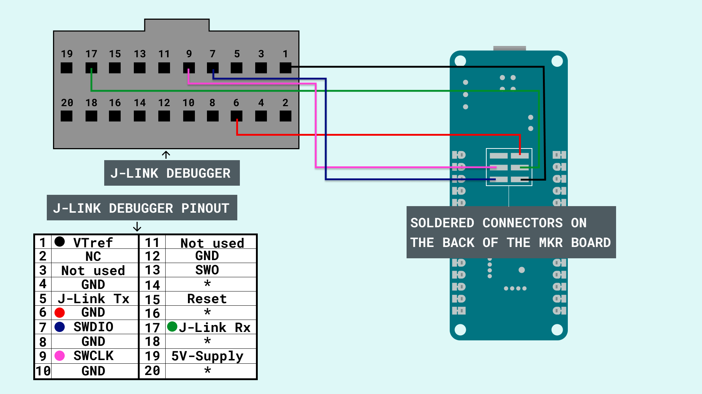
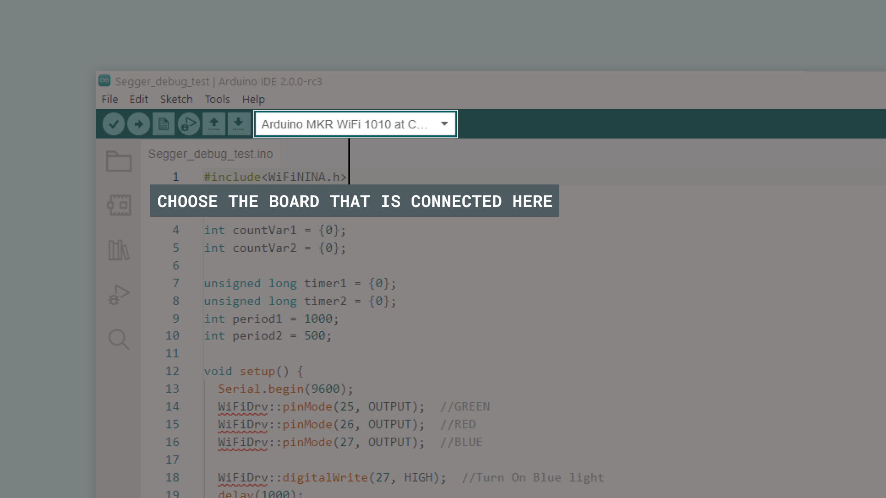
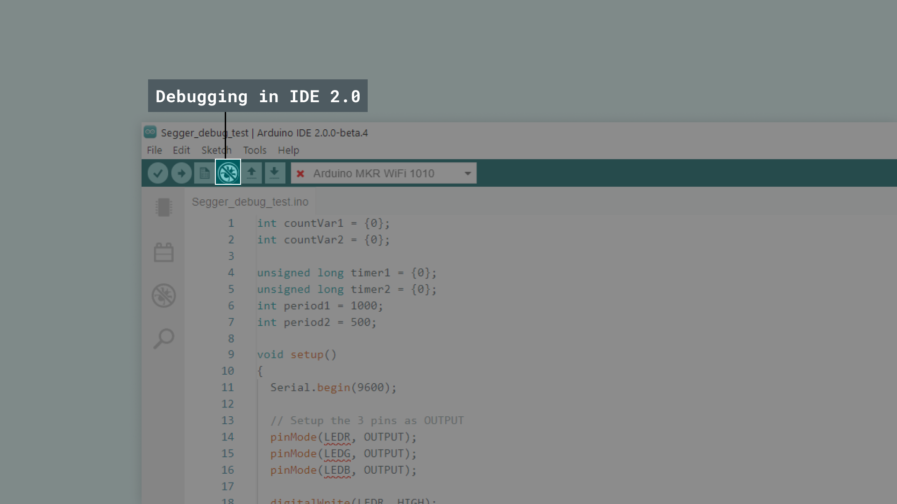
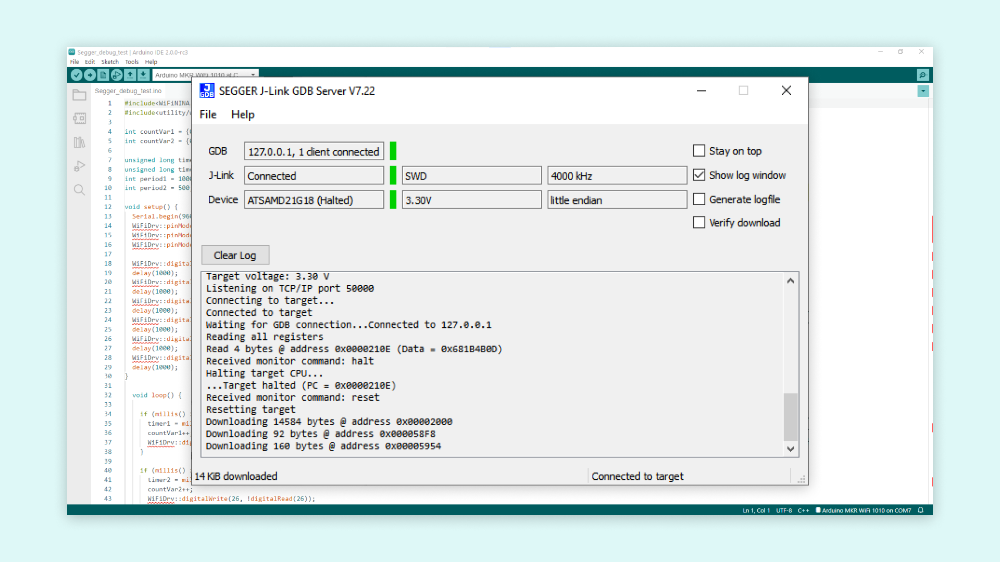

## Overview
This tutorial will show you how to debug an Arduino sketch using an Arduino MKR board and the Segger J-Link probe. It will go through how to connect these and use the Arduino IDE 2 to then debug a sketch.

### Required Hardware and Software
-   [Arduino IDE 2](https://www.arduino.cc/en/software)
-   Segger J-link device ([EDU](https://store.arduino.cc/products/j-link-edu) or [BASE](https://store.arduino.cc/products/j-link-base-compact))
-   [Arduino MKR WiFi 1010](https://store.arduino.cc/mkr-wifi-1010) (other boards from the MKR family works as well).
-   Soldering equipment
-   [MKR Proto shield](https://store.arduino.cc/mkr-proto-shield)

## J-Link Debug Probes

J-Link debug probes are one of the most widely used line of **debug** and **programming probes** in the market. They have provide solid value to embedded development for over a decade. J-Link supports a wide range of CPUs and architectures, everything from single 8051 to mass market Cortex-M to high-end cores like Cortex-A. One of the main features of J-Link debug probes is its support of several debugging/programming interfaces like JTAG, SWD and SWO. For debugging SAM-based Arduino® boards with A J-Link probe, you are going to use its **SWD interface**.

## The SWD Interface

JTAG is the de facto interface for debugging and accessing a processor registers. This interface has been used for many years, and it is still largely used today. But JTAG has a drawback: **it uses many signals (or pins), at least four**. To address this drawback, ARM® created an alternative debug interface called the Serial Wire Debug (SWD) interface.

The **SWD interface** is a **two-pin** (SWDIO/SWCLK) electrical alternative to the JTAG interface that has the same JTAG protocol on top. The SWD interface can be used to program the firmware of a processor and access its registers for debugging purposes. This interface and its associated protocol are now available in nearly all ARM® Cortex®-A, Cortex®-R, and Cortex®-M processors.

## Instructions

Before you can connect your J-Link probe to your Arduino® MKR board, you must prepare the SWD interface pins of the board. The Arduino® MKR boards have the SWD interface pins, SWDIO and SWCLK, connected to the **J2 header**. The J2 header of the Arduino® MKR boards is located on the underside of the board in the exposed pads. 

> Note: The goal is to reach the exposed pads that are located on the underside of the board, feel free to choose one of the two methods that are explained in this tutorial or to implement another solution not mentioned here.

### Connecting the Board and Device with MKR Proto Shield

A method for connecting that doesn't requires any soldering, uses a MKR Proto Shield and 6 2.54mm straight male headers to access the exposed pads of the MKR board as shown in the images below:



Besides not requiring any soldering, with this method the MKR Proto Shield remains fully reusable. Now you can connect the mini-squid cable to the straight headers in the shield.



### Connecting the Board and Device with Soldering

It is also possible to solder connectors onto the exposed pads on the back of the MKR board, that will then allow us to connect the J-Link adapter to the board. Refer to the illustration below to see where the connectors need to be soldered. 



If there is an adapter or cable already plugged into the J-link, remove the FLAT cable or J Link adapter and expose the male pins. Connect the MKR to the J-link using female to female jumper wires, use the illustration below to know which pins to connect.



When the connections have been made, simply power the J-link probe and the MKR via USB (micro USB and type A cables).

### Installing the J-Link GDB Server Software

If you haven't already, download and install the [Arduino IDE 2](https://www.arduino.cc/en/software), this will be used to debug our sketch. You will also need to download the J-Link GDB Server software, [here](https://www.segger.com/products/debug-probes/j-link/tools/j-link-gdb-server/about-j-link-gdb-server/). The J-Link GDB Server is a remote server for the GNU Debugger (GDB) which allows to use a J-Link probe with GDB or any toolchain which uses GDB as debugging interface, like the Arduino IDE 2.

> Note: write down where you installed the J-Link GDB Server software in your computer, this install path will be useful in the next step.

### Debugging in Arduino IDE 2

Now we are ready to start debugging our sketch. Connect the power to the MKR board and the J-link to power them up. Start Arduino IDE 2 and select your MKR board in the deployable menu where you specify the board and port.



Then create or open the sketch that you want to debug. If you don't already have a sketch in mind, feel free to use the example sketch found at the end of this tutorial.

Now go to the folder where the sketch is located. Add a `.json` file in the same folder as your sketch and name it `debug_custom.json`. The easiest way would be to create a text file and rename it `debug_custom.json`. In the `.json` file, add the following lines:

```arduino
{
  "servertype": "jlink",
  "device": "ATSAMD21G18",
  "interface": "SWD",
  "serverpath": "C:/Program Files/SEGGER/JLink/JLinkGDBServerCL"
}
```

The `"serverpath"` field needs to be set to the path of the "J-Link GDB Server CL" tool executable file that is located under the folder of the J-Link package you installed in the previous step. The file is named:

- **If you are using Windows:** `JLinkGDBServerCL.exe`
- **If you are using Linux or macOS:** `JLinkGDBServer`

When you have finished creating the `debug_custom.json` file, click on the debugging icon.



You should see a window similar to the one shown below. Do not close this window, just minimize it and you are now ready to start debugging. You can add breakpoints, inspect variables, halt the execution and more.



## Conclusion

In this tutorial you learned how to connect your MKR board to a Segger J-Link probe. And then how to use this setup to debug a sketch with Arduino IDE 2.

Now that you have your hardware set up, you can learn how to use the IDE 2 Debugger through the Debugging with the [Arduino IDE 2 tutorial](https://docs.arduino.cc/software/ide-v2/tutorials/ide-v2-debugger). This tutorial goes through some key features of the Debugger, and includes pointers to get started.

### Example Sketch

```arduino
#include<WiFiNINA.h>
#include<utility/wifi_drv.h>

int countVar1 = {0};
int countVar2 = {0};

unsigned long timer1 = {0};
unsigned long timer2 = {0};
int period1 = 1000;
int period2 = 500;

void setup() {
  Serial.begin(9600);
  WiFiDrv::pinMode(25, OUTPUT);  //GREEN
  WiFiDrv::pinMode(26, OUTPUT);  //RED
  WiFiDrv::pinMode(27, OUTPUT);  //BLUE

  WiFiDrv::digitalWrite(27, HIGH);  //Turn On Blue light
  delay(1000);
  WiFiDrv::digitalWrite(27, LOW);  //Turn Off Blue light
  delay(1000);
  WiFiDrv::digitalWrite(26, HIGH);  //Turn On Red light
  delay(1000);
  WiFiDrv::digitalWrite(26, LOW);  //Turn Off Red light
  delay(1000);
  WiFiDrv::digitalWrite(25, HIGH);  //Turn On Green light
  delay(1000);
  WiFiDrv::digitalWrite(25, LOW);  //Turn Off Green light
  delay(1000);
}

  void loop() {

    if (millis() >= timer1 + period1) {
      timer1 = millis();
      countVar1++;
      WiFiDrv::digitalWrite(27, !digitalRead(27));
    }

    if (millis() >= timer2 + period2) {
      timer2 = millis();
      countVar2++;
      WiFiDrv::digitalWrite(26, !digitalRead(26));
    }
  }
```
