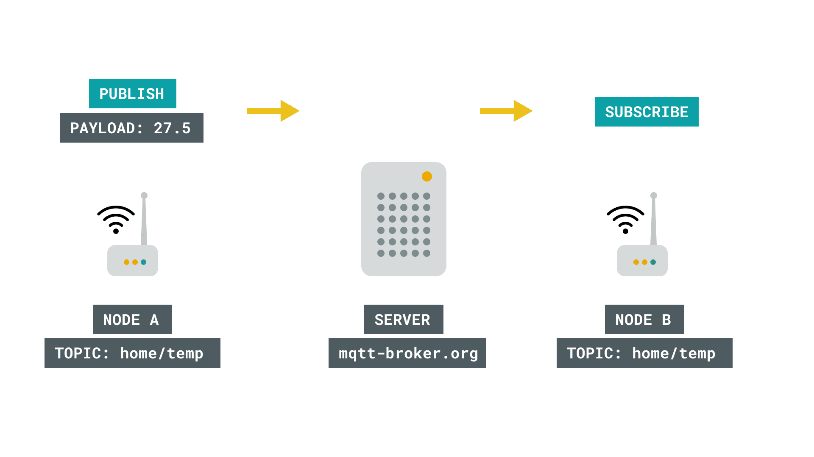
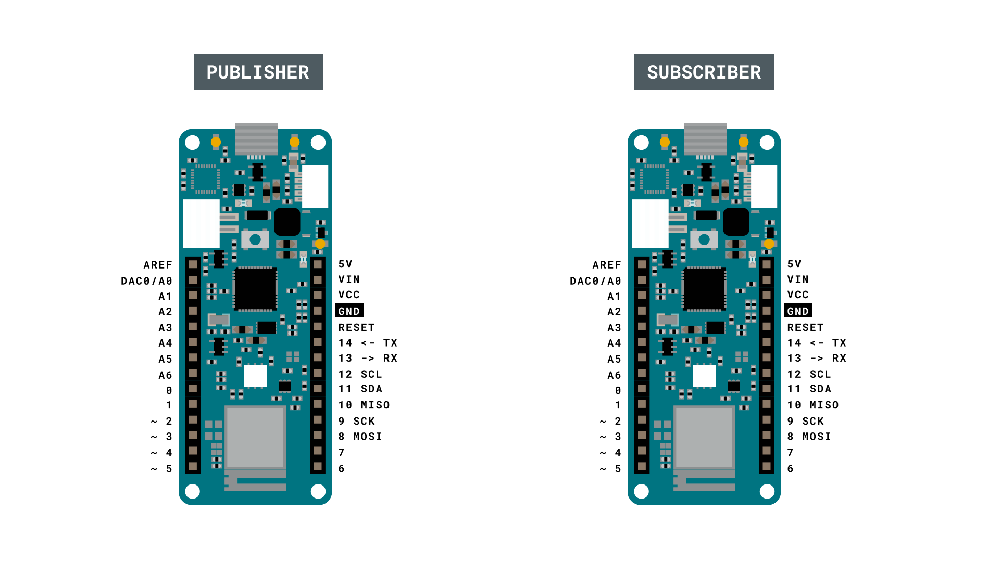
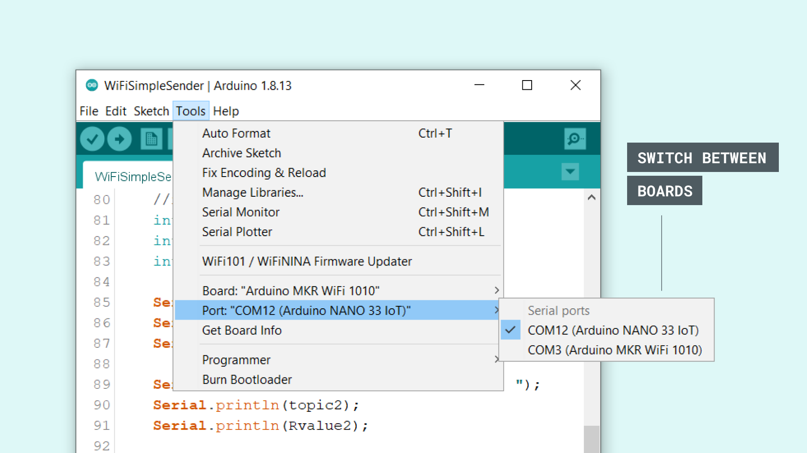
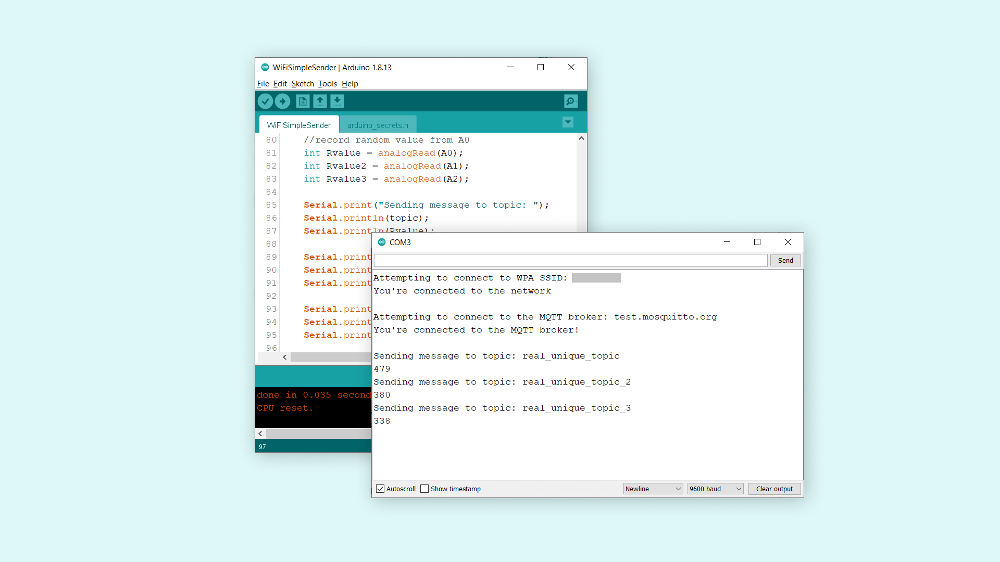

## Introduction 

In this tutorial, we will create a setup that allows a MKR WiFi 1010 board to send data to another Wi-Fi compatible board, using MQTT (Message Queuing Telemetry Transport). The sender device, simply publishes a message to a broker service, which then can be subscribed to by a receiver device. 

The data we will send is simply random readings from the analog inputs on the MKR WiFi 1010 board, but can easily be replaced by any sensor. This tutorial uses the broker [test.mosquitto.org](https://test.mosquitto.org/), an open-source service, free to use by anyone.

This tutorial uses the [ArduinoMqttClient](https://github.com/arduino-libraries/ArduinoMqttClient) and [WiFiNINA](https://www.arduino.cc/en/Reference/WiFiNINA) libraries.

## Goals

The goals of this project are:

- Learn some basics of how MQTT works.
- Learn how to use the **ArduinoMqttClient** library.
- Create a sketch for a **publisher** device.
- Create a sketch for a **subscriber** device. 

## Hardware & Software Needed

- Arduino IDE ([online](https://create.arduino.cc/) or [offline](https://www.arduino.cc/en/main/software)).
- [ArduinoMqttClient](https://github.com/arduino-libraries/ArduinoMqttClient) library.
- [WiFiNINA](https://www.arduino.cc/en/Reference/WiFiNINA) library.
- 2x Arduino MKR WiFi 1010 ([link to store](https://store.arduino.cc/mkr-wifi-1010)).
- 2x Micro USB cables.

## Message Queuing Telemetry Transport (MQTT)

The MQTT protocol was first introduced in 1999, as a light-weight **publish** and **subscribe** system. It is particularly useful for devices with low-bandwidth, where we can send commands, sensor values or messages over the Internet with little effort. 

A basic explanation on how it works is that a node, for example and Arduino with a Wi-Fi module, sends a payload to a broker. A broker is a kind of "middle-point" server, that essentially stores payloads sent to it, in something called **topics**. A topic, is a definition of what type of data it contains, it could for example be "basement humidity" or "living room temperature". Another node can then subscribe to this information, from the broker, and voilà, data has been moved from Node A to Node B over the Internet. 



There are several different ways this can be practiced, with many different layers of security depending on what type of broker and setup we use. For example, if we are dealing with non-sensitive data, such as temperature of a specific location, we are not too concerned on who might get access to it. But there's cases where data needs to be protected, for example in Social Media messaging services. 

One way to protect the data is for example, by using a **token**, something that is quite common when working with various IoT services. For instance, if we are publishing something to a broker, anyone that has the URL, e.g. **randombroker.org/randomtopic** can subscribe to it. But if we add a unique token on both sides, they wouldn't be able to. These tokens could for example be **Z6ACuLwr5T**, which is not exactly something easy to guess. 


MQTT is quite the interesting topic, and if you wish to read more about it, check out the links below:

- [mqtt.org](https://mqtt.org/) - all you need to know about MQTT.
- [Mosquitto.org](https://test.mosquitto.org/) - an MQTT broker.
- [Inductive automation](https://inductiveautomation.com/resources/article/what-is-mqtt#:~:text=MQTT%20is%20a%20publish%2Fsubscribe,communication%20between%20the%20two%20devices.&text=When%20another%20client%20publishes%20a,any%20client%20that%20has%20subscribed) - what is MQTT?
- [Randomnerdtutorials](https://randomnerdtutorials.com/what-is-mqtt-and-how-it-works/) - what is MQTT and how it works.

### Circuit

This tutorial requires no external circuit. It does however, require two boards with a Wi-Fi module (one publisher and one subscriber).



## Step by Step

We will now go through the steps required to setup one board as a publisher, and one as a subscriber. The following steps will be needed:

- Include the necessary libraries.
- Create a header file to store Wi-Fi credentials.
- Configure the **publisher device** to create three topics and publish them to a broker.
- Configure the **subscriber device** to subscribe to the three topics.

**1.** First, let's make sure we have the drivers installed. If we are using the Web Editor, we do not need to install anything. If we are using an offline editor, we need to install it manually. This can be done by navigating to **Tools > Board > Board Manager...**. Here we need to look for the **Arduino SAMD boards (32-bits Arm® Cortex®-M0+)** and install it. 

**2.** Now, we need to install the libraries needed. If we are using the Web Editor, there is no need to install anything. If we are using an offline editor, simply go to **Tools > Manage libraries..**, and search for **ArduinoMqttClient** and **WiFiNINA** and install them both.

**3.** Now let's take a look at some important functions used in the sketches:

- `WiFiClient wifiClient` - creates a Wi-Fi client.
- `MqttClient mqttClient(wifiClient)` - connects the Wi-Fi client to the MQTT client.
- `WiFi.begin(ssid, pass)` - connects to local Wi-Fi network. 
- `mqttClient.connect(broker, port)` - connects to broker (and port).
- `mqttClient.poll()` - keeps the connection alive, used in the `loop()`. 
- `mqttClient.beginMessage(topic)` - creates a new message to be published.
- `mqttClient.print()` - prints the content of message between the ().  
- `mqttClient.endMessage()` - publishes the message to the broker.
- `mqttClient.subscribe(topic)` - subscribes to a topic. 
- `mqttClient.available()` - checks if any messages are available from the topic.
- `mqttClient.read()` - reads the incoming messages.

### Programming the Publisher

We will now program the publisher device. Let's start by opening an empty sketch, and create a header file called `arduino_secrets.h` that we can store our Wi-Fi credentials in. To create a tab in the offline editor, click the arrow symbol underneath the Serial Monitor symbol, and click on the "New tab" option.


Then, name the file `"arduino_secrets.h"`.


Inside this new header file, we need to use the below code, where our `SECRET_SSID` (network name) and `SECRET_PASS` (password) needs to be replaced by your own credentials.

```cpp
#define SECRET_SSID ""
#define SECRET_PASS ""
```

We can now copy and paste the **sender** code below into our regular sketch file, and upload it to our board. Make sure we have selected the right port and board before uploading.

>**Note:** The char `topic[]`, `topic2[]` and `topic3[]`, created here may be used by someone else. If we change this, we will also need to change the name of the topic we subscribe to in the **subscriber sketch**.

```cpp    
#include <ArduinoMqttClient.h>
#include <WiFiNINA.h>
#include "arduino_secrets.h"

///////please enter your sensitive data in the Secret tab/arduino_secrets.h
char ssid[] = SECRET_SSID;        // your network SSID (name)
char pass[] = SECRET_PASS;    // your network password (use for WPA, or use as key for WEP)

WiFiClient wifiClient;
MqttClient mqttClient(wifiClient);

const char broker[] = "test.mosquitto.org";
int        port     = 1883;
const char topic[]  = "real_unique_topic";
const char topic2[]  = "real_unique_topic_2";
const char topic3[]  = "real_unique_topic_3";

//set interval for sending messages (milliseconds)
const long interval = 8000;
unsigned long previousMillis = 0;

int count = 0;

void setup() {
  //Initialize serial and wait for port to open:
  Serial.begin(9600);
  while (!Serial) {
    ; // wait for serial port to connect. Needed for native USB port only
  }

  // attempt to connect to Wifi network:
  Serial.print("Attempting to connect to WPA SSID: ");
  Serial.println(ssid);
  while (WiFi.begin(ssid, pass) != WL_CONNECTED) {
    // failed, retry
    Serial.print(".");
    delay(5000);
  }

  Serial.println("You're connected to the network");
  Serial.println();

  Serial.print("Attempting to connect to the MQTT broker: ");
  Serial.println(broker);

  if (!mqttClient.connect(broker, port)) {
    Serial.print("MQTT connection failed! Error code = ");
    Serial.println(mqttClient.connectError());

    while (1);
  }

  Serial.println("You're connected to the MQTT broker!");
  Serial.println();
}

void loop() {
  // call poll() regularly to allow the library to send MQTT keep alive which
  // avoids being disconnected by the broker
  mqttClient.poll();

  unsigned long currentMillis = millis();

  if (currentMillis - previousMillis >= interval) {
    // save the last time a message was sent
    previousMillis = currentMillis;

    //record random value from A0, A1 and A2
    int Rvalue = analogRead(A0);
    int Rvalue2 = analogRead(A1);
    int Rvalue3 = analogRead(A2);

    Serial.print("Sending message to topic: ");
    Serial.println(topic);
    Serial.println(Rvalue);

    Serial.print("Sending message to topic: ");
    Serial.println(topic2);
    Serial.println(Rvalue2);

    Serial.print("Sending message to topic: ");
    Serial.println(topic2);
    Serial.println(Rvalue3);

    // send message, the Print interface can be used to set the message contents
    mqttClient.beginMessage(topic);
    mqttClient.print(Rvalue);
    mqttClient.endMessage();

    mqttClient.beginMessage(topic2);
    mqttClient.print(Rvalue2);
    mqttClient.endMessage();

    mqttClient.beginMessage(topic3);
    mqttClient.print(Rvalue3);
    mqttClient.endMessage();

    Serial.println();
  }
}
```
### Programming the Subscriber Device

We will now program the subscriber device. For this, we need to create a new sketch, and create another `arduino_secrets.h` file. 

We can now copy and paste the **receiver** code below into our regular sketch file, and upload it to our board. Make sure we have selected the right port and board before uploading. 

```cpp
#include <ArduinoMqttClient.h>
#include <WiFiNINA.h>
#include "arduino_secrets.h"

///////please enter your sensitive data in the Secret tab/arduino_secrets.h
char ssid[] = SECRET_SSID;        // your network SSID
char pass[] = SECRET_PASS;    // your network password

WiFiClient wifiClient;
MqttClient mqttClient(wifiClient);

const char broker[] = "test.mosquitto.org";
int        port     = 1883;
const char topic[]  = "real_unique_topic";
const char topic2[]  = "real_unique_topic_2";
const char topic3[]  = "real_unique_topic_3";

void setup() {
  //Initialize serial and wait for port to open:
  Serial.begin(9600);
  while (!Serial) {
    ; // wait for serial port to connect. Needed for native USB port only
  }
  // attempt to connect to Wifi network:
  Serial.print("Attempting to connect to SSID: ");
  Serial.println(ssid);
  while (WiFi.begin(ssid, pass) != WL_CONNECTED) {
    // failed, retry
    Serial.print(".");
    delay(5000);
  }

  Serial.println("You're connected to the network");
  Serial.println();

  Serial.print("Attempting to connect to the MQTT broker: ");
  Serial.println(broker);

  if (!mqttClient.connect(broker, port)) {
    Serial.print("MQTT connection failed! Error code = ");
    Serial.println(mqttClient.connectError());

    while (1);
  }

  Serial.println("You're connected to the MQTT broker!");
  Serial.println();

  // set the message receive callback
  mqttClient.onMessage(onMqttMessage);

  Serial.print("Subscribing to topic: ");
  Serial.println(topic);
  Serial.println();

  // subscribe to a topic
  mqttClient.subscribe(topic);
  mqttClient.subscribe(topic2);
  mqttClient.subscribe(topic3);

  // topics can be unsubscribed using:
  // mqttClient.unsubscribe(topic);

  Serial.print("Topic: ");
  Serial.println(topic);
  Serial.print("Topic: ");
  Serial.println(topic2);
  Serial.print("Topic: ");
  Serial.println(topic3);

  Serial.println();
}

void loop() {
  // call poll() regularly to allow the library to receive MQTT messages and
  // send MQTT keep alive which avoids being disconnected by the broker
  mqttClient.poll();
}

void onMqttMessage(int messageSize) {
  // we received a message, print out the topic and contents
  Serial.println("Received a message with topic '");
  Serial.print(mqttClient.messageTopic());
  Serial.print("', length ");
  Serial.print(messageSize);
  Serial.println(" bytes:");

  // use the Stream interface to print the contents
  while (mqttClient.available()) {
    Serial.print((char)mqttClient.read());
  }
  Serial.println();
  Serial.println();
}
```

## Testing It Out

If everything was successful during the upload, we now have a **publisher** and **subscriber** device. Next, we need to open the Serial Monitor for each board, one at a time. This will initialize the sketch. Since we can only have one Serial Monitor open at one time, we will need to switch the ports manually. Using only one computer can be a bit tedious, as we can never view the Serial Monitor of both devices at the same time. 

In this tutorial, a MKR WiFi 1010 board and a Nano 33 IoT board was used. When switching between the ports, we can see them listed as COM12 and COM3.



When both devices have been initialized, they start connecting to the network. Now, let's open the Serial Monitor and keep it open for the **publisher** device.

We can now see that we are sending messages every 8 seconds (this interval can be changed at the top of the code). Each interval sends three messages, for each topic. Each topic contains the latest reading from an analog pin.



Now, let's open the **subscriber** device's Serial Monitor, and keep it open. If everything is successful, we can now see the analog values. This means, that we have successfully published three topics on one device, and subscribed to them using another device. 


### Troubleshoot

If the code is not working, there are some common issues we can troubleshoot:

- Check that the host is right: this tutorial uses [test.mosquitto.org](https://test.mosquitto.org).
- Check that our credentials are correct in the `arduino_secrets.h` tab.
- Make sure that the topics we publish match the topics we subscribe to.


## Conclusion

In this tutorial, we have created a very basic MQTT application, which allows data to flow from a publisher device, via a broker, to a subscriber device. This type of setup is commonly used in many Internet of Things (IoT) applications, and we encourage you to continue exploring the [ArduinoMqttClient](https://github.com/arduino-libraries/ArduinoMqttClient) library. In this tutorial, in order to create a minimal working project we did not use any form of encryption. This is OK to use for just basic, non-private data, but if you are intending to use it for e.g. home automation, security systems and so on, it is **strongly recommended** to use more security layers. 

The broker used in this tutorial, [test.mosquitto.org](https://test.mosquitto.org/) provides some explanation on different forms of encryption, and what ports to use etc. 

