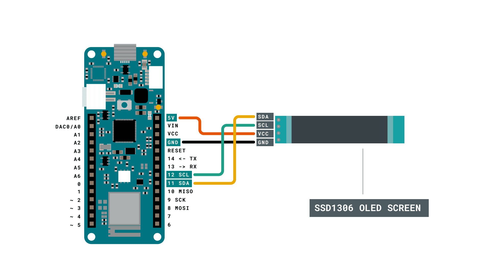
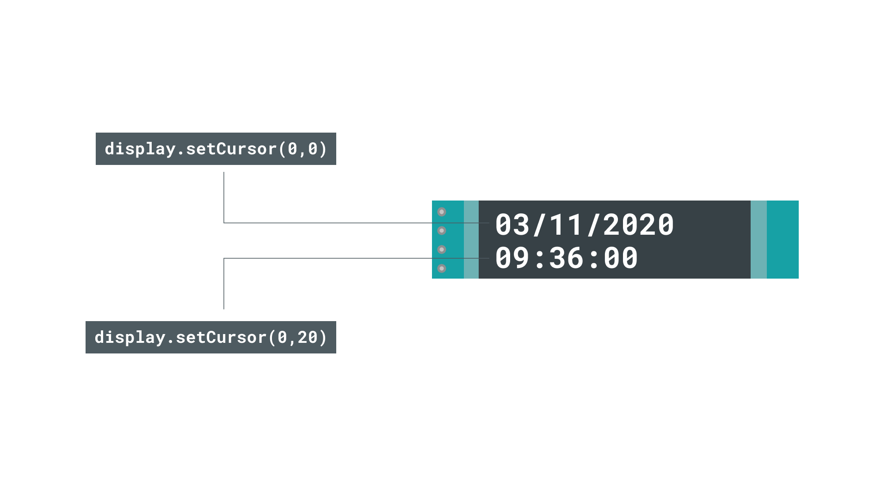

## Introduction

In this tutorial, we will learn how to create a simple RTC (Real Time Clock) with the MKR WiFi 1010 board. We will be using the **RTCZero** library to do so, which works with all the MKR boards. The time and date will then be printed on an 128x32 OLED display, using the [SSD1306](https://github.com/adafruit/Adafruit_SSD1306) library.


## Goals

The goals of this project are:

- Create a real time clock.
- Print the date and time on an OLED display.

## Hardware & Software Needed

- Arduino IDE ([online](https://create.arduino.cc/) or [offline](https://www.arduino.cc/en/main/software)).
- [Adafruit GFX](https://github.com/adafruit/Adafruit-GFX-Library) and [SSD1306](https://github.com/adafruit/Adafruit_SSD1306) library.
- [RTCZero](https://www.arduino.cc/reference/en/libraries/rtczero/) library.
- Arduino MKR WiFi 1010  ([link to store](https://store.arduino.cc/mkr-wifi-1010)).
- SSD1306 128x32 OLED Screen (other dimensions works but requires some adjusting).


## Real Time Clock (RTC)

Isn't Real Time Clock just another word for actual time? The answer is yes, it is actually just the tracking of actual time. But what is interesting is the component that does this. Most electronic devices that need to track current time use an RTC component, often in the form of an Integrated Circuit (IC). They typically consist of a crystal oscillator, which is used to create electronic signals with a constant frequency. The frequency is typically set to 32.768 kHz, which is the same frequency used for most watches. 

The frequency is equal to 2^15 cycles per second, which means it is a convenient rate to use for binary counter circuits. This operation also does not require a lot of power, and can still run while the board is in a sleep mode. This can be a quite powerful feature, to for example tell the board to wake up at a certain time, or go to sleep at a certain time, automatically. 

You can also read more about [Real Time Clocks](https://www.electronics-tutorials.ws/connectivity/real-time-clocks.html), if you find this topic interesting. 

### Circuit



### Schematic


## Step by Step

We will now get to the programming part of this tutorial. It focuses on two main parts: setting up the RTC, and printing it on an OLED display. Let's take a look at some of the steps we need to do in order to make it work:

- Include the necessary libraries.
- Configure the RTC properties (date, time).
- Configure the OLED display (dimensions, type).
- Initialize the RTC properties (this happens on start).
- Print the time and date on the OLED display.

**1.** First, let's make sure we have the drivers installed. If we are using the Web Editor, we do not need to install anything. If we are using an offline editor, we need to install it manually. This can be done by navigating to **Tools > Board > Board Manager...**. Here we need to look for the **Arduino SAMD boards (32-bits Arm® Cortex®-M0+)** and install it. 

**2.** Now, we need to install the libraries needed. If we are using the Web Editor, there is no need to install anything. If we are using an offline editor, simply go to **Tools > Manage libraries..**, and search for **Adafruit_GFX**, **Adafruit_SSD1306** and **RTCZero**.

**3.** We can now take a look at some of the core functions of this sketch:

- `const byte property = x;` - property can represent seconds, minutes, hours, days, month and year.
- `display.begin(SSD1306_SWITCHCAPVCC, 0x3C)` - initializes the OLED display.
- `rtc.begin();` - initializes the RTC library.
- `rtc.setProperty();` - sets a starting time. "Property" is replaced by a time format, e.g. minute, year.
- `rtc.getProperty()` - retrieves the actual time. "Property" is replaced by a time format, e.g. minute, year.
- `display.clearDisplay();` - clears the OLED display.
- `display.display();` - updates the OLED display.
- `void print2digits(int number)` - custom function that adds a "0" before a digit. E.g. **9.05** becomes **09.05**.


In our sketch, there will be **six different bytes** that stores different time formats, such as minutes and years. We will need to manually fill this in. For example, if we want to set the start time to **09:36** and the date to **November 3rd, 2020**, we will need to change the bytes to the following:

```cpp
const byte seconds = 0;
const byte minutes = 36;
const byte hours = 9;

const byte day = 3;
const byte month = 11;
const byte year = 20;
```

With some basic knowledge of the sketch, we can now upload the sketch below to our board. Make sure you select the right board and port before uploading.

>**Note:** Uploading the code to the board takes a few seconds. Try to sync with the time on your computer or watch and allow a couple of extra seconds before starting the uploading process.

```cpp    

#include <RTCZero.h>
#include <SPI.h>
#include <Wire.h>
#include <Adafruit_GFX.h>
#include <Adafruit_SSD1306.h>

#define SCREEN_WIDTH 128 // OLED display width, in pixels
#define SCREEN_HEIGHT 32 // OLED display height, in pixels

//Display configuration
#define OLED_RESET     4 // Reset pin # (or -1 if sharing Arduino reset pin)
Adafruit_SSD1306 display(SCREEN_WIDTH, SCREEN_HEIGHT, &Wire, OLED_RESET);

/* Create an rtc object */
RTCZero rtc;

/* Change these values to set the current initial time */
const byte seconds = 0;
const byte minutes = 36;
const byte hours = 09;

/* Change these values to set the current initial date */
const byte day = 03;
const byte month = 11;
const byte year = 20;

void setup()
{
  Serial.begin(9600);

  if (!display.begin(SSD1306_SWITCHCAPVCC, 0x3C)) { // Address 0x3C for 128x32
    Serial.println(F("SSD1306 allocation failed"));
    for (;;); // Don't proceed, loop forever
  }

  rtc.begin(); // initialize RTC

  // Set the time
  rtc.setHours(hours);
  rtc.setMinutes(minutes);
  rtc.setSeconds(seconds);

  // Set the date
  rtc.setDay(day);
  rtc.setMonth(month);
  rtc.setYear(year);

  // you can use also
  //rtc.setTime(hours, minutes, seconds);
  //rtc.setDate(day, month, year);
}

void loop()
{
  
  display.clearDisplay(); //clears display
  display.setTextColor(SSD1306_WHITE); //sets color to white
  display.setTextSize(2); //sets text size to 2
  display.setCursor(0, 0); //x, y starting coordinates

  print2digits(rtc.getDay()); //retrieve day 
  display.print("/");
  print2digits(rtc.getMonth()); //retrieve month
  display.print("/");
  print2digits(rtc.getYear()); //retrieve year
  

  display.setCursor(0, 18); //change cursor to second row
  print2digits(rtc.getHours()); //retrieve hours
  display.print(":");
  print2digits(rtc.getMinutes()); //retrieve minutes
  display.print(":");
  print2digits(rtc.getSeconds()); //retrieve seconds
  
  display.display(); //print to display

  delay(10);
}


void print2digits(int number) {
  if (number < 10) {
    display.print("0"); // print a 0 before if the number is < than 10
  }
  display.print(number);
}
```


## Testing It Out

Great job. We should now have an accurate time and date printed on our OLED display, which will be accurate for as long as the board remains powered. If we take a look at the display, we can see that at the top row, the **day, month and year** is printed. In the second row, **seconds, minutes and hours** are printed. 




### Troubleshoot

If the code is not working, there are some common issues we can troubleshoot:

- Check that all libraries are installed.
- Make sure there are no missing curly brackets {}.
- We have not selected the right port and board.

## Conclusion

This tutorial covers some basics on RTC and how to print the time and date continuously on an OLED display. But these technologies are used heavily in modern designs, and knowing just the basics can be very beneficial. 


