## Components and Supplies

- [Arduino MKR WiFi 1010](https://www.newark.com/71AC0169?COM=ref_hackster)
- [Micro-USB to USB Cable (Generic)](https://www.sparkfun.com/products/13244)

## Apps and Online Services

- [Arduino IDE](https://www.arduino.cc/en/main/software)
- [Amazon Web Services AWS IoT](https://aws.amazon.com/iot/)

## About This Project

### Introduction

[AWS IoT Core](https://aws.amazon.com/iot-core/) is a managed Cloud service that lets connected devices easily and securely interact with Cloud applications and other devices. AWS IoT Core can support billions of devices and trillions of messages, and can process and route those messages to AWS endpoints and to other devices reliably and securely. 

Devices can connect to AWS IoT Core using the following protocols: HTTP, WebSockets and MQTT. This tutorial will walk you through how to connect an [Arduino MKR WiFi 1010](https://store.arduino.cc/products/arduino-mkr-wifi-1010) (or MKR1000) board securely to AWS IoT Core using the MQTT protocol. [MQTT](http://mqtt.org/) (**Message Queuing Telemetry Transport**) is an extremely lightweight M2M (machine-to-machine) connectivity protocol which provides a messaging subscription and publish transport.

When connecting to AWS IoT Core using MQTT, devices are required to use X.509 certificates with TLS for authentication, as AWS IoT Core does not support authentication via username and password like many other MQTT broker services provide support for. More information on X.509 certificate support on AWS IoT can be found [here](https://docs.aws.amazon.com/iot/latest/developerguide/x509-certs.html).

Every Arduino MKR board with on-board connectivity, including the MKR WiFi 1010, is equipped with a Microchip [ATECC508A](https://www.microchip.com/wwwproducts/en/ATECC508A) or [ATECC608A](https://www.microchip.com/wwwproducts/en/ATECC608A) crypto element. This crypto element can be used to securely generate and store a 256-bit ECC (Elliptic Curve Cryptography) key. 256-bit ECC keys have an equivalent strength to 3072-bit RSA keys (more information can be found [here](https://aws.amazon.com/blogs/iot/elliptic-curve-cryptography-and-forward-secrecy-support-in-aws-iot-3/)).

### Software and Hardware Setup

If you don't have the Arduino IDE installed on your computer, [download](https://www.arduino.cc/en/Main/Software#download) and install it.

Once it is installed, make sure you have the latest "Arduino SAMD Boards" package installed. You can check by opening the Arduino IDE, and opening the **Tools -> Board: "..." -> Board Manager...** menu entry, and searching for "Arduino SAMD". At the time of writing 1.6.20 was the latest version.

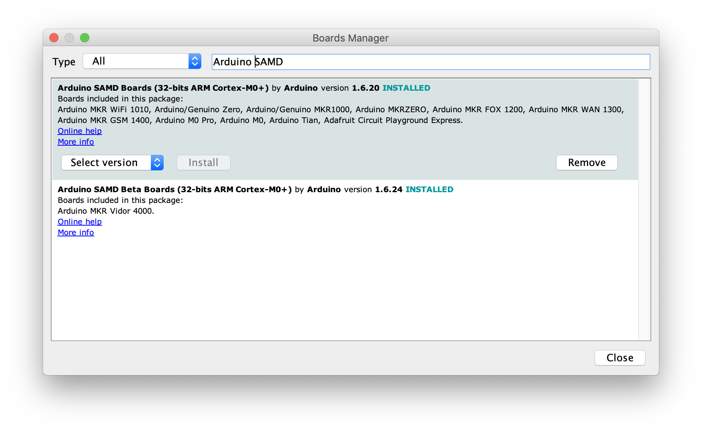

Next you'll need to install the Arduino libraries that will be used using the Arduino IDE's library manager. Open the **Sketch -> Include Library -> Manage Libraries...** menu, search for and individually install each of the following libraries:

* WiFiNINA (or WiFi101 for the MKR1000)
* ArduinoBearSSL
* ArduinoECCX08
* ArduinoMqttClient
* Arduino Cloud Provider Examples

Now plug in the MKR WiFi 1010 with the micro USB cable to your computer. Then select the serial port in the Arduino IDE using the **Tools -> Port "..."** menu and also select Arduino MKR WiFi 1010 in the **Tools -> Board "..."** menu.

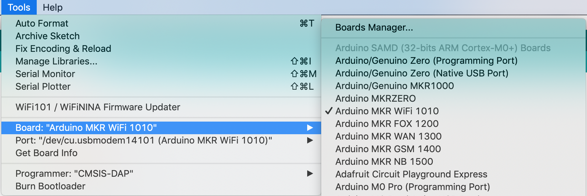

## Configuring and Adding the Board to AWS IoT Core

As mentioned above, AWS IoT Core requires devices that connect using the MQTT protocol to use X.509 certificates for authentication. We'll use a sketch to generate a Certificate Signing Request (CSR) on the board and then upload this CSR in the AWS console to create an X.509 certificate.

The CSR can be generated using an example sketch from the ArduinoECCX08 library. Open the sketch in the Arduino IDE using the **File -> Examples -> ArduinoECCX08 -> Tools -> ECCX08CSR**. Click the "Upload" button to build and upload the sketch to your board, then open the Serial Monitor. Make sure the line ending configuration is set to "Both NL & CR."

This sketch will prompt you to permanently configure your ATECC508A to ECC608A crypto element if it is not configured and locked.

 ***NOTE: This locking process is permanent and irreversible, but is needed to use the the crypto element - the configuration the sketch sets allows to use 5 private key slots with any Cloud provider (or server) and a CSR can be regenerated any time for each of the other four slots.*** 
 
When the board is shipped from the factory, the crypto element is in an un-configured and unlocked state.

After this, you will be prompted for information to include in the CSR, most entries can be left blank and except the "Common Name", in the screenshot below "MyMKRWiFi1010" was entered. For this tutorial we'll be using slot 0 to generate and store the private key used to sign the CSR (slots 1 to 4 can be used to generate and store additional private keys if needed). 

**Note:** Since the private key is generated inside the crypto element it never leaves the device and is stored securely and cannot be read.


Copy the generated CSR text including "-----BEGIN CERTIFICATE REQUEST-----" and "-----END CERTIFICATE REQUEST-----" and save it to a new **.txt** file using your favorite text editor. This file will be uploaded the AWS console next.

Now that we have a CSR to identify the board, we need to login into the AWS console and create a certificate for it.

1) Open a web browser and goto [aws.amazon.com](https://aws.amazon.com/).

2) If you don't already have an AWS account, click the "Create an AWS Account" button on the top right of the page to create an account. Otherwise, click the "Sign In to the Console" button on the top right of the page, then login in.

3) After you are logged in, on the top right of the page, select the region to use to configure AWS IoT Core (note: not all regions support AWS IoT).

4) Next in the "AWS Services" section of the page, search for "IoT Core" and it's entry.

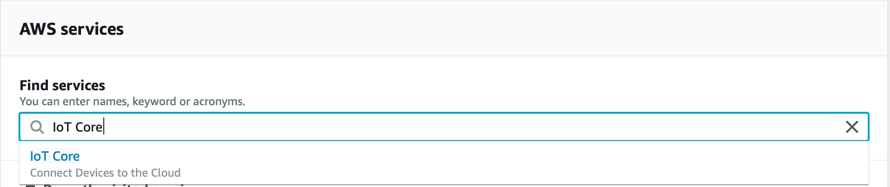

5) You will then be presented with a welcome page, if this is your first time using IoT Core. Click the "Get started" button to continue.

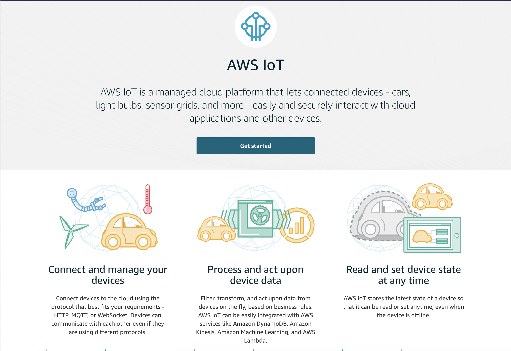

6) Now the main AWS IoT page will be visible.

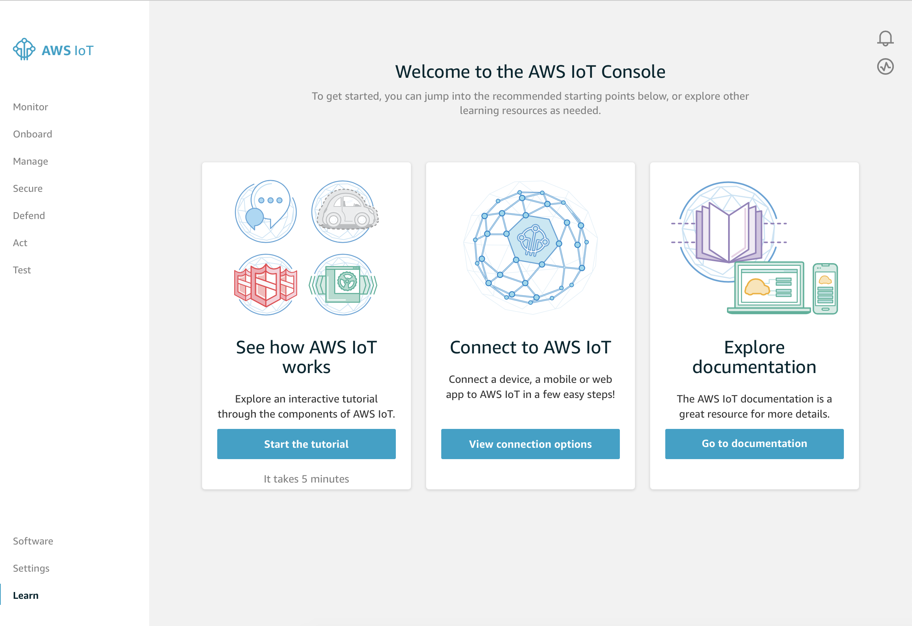

7) Click the "Manage" on the left, then "Things," and then click the "Register a thing" button.

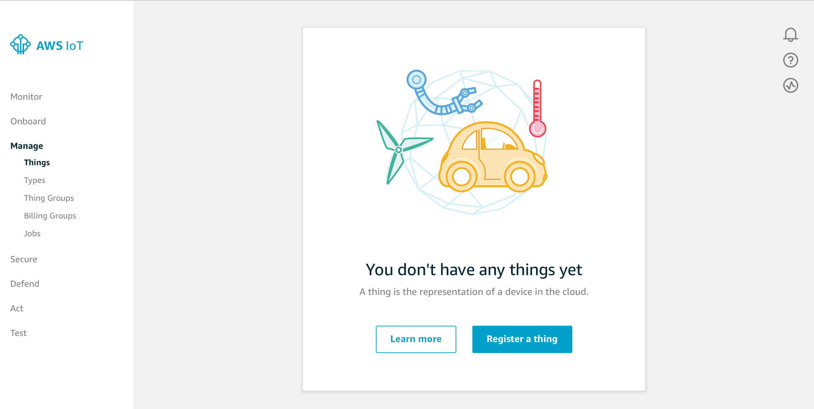

8) On the next page, click "Create a single thing." 

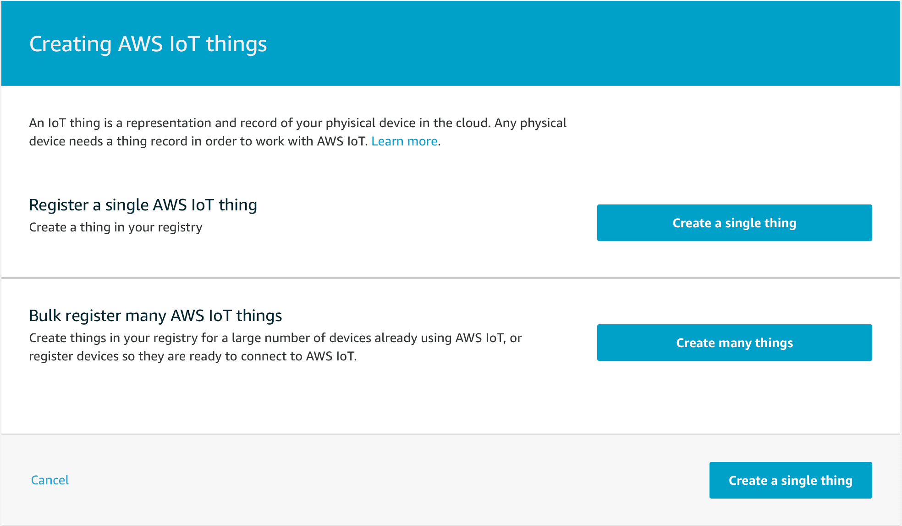

9) Give the thing a name like MyMKRWiFi1010, and click "Next." The other entries on the form can be left empty.

10) Since we have already generated a CSR on the board, click the "Create with CSR" button, and select the CSR that was generated and saved to the text file earlier. Then click "Upload."

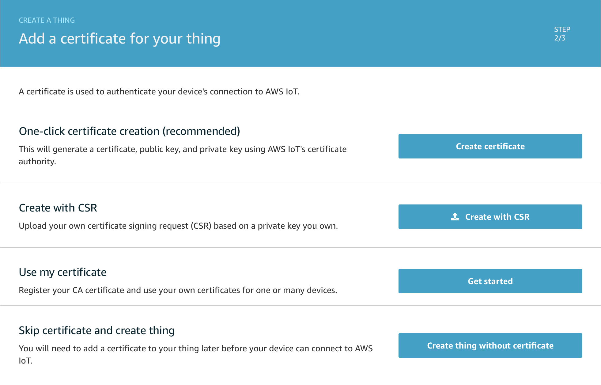

11) On the next screen, click "Register Thing." We don't have any policies setup yet, and will set one up in a later step.

12) You should now see a new entry on the Things page.

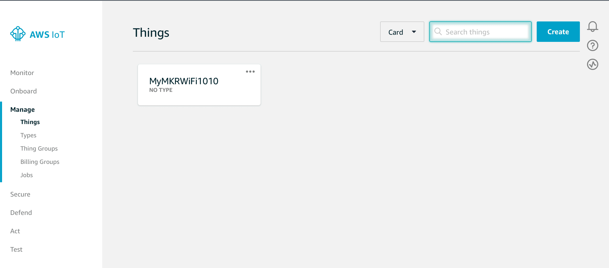

13) Now we need to create and attach a policy to the thing's certificate. Click on the "Secure" link on the left, then "Policies."

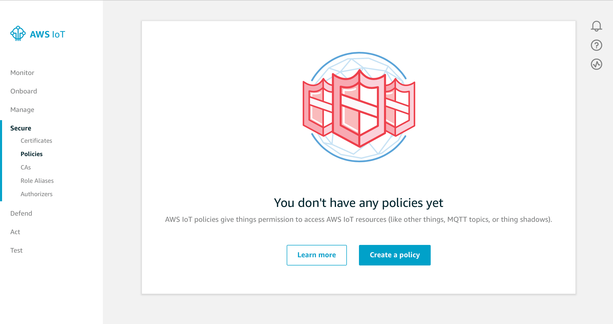

13) Click "Create a policy." We'll be creating a very open policy for testing, **later on we suggest you create a stricter policy***. We'll call this policy "AllowEverything," fill in "iot:\*" for the Action and "\*" for the Resource ARN, then check the "Allow" box, then click "Create."

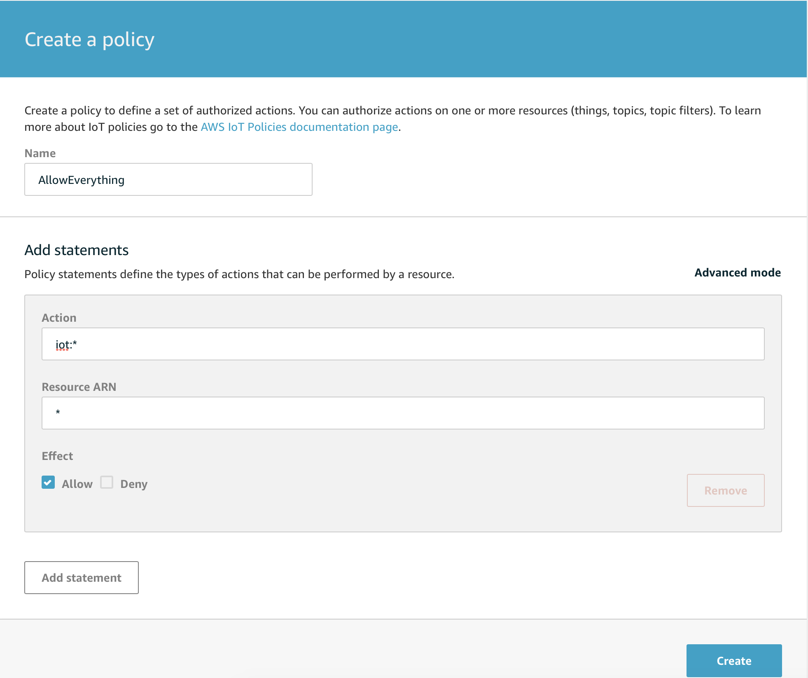

14) Now that the policy has been created, navigate to the "Certificates" page using the link on the left. You'll see a certificate entry for the certificate we created earlier.

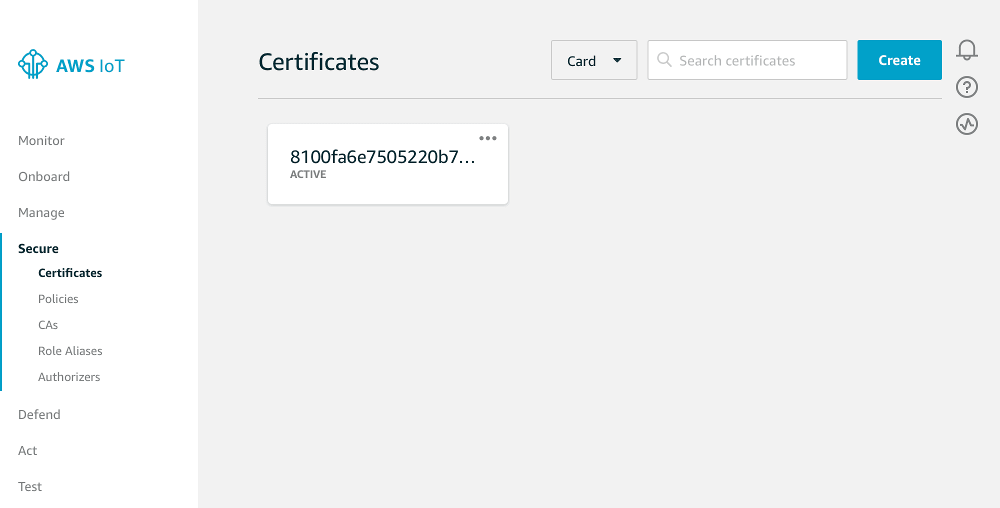

15) Check the certificate, then in the "Actions" drop down click "Download" to save the certificate to your computer.


16) Now lets attach the policy we created to this certificate. in the "Actions" drop down click "Attach Policy." Then check the "AllowEverything" policy and click the "Attach" button.

17) Now click the "Settings" link on the left to get the MQTT endpoint to use for connections. Copy the endpoint and save to a text file for reference later on.

18) AWS IoT is now configured for our board.

## Connecting the Board to AWS IoT Core

1) Open the AWS IoT Wi-Fi sketch in the Arduino IDE using the **File -> Examples -> Arduino Cloud Provider Examples -> AWS IoT-> AWS_IoT_WiFi**.

2) In the arduino_secrets.h tab. update the Wi-Fi settings with the SSID and password of your Wi-Fi network.

```arduino
// Fill in  your WiFi networks SSID and password
#define SECRET_SSID ""
#define SECRET_PASS ""
```

3) Update the broker value with the endpoint referenced above.

```arduino
// Fill in the hostname of your AWS IoT broker
#define SECRET_BROKER "xxxxxxxxxxxxxx.iot.xx-xxxx-x.amazonaws.com"
```

4) Open the certificate file that was downloaded earlier with a text editor and paste the value in the sketch.

```arduino
// Fill in the boards public certificate
const char SECRET_CERTIFICATE[] = R"(
-----BEGIN CERTIFICATE-----
-----END CERTIFICATE-----
)";
```

5) Upload the sketch to your board and open the serial monitor. The board will attempt to connect to the Wi-Fi network and if successful try to connect to AWS IoT using MQTT.

### Interacting with the Board on AWS IoT Core

Now that your board has successfully connected to AWS IoT, we can use the AWS console to interact with it. The sketch sends a message to the **arduino/outgoing** topic every 5 seconds and listens for messages on the **arduino/incoming** topic.


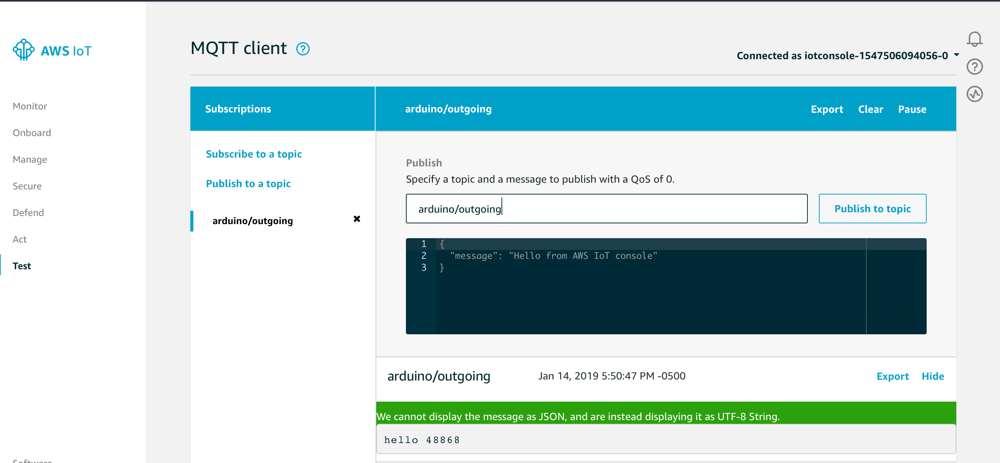

Every five seconds the board sends a hello message with the current millis() value.

Now let's send a message to the board. In the Publish section, change the topic to **arduino/incoming** and click the "Publish to topic" button.

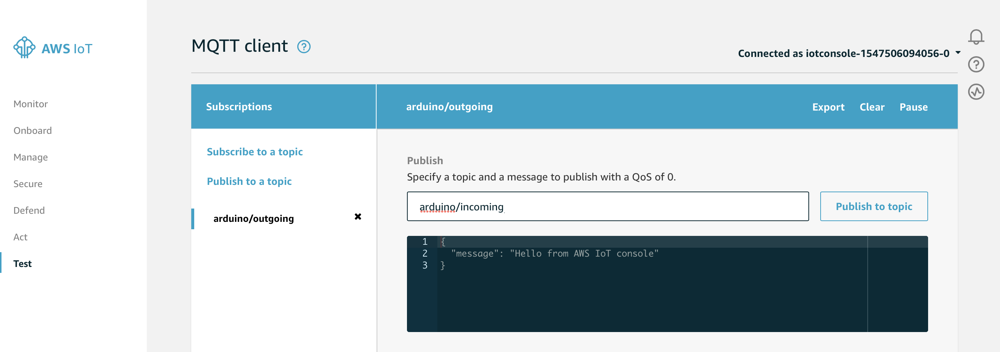

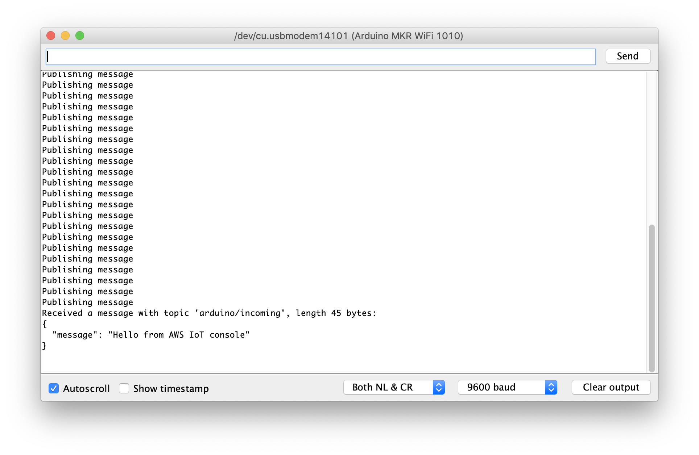

## Complete Sketch

```arduino

/*
  AWS IoT WiFi
  This sketch securely connects to an AWS IoT using MQTT over WiFi.
  It uses a private key stored in the ATECC508A and a public
  certificate for SSL/TLS authentication.
  It publishes a message every 5 seconds to arduino/outgoing
  topic and subscribes to messages on the arduino/incoming
  topic.
  The circuit:
  - Arduino MKR WiFi 1010 or MKR1000
  The following tutorial on Arduino Project Hub can be used
  to setup your AWS account and the MKR board:
  https://create.arduino.cc/projecthub/132016/securely-connecting-an-arduino-mkr-wifi-1010-to-aws-iot-core-a9f365
  This example code is in the public domain.
*/

#include <ArduinoBearSSL.h>
#include <ArduinoECCX08.h>
#include <ArduinoMqttClient.h>
#include <WiFiNINA.h> // change to #include <WiFi101.h> for MKR1000

#include "arduino_secrets.h"

/////// Enter your sensitive data in arduino_secrets.h
const char ssid[]        = SECRET_SSID;
const char pass[]        = SECRET_PASS;
const char broker[]      = SECRET_BROKER;
const char* certificate  = SECRET_CERTIFICATE;

WiFiClient    wifiClient;            // Used for the TCP socket connection
BearSSLClient sslClient(wifiClient); // Used for SSL/TLS connection, integrates with ECC508
MqttClient    mqttClient(sslClient);

unsigned long lastMillis = 0;

void setup() {
  Serial.begin(115200);
  while (!Serial);

  if (!ECCX08.begin()) {
    Serial.println("No ECCX08 present!");
    while (1);
  }

  // Set a callback to get the current time
  // used to validate the servers certificate
  ArduinoBearSSL.onGetTime(getTime);

  // Set the ECCX08 slot to use for the private key
  // and the accompanying public certificate for it
  sslClient.setEccSlot(0, certificate);

  // Optional, set the client id used for MQTT,
  // each device that is connected to the broker
  // must have a unique client id. The MQTTClient will generate
  // a client id for you based on the millis() value if not set
  //
  // mqttClient.setId("clientId");

  // Set the message callback, this function is
  // called when the MQTTClient receives a message
  mqttClient.onMessage(onMessageReceived);
}

void loop() {
  if (WiFi.status() != WL_CONNECTED) {
    connectWiFi();
  }

  if (!mqttClient.connected()) {
    // MQTT client is disconnected, connect
    connectMQTT();
  }

  // poll for new MQTT messages and send keep alive
  mqttClient.poll();

  // publish a message roughly every 5 seconds.
  if (millis() - lastMillis > 5000) {
    lastMillis = millis();

    publishMessage();
  }
}

unsigned long getTime() {
  // get the current time from the WiFi module  
  return WiFi.getTime();
}

void connectWiFi() {
  Serial.print("Attempting to connect to SSID: ");
  Serial.print(ssid);
  Serial.print(" ");

  while (WiFi.begin(ssid, pass) != WL_CONNECTED) {
    // failed, retry
    Serial.print(".");
    delay(5000);
  }
  Serial.println();

  Serial.println("You're connected to the network");
  Serial.println();
}

void connectMQTT() {
  Serial.print("Attempting to MQTT broker: ");
  Serial.print(broker);
  Serial.println(" ");

  while (!mqttClient.connect(broker, 8883)) {
    // failed, retry
    Serial.print(".");
    delay(5000);
  }
  Serial.println();

  Serial.println("You're connected to the MQTT broker");
  Serial.println();

  // subscribe to a topic
  mqttClient.subscribe("arduino/incoming");
}

void publishMessage() {
  Serial.println("Publishing message");

  // send message, the Print interface can be used to set the message contents
  mqttClient.beginMessage("arduino/outgoing");
  mqttClient.print("hello ");
  mqttClient.print(millis());
  mqttClient.endMessage();
}

void onMessageReceived(int messageSize) {
  // we received a message, print out the topic and contents
  Serial.print("Received a message with topic '");
  Serial.print(mqttClient.messageTopic());
  Serial.print("', length ");
  Serial.print(messageSize);
  Serial.println(" bytes:");

  // use the Stream interface to print the contents
  while (mqttClient.available()) {
    Serial.print((char)mqttClient.read());
  }
  Serial.println();

  Serial.println();
}
```

## Conclusion

In this tutorial, we covered how to securely use an Arduino MKR WiFi 1010 board with AWS IoT Core. An X.509 certificate was used to authenticate with AWS IoT Core using the MQTT protocol with the ATECC508A or ATECC608A storing the private key associated with the certificate. MQTT messages were sent to and from the board.

This is just the beginning, you can use AWS IoT Core with many of the other services AWS provides!